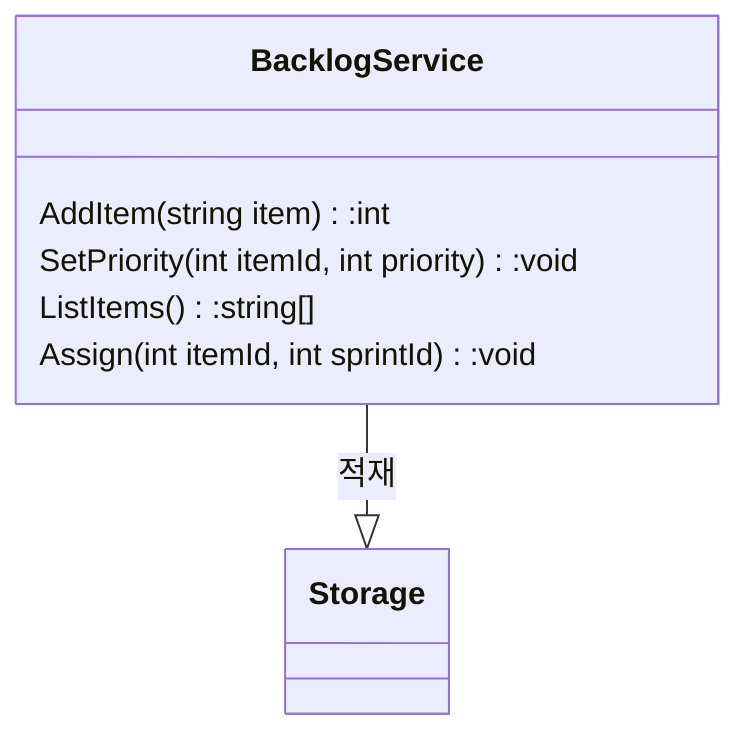

- 단순한 비즈니스 로직에 적합한 두가지 패턴 &rarr; 트랜잭션 스크립트, 액티비 레코드

## 트랜잭션 스크립트

```프레젠테이션으로부터 단일 요청을 처리하는 여러 프로시저를 모아서 비즈니스 로직을 구현하라
- 트랜잭션 스크립트 
  - 프로시저를 기반으로 시스템의 비즈니스 로직을 구성하며, 각 프로시저는 퍼블릭 인터페이스를 통해 시스템 사용자가 실행하는 작업을 구현한다
  - 실제로 시스템의 퍼블릭 오퍼레이션은 캡슐화의 경게로 사용된다 
```

- 예제 인터페이스



### 구현

- 각 프로시저는 간단하고 쉬운 절차지향 스크립트(procedual script)로 구현한다

```kotlin
DB.StartTransaction()

var job = DB.LoadNextJob()
var json = LoadFile(job.Source)
var xml = ConvertJsonToXML(json)
WriteFile(job.Destination, xml.ToString())
DB.MarkJobAsCompleted(job)

DB.Commit
```

### 트랜잭션 스크립트를 사용하는 경우

- 트랙젼션 스크립트 패턴은 정의상 비즈니스 로직이 단순한 지원 하위 도메인에 적합하다
- 충돌 방지 계층의 일부로 사용할 수도 있다
- 최소한의 추상화를 도입하여 런타임 성능을 최적화하고, 비즈니스 로직을 이해하기 위한 시간을 최소화 한다 &rarr; 복잡한 시스템에 부적합하다
- 다른 모든 패턴도 어떤 식으로든 트랜잭션 스크립트 패턴을 기반으로 한다

## 액티브 레코드

```데이터베이스 테이블 또는 뷰의 행을 감싸고 데이터 베이스 접근을 캡슐화하고 해당 데이터에도 메인 로직을 추가하는 오브젝트```

- 트랜잭션 스크립트 패턴과 마찬가지로(보다 복잡한 자료구는 가질 수 있음) 액티브 레코드는 비즈니스 로직이 단순한 경우 사용한다

### 구현

- 액티브 레코드라고 하는 전용 객체를 사용하여 복잡한 자료구조를 표현한다
- CRUD 작업도 한다 &rarr; 액티브 레코드 객체는 객체 관계 매핑ORM: object-relational mapping)또는 다른 데이터 접근 프레임워크와도 관련이 있다
- 자료구조가 '액티브'하다는 점에서 패턴이름이 만들어 졌다 &rarr; 즉, 액티브 레코드는 데이터 접근 로직을 구현한다

```kotlin
class CreateUser {
    fun Execute(userDetails) {
        try {
            _db.StartTransaction()

            var user = User()
            user.Name = userDetails.Name
            user.Email = userDetails.Email
            user.Save()
            _db.commit()
        } catch {
            _db.Rollback()
            throw
        }
    }
}
```

- 이 패턴의 목적은 메모리 상의 객체를 테이터베이스 스키마에 매핑하는 복잡성을 숨기는 것이다
- 영속성을 담당하는 것 외에도 액티브 레코드 객체에는 비즈니스 로직이 포함될 수 있따
    - 필드에 할당된 새 값의 유효성을 검사하거나 객체의 데이터를 조작하는 비즈니스 관련절차를 구현 할 수 있다

### 액티브 레코드를 사용하는 경우

- 액티브 레코드는 본질적으로 데이터베이스에 대한 접근을 최적화하는 트랜잭션 스크립트이기 때문에 이 패턴은 기껏해야 사용자 입력의 유효성을 검사하는 CRUD 작업과 같은 비교적 간다한 비즈니스 로직만 지원할 수 있따
- 트랜잭션 스크립트 패턴과 마찬가지로 액티브 레코드 패턴은 지원 하위 도메인, 일반 하위 도메인과 외부 솔루션의 연동, 모델 변환 작업에 적합하다
- 트랜잭션 패턴과의 차이는 액티브 레코드의 경우 복잡한 자료구조를 데이터베이스 스키마에 매핑하는 복잡성을 해소한다는 것이다
- 액티브 레코드 패턴은 '빈약한 도메인 모델 안티패턴(anemic domian model antipattern)'이라고도 하며 부적절하게 설계된 도메인 모델이다

### 결론

- 트랜잭션 스크립트
    - 시스템 작업을 간단하고 쉬운 절차지향 스크립트로 구성한다. 이 절차는 작업에 드랜잭션을 적용해서 작업이 성공하거나 실패하도록 보장한다. 트랜잭션 스크립트 패턴은 ETL처럼 단순한 비즈니스 로직을 가진 하위
      도메인에 적합하다
- 액티브 레코드
    - 비즈니스 로직이 단순하지만 복잡한 자료구조에서 작동하는 경우 해당 자료구조를 액티브 레코드로 구현할 수 있따. 액티브 레코드 객체는 간단한 CRUD데이터 접근 방법을 제공하는 자료구조다
