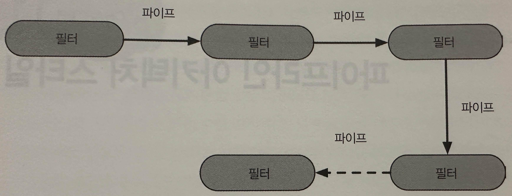
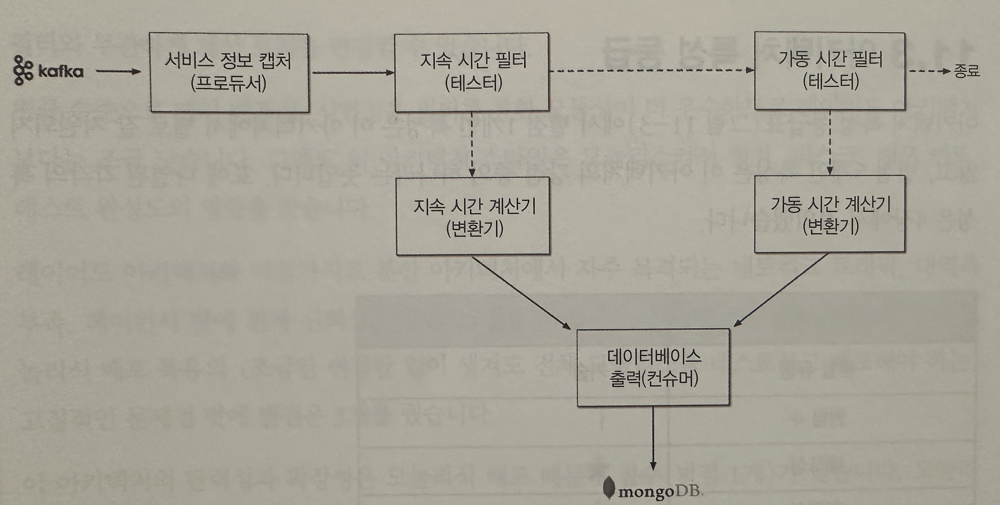
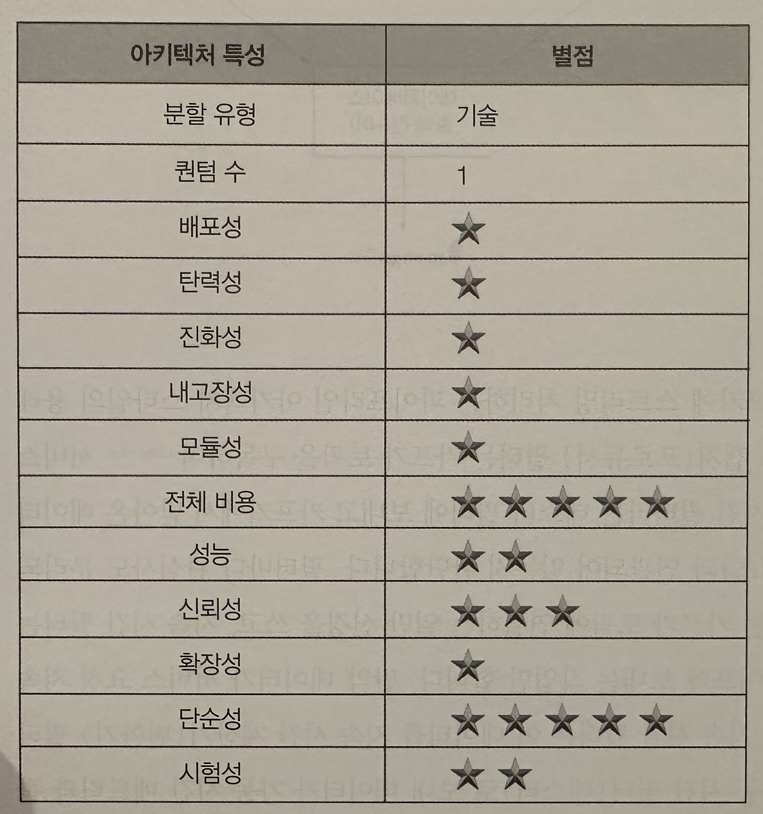

## 파이프라인 아키텍처 스타일

- 파이프라인 아키텍처(Pipeline architecture)또는 파이프와 필터(Pipes and filters)아키텍처 라고 함
- 기본적인 아키텍처 패턴이다
- 개발자와 아키텍트가 기능을 개별 파트로 분리하기로 결정하는 순간부터 이 패턴이 수반된다
- 파이프라인 아키텍처 스타일은 저수준에서 구현할 수도 있고 고수준의 비즈니스 애플리케이션에서도 적용할 수 있다
    - 맵리듀스 프로그래밍 모델을 이용한 많은 도구가 이 기본 토폴로지를 따르고 있다

### 토폴로지

- 파이프라인 아키텍처는 다수의 파이프와 필터로 구성된다
- 파이프와 필터는 특정한 방식으로 조정되며, 보통 필터 간 단방향 통신은 점대점 방식으로 구성한다

### 파이프

- 파이프는 한 소스에서 입력을 받아 다른 소스로 출력을 내는, 필터 간 통신 채널이다
- 파이프는 성능상 이유로 보통 단방향, 점대점 방식으로 구성한다
- 파이프를 오가는 페이로드의 데이터는 어떤 포맷이라도 가능하지만, 아키텍트는 고성능에 유리한 적은 양의 데이터를 선호한다

### 필터

- 필터는 자기 완비형(self-contained)이고, 다른 필터와 독립적이며, 일반적으로 무상태성이다
- 필터는 한 가지 테스크만 수행하므로 복합 태스크는 여러 필터를 이어 붙여 처리하면 된다
- 파이프라인 아키텍처 스타일에서 필터는 다음 네가지 종류가 있다
- 프로듀서(producer)
    - 프로세스의 시작점이다
    - 아웃바운드(들어오는 트래픽은 없고 나가는 트랙만 있기 때문에 소스라고도 한다)
- 변환기(transformer)
    - 입력을 받아 필요시 일부 또는 전체 테이터를 변환한 후, 그 결과를 아웃바운드 파이프로 전달한다
    - 함수형 프로그래밍의 팬들은 이 기능을 맵(map)이라고 한다
- 테스터(tester)
    - 입력을 받아 하나 이상의 기준(criteria)에 대해 테스트를 하고 그 결과에 따라 필요시 결과를 생산한다
    - 함수형 프로그래머는 이 기능을 리듀스(reduce)라고 한다
- 컨슈머(consumer)
    - 파이프라인 흐름의 종착역이다
    - 컨슈머는 파이프라인 프로세스의 최종 결과를 데이터베이스에 저장하거나 유저인터페이스 화면에 표시한다
- 각 파이프와 필터는 단방향이고 워낙 단순해서 얼마든지 조합이 가능하다

### 예제

- 파이프라인 아키텍처 패턴은 특히 간단한 단방향 처리 테스크에서 흔히 찾아 볼 수 있다
- 위 이미지는 다양한 서비스의 텔레메트리(원격 계측)정보를 아파치 카프카에 스트리밍하는 예제이다
    - 1> 서비스 정보 캡처(프로듀서)필터는 카프카를 구독하여 정보를 받아 지속 시간 필터에 데이터를 보낸다
    - 2> 지속시간 필터는(테스터)는 받은 데이터가 서비스 요청 지속시간과 연관되어 있는지 판단한다
    - 2-1> 연관이 있으면 필요시 지속시간 계산기(변환기)필터로 전달
    - 2-2> 연관이 없으면 가동시간 필터(테스터)로 전달
    - 3> 반복
- 필터는 기본적으로 관심사가 분리가 되어있다
- 확정성이 용이 하다
    - 데이터베이스 접속 대기 시간처럼 새로 수집된 메트릭을 데이터베이스에 전달해야 할 경우, 간단히 가동시간 필터 다음에 테스트 필터를 하나 더 추가하면 된다

### 아키텍처 특성 등급

- `애플리케이션을 필터 타입(프로듀서, 테스터, 변환기, 컨슈머)에 따라 나누는 기술 분할 아키텍처이다`
- 파이프라인 아키텍처는 보통 모놀리식 형태로 구현/배포 하므로 아키텍처 퀀텀은 언제나 1이다
- 주요 강점은 모듈성과 결부된 전체 비용 및 단순성이다
- 모놀리식에 가깝다
    - 분산 아키텍처 스타일에 수반되는 복잡도가 없고
    - 단순해서 알기 쉽다
    - 구축 및 유지보수 비용이 적다
- 아키텍처 모듈성 확보
    - 다양한 필터 타입과 변환기 간의 관심사를 분리
- 탄력성과 확정성은 낮다
    - 모놀리식 배포 이기 때문
