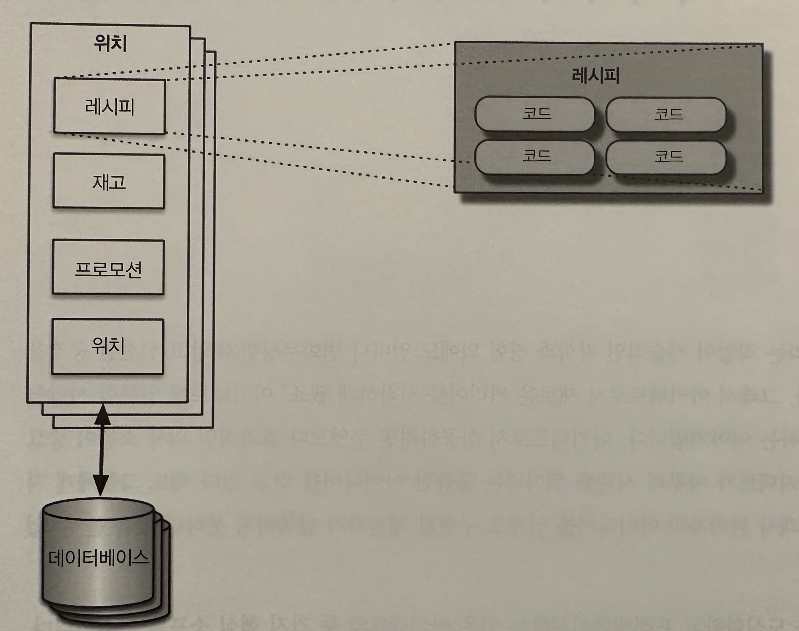
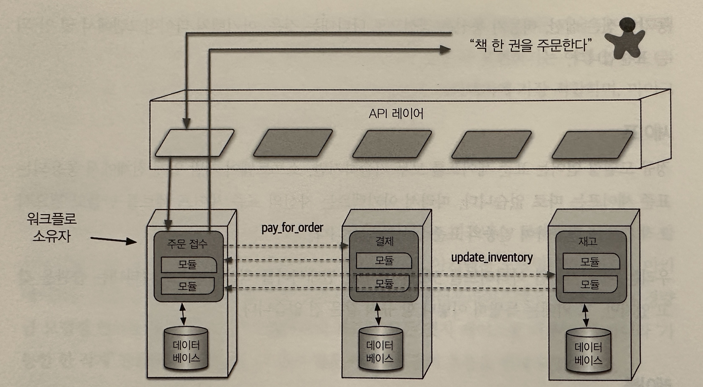
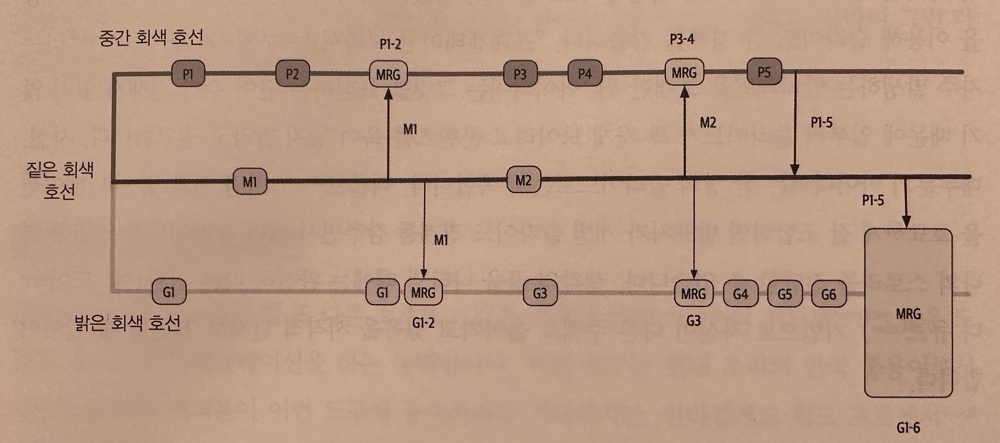
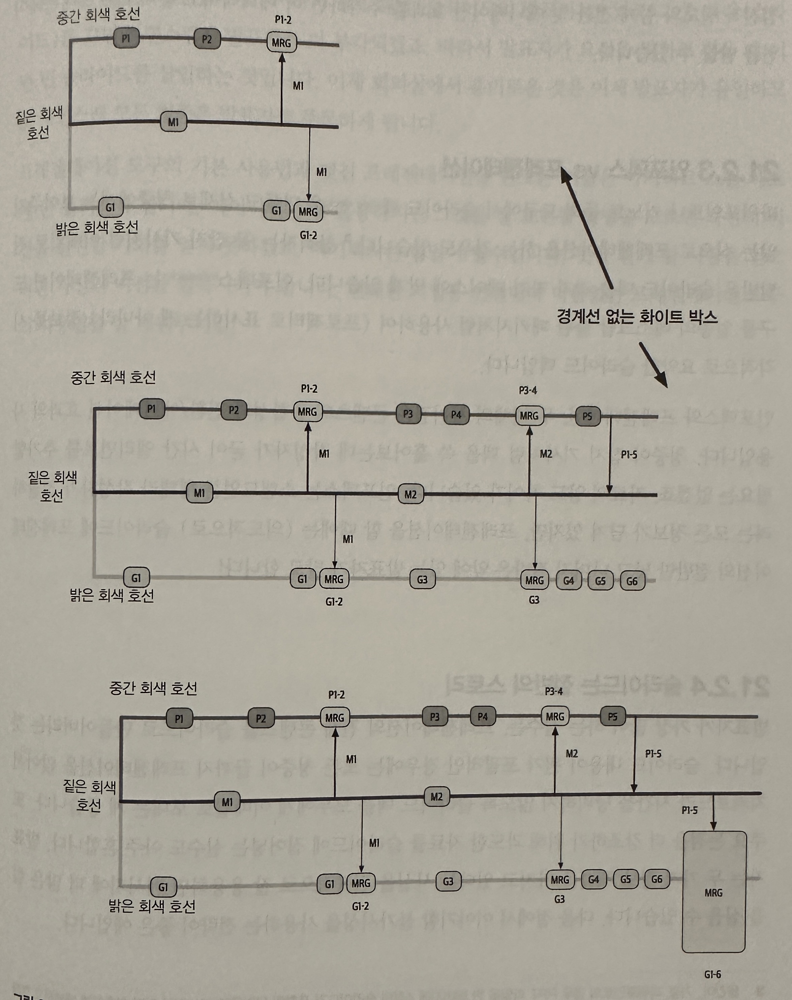

## 아키텍처 도식화 및 프레젠테이션

- 아키텍처를 도식화하고 프레젠테이션하는 일은 아키텍트의 두 가지 핵심 소프트 스킬이다
- 아키텍처를 시각적으로 기술할 때에는 항상 프레젠테이션 뷰를 바꾸기 전에 아키텍처 파트 간의 관계를 보여줘야 한다(숲에서 나무를 볼 수 있도록)

## 도식화

- 아키텍처 토폴로지는 아키텍트와 개발자가 늘 관심을 갖는 부분이다. 따라서 아키텍트는 언제나 다이어그램을 작성하는 기술을 갈고 닦아야 한다

### 도구

- 요즘 아키텍트용 다이어그램 도구는 매우 강력하다. 하지만 정확도가 떨어지는 아티팩트를 간과해선 안된다
    - 조기에 일시적인 설계 아티팩트를 구현한 아키텍트가 자신이 창조한 것이 집착하는 현상을 무리한 아티팩트 집착(Iraational Artifact Attachment)를 예방해야 한다
    - 무리한 아티팩트 집착
        - 다이어그램을 작성하는데 2시간이 걸렸따만, 투자한 시간 만큼 아티팩트에 집착한다 (4시간 걸렸다면 집착은 더하다)

### 도식화 표준: UML, C4, ArchiMate

- 소프트웨어 기술 다이어그램은 몇 가지 공식적인 표준이 재정되어 있다

#### UML

- 통합 모델링 언어(Unifired Modeling Language)는 80년대 경쟁했던 3개의 설계 철학을 통합한 표준이다
- 아직도 UML 클래스와 시퀀스 다이어그램 등으로 구조와 워크플로를 표현하는 아키텍트와 개발자들이 있지만, 다른 종류의 UML다이어 그램은 이제 더 이상 쓰지 않는다

#### C4

- C4는 UML의 결함을 보완하고 보다 현대적인 방식으로 접근하고자 사이먼 브라운이 개발한 다이어그램이다 (C4는 네개의 C를 의미한다)
- Context
    - 유저 역할, 외부 의존성 등 시스템의 전체 콘텍스트
- Container
    - 아키텍처 내부의 물리적인(논리적일 때도 많음)배포 경계 및 컨테이너, 이 뷰는 운영자와 아키텍트의 훌륭한 접점을 형성한다
- Component
    - 시스템의 컴포넌트 뷰, 대부분 아키텍트가 시스템을 바라보는 관점과 거의 일치한다
- Class
    - UML과 동일한 스타일의 클래스 다이어그램을 사용하는데, 이 클래스 다이어그램은 그 자체로 효과적이어서 굳이 교체할 필요가 없었따

- C4는 전사 레벨에서 표준화하기에 괜찮은 방안이지만, 모놀리식에 아키텍처에 보더 적합하며, 마이크로서비스 같은 분산 아키텍처와는 잘 안맞는다

#### 아키메이트

- 아키메이트(Arch mate)는 비지니스 도메인 중심으로 아키텍처를 기술, 분석 시각화하는 오픈 소스 엔터프라이즈 아키텍처 모델링 언어이다
- 아키메이트 오픈 그룹의 기술 표준으로서 주로 엔터프라이즈에서 많이 쓰이는 경량급 모델링 언어를 제공한다
- 아키메이트의 목표는 모든 엣지 케이스를 다루는게 아니라 '가능한 한 작게'만들자는 것이다

### 도식화 지침

- 도식화 가이드 라인

- 제목 : 청중이 쉽게 알아 볼 수 있도록 제목을 붙인다
- 선 : 굵게 해야 잘 보이고 화살표 머리는 일관성있게 해야 한다
- 쉐이프 : 정규 모델링 언어는 표준 쉐이프를 모두 기술하지만, 개발 업계 전체에서 통용되는 쉐이프는 따로 없다. 자신만의 표준을 만들어라
- 레이블 : 다이어그램 항목마다 레이블을 붙인다
- 색상 : IT책은 오랫동안 흑백으로 이노새되어 왔기 때문에 흑백에 익숙하다
- 키: 어떤 이유로든 쉐이프가 모호할 때에는 다이어그램에 키를 넣어 각 쉐이프가 가리키는 것을 명확하게 밝히는 것이 좋다

## 프레젠테이션

### 시간 조작

- 총알투성이 시체 안티패턴을 조심해라
    - 총알 투성이 시체: 사실살 발표자의 노트나 다름없는 슬라이드를 청중이 보게 하는 행위

- 위 이미지 처럼 한페이지에 결과까지 보이게 하지 말라

- 위 이미지처럼 점진적으로 한 번에 일부분만 보여줘라 &rarr; 긴장감 유지 

- 추가로 발표자를 더 부각시키거나 말에 집중하길 원한다면 빈 검정 슬라이드를 이용해라 