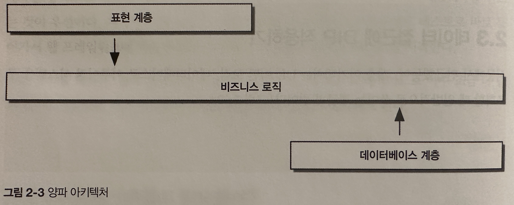
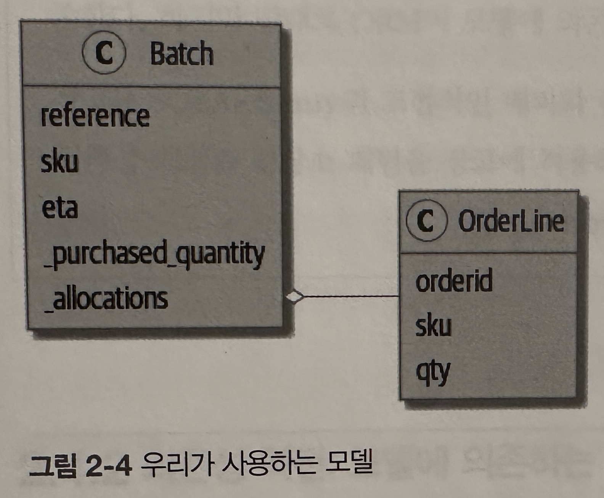
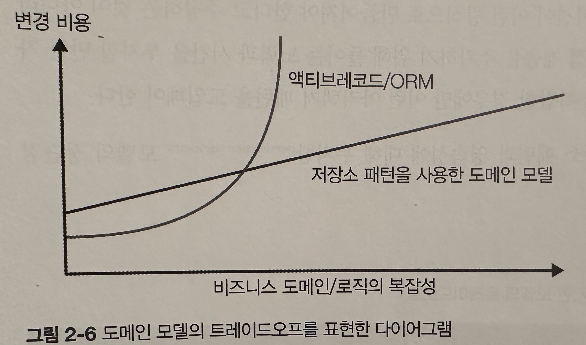

## 저장소 패턴

- 저장소 패턴은 데이터 저장소를 더 간단히 추상화한 것으로 이 패턴을 사용하면 모델 계층과 데이터 계층을 분리할 수 있다
- 추상화가 어떻게 데이터베이스의 복잡성을 감춰서 시스템을 테스트하기 더 좋게 만드는지 구체적인 예제로 살펴본다
- Repository 객체는 도메인 모델과 데이터베이스 사이에 존재한다

## 2.1 도메인 모델 영속화

- 1장에서 만든 모델은 인프라를 비롯한 의존성이 없으므로 쉽게 테스트할 수 있다
- 하지만 현실에서는 영속적인 저장소가 필요하며 이미 테스트를 어렵게 만드는 의존성이다

## 2.2 의사코드:무엇이 필요할까?

- 처음 API 엔드포인트 코드는 보통 다음과 같다

```python
@flask.route.gubbins
def allocate_endpoint():
    # 요청으로 부터 주문 라인 추출
    line = OrderLine(request.parmas, ...)
    # DB에서 모든 배치 가져오기
    batches = ...
    # 도메인 서비스 호출
    allocate(line, batches)
    # 어떤 방식으로든 할당한 배치를 다시 데이터베이스에 저장
    return 201
```

- 즉 필요한건 배치 정보를 데이터베이스에서 가져와 도메인 모델 객체를 초기화는 방법과 도메인 객체 모델에 있는 정보를 데이터베이스에 저장하는 방법이다

## 2.3 데이터 접근에 DIP 적용하기


- 계층 아키텍처는 UI, 어떤 로직, 데이터베이스로 이루어진 시스템을 구조화할 때 일반적으로 쓰이는 접근 방법이다
- `목표는 각 계층이 바로 아래 계층에만 의존하게 만드는 것이 목표다`
- [생각] 틀림 바로 아래 레이어가 오픈인 경우 건너 뛸 수 있음(바로 아래가 아니라 그 다음꺼에 의존할 수 있음)
- `하지만 도메인 모델에는 그 어떤 의존성도 없기 바란다`
    - 하부 구조와 관련된 문제가 도메인 모델에 지속적으로 영향을 끼쳐서 단위 테스트를 느리게 하고 도메인 모델을 변경할 능력이 감소되는 것을 원하지 않는다
    - 따라서 의존성이 도메인 모델 내부로 들어오게 만들어야 한다. 이런 방식을 `양파 아키텍처(onion architecture)` 라고 부른다(아래그림)



## 2.4 기억 되살리기: 우리가 사용하는 모델



- 할당은 OrderLine과 Batch를 연결하는 개념이다. 할당 정보를 Batch객체의 컬렉션으로 저장한다
- 이 모델을 관계형 데이터베이스로 번역하려면 어떻게 해야할까

## 2.4.1 '일반적인' ORM 방식: ORM에 의존하는 모델

- 요즘에는 직접 SQL질의를 수행하지 않고 ORM을 사용한다
    - ORM은 객체와 도메인 모델의 세계와 데이터베이스의 관계대수의 세계를 이어주는 다리 역할을 함으로 `객체 관계 매핑(object-relational mapping)`이다
    - ORM이 제공하는 가장 중요한 기능은 `영속성 무지(persistence ignorence)`이다. 도메인 모델이 데이터를 어떻게 적재하는지 또는 어떻게 영속화하는지에 대해 알 필요가 없다는 의미다
    - 영속성 무지가 성립하면 특정 데이터베이스 기술에 도메인이 직접 의존하지 않도록 유지할 수 있다
    - [생각] 선언적

```python
class Order(Base):
    id = Column(Integer, primary_key=True)


class OrderLine(Base):
    id = Column(Integer, primary_key=True)
    sku = Column(String(250))
    qty = Integer(String(250))
    order_id = Column(Integer, ForeignKey('order.id'))
    order = relationship(Order)

```

- 전형적인 SQLAlchemy 튜토리얼을 따르면 위와 같은 코드를 작성할 수 있다
    - 모델들이 정말 데이터베이스에 대해 무지하다고 말할 수 있을까?
    - 모델 프로퍼티가 직접 데이터베이스 열과 연관되어 있는데 어떻게 저장소와 관련되 관심사를 모델로부터 분리할 수 있을까?

### 2.4.2 의존성 역전: 모델에 의존하는 ORM

- 다행히 앞에서 설명한 모델이 ORM에 의존하는 방법 말고도 SQLAlchemy를 사용하는 방법이 더 있다
    - 대안은 스키마를 별도로 정의하고, 스키마와 도메인 모델을 상호 변환하는 명시적인 매퍼를 정의하는 것이다
    - SQLAlchemy는 이런 매퍼를 고전적 매퍼(classic mapper)라고 부른다

```python
import model  # 1

order_lines = Table(  # 2
    'order_lines', metadata,
    Column('id', Integer, primary_key=True, autoincrement=True),
    Column('sku', String(255)),
    Column('qty', Integer, nullable=False),
    Column('orderid', String(255))
)


def start_mappers():
    lines_mapper = mapper(models.OrderLine, order_lines)  # 3
```

- 위코드는 SQLAlchemy의 테이블 객체를 사용한 명시적 ORM 매핑 코드이다
    - 1> ORM은 도메인 모델을 임포트한다. 반대로 도메인 모델이 ORM을 임포트하지 않는다
    - 2> SQLAlchemy가 제공하는 추사화를 사용해 데이터베이스 테이블과 열을 정의한다
    - 3> mapper함수를 호출할 때 SQLAlchemy는 마법처럼 사용자가 정의한 여러 테이블에 도메인 클래스를 연결한다
    - [생각] 시리얼라이저랑 똑같음
    - [생각] 이것도 문제임 어잿든 DB에 있는 로우 한줄이 장고에서 객체가 된다는 것은 변함이 없음
- 결과적으로 start_mappers를 호출하면 쉽게 도메인 모델 인스턴스를 데이터베이스에 저장하거나 데이터베이스에서 불러올 수 있다
- 이런 구조를 사용하면 마이그레이션 등 SQLAlchemy의 모든 이점을 취하는 동시에 도메인 클래스를 사용해 질의를 투명하게 할 수 있다

```python
def test_orerline_mapper_can_load_lines(session):  # 1
    session.execute(
        'INSERT INTO order_lines (orderid, sku, qty) VALUES '
        '("order1", "RED-CHAIR",12),'
        '("order1", "RED-TABLE",13),'
        '("order2", "BLACK_LIPSTICK",14),'
    )

    expected = [
        model.OrderLine("order1", "RED-CHAIR", 12),
        model.OrderLine("order1", "RED-TABLE", 13),
        model.OrderLine("order2", "BLUE_LIPSTICK", 14)
    ]
    assert session.query(model.OrderLine).all() == expected


def test_orderline_mapper_can_save_lines(session):
    new_line = model.OrderLine('order1', 'DECORATIVE-WIDGET', 12)
    session.add(new_line)
    session.commit()

    rows = list(session.execute('SELECT orderid, sku, qty FROM "order_lines"'))
    assert rows = [('order1', 'DECORATIVE-WIDGET', 12)]
```

- 위 코드는 ORM을 직접 테스트 하는 코드이다
    - `테스트는 성공하기 때문에 의존성을 역전하는 목정은 달성했다`

- 도메인 모델에서 수행하는 작업에 따라 객체 지향 패러다임으로부터 멀어지면 멀어질수록 ORM이 원하는 대로 작동하게 만들기가 점점 더 어려워지고 도메인 모델을 직접 바꿀 필요가 생긴다
    - 아키텍처 관련 결정을 내릴 때 자주 발생하듯이 이런 경우에는 트레이드오프를 고려해야 한다
    - `파이썬의 철학은 실용성은 순수성을 이긴다!`

```python
@flask.route.gubbins
def allocate_endpoint():
    session = start_session()

    # 요청에서 주문 라인을 추출한다
    line = OrderLine(
        request.json['orderid'],
        request.json['sku'],
        request.json['qty']
    )
    # DB에서 모든 배치를 가져온다
    batches = session.query(Batch).all()

    # 도메인 서비스를 호출한다
    allocate(line, batches)

    # 할당을 데이터베이스에 저장하다
    session.commit()

    return 201
```

- 이제 API 엔드포인트는 위 코드와 비슷할 것이다

## 2.5 저장소 패턴 소개

- 저장소 패턴은 영속적 저장소를 추상화한 것이다

### 2.5.1 추상화한 저장소

- 가장 간단한 저장소에는 add(), get() 두가지 밖에 없다. 도메인 서비스 게층에서 데이터에 접근할 때 엄격하게 이 두가지 메서드만 사용할 수 있다
    - 이렇게 단순성을 강제로 유지하면 도메인 모델과 데이터베이스 사이의 결합을 끊을 수 있다

```python
class AbstractRepository(ABC):

    @abstractmethod  # 1
    def add(self, batch: model.Batch):
        raise NotImplementedError  # 2

    @abstractmethod  # 1
    def get(self, reference) -> model.Batch:
        raise NotImplementedError  # 2
```

- 위 코드는 저상소의 추상 기반 클래스가 어떤 모양인지 보여주는 코드이다
    - 1> abstractmethod는 파이썬에서 ABC가 실제로 작동하는 몇 안되는 요소 중 하나다. 구현을 강제한다
    - 2> 이 코드도 좋지만 여기 있을 필요도 없고, 충분하지도 않다. 정말 원한다면 하위 클래스가 호출할 수 있는 실제 동작을 상위클래스의 추상 메서드에 넣을 수도 있다

- 추상 기반 클래스, 덕 타이핑, 프로토콜
    - 이 책에서는 추상 기반 클래스를 사용하면 저장소라는 추상화가 제공하는 인터페이스를 더 잘 설명 할수 있을 것이라고 기대해서 추상 기반 클래스를 사용한다
    - 하지만 실전에서는 ABC를 제거하는 경우가 종종 있고, 파이썬에서는 ABC를 무시하기가 너무 쉬워서 종조 ㅇ유지보수가 불가능해지거나 더 꼬이게 된다
    - 따라서 실무에서는 파이썬의 덕 타이핑에 의존해 추상화하는 경우도 많다
        - `파이썬 개발자에게는 add(thing)과 get(id)메서드를 제공하는 어떤 객체든 저장소가 될 수 있다`
    - PEP544 프로토콜, 프로토콜은 상속을 사용하지 않고 타입을 지정할 수 있다. 따라서 특히 '상속보다는 구성을 사용하라'는 규칙을 선언한다면 프로토콜을 더 좋아할 수 있다
    - [생각]제발 하지 말자 눈에 보이지 않는 의존성을 만드는 짓이다

### 2.5.2 트레이드오프란 무엇인가?

- 아키텍처 패턴을 제시할 때마다 항상 트레이드오프를 고려해야 한다
- 보통 추상화 계층은, 전체적인 복잡성이 최소한으로 줄어들기를 기대한다
    - 하지만 새 추상화는 지역적으로는 복잡성을 증가시키고, 움직이는 부품 수나 지속적으로 유지보수해야 한다는 측면에서는 비용이 증가한다
    - 단위 테스트 시 가짜 저장소를 제공하기가 더 쉬워진다
      언

```python
def test_repository_can_save_a_batch(session):
    batch = model.Batch('batch', 'RUSTY-SOAPDISH', 100, eta=None)

    repo = repository.SqlAlchemyRepository(session)
    respo.add(batch)  # 1
    session.commit()  # 2

    rows = list(session.execute(
        'SELECT reference, sku, _purchased_quantity, eta FROm "batches"'  # 3
    ))
    assert rows == [('batch', 'RUSTY-SOAPDIS', 100, None)]
```

- 위 코드는 저장소가 데이터베이스와 제대로 연동되는지 검사하는 코드이고, 통합 테스트로 분류할 수 있다
    - 1> 여기에서 테스트하는 메서드는 repo.add()이다
    - 2> 저장소 밖에서 .commit()을 반복 수행해야 하며 이를 저장소를 호출하는 쪽의 책임으로 한다. 이런 방식에는 장단점이 있다
    - 3> SQL문을 사용해 저장된 데이터가 맞는지 검증한다
- `모든 모델에 대해 공들여 테스트를 작성하느냐는 각자의 판단에 따라 달라질 수 있다`

```python
class SqlAlchemyRepositry(AbstractRepository):
    def __init__(self, session):
        self.session = session

    def add(self, batch):
        self.session.add(batch)

    def get(self, reference):
        return self.session.query(model.Batch).filter_by(reference=reference).one()

    def list(self):
        return self.session.query(model.Batch).all()


@flask.route.gubbins
def allocate_endpoint():
    batches = SqlAlchemyRepositry.list()
    lines = [
        OrderLine(l['orderid'], l['sku'], l['qty']) for l in request.parmas...
    ]
    allocate(lines, batches)
    session.commit()
    return 201
```

- 위 코드는 최종 코드이다

## 2.6 테스트에 사용하는 가짜 저장소를 쉽게 만드는 방법

- 아래 코드는 저장소 패턴의 가장 큰 이점을 보여준다
    - 테스트에서 가짜 저장소를 사용하기도 아주 쉽다

```python
class FakeRepository(AbstractRepository):
    def __init__(self, batches):
        self._batches = set(batches)

    def add(self, batch):
        self._batches.add(batch)

    def get(self, reference):
        return next(b for b in self._batches in b.reference == reference)

    def list(self):
        return list(self._batches)


fake_repo = FakeRepository([batch1, batch2, batch3])  # 가짜 저장소 사용법 
```

## 2.7 파이썬에서 포트는 무엇이고, 어댑터란 무엇인가

- 포트와 어댑터는 객체 지향 세계에서 나온 용어이다. 이 책에서는
    - 포트(port)는 애플리케이션과 추상화하려는 대상 사이의 인터페이스
    - 어댑터(adapter)는 이 인터페이스나 추상화가 뒤에 있는 구현
    - 이라는 정의를 채택한다
    - [생각]핵사고날

## 2.8 마치며

- 간접 계층을 추가하기 위해 들이는 노력과 시간을 투자할 만한 가치가 있을 정도로 앱과 도메인이 복잡한 경우에만 이런 아키텍처 패턴을 도입해야 한다
- 아래는 영속성 무지에 모델에 대한 장단점이다

| 장점                                                       |                                   단점                                   |
 |----------------------------------------------------------|:----------------------------------------------------------------------:|
| 영속적 저장소와 도메인 모델 사이의 인터페이스를 간단하게 유지할 수 있다                 | ORM이 어느 정도 결합을 완화시켜준다. 외래키를 변경하기는 어렵지만 필요할때 MySQL과 Postgres를 서로 바꾸기 쉽다 |
| 단위 테스트를 위한 가짜 저장소를 쉽게 만들 수 있다                            |                    ORM 매핑을 수동으로 하려면 작업과 코드가 더 필요하다                     |
| 모델을 변경 할때 외래키나 마이그레이션 등에 대해 염려하지 않고 모델에 반영할 수 있다         |                       간첩 계층을 추가하면 유지 보수 비용이 증가한다                       |
| 객체를 테이블에 매핑하는 과정을 원하는 대로 제어할 수 있어서 데이터베이스 스키마를 단순화할 수 있다 |                                                                        |

- 아래 이미지는 영속성 분리와 ORM/액티브레코드 패턴 비용 그래프 이다


