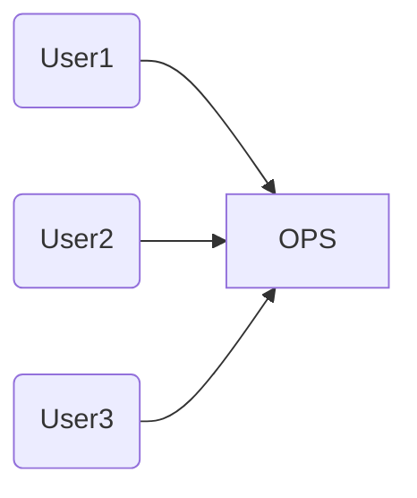

## ISP: 인터페이스 분리원칙

- 인터페이스 분리 원칙은 아래 다이어그램에서 그 이름이 유래했다



- 위 상황에서 User1,2,3 는 각각 OPS의 일부분만을 사용한다
    - 즉, 전혀 사용하고 있는 않은 코드에 의존하게 된다
- 위 문제는 인터페이스 단위로 분리하여 해결할 수 있다
  ```mermaid
    graph LR
      A(User1) --> D[U1Ops]
      B(User2) --> E[U2Ops]
      C(User3) --> F[U3Ops]
      G(OPS) --> D
      G(OPS) --> E
      G(OPS) --> F
  ```

### ISP와 언어

- 정적 타입 언어는 사용자가 import, user 또는 include와 같은 타입 선언문을 사용하도록 강제한다
    - 이로 인해 소스 코드 의존성이 발생하고, 이로 인해 재컴파일 또는 재배포가 강제되는 상황이 무조건 초래된다
- 루비나, 파이썬과 같은 동적 타입 언어에서는 소스 코드에 이러한 선언문이 존재하지 않는다. 대신 런타임에 추론이 발생한다
    - 따라서 소스 코드의 의존성이 아예 없으며, 결국 재컴파일과 재배포가 필요 없다
- 동적 타입 언어를 사용하면 정적 타입 언어를 사용할 때보다 유연하며 결합도가 낮은 시스템을 만들 수 있는 이유이다

### ISP와 아키텍처

- 일반적으로 필요 이상으로 많은 걸 포함하는 모듈에 의존하는 것은 해로운 일이다
- 시스템 S에서 프레임워크 F를 사용하려고하는데 프레임워크 F는 데이터베이스 D를 사용하고 있다
    - 위 경우 시스템 S에 전혀 필요하지 않은 데이터베이스 D의 기능이포함되게 된다
    - 데이터베이스D의 변경으로 인해 시스템 S를 수정해야하는 최악의 경우가 발생할 수 있다 