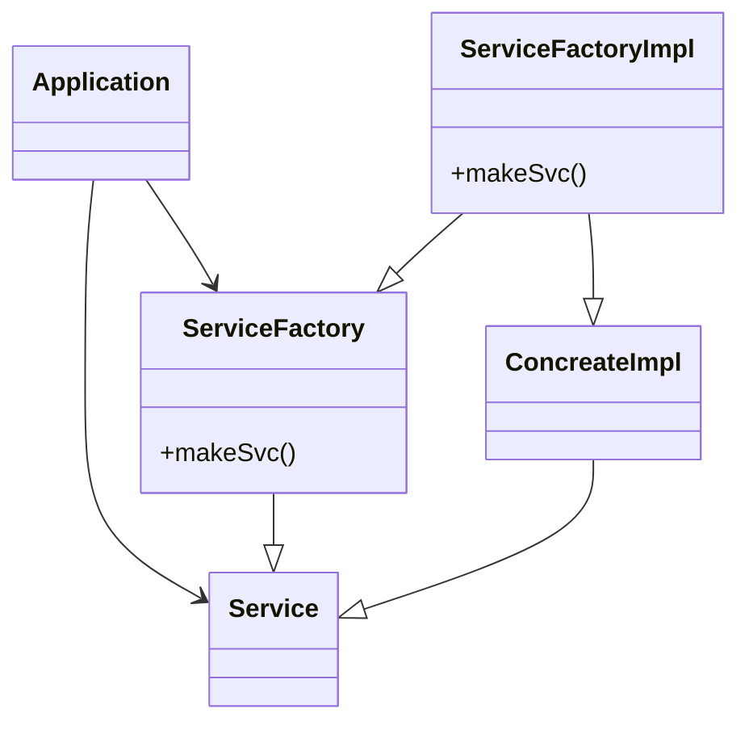

## DIP: 의존성 역전 원칙

- `의존성 역전 원칙에서 말하는 '유연성이 극대화된 시스템'이란 소스 코드 의존성이 추상에 의존하며 구체에는 의존하지 않는 시스템이다`
    - import, user, include에서 오직 인터페이스나 추상 클래스 같은 추상적인 선언만 있어야 하고 구체적인 대상은 절대 오면 안된다는 뜻
    - 다만 위 경우 운영체제나 플랫폼 같이 안정성이 보장된 환경에 대해서는 허용한다
    - 즉, 의존하지 않도록 피하고자 하는 것은 바로 변동성이 큰 (volatile)구체적인 요소이다 &rarr; 구체적인 요소란 우리 개발자의 코드이다

### 안정된 추상화

- 추상 인터페이스에 변경이 생기면 이를 구체화한 구현체들도 따라서 수정해야 한다. 반대로 구체적인 구현체에 변경이 생기더라도 그 구현체가 구현하는 인테페이스를 수정해야 한다
    - `하지만 대다수의 경우 구현체보다 인터페이스가 변동될 가능성이 극히 낮다`
    - 실제로 뛰어난 아키텍트는 인터페이스의 변도성을 낮추기 위해 노력한다
- 실천 방법
    - 변동성이 큰 구체 클래스를 참조하지 말라
        - 대신 추상 인터페이스를 참조하라
        - 객체 생성 방식을 강하게 제약하며, 일반적으로 추상 팩토리를 사용하도록 강제한다
    - 변동성이 큰 구체 클래스로부터 파생하지 말라
        - 상속은 소스 코드에 존재하는 모든 관계 중에서 가장 강력한 동시에 뻣뻣해서 변경하기 어렵다 &rarr; 신중하게 사용해야 한다
    - 구체 함수를 오버라이드 하지 말라
        - 대체로 구체 함수는 소스 코드 의존성을 필요로 한다. 따라서 구체 함수를 오버라이드 하면 이러한 의존성을 제거할 수 없게 되며, 실제로는 그 의존성을 상속하게 된다
    - 구체적이며 변동성이 크다면 절대로 그 이름을 언급하지 말라

### 팩토리

- 변동성이 큰 구체적인 객체는 특별히 주의해서 생성해야 한다



```python
def main():
    factory: ServiceFactory = ServiceFactoryImpl()  # ServiceFactoryImpl -> 어쩔수 없이 포함하게 되는 구체 컴포넌트
    service: Service = factory.makeSvc()
    service.work()

```

- Application은 service interface를 통해 concreateImpl을 사용하지만 Application에서는 어떤 식으로든 concreteImple의 인스턴스를 생성해야 한다
    - concreateImpl에 대해 소스 코드 의존성을 만들지 않으면서 이 목적을 이루기 위해 Application은 serviceFactory인터페이스의 makeSvc메서드를 호출한다
    - 이 메서드는 ServiceFactory로 부터 파생된 ServiceFactoryImpl에서 구현된다
    - 그리고 ServiceFactoryImpl 구현체가 concreateImpe의 인스턴스를 생성한 후 service 타입으로 반환한다
- 사실 위 코드도 DIP를 위배하고 있다
    - ServiceFactory가 ConcreteImple에 의존하고 있다
    - 하지만 이는 일반적인 일이다 DIP위배를 모두 없앨 수는 없다
    - `DIP를 위배하는 클래스들은 적은 수의 구체 컴포넌트 내부로 모을 수 있고 이를 통해 시스템의 나머지 부분과는 분리할 수 있다`
    - `즉, 구체 컴포넌트(변경이 많이 발생하는)로 부터 나머지를 보호하는 것이 DIP의 목적이다` 