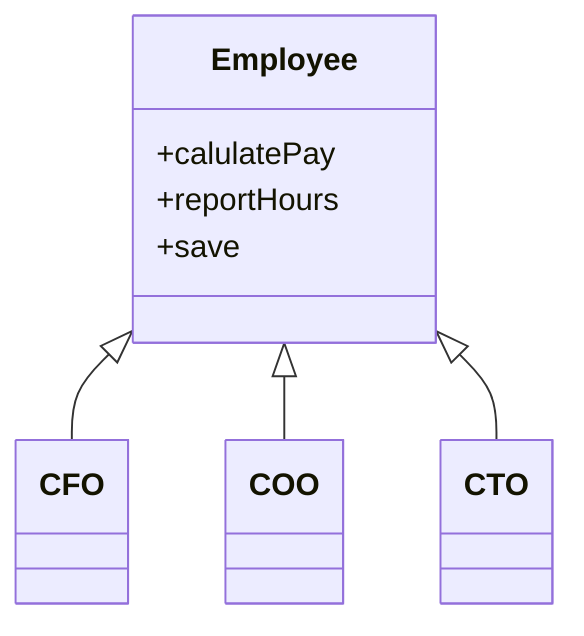

## SRP: 단일 책임 원칙

- `모든 모듈이 단 하나의 일만 해야 한다는 의미가 아니다`
    - 위 원칙은 따로 있다 &rarr; 함수는 반드시 하나의 단하나의 일만 해야 한다는 원칙이다
    - 이 원칙은 커다란 함수를 작은 함수들로 리택터링하는 더 저수준에서 사용된다
- SRP 의 정의는 단일 모듈의 변경의 이유가 하나, 오직 하나 뿐이어야 한다 이다 다른 말로 하면 하나의 모듈은 하나의, 오직 하나의 사용자 또는 이해관계자에 대해서만 책임 져야 한다 이다
    - 이해관계자 사용자 &rarr; 액터(actor)
- `정의 : 하나의 모듈은 하나의, 오직 하나의 액터에 대해서만 책임져야 한다`
    - 모듈 &rarr; 소스 파일, 단순히 함수와 데이터 구조로 구성된 응집된 집합
    - '응집된' 이라는 단어가 SRP를 암시한다. 단일 액터를 책임지는 코드를 함께 묶어주는 힘이 바로 응집성이다

### SRP를 위반하는 사례 : 징후1: 우발적 중복



- Employee의 세 가지 메서드가 서로 매우 다른 세명의 액터를 책임지기 있기 때문에 위반이다
    - CFO팀에서 결정한 조치가 COO팀에 의존하는 무언가에 영향을 줄 수 있다

### SRP를 위반하는 사례 : 징후2: 병합

- 서로 다른 팀이 같은 코드를 수정했을 경우 병합(merge conflict)가 발생할 수 있다
    - CFO팀 CTO팀이 둘다 Employee를 수정하려고 했을 경우

## 해결책

- 데이와 메서드를 분리하는 방법이 있다
    - 즉 아무런 메서드가 없는 간단한 데이터 구조인 EmployeeData 클래스를 만들어, 세 개의 클래스가 공유하도록 한다
    - 각 클래스는 자신의 메서드에 반드시 필요한 소스 코드만을 포함한다. 세클래스는 서로 존재를 몰라야한다 &rarr; '우연한 중복'을 피할 수 있다
  ```mermaid
      classDiagram
      EmployeeData <|-- PayCalculator
      EmployeeData <|-- HourReporter
      EmployeeData <|-- EmployeeSaver
      class PayCalculator {
          +calculatePay
      }
      class HourReporter {
          +reportHours()
      }
      class EmployeeSaver {
          +saveEmployee
      } 
  ```
    - 위 해결책의 문제점은 개발자가 세 가지 클래스를 인스턴스화하고 추적해야 한다는 단점이 있다 &rarr; 퍼사드 패턴을 활용해서 해결할 수 있다
      ```mermaid
          classDiagram
          EmployeeData <|-- PayCalculator
          EmployeeData <|-- HourReport터r
          EmployeeData <|-- EmployeeSaver
          PayCalculator <|-- EmployeeFacade
          HourReporter <|-- EmployeeFacade
          EmployeeSaver <|-- EmployeeFacade
          class PayCalculator {
              +calculatePay
          }
          class HourReporter {
              +reportHours()
          }
          class EmployeeSaver {
              +saveEmployee
          }
          class EmployeeFacade {
              +calculatePay()
              +reportHours()
              +save()
          }
      ```
        - EmployeeFacade에 코드는 거의 없다. 이 클래스는 세 클래스의 객체를 생성하고 요청된 메서드를 가지는 개체로 위임하는 일을 책임진다
    - 중요한 업무 규칙을 데이터와 가깝게 배치하는 방식을 선호하는 경우 다음과 같이 작성할 수 있다
      ```mermaid
      classDiagram
        Employee --|> HourRepoter
        Employee --|> EmployeeSaver
        class Employee {
          +employeeData
          +calculatePay()
          +save()
        }
        class HourRepoter {
          +reportHours()
        }
        class EmployeeSaver {
          +saveEmployee()
        }
      
      ```
        - 이 경우에는 가장 중요한 메서드는 기존의 Employee 클래스에 그대로 유지하되, Employee클래스를 덜 중요한 나머지 메서드들에 대한 퍼사드로 활용 한다
- 외부에 노출되어 있는 퍼블릭 함수가 3개 있고 이 3개의 함수는 여러 프라이빗 함수를 사용하고 있을 경우 세 가족이 있다고 할수 있다(유효 범위가 3개이다)
    - 외부(유효범위 바깥)에서는 3개의 유효범위에 식구(프라이빗)이 있는지 알 수 없기 때문

### 결론

- 단일 책임 원칙은 메서드와 클래스 수준의 원칙이다. 하지만 이보다 상위의 두 수준에서도 다른 형태로 다시 등장한다.
    - 컴포넌트 수준에서는 공통 폐쇄 원칙(Common Closure Principle)이 된다.
    - 아키텍처 수준에서는 아키텍처 경계(Architectural Boundary)의 생성을 책임지는 변경의 축(Axis of Change)이 된다