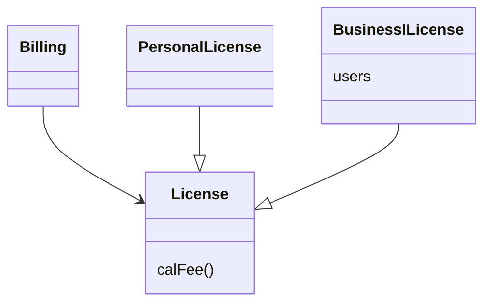
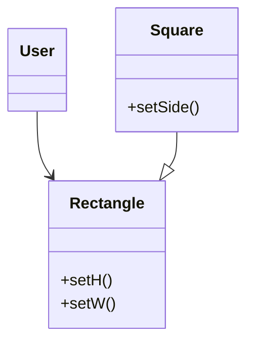

## LCP: 리스코프 치환 원칙

### 상속을 사용하도록 가이드 하기



- License에는 PersonalLicense와 BusinessLicense라는 두가지 '하위 타입'이 존재한다
- `위 설계는 LSP를 준수하는데, Billing 애플리케이션의 행위가 License하위 타입 중 무엇을 사용하는지에 전혀 의존하지 않기 떄문이다`
    - 이들 하위 타입은 모두 License 타입을 치환할 수 있다

### 정사각형/직사각형 문제

- LSP를 위반하는 전형적인 문제로는 유명한 정사각형/직사각형 문제가 있다



- Square(정사각형)는 Rectangle(직사각형)의 하위 타입으로 적합하지 않다
    - 직사각형의 높이와 너비는 서로 독립적으로 변경될 수 있는 반면 정사각형은 높이와 너비가 반드시 함께 변경되기 떄문
    - 아래 코드를 보면 왜 문제 인지 알 수 있따
      ```java
      Rectangel r = new Rectangle() or new Square()
      r.setW(5);
      r.setH(2);
      assert(r.area() == 10);
      ```
        - Square를 생성했는지 Rectangle을 생성했는지에 따라서 assert문의 결과가 달라진다
        - 이를 막을 수 있는 유일한 방법은 if문등을 활용해서 Rectangle이 실제로 Square인지 검사를 하는 메커니즘을 추가해야 하는데 이는 특정 타입에 의존하게 되는 코드임으로 LSP에 부합하지
          않게된다

### LSP와 아키텍처

- LSP가 처으마에는 상속을 사용하돌고 가이드하는 방법 정도 였지만 시간이 지나면서 LSP는 인터페이스와 구현체에도 적용되는 더 광범위한 설계 원칙으로 변모했다
    - 잘 정의된 인터페이스와 그 인터페이스의 구현체끼리의 상호 치환 가능성

