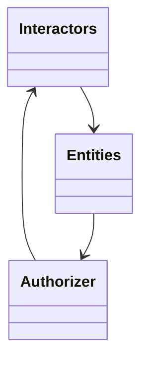
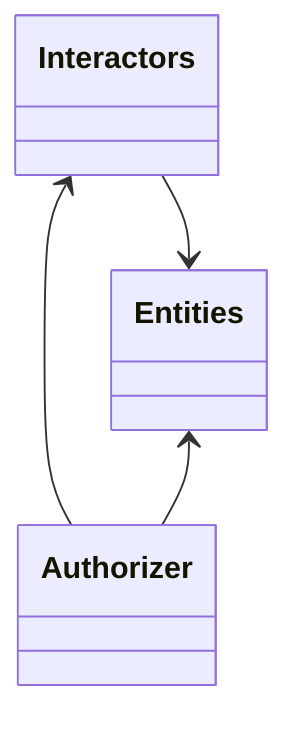
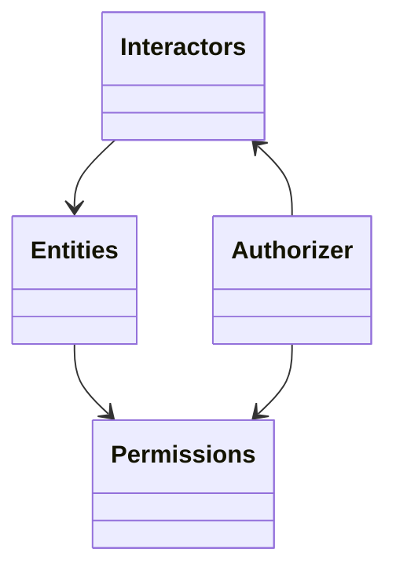
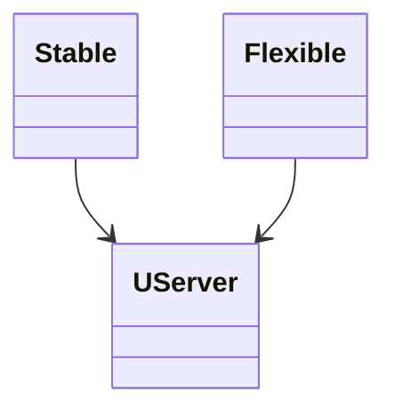
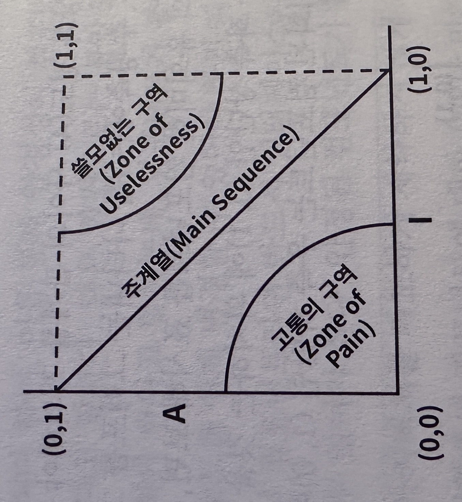

## 컴포넌트 결합

- 다음 세가지 원칙은 컴포넌트 사이의 관계를 설명한다

### ADP : 의존성 비순환 원칙(Acyclic Dependencies Principle)

- `컴포넌트 의존성 그래프 순환이 있어서는 안된다`
- 여러 개발자가 일을 하면서 동일한 코드를 수정했을 때 문제가 발생하는 것은 빈번했고 이 문제를 해결하기 위해 수십년동안 다음 방법이 발전되었다
- 주단위 빌드(Weekly Build)
    - 주 단위 빌드는 중간 규모의 프로젝트에서 흔하게 사용된다
    - 모든 개발자는 일주일의 첫 4일 동안은 서로를 신경 쓰지 않는다. 개발자는 모두 코드를 개인적으로 복사하여 작업하며, 전체적인 기준에서 작업을 어떻게 통합할지는 걱정하지 않는다
    - 그런 후 금요일이 되면 변경된 코드를 모두 통합하여 시스템을 빌드한다
    - 하지만 프로젝트가 커지면 금요일 하루만에 통합하는게 불가능해진다
- 의존성 비순환 원칙 (Acyclic Dependencies Principle)
    - `개발 환경을 릴리스 가능한 컴포넌트 단위로 분리하는 방법이다`
    - 개별 개발자 또는 단일 개발팀이 책임질 수 있는 작업 단위가 된다
    - 개발자가 해당 컴포넌트가 동작하도록 만든 후, 해당 컴포넌트를 릴리스하여 다른 개발자가 사용할 수 있도록 한다
    - 따라서 어떤 팀도 다른 팀에 의해 좌우되지 않는다. 특정 컴포넌트가 변경되더라도 다른 팀에 즉각 영향을 주지 않는다
    - `하지만 이방법이 성공적으로 동작하려면 컴포넌트 사이의 의존성 구조를 반드시 관리해야한다`

- 순환이 컴포넌트 의존성 그래프에 미치는 영향
    - 순환이 발생할 경우 순환이 발생하고 있는 컴포넌트들 중 어느 것을 개발하더라도 항상 정확하게 동일한 릴리스를 사용해한다
    - 더 큰 문제는 수정하는 하나는 수정하려고 하고 테스트 하려고 할 경우 순환하는 다른 컴포넌트들 까지 반드시 빌드하고 통합한 후에 가능해진다
    - 또한 순환 의존이 발생할 경우 어떤 컴포넌트들을 어떤 순서로 빌드해야 올바를지가 파악하기 어려워진다
- 순환 끊기
    - 컴포넌트 사이의 순환을 끊고 의존성을 다시 비순환 방향 그래프(Directed Acyclic Graph,DAG)로 원상복구하는 일은 언제라도 가능하다
    - 다음은 그 방법이다
        - DIP의존성 역전 원칙을 적용한다 (화살표 방향을 바꾸는 방법)
        - 순환이 발생하는 컴포넌트 중 두개가 의존하는 새로운 컴포넌트를 만든다(순환하지 않도록 컴포넌트를 추가하는 방법, Permissions 컴포넌트 추가)

- 흐트리짐(Jitters)
    - 위에서 나온 두번쨰 해결책(순환하지 않도록 컴포넌트를 추가하는 방법)이 시사하는 바는 요구사항이 변경되면 컴포넌트 구조도 변경될 수 있다는 사실이다
    - `실제로 애플리케이션이 성장함에 따라 컴포넌트 의존성 구조는 서서히 흐트러지며 또 성장한다. 따라서 의존성 구조에 순환이 발생하는지를 항상 관착해야 한다`
- 하향식(top-down)설계
    - 지금까지 논의로 봐서 피할 수 없는 결론은, 컴포넌트 구조는 하향식으로 설계될 수 없다
        - `컴포넌트는 시스템에서 가장 먼저 설계할 수 있는 대상이 아니며, 오히려 시스템이 성장하고 변경될 때 함께 진화한다`
        - 직관에서 어긋난다고 생각할 수도 있다. 컴포넌트와 같이 큰 단위로 분해된 구조는 고수준의 기능적인(function)구조로 다시 분해할 수 있다고 기대하기 때문이다
    - `컴포넌트들의 의존성을 통해서 시스템이 어떻게 동작하는지 기능적 측면을 보려고하지만 이는 컴포넌트 의존성 다이어그램의 속성이 아니다`
        - 컴포넌트 의존성 다이어그램은 애플리케이션의 기능을 기술하는 일과는 거의 관련이 없다
        - 오히려 컴포넌트 의존성 다이어그램은 애플리케이션의 빌드 가능성(buildability)와 유지 보수성(maintainability)를 보여주는 지도와 같다
        - 이런 이유 때문에 컴포넌트 구조는 프로젝트 초기에 설계할 수 없다
        - 빌드하거나 유지보수할 소프트웨어가 없다면 빌드와 유지보수에 관한 지도 또한 필요 없기 때문이다

### SDP : 안정된 의존성 원칙 (Stable Dependencies Principle)

- `안정성의 방향으로(더 안정된 쪽에) 의존하라`
- 어떤식으로든 의존은 발생하게 되는데 변경이 쉽지 않은 컴포넌트가 변동이 예상되는 컴포넌트에 의존하게 만들어서는 절대로 안 된다
    - 한번 의존하게 되면 변동성이 큰 컴포넌트도 결국 변경이 어려워진다
- 이는 소프트웨어가 가진 괴팍함이다
    - 즉, 당신이 모듈을 만들 때 변경하기 쉽도록 설계했지만, 이 모듈에 누군가가 의존성을 매달아 버리면 당신의 모듈도 변경하기 어려워진다
    - 당신의 모듈에서는 단 한줄의 코드도 변경되지 않았지만 어느순간 당신의 모듈을 변경하는 일이 상당히 도전적이 일이 되어 버린다
- 안정성(Stability)
    - `안정성은 변화가 발생하는 빈도와는 직접적이 관련이 없다. 안전성은 변경을 만들기 위해 필요한 작업량과 관련된다`
        - 옆으로 서있는 동전이 누워있는 동전보다 안정적이지 않은 이유는 그다지 힘을 쓰지 않고도 넘어뜨릴수 있기 때문이다
    - 컴포넌트를 변경하기 어렵게 만드는 확실한 방법중 하나는 수많은 다른 컴포넌트가 해당 컴포넌트에 의존하게 만드는 것이다
        - 사소한 변경이라도 의존하는 모든 컴포넌트를 만족시키면서 변경하려면 상당한 노력이 들기 때문이다
    - A,B,C가 X에 의존할 때
        - X는 변경하지 말아야할 이유가 3개나 있다
        - X는 세 컴포넌트를 책임진다(reponsible)이라고 한다
        - `반대로 X는 어디에도 의존하지는 않을 경우, X가 변경되도록 만들 수 있는 외적인 영향이 전혀없고 이럴 경우, 독립적(independent)라고 한다`
        - 그리고 X는 안정적인 컴포넌트이다
    - Y가 세가지 컴포넌트에 의존할 때
        - Y는 불안정한 컴포넌트이다
        - 어떤 컴포넌트도 Y에 의존하지 않는 경우 Y는 책임이 없다고 말할 수 있다
        - `또한 Y는 세 개의 컴포넌트에 의존하므로 변경이 발생할 수 있는 외부 요인이 세가지이고, 이 경우 Y는 의존적이라고 말한다 `
- 안정성 지표
    - 컴포넌트로 들어오고 나가는 의존성의 개수를 세어 보는 방법으로 컴포넌트가 위치상 어느 정도의 안정성을 가지는지 계산할 수 있다
    - Fan-in
        - 안으로 들어오는 의존성
        - 이 지표는 컴포넌트 내부의 클래스에 의존하는 컴포넌트 외부의 클래스 개수를 나타낸다
    - Fan-out
        - 바깐으로 나가는 의존성
        - 이 지표는 외부의 클래스에 의존하는 컴포넌트 내부의 클래스 개수를 나타낸다
    - I(불안정성) I = Fan-out / (Fan-in + Fan-out)
        - 이 지표는 (0,1)범위의 값을 같는다
        - 0이면 최고로 안정된 컴포넌트라는 뜻이다
    - `SDP에서는 결국, 의존성 방향으로 갈수록 I 지표값이 감소해야한다 &rarr; 점점 안정한 것들을 의존해야한다`
- 모든 컴포넌트가 안정적이어야 하는 것은 아니다
    - 모든 컴포넌트가 최고로 안정적인 시스템이라면 변경이 불가능하다
    - Stable한 컴포넌트가 Flexible한 컴포넌트에 의존하는 경우 어떻게 해결해야 하는가
        - DIP를 도입하면 문제를 해결할 수 있다
            - Stable이 Flexible에 의존하는 경우 Userver를 DI한다
            - DI한 Userver는 I가 0이다 (안정적이다) &rarr; SDP 원칙을 위반하지 않는다

- 추상 컴포넌트
    - 오로지 인터페이스만을 포함하는 컴포넌트를 생성하는 방식이 이상하게 보일 수도 있다 (위 예제에서 Userver)
    - 흔히사용하는 전략이며 꼭 필요한 전략으로 알려져 있다
    - 이러한 추상 컴포넌트는 상당히 안정적이며, 따라서 덜 안정적인 컴포넌트가 의존할 수 있는 이상적인 대상이다

### SAP : 안정된 추상화 원칙 (Stable Abstractions Principle)

- `컴포넌트는 안정된 정도만큼만 추상화 되어야 한다`
- 고수준 정책을 어디에 위치시켜야 하는가?
    - 시스템에는 고수준 아키텍처나 정책 결정과 같은 자주 변경해서는 절대로 안되는 소프트웨어도 있다
    - 따라서 시스템에서 고수준 정책을 캡슐화하는 소프트웨어에는 반드시 안정된 컴포넌트(I=0)에 위치해야 한다
    - 하지만 고수준 정책을 안정된 컴포넌트에 위치시키면, 그 정책을 포함하는 소스 코드는 수정하기가 어려워 진다 &rarr; 시스템 전체가 유연성을 잃는다
    - 해답은 개방 폐쇄 원칙(OCP)에서 찾을 수 있다
        - OCP에서는 클래스를 수정하지 않고도 확장이 충분히 가능할 정도로 클래스를 유연하게 만들 수 있을 뿐만 아니라 바람직한 방식이라고말한다
        - `바로 추상화 클래스가 이 원칙을 준수해야 한다`
- 안정된 추상화 원칙
    - 이 원칙은 안정성과 추상화 정도 사이의 관계를 정의한다
    - `안정된 컴포넌트는 추상 컴포넌트여야 하며, 이를 통해 안정성이 컴포넌트를 확장하는 일을 방해해서는 안된다`
    - `불안정한 컴포넌트는 반드시 구체 컴포넌트여야 한다 &rarr; 컴포넌트가 불안정하므로 컴포넌트 내부의 구체적인 코드를 쉽게 변경할 수 있다`
    - `따라서, 의존성은 추상화의 방향으로 향하게 된다`
    - 하지만 DIP는 클래스에 대한 원칙이며, 클래스의 경우 중간은 존재하지 않는다. 즉, 클래스는 추상적이거나 아니거나 둘 중 하나다
    - SDP와 SAP의 조합은 컴포넌트에 대한 원칙이며, 컴포넌트는 어떤 부분은 추상적이면서 다른 부분은 안정적일 수 있다
- 추상화 정도 측정하기
    - A지표는 컴포넌트의 추상화 정도를 측정한 값이다. 이 값은 컴포넌트의 클래스 총 수 대비 인터페이스와 추상 클래스의 개수를 단순히 계산한 값이다
    - Nc: 컴포넌트의 클래스 개수
    - Na: 컴포넌트의 추상 클래스와 인터페이스의 개수
    - A : 추상화 정도. A = Na / Nc
    - A 지표는 0과 1 사이의 값을 갖는다. A가 0이면 컴포넌트에는 추상 클래스가 하나도 없다는 뜻이다. 1이면 오로지 추상 클래스만을 포함한다는 뜻이다
    - 주계열 (천문학 용어로, 관측된 모든 별 중의 90%가 표시되어 있는 좁은 띠를 말한다)
        - 안정화(I)와 추상화 정도(A)로 그래프를 그린다
        - 좌상단은 최고로 안정적이며 추상화된 컴포넌트이다. 우측하단은 최고로 불안정하며 구체화된 컴포넌트이다

        

    - 고통의 구역 (zone of pain)
        - (0,0) 주변 구역에 위치한 컴포넌트 &rarr; 이 컴포넌트는 매우 안정적이며 구체적이다 &rarr; 바람직한 상태가 아니다
        - `추상적이지 않으므로 확장할 수도 없고, 안정적이므로 변경하기도 상당히 어렵다`
        - 이 주변 영역은 배제해야할 구역이며 고통의 구역이라고 한다
        - 데이터베이스 스키마 처럼 일부 소프트웨어 엔티티는 고통의 구역에 위치하곤한다
            - 데이터베이스 스키마는 변동성이 높기로 악명이 높으며, 극단적으로 구체적이며, 많은 컴포넌트가 여기에 의존한다
        - 구체적인 유틸리티 라이브러리도 여기에 속하는 경우가 많다
            - 비록 이러한 라이브러리는 I지표가 1일지라고, 실제로는 변동성이 거의 없다 (string 컴포넌트)
            - 즉, 변동성이이 없는 컴포넌트는 이 구역에 위치했더라도 해롭지 않다
    - 쓸모 없는 구역 (zone of uslessness)
        - `최고로 추상적이지만, 누구도 이 컴포넌트에 의존하지 않는 경우이며 바람직하지 않은 경우이다`
        - 이러한 컴포넌트는 쓸모가 없다. 이가 영역에 존재하는 엔티티는 폐기물과도 같다. 누구도 구현하지 않은 채 남겨진 추상 클래스인 경우가 많다
    - 정리 (내생각)
        - 추상적 = 확장 가능성 = 어떤것도 될 수 있다 = interface object
        - 안정적 = 변경이 불가능 하다 = 모두가 나를 사용하고 있다 = 나는 아무것도 사용 하고 있지 았다
        - (0,0) 구역 = 변경 불가능 + 확장 불가능 = 영원히 이대로 써야 한다
        - (100,100) 구역 = 어떤 것도 될 수 있다 + 아무도 날 사용하지 않는다 = 쓸데가 없다
- 배제 구역 벗어나기
    - 따라서 변동성이 큰 컴포넌트는 두 배제 구역으로 부터 떨어뜨려야 하며, 위치할곳은 주계열이다
    - 주계열에 위치한 컴포넌트는 자신의 안정성에 비해 너무 추상적이지도 않고, 추상화 정도에 비해 너무 불안정하지도 않다
    - 컴포넌트가 위치할 수 있는 가장 바람직한 지점은 주계열의 두 종점이다
- 주계열과의 거리
    - 실제로 통계를 이용해서 주계열과의 거리를 측정해서 분석하는 것도 가능하다

### 결론

- 의존성 관리 지표는 설계의 의존성과 추상화 정도를 내가 '훌륭한 패턴'이라고 생각하는 수준에 얼마나 잘 부합하는지를 측정한다
- 지표는 아무리 해도 불완전하다. 하지만 이들 지료포부터 무언가 유용한 것을 찾을 수 있다