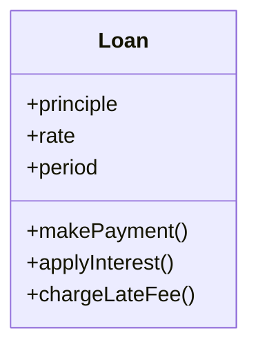

## 업무규칙

- 애플리케이션을 업무 규칙과 플러그인으로 구분하려면 업무규칙이 실제로 무엇인지 알아야 한다
- `엄밀하게 말하면 업무 규칙은 사업적으로 수익을 얻거나 비용을 줄일수 있는 규칙 또는 절차이다`
    - 업무 규칙은 사업적으로 수익을 얻거나 비용을 줄일 수 있어야 한다. 심지어 사람이 해도 마찬가지이다
    - 사람이 손으로 이자 계산을 해도 업무규칙이다
    - 이러한 업무 규칙을 핵심 업무 규칙(Critical Business Rule) 이라고 한다
    - 핵심 업무 규칙은 데어터를 요구하고 이를 핵심 업무 데이터(Critical Business Data)라고 부른다
    - `핵심 규칙과 핵심 데이터는 본질적으로 결합되어 있기 때문에 객체로 만들 좋은 후보가 되며 이러한 유형의 객체를 엔티티(Entity)라고 한다`

### 엔티티

- 엔티티는 시스템 내부의 객체로서, 핵심 업무 데이터를 기반으로 동작하는 일련의 조그만 핵심 규칙을 구체화 한다
- 엔티티 객체는 핵심 업무 데이터를 직접 포함하거나 핵심 업무 데이터에 매우 쉽게 접근할 수 있다
- 엔티티의 인터페이스는 핵심 업무 데이터를 기반으로 동작하는 핵심 업규 규칙을 구현한 함수들로 구성된다
- 예

- Loan 엔티티는 세 가지의 핵심 업무 데이터를 폼하며, 데이터와 관련된 세 가지 핵심 업무 규칙을 인터페이스로 제공한다
- 이 클래스는 업무의 대표자로서 독립적으로 존재한다. 이 클래스는 데이터베이서, 사용자 인터페이스, 서드파티 프레임 워크에 대한 고려사항들로 인해 오염이 되어서는 절대 안된다

### 유스케이스

- `유스케이스 : 제공해야 하는 입력, 출력, 그리고 해당 출력을 생성하기 위한 처리 단계를 기술한다`
- 마지막 customer에 주목해야한다. 이는 customer 엔티티에 대한 참조이며, 은행과 고객의 관계를 결정짓는 핵심 업무규칙은 바로 이 Customer 엔티티에 포함된다
- 유스케이스는 엔티티 내부의 핵심 업무 규칙을 어떻게, 그리고 언제 호출할지를 명시하는 규칙을 담는다 &rarr; 엔티티가 어떻게 춤을 출지는 유스케이스가 제어한다
- 또한 인테페이스로 들어오는 데이터와 인터페이스에서 되돌려주는 데이터를 형식 없기 명시한다는 점만 빼면, 유스케이스는 사용자 인터페이스를 기술하지 않는다는 점이다
    - 유스케이스만 봐서는 클라이언트 기반 인지 콘솔 기반인지 알 수 없다
- `유스케이스는 객체다. 유스케이스는 애플리케이션에 특화된 업무 규칙을 구현하는 하나 이상의 함수를 제공한다. 또한 유스케이스는 입력 데이터, 출력 데이터, 유스케이스가 상호작용하는 엔티티에 대한 참조 데이터 등의
  데이터 요소를 포함한다`
- 엔티티는 자신을 제어하는 유스케이스에 대해 아무것도 알지 못한다. 이는 의존성 역전 원칙을 준수하는 의존성 방향에 대한 또 다른 예다
    - 엔티티와 같은 고수준 개념은 유스케이스와 같은 저수준 개념에 대해 아무것도 알지 못한다
    - 반대로 저수준인 유스케이스는 고수준인 엔티티에 대해 알고 있다
- 왜 엔티티는 고수준이며, 유스케이스는 저수준일까?
    - 왜냐하면 유스케이스는 단일 애플리케이션에 특화되어 있으며, 따라서 해당 시스템의 입력과 출력에 보다 가깝게 위치하기 때문이다
    - 엔티티는 수많은 다양한 애플리케이션에서 사용될 수 있도록 일반화된 것이므로, 각 시스템의 입력이나 출력에서 더 멀리 떨어져 있다
    - 유스케이스는 엔티티에 의존한다. 반면 엔티티는 유스케이스에 의존하지 않는다

### 요청 및 응답 모델

- 유스케이스는 데이터를 사용자나 또 다른 컴포넌트와 주고받는 방식에 대해서는 전형 눈치챌 수 없게 받아서 출력 데이터를 생성한다
    - 유스케이스는 단순한 요청 데이터 구조를 입력으로 받아들이고, 단순한 응답 데이터 구조를 출력으로 반환한다
    - 이들 데이터 구조는 어떤 것에도 의존하지 않는다
    - 독립적이지 않다면 그 모델에 의존하는 유스케이스도 결국 해당 모델이 수반하는 의존성에 간접적으로 결합되어 버린다
- 엔티티 객체를 가리키는 참조 요청 및 응답 데이터 구조를 포함하려는 유혹을 받을 수도 있다
    - 엔티티와 요청/응답 모델은 상당히 많은 데이터를 공유하므로 이러한 방식이 적합해 보일 수 도 있다
    - 하지만 시간이 지나면 두 객체는 완전히 다른 이유로 변경될 것이고, 따라서 두 객체를 어떤 식으로든 함께 묶는 행위는 공통 폐쇄 원칙과 단일 책임 원칙을 위배하게 된다

### 결론

- 업무 규칙은 사용자 인터페이스나 데이터베이스와 같은 저수준의 관심사로 인해 오염되어서는 안 되며, 원래 그대로의 모습으로 남아 있어야 한다
- 이상적으로 업무 규칙을 표현하는 코드는 반드시 시스템의 심장부에 위치해야 하며, 덜 중요한 코드는 이 심장부에 플러그인되어야 한다 
- 업무 규칙은 시스템에서 가장 독립적이며 가장 많이 재사용할 수 있는 코드여야 한다 