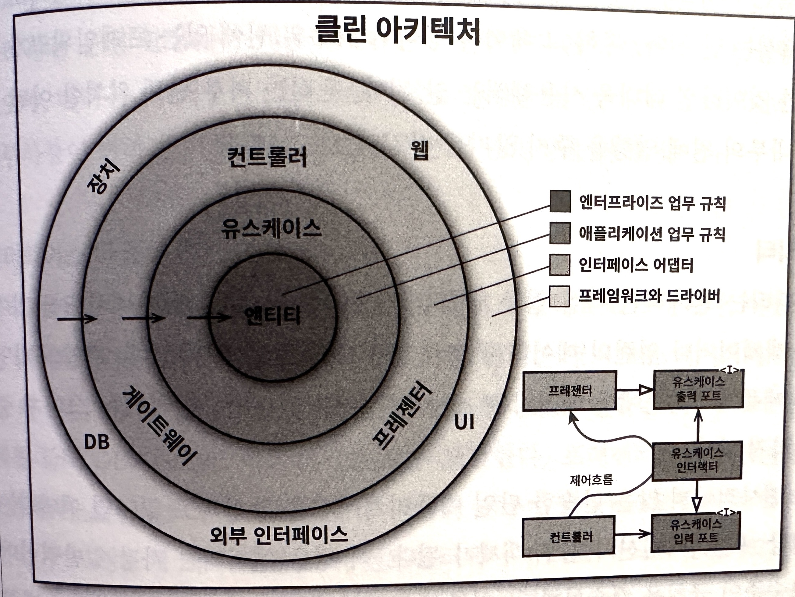

## 클린 아키텍처

- 지금 까지 여러 아키텍처들이 개발 되었지만 목표는 모두 같다
    - 목표는 바로 관심사의 분리(seperation of concers)이다
    - 이들 모두 소프트웨어를 계층으로 분리함으로써 관심사의 분리라는 목표를 담을 수 있었다
    - 이들 모두 최소한 업무 규칙을 위한 계층하나와, 사용자와 시스템 인터페이스를 위한 또 다른 계층 하나를 반드시 포함한다
    - 이들 아키텍처는 모두 시스템이 다음과 같은 특징을 지니도록 만들었다
        - 프레임워크 독립성
            - 아키텍처는 프레임워크의 존재 여부에 의존하지 않는다
            - 이를 통해 프레임워크를 도구로 사용할 수 있으며, 프레임워크가 지닌 제약사항으로 시스템을 욱여 넣도록 강제 하지 않는다
        - 테스트 용이성
            - 업무 규칙은 UI, 데이터베이스, 웹 서버, 또는 여타 외부 요소가 없이도 테스트할 수 있다
        - UI 독립성
            - 시스템의 나머지 부분을 변경하지 않고도 UI를 쉽게 변경할 수 있다
        - 데이터베이스 독립성
            - 오라클이나 MySQL, 몽고DB 등으로 교체할 수 있으며, 업무 규칙은 데이터베이스에 결합되지 않는다
        - 모든 외부 에이전시에 대한 독립성
            - 업무 규칙은 외부 세계와의 인터페이스에 대해 전혀 알지 못한다

### 의존성 규칙

- 맨위 그림에서 동심원은 소프트웨어에서 서로 다른 영역을 표현한다
    - 보통 안으로 들어갈 수록 고수준의 소프트웨어가 된다
    - 바깥쪽 원은 메커니즘이고, 안쪽 원은 정책이다
    - 이러한 아키텍처가 동작하도록 하는 가장 중요한 규칙은 의존성 규칙이다
    - `소스 코드 의존성은 반드시 안쪽으로, 고수준의 정책을 향해야 한다`

### 엔티티

- 엔티티는 전사적인 핵심 업무 규칙을 캡슐화한다
- 엔티티는 메서드를 가지는 객체이거나 데이터 구조와 함수의 집할일 수도 있다. 형태는 그다지 중요하지 않다(클래스이지 않아도 된다)

### 유스케이스

- 유스케이스 계층의 소프트웨어는 애플리케이션에 특화된 업무 규칙을 포함한다
- 유스케이스 계층의 소프트웨어는 시스템의 모든 유스케이스를 캡슐화하고 구현한다
- 유스케이스는 엔티티로 들어오고 나가는 데이터 흐름을 조정하며, 엔티티가 자신의 핵심 업무 규칙을 사용해서 유스케이스의 목적을 달성하도록 이끈다
- 유스케이스 계층에서 발생한 변경이 엔티티에 영향을 줘서는 안 된다
    - 데이터베이스, UI, 또는 여타 프레임워크와 같은 요소가 엔티티에 영향을 줘서는 안된다
- 하지만 운영 관점에서 애플리케이션이 변경된다면 유스케이스가 영향을 받는다

### 인터페이스 어댑터

- 인터페이스 어댑터 계층은 일련의 어댑터들로 구성된다
- MVC아키텍처, Presenter, View, Controller도 모두 인터페이스 어댑터 계층에 속한다
- 모델은 그저 데이터 구조 정도에 지나지 않으며, 컨트롤러에서 유스케이스로 전달되고, 다시 유스케이스에서 프리젠터와 뷰로 되돌아 간다
- 이 원 안에 속한 어떤 코드도 데이터베이스에 대해 조금도 알아서는 안 된다

### 프레임워크와 드라이버

- 가장 바깥쪽 계층은 일반적으로 데이터베이스나 웹 프레임워크 같은 프레임워크나 도구들로 구성된다
- 일반적으로 이 계층에서는 안쪽원과 통신하기 위한 접합 코드 외에는 특별히 더 작성해야 할 코드가 그다지 많지 않다
- 프레임 워크와 드라이버 계층은 모두 세부사항이 위치하는 곳이다 (웹, DB 모두 세부사항이다)

### 원은 네 개여만 하나?

- 네 개보다 더 많은 원이 필요할 수도 있다
- 하지만 어떤 경우에도 의존성 규칙은 적용된다 (소스 코드 의존성은 항상 안쪽을 향한다)

### 경계 횡단하기

- 이미지 우 하단 예시
    - 제어 흐름: 컨트롤러 -> 유스케이스 -> 프레젠터
    - 의존성 : 각 의존성은 유스케이스를 향해 안쪽을 가리킨다
    - 이처럼 제어 흐름과 의존성이 방향이 명백히 반대여야 하는 경우, 대체로 의존성 역전 원칙을 사용하여 해결한다
- `아키텍처 경계를 횡단할 떄 언제라도 동적 다형성을 이용하여 의존성을 제어흐름과는 반대로 만들수 있고, 이를 통해 제어흐름이 어느 방향으로 흐르더라도 의존성 규칙을 준수 할 수 있다`

### 경계를 횡단하는 데이터는 어떤 모습이나가

- 격리되어 있는 간단한 데이터 구조가 경계를 가로질러 전달 된다
    - 꾀를 부려서 엔티티 객체나 데이터베이스의 행을 전달하는 일은 원치 않는다
- 예를 들어 많은 데이터베이스 프레임워크는 쿼리에 대항 응답으로 '행(row)'를 사용하는데, 이 행 구조가 경계를 넘어 내부로 그대로 전달되는 것을 원치 않는다
    - 이렇게 되면 의존성 규칙을 위배하게 되는데, 내부의 원에서 외부원의 무언가를 알아야만 하기 때문이다
    - `따라서 경계를 가로질러 데이터를 전달 할 때, 데이터는 항상 내부 원에서 사용하기 가장 편리한 형태를 가져야만 한다`

### 결론

- 소프트웨어를 계층으로 분리하고 의존성 규칙을 준수한다면 본질적으로 테스트하기 쉬운 스스템을 만들게 될 것이며, 그에 따른 이점을 누릴 수 있다 