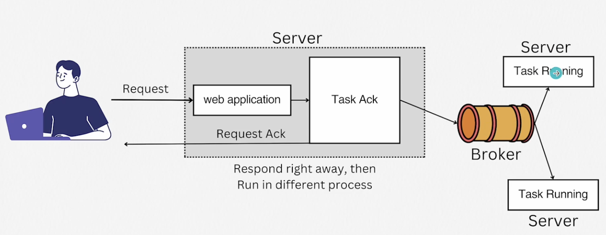
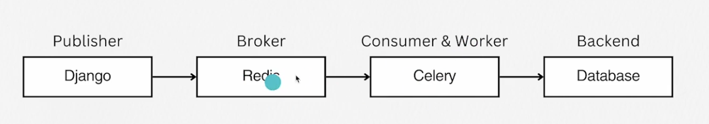

## Celery 특성

- 비동기 테스크를 여러 서버에 분할해서 병렬적으로 돌아가게 한다
    - Distributed : 워커가 잡을 받아서 각각의 머신에서 일읋한다
    - Broker : 장고로 부터 메시지를 받아서 장고와 워커를 중재한다 (Redis, RabbitMQ)
    - Backends : 상태저장 (Rdis, RabbitMQ, RDBMS)
    - Task: unit of work
    - Scheduling : 크론잡이나 Periodic task 가능
    - Concurrency : Concurrency(multipleprocessing, Eventlet, Gevnt)
    - Fault Tolerance : designed to be resilient to node failures, with various machanisms for retrying failed tasks
    - Monitoring : Flower 라이브러리로 가능
