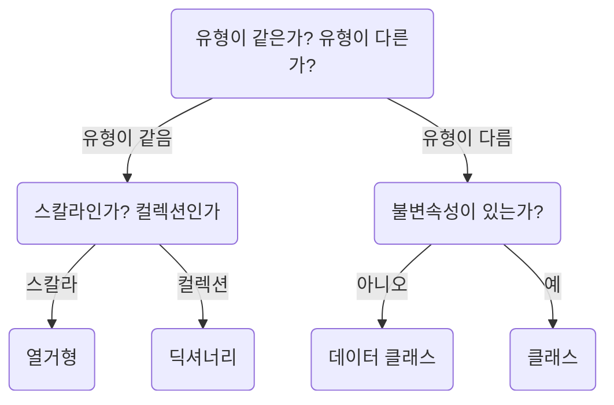

## 사용자 정의 타입: 클래스

- 클래스를 사용해야 할 곳과 사용하지 말아야 할 곳을 구분 해야한다

## 클래스 해부

- 클래스는 서로 연관된 데이터를 그룹화하는 또 다른 방식이다
    - 얼핏 보면 데이터클래스와 다르지 않아 보이며, 사실은 데이터 클래스에서처럼 클래스를 작성할 수 있다
- 클래스가 데이터 클래스 대신 사용될 수 있는 장점을 알아야 한다

### 생성자

- 생성자는 클래스를 어떻게 초기화하는지 기술하며 __init__ 함수로 정의한다
    - 데이터 클래스에서처럼 변수들을 정의하는 대신 모든 변수를 생성자에서 정의 한다
- `클래스는 딕셔너리나 데이터 클래스가 전달할 수 없는 키 값 하나를 전달 할 수 있는데, 이 값이 바로 불변 속성이다`

#### 불변속성

- 불변 속성이란 해당 엔티티의 수명주기 동안 변하지 않는 엔티티 속성을 의미하며, 불변 속성은 코드에 대해 항상 참인 개념이다
    - 불변 속성은 코드베이스를 이해하는데 기초를 제공한다
- 다음은 불변 속성의 예시들이다
    - 모든 직원은 고유 ID를 갖는다. ID는 중복될 수 없다
    - 게엠에서 적들은 자신의 체력이 0 이상일 떄만 행동을 취할 수 있다
    - 원의 반지름은 항상 양수다
    - 피자는 항상 소스 위에 치즈가 얹어진다
- 불변 속성은 객체의 수정 불가 속성을 전달한다
    - 이 속성들은 수학적인 특성이 될 수도 있고, 비즈니스 규칙이 될 수도 있고, 조정에 대한 보증이 될수도 잇고, 그 외에 참으로 묶어 두고 싶은 무언가가 될 수 있다
    - 불변 속성은 실세계에서 미러링이란 있을 수 없으며, 시스템에서는 항상 참이어야 한다
    - ex) 시카고 스타일 피자의 애호가들은 피자의 선택지가 여러 개인 것에 동의하지 않을 수 있다. 하지만 시스템이 치즈 온 소스 피자만 처리하는 경우에는 이를 불변 속성으로 처리해도 괜찮다
    - 불변 속성 역시 특정 엔티티만 참조한다
    - 불변 속성의 범위, 즉 시스템 전체에 적용되는지 또는 특정 프로그램, 모듈, 클래스에만 적용되는지 여부를 결정 할 수 있다
- 클래스가 어떻게 불변 속성을 전달하는 데 도움이 될까?
    - 생성자를 봐야 한다
    - 불변 속성을 만족하는지를 체크하는 안전망과 가정 설정들을 여기에 넣을 수 있으며, 이 지점 부터 클래스의 사용자들은 클래스의 수명주기 동안 항상 참인 불변 속성에 의존할 수 있다
- 어떻게 위처럼 되는지 살펴보자
    - 항상 최상의 피자를 제조하는 자동 피자 제조기를 생각해보자. 먼저 도우를 받아 둥그렇게 펴고 소스와 토핑을 넣은 후 오븐에 굽니다
    - 여기에서 시스템에서 사용될 몇 가지 불변 속성을 정의해보자
        - 소스틑 토핑위에 올라갈 수는 없다
        - 토핑은 치즈 위 또는 아래에 올라갈 수 없다
        - 항상 단일 소스만 사용한다
        - 도우의 반지름은 항상 정수다
        - 도우의 반지름은 6친치에서 12인치 사이다
  - 위 불변 속성 중 어떤 것은 비즈니스의 이유일 수도 있고 또 어떤 것은 건강상의 이유일수도 있고 또 어떤 것은 하드웨어의 제약 사항 때문일 수도 있다
    - 하지만 위 항목들은 피자의 수명주기 동안 참이라고 생각하자
    - `이 불변 속성들을 피자의 생성자를 통해 체크할 것이다`

#### 깨진 불변 속성 피하기

- 클래스내 불변 속성이 깨질 것 같다면 절대 이 클래스는 구성하지 말아야 한다
- 호출자가 불변 속성을 꺠트리는 방식으로 객체를 구성할 경우 선택지는 아래 두개가 있다
  - 예외 발생 &rarr; 불변 속성이 깨지는 상황에서 객체가 생성되는 것을 막아준다
  - 데이터 마사지 (Message the data) &rarr; 데이터를 불변 속성에 적합하게 만든다

#### 불변 속성이 이익인 이유

- 예시
    - 타입 시스템에서 미처 캐치하지 못한 어떤 형태(예를 들어 토핑의 순서)에 제약이 되는 데이터들이 있는가?
    - 상호의존적인 필드들이 있는가?
    - 데이터에 필요한 보증이 있는가?
- 위 질문 중 하나라도 "예"라면 보존하려는 불변 속성으 갖고 있으면 클래스를 작성해야 한다
- 클래스를 작성하고 불변 속성을 설정하기로 했다면 다음을 수행하는 것과 같다
    - 1> DRY 원칙을 지키고 있다. 객체 생성 전에 여러 가지 체크사항들로 코드를 어지럽히는 대신 해당 체크 사항들을 한 곳으로 배치한다
    - 2> 유지보수 작업을 용이하게 하고, 작성자에게 더 많은 작업을 시킨다. &rarr; 코드는 한 번 작성되면 작업하는 시간보다 오래 지속될 가능성이 높이며, 불변 속성을 제공해 부담을 줄일 수 있다
    - 3> 더 효과적으로 코드를 추론할 수 있게 된다
- 위 사항들은 버그를 줄이는 데 많은 기여를 한다
- SOLID 원칙의 S에 해당한다
    - 단일 책임 원칙은 "각 객체는 한 개의 이유로만 변경되려면 하나의 책임을 가져야 함"
      -연관된 불변 속성들을 집합으로 정의하고 연관된 불변 속성의 집합 단위로 클래스를 작성 하는 방법을 추천한다
    - 불변 속성 중 하나와 직접 적으로 연관되지 않는 메서드나 속성을 작성한다면 클래스는 낮은 응집력을 가지며, 이는 클래스가 많은 책임을 갖고 있음을 의미한다

#### 불변은 클래스 이외에도 다른 방법이 있는거 같은데?

- 불변 속성 검사후 딕셔너리를 만드는 메서드를 정의할 수 있고 불변 속성 검사 함수를 통해서만 딕셔너리를 변경할 수 있다는 것도 사실이다.
- 또한 데이터 클래스에 생성자 및 불변성 체크 메서드를 작성할 수도 있다
- 하지만 이런 것들을 쓰는게 어렵다면 클래스를 사용하는 것이 어떤가?
- 딕셔너리, 데이터 클래스, 클래스 중 하나를 선택할 때는 신중해야 한다. 이 추상화들은 각각 구체적인 의미를 전달하며, 향후 유지보수에 큰 영향을 미친다

### 불변 속성을 통한 커뮤니케이션

- 불변 속성으로 커뮤니케이션을 효과적으로 하지 않으면 불변 속성의 장점을 알기 어렵다
- 커뮤니케이션의 상대는 크게 다음 두 가지로 나눌 수 있다
    - 클래스 소비자: 문제를 해결하기 위해 클래스를 사용하는 사람
    - 클래스 유지 보수자: 클래스를 수정 및 추가하는 작업을 수행하는 사람

#### 클래스의 소비

- 생성자는 일반적으로 개발자들이 처음 들여다 보는 곳이다
    - 생성자에 가정 설정 구문을 삽입하는 것은 사용자들에게 무엇이 가능하고 무엇이 불가능할지 알려주는 최상의 방법이다
    - 코드가 하는 일을 절대적으로 자체 문서화해야 한다

#### 유지 보수자들

- 제약 조건을 정의하는 데 주석은 도움을 주지만 우발적인 변화까지는 막을 수 없다
    - 이런 변경을 캐치하려면 단위 테스트에 의존해야 한다
    - 따라서 당연히 의도와 불변 속성에 대한 단위 테스트를 작성해야 한다

```python
@contextlib.contextmanager
def create_pizza_specification(dough_radius_in_inches: int, toppings):
    pizza_spec = PizzaSpecification(dough_radius_in_inches, toppings)
    yield pizza_spec
    assert 6 <= pizza_spec.dough_radius_in_inches <= 12
    sauces = [t for t in pizza_spec.toppings if is_sauce(t)]
    assert len(sauces) < 2
    if sauces:
        assert pizza_spec.toppings[0] == sauces[0]

    # check that we assert order of all non sauces 
    # keep in mind, no invariant is specified that we can't add
    # toppings at a later date, so we only check against what was
    # passed in
    non_sauces = [t for t in pizza_spec.toppings if t not in sauces]
    expected_non_sauces = [t for t in toppings if t not in sauces]
    for expected, actual in zip(expected_non_sauces, non_sauces):
        assert expected == actual


def test_pizza_operations():
    with create_pizza_specification(8, ["Tomato Sauce", "Peppers"])
        as pizza_spec:

    assert pizza_spec.toppings == ["Tomato Sauce", "Peppers"]


test_pizza_operations

pizza_spec = PizzaSpecification(dough_radius_in_inches=8,
                                toppings=['Olive Oil', 'Garlic', 'Sliced Roma Tomatoes', 'Mozzarella'])
pizza_spec.dough_radius_in_inches = 100  # BAD!
assert pizza_spec.dough_radius_in_inches == 100
pizza_spec.toppings.append('Tomato Sauce')  # Second Sauce, oh no
```

- 추가로 테스트 작성시 중요한 것은 언제 불변 속성이 깨졌는지 알 수 있게 도와 줘야 한다
    - 이를 컨텍스트 관리자의 도움을 받아 수행할 수 있다
    - 컨텍스트 관리자 사용의 큰 장점은 모든 불변 속성이 테스트 시점에서 모두 확인될 수 있다는 것이다

### 캡술화와 불변 속성의 유지보수

- 사실 위 코드에는 문제가 있다
    - pizza_spec.toppings.append("tomato sauce")를 막지 않고 있다
    - 이를 해결하기 위해서는 캡슐화를 알아야 한다

#### 캡슐화

- `캡슐화란 하나의 엔티티에 대해 속성들과 그 속성들의 동작을 숨길 수 있는 능력이다`
    - 호출자에게 어떤 속성을 보여줄지를 결정하거나 어떻게 데이터 변경이나 접근을 제어할지를 결정하는 것을 의미한다
    - 이는 API로 수행된다 (모든 클래스는 API를 가지고 있다)

#### 데이터 접근의 보호

- API가 불변 속성을 깨트리는 것을 방지 하기 위해서는 데이터가 private 이어야 한다는 것을 알려주면 된다
    - 파이썬에서는 언더스코어(_)를 붙임으로써 개발자들에게 해당 속성을 protected임을 알려준다
    - private속성과 메서드는 앞에 던더(__)를 붙여 나타낸다
    - 하지만 파이썬에서는 이런 접근 제어가 깨짐을 캐치할 수 있는 컴파일러가 없다 (동타입의 문제)
- 모든 private멤버에 게터와 세터를 작성해야 할까?
    - 게타와 세터를 모든 private 멤버에 작성하는 것은 결국 공용 데이터를 복잡하게 오픈하는 것 밖에 안되면 그럴거면 데이터 클래스를 사용하는 것이 낫다

#### 운영

- 추가하는 모든 메서드는 불변 속성을 계속 보존해야 한다
- 메서드는 때떄로 접근자와 설정자로 나뉘다 (게터,세터)
    - 접근자는 정보를 검색하는데 사용된다. 데이터 표현과 관련되 불변 속성을 갑고 있다면 이 메서드를 다뤄야 한다
    - 설정자는 객체의 상태르 변경한다. 설정자를 갖고 있다면 상태 변경 시 불변 속성이 변경되지 않도록 주의를 기울어야 한다
- 위의 구분법은 함수를 클래스의 안에 둘지 밖으로 뺄지 결정하는 좋은 방법이다
    - `함수가 불변 속성과는 무관하고 더 심한 경우 클래스의 멤버들과 무관하다면 자유 함수(클래스 밖의 함수)로 빼는 것이 나을 것이다`
    - 클래스에 불변 속성이 전혀 없을 수도 있으며 이럴 때는 클래스 대신자유 함수로 서로 체이닝 해야 한다
- @staticmethod 와 @classmethod
    - 이들은 인스턴스 대신 클래스에 묶인 함수를 작성하거나(classmethod)
    - 클래스 안에 위치하지만 어떤 방식으로든 클래스에 묶이지 않은(staticmethod) 함수를 작성하게 하는 데코레이터다
    - 이는 오늘날처럼 견고한 패턴이 많지 않던 시절 프로그래머들의 진부한 정신일 수도 있다
    - staticmethod의 경우는 클래스로 묶어두기보다는 모듈 레벨의 범위서의 자유 함수가 돼야 한다
    - classmethod를 사용하면 메타프로그래밍을 포함한 몇 가지 합법적인 사용 사례가 있지만 자유 함수가 더 강력한다
        - 자유 함수는 클래스보다 이동하기 쉬우며 하위 타입이 내 클래스의 메서드나 정적 메서드보다 우선하는 여부를 걱정할 필요가 없다
        - &rarr; 상속 및 클래스/정적 메서드에는 위험한 부분이 있다

### 정리

#### 딕셔너리

- 딕셔너리는 키-값 매핑의 의미를 가진다.
- 딕셔너리를 사용하고 있지만 이터레이션이 거의 없거나 동적으로 키를 찾는다면 &rarr; 딕셔너리를 연관된 매핑처럼 사용하는 것이 아니므로 다른 타입을 써야 한다
- 런타임시에 데이터 검색에 예외가 있는데, 이런 경우는 TypedDict가 더 적절하다
- 하지만 데이터들을 다른 곳에서의 딕셔너리로 사용할 필요가 없다면 데이터를 파싱 후 이들을 사용자 정의 클래스로 가져오게 해야 한다

#### 열거형(enum)

- 열거형은 분산 스칼라 값들의 조합을 표현하는 데 적합하다
- 열거형 값이 어떻게 되는지 신경을 쓸 필요는 없으며 코드에서 케이스를 구분하기 위한 구분자만 필요하다

#### 데이터 클래스

- 데이터 클래스는 거의 독립적인 데이터를 다루는데 최적이다
- 개별 필드들이 설정되는 방법은 제약이 있을 수 있지만 대부분은 사용자들이 내용의 핵심에 대한 개별 속성을 읽어 들어가나 설정하는 데 자유롭다

#### 클래스

- 클랫는 모두 불변 속성을 위한 것이다.
- 보존하고 싶은 불변 속성이 있다면 클래스를 만들고 구축할 때 가정 설정을 세운다
- 그리고 메서드나 사용자가 이 불변 속성을 꺠지 않게 해야 한다

#### 표



- 스칼라 : 단 하나의 데이터만 가질 수 있는 타 (반복 불가능)