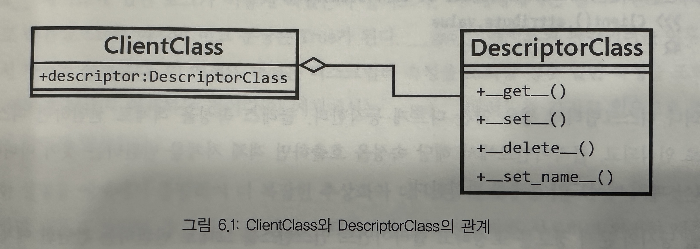

- 디스크립터는 다른 언어에서도 생소한 개념이어서 마땅한 비교대상이 없다
- 디스크립터는 파이썬의 객체지향 수준을 한 단계 더끌어올려주는 혁신적인 기능으로 잘 활용하면 보다 견고하고 재사용성이 높은 추상화를 할 수 있다
    - 디스크립터가 무엇인지, 어떻게 효율적으로 구현하는지
    - 두가지 유형읜 디스크립터 - 데이터 디스크립터, 비데이터 디스크립터
    - 디스크립터를 활용한 코드 재사용 방법
    - 디스크립터의 좋은 사용 예를 살펴보고 자체 라이브러리의 API에 어떻게 활용할지

# 디스크립터 개요

## 디스크립터 메커니즘

- 동작방식은 복잡하지는 안히만, 세부 구현 시의 주의사항이 많다
- 최소 두개의 클래스가 필요하다
    - 클라이언트 클래스는 디스크립터 구현의 기능을 활용할 도메인 모델로서 솔류션을 위해 생성한 일반적인 추상화 객체이다
    - 디스크립터 클래스는 디스크립터 로직의 구현체이다
- 디스크립터는 단지 디스크립터 프로토콜을 구현한 클래스의 인스턴시이드
    - 아래중 최소 한개 이상을 구현해야 한다
    - __get__, __set__, __delete__, __set_name__



| 이름              | 의미                                                         |
|-----------------|------------------------------------------------------------|
| ClientClass     | 디스크립터 구현체의 기능을 활용할 도메인 추상화 객체<br/>클래스 속성으로 디스크립터를 갑는다      |
| DescriptorClass | 디스크립터 로직을 구현한 클래스 <br/>디스크립터 프로토콜의 매직 메서드를 구현해야 한다         |
| Client          | ClientClass의 인스터스                                          |
| Descriptor      | DescriptorClass의 인스턴스<br/>이 객체는 클래스 속성으로 ClientClass에 위치한다 |

- 중요한 점은 이 프로토콜이 동작하려면 디스크립터 객체가 클래스 속성으로 정의되어야 한다는 것이다
    - 이 객체를 인스턴스 속성으로 생성하지 않으므로 init 메서드가 아니라 클래스 본문에 있어야 한다

```python
class Attribute:
    value = 42


class Client:
    attribute = Attribute()


Client().attribute.value  # 42
```

- 일반적인 코드는 위 처럼 동작한다

```python
class DescriptorClass:
    def __get__(self, instance, owner):
        if instance is None:
            return self
        logger.info(
            "%s.__get__ 메서드 호출(%r, %r)",
            self.__class__.__name__,
            instance,
            owner
        )
        return instance


class ClientClass:
    descriptor = DescriptorClass()


client = ClientClass()

print(client.descriptor)
# %s.__get__ 메서드 호출(%r, %r) DescriptorClass <__main__.ClientClass object at 0x1026a0a70> <class '__main__.ClientClass'>
# <__main__.ClientClass object at 0x1026a0a70>

print(client.descriptor is client)
# %s.__get__ 메서드 호출(%r, %r) DescriptorClass <__main__.ClientClass object at 0x1026a0a70> <class '__main__.ClientClass'>
# True
```

- 위 코드에서 descriptor 속성에 접근해보면 DescriptorClass 인스턴스를 반환하짖 않고 대신에 __get__() 메서드의 값을사용한다는 것을 알 수 있다
    - `즉 디스크립터 속성을 조회할 경우 일반 속성을 조회할 때와는 다르다'
    - 따라서 __get__ 메서드 뒤쪽으로 모든 종류의 로직을 추상화할 수 있으며 클라이언트에게 세부 내용을 숨긴 채로 모든 유형의 변환을 투명하게 실행할 수 있다
    - `이는 새로운 레벨의 캡슐화이다`

## 디스크립터 프로토콜의 메서드 탐색

- 디스크립터는 단지 객체이기 때문에 이러한 메서드들은 self를 첫 번쨰 파라미터로 사용한다
    - self는 디스크립터 객체 자신을 의미한다

### get 메서드

- __get__(self, instance, owner)
    - instance는 디스크립터를 호출한 객체를 의미한다 -> client 객체
    - owner는 호출한 객체의 클래스를 의미한다 -> ClientClass

```python
class DescriptorClass:
    def __get__(self, instance, owner):
        if instance is None:  # 클래스에 호출되는 경우
            return f"{self.__class__.__name__}.{owner.__name__}"
        return f"{instance} 인스턴스"  # 인스턴스에서 호출되는 경우


class ClientClass:
    descriptor = DescriptorClass()


print(ClientClass.descriptor)  # DescriptorClass.ClientClass
print(ClientClass().descriptor)  # <__main__.ClientClass object at 0x1010fc9b0> 인스턴스
```

- 일반적으로 정말 owner 파라미터를 활용해야 하는 경우가 아니라면, 인스턴스가 None일 때는 단순시 디스크립터 자체를 반환한다
    - 이렇게 하는 이유는 클래스에서 직접 디스크립터에 접근하려는 경우 단순히 디스크립터 자체를 받고 싶어서 하는 경우가 많을 것이기 때문이다
    - 물론 사용하는 상황에 따라 달라질 수 있다

### set 메서드

- __set__(self, instance, value)
- client.descriptor = 'value'
- 이 메서드는 디스크립터에 값을 할당하려고 할 때 호출된다
- 이 동작은 @property.setter 데코레이터 동작과 비슷하다
    - 즉, setter함수의 파라미터로 할당문의 오른쪽에 있는 값이 들어온다
    - `set 메서드를 구현하지 않았다면 value(할당문의 오른쪽에 있는 값)로 descripter 자체를 덮어씌운다`

```python
class Validation:
    def __init__(self, validation_function: Callable[[Any], bool], error_msg: str) -> None:
        self.validation_function = validation_function
        self.error_msg = error_msg

    def __call__(self, value):
        if not self.validation_function(value):
            raise ValueError(f"{value!r} {self.error_msg}")


class Field:
    def __init__(self, *validations):
        self._name = None
        self.validations = validations

    def __set_name__(self, owner, name):
        self._name = name

    def __get__(self, instance, owner):
        if instance is None:
            return self
        return instance.__dict__[self._name]

    def validate(self, value):
        for validation in self.validations:
            validation(value)

    def __set__(self, instance, value):
        self.validate(value)
        instance.__dict__[self._name] = value


class ClientClass:
    descriptor = Field(
        Validation(lambda x: isinstance(x, (int, float)), "는 숫자가 아님"),
        Validation(lambda x: x > 0, "는 0보다 작음"),
    )


client = ClientClass()
client.descriptor = 42
client.descriptor = -42  # ValueError ...
```

- 이 기능은 단지 객체에 값을 저장하는 것 이지만, 잘 활용하면 강력한 추상화를 할 수 있다
    - 예를 들어 자주 사용되는 유효성 검사 객체를 디스크립터로 만들면 프로퍼티의 세터 메서드에서 같은 유효성 검사를 반복할 필요가 없다
- 위 코드에서 유효성 검사 함수는 자유롭게 생성하여 지정할 수 있으며 객체에 값을 할당하기 전에 실행된다
- 여기에서 중요한 점은
    - 프로퍼티 자리에 놓일 수 있는 것은 디스크립터로 추상화할 수 있으며 여러번 재사용할 수 있다는 것이다
    - 즉, 프로퍼티는 특별한 형태의 디스크립터이다

### delete 메서드

- __delete(self, instace)
- del client.descriptor

```python
# descriptors_methods_3.py

class ProtectedAttribute:
    def __init__(self, requires_role=None) -> None:
        self.permission_required = requires_role
        self._name = None

    def __set_name__(self, owner, name):
        self._name = name

    def __set__(self, user, value):
        if value is None:
            raise ValueError(f"{self._name}를 None으로 설정할 수 없음")
        user.__dict__[self._name] = value

    def __delete__(self, user):
        if self.permission_required in user.permissions:
            user.__dict__[self._name] = None
        else:
            raise ValueError(f"{user!s} 사용자는 {self.permission_required} 권한이 없음")


class User:
    """admin 권한을 가진 사용자만 이메일 주소를 삭제할 수 있음."""
    email = ProtectedAttribute(requires_role="admin")

    def __init__(self, username: str, email: str, permission_list: list = None) -> None:
        self.username = username
        self.email = email
        self.permissions = permission_list or []

    def __str__(self):
        return self.username


admin = User('root', 'root@d.com', '[admin]')
user = User('user', 'user1@.com', ['email', 'helptdesk'])
admin.email  # root@d.com
del admin.email
admin.email is None  # True

user.email = None  # email을 None으로 설정할 수 없음 ...
```

- 위 코드는 del 메서드를 사용하여 관리자 권한이 없는 객체에서 속성을 제거하지 못하도록 하는 디스크립터를 만들었다

### set_name 메서드

- __set_name__(self, owner, name)
- 일반적으로 클래스에 디스크립터 객체를 만들 때는 디스크립터가 처리하려는 속성의 이름을 알아야 한다
    - 속성의 이름은 __dict__에서 __get__과 __set__메서드로 읽고 쓸 떄 사용된다
    - 파이썬 3.6 이전에는 디스크립터가 자동으로 이름을 설정하지 못했기 때문에 객체 초기화 시 명시적으로 이름을 전달했다

```python
class DescriptorWithName:
    def __init__(self, name):
        self.name = name

    def __get__(self, instance, value):
        if instance is None:
            return self
        logger.info("%r에서 %r 속성 가져오기", instance, self.name)
        return instance.__dict__[self.name]

    def __set__(self, instance, value):
        instance.__dict__[self.name] = value


class ClientClass:
    descriptor = DescriptorWithName("descriptor")


client = ClientClass()
client.descriptor = "value"
client.descriptor  # INFO:<ClientClass object at 0x...>에서 'descriptor' 속성 가져오기 'value'
```

- 위 코드는 전형적인 디스크립터 코드이다
- 속성의 이름을 두 번 쓰지 않으려면, 다음과 같이 몇 가지 트릭을 사용해야 한다
    - 클래스 테코레이터를 사용하거나 심지어는 메타클래스를 사용해야 한다

```python
class DescriptorWithName:
    def __init__(self, name=None):
        self.name = name

    def __set_name__(self, owner, name):
        self.name = name
```

- 파이썬 3.6에서 새로운 메서드 __set_name__이 추가되었는데 이 메서드는 파라미터로 디스크립터를 소유한 클래스와 디스크립터의 이름을 받는다
    - 디스크립터에 이 메서드를 추가하여 필요한 이름을 지정 하면 된다
- __set_name__은 디스크립터가 할당된 속성의 이름을 구할 떄 유용하다
    - 그러나 다른 값으로 설정하고 싶은 경우 우선순위가 높은 __init__메서드도 사용할 수 있기 때문에 유연성을 유지할 수 있따
- 디스크립터의 이름으로 무엇이든 사용할 수 있지만 일반적으로 디스크립터의 이름(속성 이름)을 클라이언트 __dict__객체의 키로 사용한다
    - 즉, 디스크립터의 이름도 속성으로 해석된다는 것을 의미한다
    - 떄문에 가급적 유효한 파이썬 변수명을 사용하려고 노력해야 한다

# 디스크럽터의 유형

- 작동방식에 따라 디스크립터를 구분할 수 있따
    - `__set__ 또는  __delete__를 구현 헀다면 데이터 디스크립터라고 부른다`
    - `__get__ 만 구현 했다면 비데이터 디스크립터라고 부른다`
    - __set_name__은 분류에 영향을 미치지 않는다
- 객체의 속성을 결정할 때 데이터 디스크립터 객체의 사전보다 우선적으로 적용되지만, 비데이터 디스크립터는 그렇지 않다
    - 즉, 비데이터 디스크립터는 객체의 사전에 디스크립터와 동일한 이름의 키가 있으면 객체의 사전 값이 적용되고 디스크립터는 절대 호출되지 않는다
    - 데이터 디스크립터는 객체의 사전보다 우선순위가 높고, 비데이터 디스크립터는 객체의 사전보다 우선순위가 낮다

## 비데이터(non-data) 디스크립터

```python
class NonDataDescriptor:
    def __get__(self, instance, owner):
        if instance is None:
            return self
        return 42


class ClientClass:
    descriptor = NonDataDescriptor()


client = ClientClass()
client.descriptor  # 42

client.descriptor = 43
client.descriptor  # 43

del client.descriptor
client.descriptor  # 42

vars(client)  # {}

client.descriptor = 99
vars(client)  # {'descriptor' : 99}

del client.descriptor
vars(client)  # {}

client.descriptor  # 42
```

- 처음 client 객체를 만들었을 때 decriptor 속성은 인스턴스가 아니라 클래스 안에 있다
    - 따라서 client 객체의 사전을 조회하면 그 값은 비어 있다
    - 여기에서 .decriptor 속성을 조회하면 client.__dict__에서 descriptor라는 이름의 키를 찾지 못하고 결국 클래스에서 디스크립터를 찾아보게 된다
        - 이것이 __get__메서드의 결과가 반환되는 이유다
    - 그러나 .descriptor 속성에 다른 값을 설정하면 인스턴스의 사전이 변경되므로 client.__dict__는 비어 있지 않다
        - 따라서 .descriptor 속성을 조회하면 객체의 __dict__사전에서 descriptor키를 찾을 수 있으므로 클래스까지 검색하지 않고 바로 __dict__사전에서 값을 반환한다
        - 때문에 디스크립터 프로토콜이 사용ㄷ외지 않고 다음에 이 속성을 조회할 때는 덮어써진 99 값을 반환한다
    - 그 뒤에 del을 호출해 이 속성을 지우면 객체의 __dict__사저ㅓㄴ에서 descriptor 키를 지운 것과 같으므로 ㄷ다시 앞으 시나리오로 돌아가게 된다
        - 즉, 다시 디스크립터 프로토콜이 활성화 된다
- 이렇게 descriptor 속성 값을 설정하면 우연히 디스크립터가 깨진 것처럼 동작하게 된다
    - 왜냐하면 디스크립터가 __delete__ 메서드를 궇현하지 않았기 때문이다(필요가 없는 경우도 있다)

- 정리
    - client를 만들었을 때는 __dict__에서 decriptor가 없기 떄문에 NonDataDescriptor에서 값을 가져 온다
    - 하지만 client.descritpor = 42 처럼 값을 설정하게 되면 이제 clien 객체 __dict__에 descritpor가 추가된다
        - 따라서 값 설정 이후에는 NonDataDescriptor 하고는 상관이 없어진다
    - 여기에서 del로 지우면 client 객체 자체의 dict에서 삭제 됨으로 다시 NonDataDescriptor에서 값을 가져 온다

## 데이터 디스크립터

```python
class DataDescriptor:
    def __get__(self, instance, owner):
        if instance is None:
            return self
        return 42

    def __set__(self, instance, value):
        logger.debug("%s.descriptor을 %s 값으로 설정", instance, value)
        instance.__dict__["descriptor"] = value


class ClientClass:
    descriptor = DataDescriptor()


client = ClientClass()
client.descriptor  # 42

client.descriptor = 99
client.descriptor  # 42

vars(client)  # {'descriptor':99}
client.__dict__['descriptor']  # 99
``` 

- 마지막 코드를 보면 descriptor의 값이 변경되지 않았다. 그러나 다른 값으로 할당하면 앞의 예와 마찬가지로 객체의 __dict__ 사전에는 업데이트가 된다
    - 이렇게 되는 이유는 사실 __set__메서드가 호출되면 객체의 사전에 값을 설정하기 떄문이다
    - 그리고 데이터 디스크립터에서 속성을 조회하면 객체의 __dict__에서 조회하는 대신 클래스의 descriptor를 먼저 조회한다
- 삭제는 더이상 동작하지 않는다
    - del을 호출하면 인스턴스의 __dict__에서 속성을 지우려고 시도하는 것이 아니라 descriptor에서 __delte__메서드를 호출하게 되는데 없기 때문
- `즉, 디스크립터가 __set__메서드를 구현했다면 객체의 사전보다 높은 우선순위를 갖는다`

```python
instance.__dict__["descriptor"] = value
```

- 위 코드르 ㄹ봐야 한다
- 왜 descriptor라는 이름의 속성 값을 바꿀까?
    - 이 예제에서는 단순화를 위해 디스크립터의 이름을 따로 설정하지 않았기 때문이다
    - 더 적은 코드를 사용하기 위해 단순화한 것이지만, __set_name__ 메서드를 사용하면 쉽게 해결할 수 있다
- __dict__ 속성에 직접 접근하는 이유
    - setattr(instance, "descriptor", value)
    - 로 접근하면 __set__메서드가 호출된다
    - 따라서 setattr() -> 디스크립터의 __set__ 메서드 호출 -> setattr 호출 -> __set__ 호출
- 디스크립터가 모든 인스턴스의 프로퍼티 값을 보관할 수 없는 이유
    - 클라이언트 클래스는 이미 디스크립터의 참조를 가지고 있다. 디스크립터가 다시 클라이언트 객체를 참조하면 순환 종속성(순환참조)이 생기게 되어 가비지 컬렉션이 되지 않는 문제가 생긴다
    - 즉, 서로를 가리지키고 있기 때무에 참조 카운트가 제거 임계치 이하로 떨어지지 않는다
    - 이에 대한 대안은 weakref 모듈에 있는 약한 참조를 사용하여 약한 참조 키 사전을 만드는 것이다

# 디스크립터 실전

## 디스크립터를 사용한 애플리 케이션

- 코드 중복을 디스크립터로 추상화하는 방버

### 디스크립터를 사용하지 않은 에

```python
class Traveler:
    def __init__(self, name, current_city):
        self._name = name
        self._current_city = current_city
        self._cities_visited = [current_city]

    @property
    def current_city(self):
        return self._current_city

    @current_city.setter
    def current_city(self, new_city):
        if new_city != self._current_city:
            self._cities_visited.append(new_city)
            self._current_city = new_city

    @property
    def cities_visited(self):
        return self._cities_visited


alice = Traveler("Alice", "Barcelona")
alice.current_city = "Paris"
alice.current_city = "Brussels"
alice.current_city = "Amsterdam"
alice.cities_visited  # ['Barcelona', 'Paris', 'Brussels', 'Amsterdam']
```

- 위 코드는 일반적인 클래스 인데 속성의 값이 달라질 때마다 추적하려고 한다
    - setter 메서드에서 값이 변경될 떄 검사하여 리스트와 같은 내부 변수에 값을 저장한다
- 위 코드는 충분하다. 하지만 애플리케이션의 여러 곳에서 똑같은 로직을 사용한다면 어떻게 될까?
    - 모든 변수를 추적하는 것이 보다 일반적인 문제라 가정하자
    - 예를 들어 Alice가 구입한 모든 티켓을 추적한다거나 방문했던 모든 국가를 추적하는 등의 일을 하고 싶다
    - 공통적인 메서드를 구현하는 새로운 부모 클래스를 만들고, 추적할 속성에 신호를 보내기 위해 클래스 속성을 만들고, 해당 로직을 메서드로 구현하면된다
        - 이 클래스는 클래스의 계층 구조에 추가되는 믹스인 클래스가 될 수 있지만, 결합도가 높아지고, 개념적으로 옳지 않다
        - 따라서 데코레이터를 사용하는 것이 더 낫다

### 이상적인 구현방법

```python
class HistoryTracedAttribute:
    def __init__(self, trace_attribute_name: str) -> None:
        self.trace_attribute_name = trace_attribute_name  # [1]
        self._name = None

    def __set_name__(self, owner, name):
        self._name = name

    def __get__(self, instance, owner):
        if instance is None:
            return self
        return instance.__dict__[self._name]

    def __set__(self, instance, value):
        self._track_change_in_value_for_instance(instance, value)
        instance.__dict__[self._name] = value

    def _track_change_in_value_for_instance(self, instance, value):
        if self._needs_to_track_change(instance, value):  # [2]
            instance.__dict__[self.trace_attribute_name].append(value)

    def _needs_to_track_change(self, instance, value) -> bool:
        try:
            current_value = instance.__dict__[self._name]
        except KeyError:  # [3]
            return True
        return value != current_value  # [4]

    def _set_default(self, instance):
        instance.__dict__.setdefault(self.trace_attribute_name, [])  # [6]


class Traveler:
    current_city = HistoryTracedAttribute("cities_visited")  # [1]

    def __init__(self, name: str, current_city: str) -> None:
        self.name = name
        self.current_city = current_city  # [5]
```

- 위 코드는 속성에 대해 이름을 가진 일반적인 디스크립터이다 (값이 달라질 경우 추적이 가능하다)
- 디스크립터의 일반적인 특징이 그러하듯 메서드나 속ㄷ성의 이름이 현재의 도메인 문제에 관련이 없음을 알 수 있다
    - 이는 디스크립터가 어떤 유형의 클래스 또는 다른 프로젝트에서도 동일한 결과를 내도록 설계되었기 때문이다
- 디스크립터의 코드가 복잡해진것은 사실이다
    - 하지만 클라이언트 코드는 상당히 간단해졌다
    - 때문에 이 디스크립터를 여러번 사용한다면 충분히 가치가 있다
- 디스크립터가는 이제 클래스와 완전히 독립적이다
    - 어떤한 비즈니스 로직도 포함하고 있지 않다

## 다른 형태의 디스크립터

### 전역 상태 공유 이슈

- 디스크립터는 클래스 속성으로 설정해야 한다. 대부분이 문제가 안 되지만 몇 가지 고려사항이 있다
    - 클래스 속성의 문제점은 해당 클래스의 모든 인스턴스에서 공유된다는 것이다
    - 디스크립터도 예외가 아니기 떄문에 디스크립터 객체에 데이터를 보관하면 모든 객체가 동일한 값에 접근할 수 있다

```python
class SharedDataDescriptor:
    def __init__(self, initial_value):
        self.value = initial_value

    def __get__(self, instance, owner):
        if instance is None:
            return self
        return self.value

    def __set__(self, instance, value):
        self.value = value


class ClientClass:
    descriptor = SharedDataDescriptor("첫 번째 값")


client1 = ClientClass()
client1.descriptor

client2 = ClientClass()
client2.descriptor

client2.descriptor = "client2를 위한 값"
client1.descriptor  # "client2를 위한 값" -> 여기가 문제다
```

- 위 코드는 각 객체에 데이터를 저장하는 대신 디스크립터가 데이터 자체를 유지하도록 잘못 정의한 경우이다
    - 디스크립터 객체는 데이터 자체를 바로 저장한다
    - 이것은 인스턴스의 값을 수정하면 같은 클래스의 다른 모든 인스턴스에서도 값이 수정된다
    - 이를 해결하기 위해서는 각 인스턴스의 값을 보관했다가 반환해야 한다. 이것이 각 인스턴스의 __dict__사전에 값을 설정하고 검색하는 이유다

### 객체의 사전에 접근하기

- 디스크립터는 객체의 사전 __dict__에 값을 저장하고 조회한다

### 약한 참조 사용

```python
from weakref import WeakKeyDictionary


class DescriptorClass:
    def __init__(self, initial_value):
        self.value = initial_value
        self.mapping = WeakKeyDictionary()

    def __get__(self, instance, owner):
        if instance is None:
            return self
        return self.mapping.get(instance, self.value)

    def __set__(self, instance, value):
        self.mapping[instance] = value
```

- __dict__를 사용하지 않으려는 경우 또 따른 대안은 디스크립터 객체가 직접 내부 맾핑을 통해 각 인스턴스의 값을 보관하고 반환하는 것이다
    - 이렇게 하는 것에는 주의사항이 있다
    - 내무 매핑을 할 때 사전을 사용하면 안된다
    - 클라이언트 클래스는 디스크립터에 대한 참조를 가지며 디스크립터는 디스크립터를 사용하는 객체에 대한 참조를 가지므로 순환 종속성이 생긴다
    - 이를 해결하기 위해 사전은 weakref 모듈에 정의된 것처럼 약한 키가 되어야 한다
- 인스턴스 객체는 더 이상 속성을 보유하지 않는다. 대신 디스크립터가 속성을 보유한다. 이것은 다소 논란의 여지가 있으며 개념적 관점에서 보면 완전히 정확하지 않을 수도 있다. 이 세부 사항을 잊어 버리면 객체의
  사전에 있는 내용을 찾으려고 할 수 있으나(예 vars(clinet) 호출)객체는 속성을 보유하지 않기 때문에 완전한 데이터를 반환하지 못한다
- 선호되는 방식이 아니다

## 디스크립터에 대한 추가 고려사항

### 코드 재사용

- @property 를 자주사용 하는 경유 디스크립터가 유용하게 활용될 수 있다
- 디스크립터는 데코레이터가 클래스 메서드에서도 동작할 수 있도록 도와 더 나은 데코레이터를 만들 수 있게 한다

### 클래스 데코레이터의 대안

```python
@Serialization(
    username=show_original,
    password=hide_field,
    ip=show_original,
    timestamp=format_time()
)
@dataclass
class LoginEvent:
    username: str
    password: str
    ip: str
    timestamp: datetime
```

- 위 코드를 디스크립터로 변경할수 있는지 알아보자

```python
from dataclasses import dataclass
from datetime import datetime
from functools import partial
from typing import Callable


class BaseFieldTransformation:
    def __init__(self, transformation: Callable[[], str]) -> None:
        self._name = None
        self.transformation = transformation

    def __get__(self, instance, owner):
        if instance is None:
            return self
        raw_value = instance.__dict__[self._name]
        return self.transformation(raw_value)

    def __set_name__(self, owner, name):
        self._name = name

    def __set__(self, instance, value):
        instance.__dict__[self._name] = value


ShowOriginal = partial(BaseFieldTransformation, transformation=lambda x: x)
HideField = partial(
    BaseFieldTransformation, transformation=lambda x: "**민감한 정보 삭제**"
)
FormatTime = partial(
    BaseFieldTransformation,
    transformation=lambda ft: ft.strftime("%Y-%m-%d %H:%M"),
)


@dataclass
class LoginEvent:
    username: str = ShowOriginal()
    password: str = HideField()
    ip: str = ShowOriginal()
    timestamp: datetime = FormatTime()

    def serialize(self) -> dict:
        return {
            "username": self.username,
            "password": self.password,
            "ip": self.ip,
            "timestamp": self.timestamp,
        }


le = LoginEvent("john", "secret password", "1.1.1.1", datetime.utcnow())
vars(le)  # {'username': 'john', 'password': 'secret password', 'ip': '1.1.1.1', 'timestamp': datetime.datetime(...)}
le.serialize()  # {'username': 'john', 'password': '**redacted**', 'ip': '1.1.1.1', 'timestamp': '...'}
le.password  # '**민감한 정보 삭제**'
```

# 디스크립터 분석

- 좋으 ㄴ디스크립터의 기준은 무엇을까?

## 파이썬 내부에서의 디스크립터 활용

- 훌륭한 예제를 살펴본다

### 함수와 메서드

- 함수는 __get__메서드를 구현했기 떄문에 클래스 안에서 메서드처럼 동작할 수 있다
    - 파이썬에서 메서드는 추가 파라미터를 가진 함수일 뿐이다
    - 관심적으로 메서드의 첫 번재 파라미터는 self라는 이름을 사용하여 메서드를 소유하고 있는 클래스의 인스턴스를 나타낸다
    - 따라서 메서드에서 self를 사용하는 것은 객체를 받아서 수정을 하는 함수를 사용하는 것과 동일하다

````python
class MyClass:
    def method(self, ...):
        self.x = 1
````

따라사 위 코드는 실제로 아로 코드처럼 정의하는 것과 같다

```python
class MyClass: pass


def method(myclass_instance: MyClass, ...):
    myclass_instance.x = 1


method(MyClass())
```

- 따라서 메서드는 객체를 수정하는 또 다른 함수일 뿐이며, 객체 안에서 정의도었기 떄문에 객체에 바인딩되어 있다고 말한다

```python
instance = MyClass()
instance.method(...)
```

위와 같은 코드는 실제로는 아래 코드 처럼 파이썬은 처리한다

```python
instance = MyClass()
MyClass.method(intance, ...)
```

```python
def function: pass


print(function.__get__)  # <method-wrapper '__get__' of fucntion object at 0X..>
```

- 함수는 디스크립터 프로토콜을 구현하였으므로 __get__메서드가 먼저 호출된다
- instance.method(...)구문에서는 괄호 안의 인자를 처리하기 전에 instance.method 부분이 먼저 평가 된다
    - method는 클래스 속성으로 정의된 객채이고 __get__메서드가 있기 떄문에 __get__메서드가 호출된다
    - 그리고 __get__메서드가 하는 일은 메서드로 변환하는 것이다
    - 즉 함수를 작업하려는 객체의 인스턴스에 바인딩 한다

```python
class Method:
    def __init__(self, name):
        self.name = name

    def __call__(self, instance, arg1, arg2):
        print(f"{self.name}: {instance} 호출됨. 인자는 {arg1}와 {arg2}입니다.")


class MyClass:
    method = Method("Internal call")


instance = MyClass()
Method("External call")(instance, "first", "second")
instance.method("first", "second")  # 실패
```

- 위 코드는 외부에서 호출 가능한 형태의 함수 또는 메서드를 클래스 내에 호출 가능한 객체로 정의하 ㄴ것이다
    - method 클래스의 인스턴스는 함수나 메서드 형태로 다른 클래스에서 사용될 것이다
    - 따라서 Usage 부분에서 두 가지 호출은 동일한 역할을 해야 한다
    - 하지만 에러가 발생한다

```python
from types import MethodType


class Method:
    def __init__(self, name):
        self.name = name

    def __call__(self, instance, arg1, arg2):
        print(f"{self.name}: {instance} 호출됨. 인자는 {arg1}와 {arg2}입니다.")

    def __get__(self, instance, owner):
        if instance is None:
            return self
        return MethodType(self, instance)


# Usage
instance = MyClass()
Method("External call")(instance, "first", "second")
instance.method("first", "second")  # 이제 성공
```

- 위 코드는 에러를 해결한 코드이다
    - 이유는 파라미터 위치가 한 칸씩 밀려서 Method.__call__기준으로 self자리에 instance가 전달되고, instance 자리에 'first'가 전달....
    - 이 문제를 해결 하려면 메서드를 디스크립터로 변경하면 된다
    - 이렇게 하면 instance.method 호출 시 Method.__get__ 메서드를 먼저 호출할 것이다. 여기에서 첫 번째 파라미터로 Method의 인스턴스를 전달 함으로써 객체에 바인딩하면 된다
    - MethodType을 사용하여 함수를 메서드로 변환하는 것이다. 두번째 파라미터는 이 함수에 바인딩할 객체이다
- 파이썬의 함수 객체도 이것과 비슷하게 동작한다
    - 따라서 클래스 내부에 함수를 정의할 경우 메서드처럼 사용할 수 있는 것이다

### 메서드를 위한 빌트인 데코레이터

```python
class MyClass:
    @property
    def prop(self): pass


print(MyClass.prop)  # <propoerty object at 0x...>
```

- @property, @classmethod, @staticmethod 데코레이터는 디스크립터이다
- 메서드를 인스턴스가 아닌 클래스에서 직접 호출할 때는 관습적으로 디스크립터 자체를 반환한다
- 프로퍼티를 클래스에서 직접 호출하면 계산할 속성이 없으므로 일종의 디스크립터인 프로퍼티 객체 자체를 반환한다
- @classmethod를 사용하면 디스크립터의 __get__ 함수가 메서드를 인스턴스에서 호출하든 클래스에서 호출하든 산관없이 데코레이팅 함수에 첫 번째 파라미터로 메섣르르 소유한 클래스를 넘겨준다
- @staticmethod를 사용하면 정의한 파리미터 이외의 파라미터를 넘기지 않도록 한다
    - 즉 __get__ 메서드에서 함수의 첫 번째 파라미터에 self를 바인딩하는 작업을 취소한다

### 슬롯(slots)

- __slots__는 해당 클래스가 가질 수 있는 필드의 범위를 정의하는 클래스 속성이다
- 이 속성을 사용해 앞으로 클래스에서 허용할 속성의 이름을 차례로 지정할 수 있다
    - 그럼 그 순간부터는 해당 클래스의 인스턴스에 새로운 속성을 동적으로 추가할 수 없다
    - AttributeError가 발생한다
    - __slot__속성을 정의하면 클래스의 속성이 정적으로 되기 떄문에 __dict__속성을 갖지 않으므로 더 이상 동적으로 추가할 수 없다
- 그럼 클래스 속성을 어디에서 가져올까?
    - 디스크립터를 사용한다

```python
from dataclasses import dataclass


@dataclass
class Coordinate2D:
    __slots__ = ("lat", "long")
    lat: float
    long: float

    def __repr__(self):
        return f"{self.__class__.__name__}({self.lat}, {self.long})"
```

## 데코레이터를 디스크립터로 구현하기

- 데코레이터를 이런 형태로 만들기 위한 일반적인 방법은 __get__메서드를 구현하고 types.MethodType을 사용해 데코레이터 자체를 개체에 바인딩된 메서드로 만드는 것이다
- 이렇게 하려면 데코레이터를 객체로 구현해야 한다
    - 만약 함수로 구현하는 경우 __get__메서드가 이미 존재할 것이디 때문에 정상적으로 동작하지 ㅇ낳게 된다
- 더 깔끔한 방법은 데코레이터를 위한 클래스를 정의하는 것이다

# 디스크립터 최종 정리

## 디스크립터에 대한 타입 어노테이션

- 대부분의 경우 디스크립터에 타입 어노케이션을 추가하는 것은 어려운 일이다
    - 순환 의존성 문제가 있을 수 있기 떄문이다
    - 즉 디스크립터가 정의된 파일은 디스크립터를 사용하는 객체의 타입을 확인하기 위해 클라이언트 파일을 읽어야 하지만, 클라이언트 파일 역시 디스크립터가 정의된 파일을 읽어야 한다
- 디스크립터가 타입 어노테이션을 추가할 수 있따는 말은 디스크립터가 한 가지 데이터 타입에대해서만 사용 가능하다는 뜻이다
    - 일반적인 디스크립터의 목적과 상충되는 부분이다
- 따라서 타입 어노테이션은 디스크립터의 경우에는 하지 않는 것이 더 간단한 선택일 수 있다

# 요약
- 메타프로그래밍에 가깝게 해주는 고급 기능이다