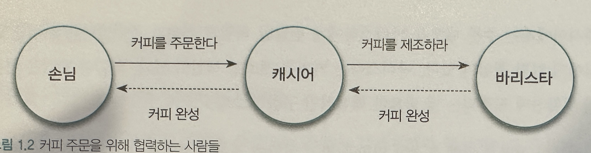

## 협력하는 객체들의 공동체

### 협력하는 사람들

- `객체지향에서 가장 중요한 개념은 역할, 책임, 협력이다`
- 요청과 응답으로 구성된 협력
    - 스스로 해결하지 못하는 문제와 마주치면 문제 해결을 할 수 있는 사람에게 요청(request)한다. 요청을 받은 사람은 요청에 응답(response)해야한다
    - 요청과 응답을 통해 다른 사람들과 협력(collaboratio)할수 있다
- 역할과 책임
    - 협력하는 과정 속에서 사람들은 특정한 역할(role)을 부여받고, 역할은 책임(responsibility)를 동반한다
    - 여러 사람이 동일한 역할을 수행할 수 있다
        - 손님입장에서 커피를 마실 수만 있다면 어떤 캐시어가 주문을 받는지는 중요하지 않다
        - 캐시어의 입장에서는 자신이 전달한 주문 내역에 맞게 커피를 제조하는지가 중요하지 어떤 바르스타가 커피를 제조하는지는 중요하지 않다
    - 역할은 대체 가능성을 의미한다
        - 손님 입장에서 캐시어는 대체 가능(substitutable)하다
        - 두 명이 동일한 역할을 수행할 수 있다면 요청자 입장에서 둘 중 어떤 사람이 역할을 수행하더라도 문제가 되지 않는다
    - 책임을 수행하는 방법은 자율적으로 선택할 수 있다
        - 요청을 받은 사람들은 요청을 처리하는 방법을 자유롭게 선택할 수 있다
        - `동일한 요청에 대해 서로 다른 방식으로 응답할 수 있는 능력을 다형성이라고 한다`
    - 한 사람이 동시에 여러 역할을 수행할 수 있다
        - 한 사람이 케시어와 바리스타라의 역할을 동시에 수행하는 것도 가능하다

### 역할, 책임, 협력

- 역할과 책임을 수행하며 협력하는 객체들
    - 객체지향 설계라는 예술은 적절한 객체에게 적절한 책임을 할당하는 것에서 시작된다
    - 책임이 불분명한 객체는 애플리케이션의 미래 역시 불분명하게 만든다.
    - 얼마나 적절한 책임을 선택하느냐가 애플리케이션의 아름다음을 결정한다

### 협력 속에 사는 객체

- 객체는 아래 두가지 사이에서 균형을 유지해야 한다
    - 객체는 충분히 '협력적'이어야 한다. 외부의 도움을 무시한 채 모든 것을 스스로 처리하려고 하는 전지전능한 객체(god object)는 내부적인 복잡도에 의해 자멸하게 된다
    - 객체는 충분히 '자율적'이어야 한다. 손님이 캐시어에게 어떤 질문을 해야 하고 어떤 방식으로 바리스타에게 주문 내역을 전달하라고 지시하지 않아야 한다
- 상태와 행동을 함께 지닌 자율적인 객체
    - 객체는 상태(state)와 행동(behavior)를 함께 지닌 실체이다
        - 객체가 협력에 참여하기 위해 어떤 행동을 해야 한다면 그 행동을 하는데 필요한 상태도 함께 지니고 있어야 한다는 것을 의미한다
    - `객체의 자율성은 객체의 내부와 외부를 명확하게 구분하는 것으로부터 나온다`
        - 객체의 사전인 부분은 객체 스스로 관리하고 외부에서 일체 간섭할 수 없도록 차단해야 하며, 객체의 외부에서는 접근이 허락된 수단을 통해서만 객체와 의사소통해야 한다
        - `즉, 객체가 무엇(what)을 수행하는지는 알 수 있지만 어떻게(how)수행하는지에 대해서는 알 수 없어야 한다`
- 협력과 메시지
    - 객체지향의 세계에서는 오직 한 가지 의사소통 수단만이 존재한다 &rarr; 메세지
    - 메시지를 전송하는 객체를 송신자(sender)라고 하고 메시지를 수신하는 객체를 수신자(receiver)라고 부른다
- 메서드와 자율성
    - `객체가 수신된 메시지를 처리하는 방법을 메서드(method)라고 부른다`
    - `외부의 요청이 무언인지를 표현하는 메시지와 요청을 처리하기 위한 구체적인 방법인 메서드를 분리하는 것은 객체의 자율성을 높이는 핵심 매커니즘이며 캡슐화와도 관련이 깊다`

### 객체지향의 본질

- 객체지향이란 무엇인가?
    - 시스템을 상호작용하는 자율적인 객체들의 공동체로 바라보고 객체를 이용해 시스템을 분할하는 방법이다
    - 자율적인 객체란 상태와 행위를 함께 지니며 스스로 자기 자신을 책임지는 객체를 의미한다
    - 객체는 시스템의 행위를 구현하기 위해 다른 객체와 협력한다. 각 객체는 협력 내에서 정해진 역할을 수행하며 역할은 관련된 책임의 집합이다
    - 객체는 다른 객체와 협렵하기 위해 메시지를 전송하고, 메시지를 수신한 객체는 메시지를 처리하는데 적합한 메서드를 자율적으로 선택한다
- 객체를 지향하라
    - 훌륭한 객체지향 설계자가 되기 위해서 거처야 할 첫 번째 도전은 코드를 담는 클래스의 관점에서 메시지를 주고받는 객체의 관점으로 사고의 중심을 전환하는 것이다
    - 중요한 것은 어떤 클래스가 필요한가가 아니라 어떤 객체들이 어떤 메시지를 주고 받으며 협력하는가이다
    - `클래스는 객체들의 협력 관계를 코드로 옮기는 도구에 불과하다. 클래스의 구조와 메서드가 아니라 객체의 역할, 책임 협력에 집중해야한다`

    