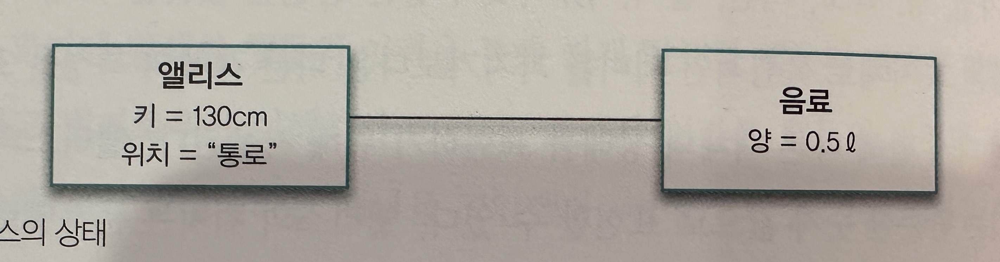

## 이상한 나라의 객체

- `객체지향 패러다임은 지식을 추상화하고 추상화한 지식을 객체 안에 캡슐화함으로써 실세계 문제에 내재된 복잡성을 관리하려고 한다. 객체를 발견하고 창조하는 것은 지식과 행동을 구조화하는 문제다`

### 객체지향과 인지 능력

- 객체지향을 직관적이고 이해하기 쉬운 패러다임이라고 말하는 이유는 객체지향이 세상을 자율적이고 독립적인 객체들로 분해할 수 있는 인간의 기본적인 인지능력에 기반을 두고 있기 때문
- `객체란 인간이 분명하게 인지하고 구별할 수 있는 물리적인 또는 개념적인 경계를 지닌 어떤 것이다`
    - 하지만 소프트웨어 세계에서 객체는 현실에 존재하는 객체와는 전혀 다른 모습을 보이는 것이 일반적이다
    - 현실 세계의 전등은 사람의 손길 없이는 스스로 불을 밝힐 수 없지만 소프트웨어 세계의 전등은 외부의 도움 없이도 가능하다

### 객체, 그리고 소프트웨어 나라

- `객체의 다양한 특성을 효과적으로 설명하기 위해서는 객체를 상태(state), 행동(behavior), 식별자(indentity)를 지닌 실체롤 보는 것이 가장 효과적이다`

- 상태
    - 객체가 주변 환경과의 상호작용에 어떻게 반응하는가는 그 시점까지 객체에 어떤일이 발생했느냐에 따라 좌우된다
        - `즉 어떤 행동의 결과는 과거에 어떤 행동들이 일어났었느냐에 의존한다`
    - `상태라는 것은 객체의 과거 행동들의 결과를 기술하기 위한 개념이다`
    - 상태를 이용하면 거거의 모든 행동 이력을 설명하지 않고도 행동의 결과를 쉽게 예측하고 설명할 수 있다
    - 상태와 프로퍼티
        - 위 이미지에서 앨리스와 음료는 객체다
            - 그러나 앨리스의 키와 위치, 음료의 양은 객체가 아닌 단순한 값이다
            - 따라서 앨리스의 상태는 키와 위치라는 단순한 값과 음료라는 객체의 조합으로 표현할 수 있다
    - 결론적으로 모든 객체의 상태는 단순한 값과 객체의 조합으로 표현할 수 있다
        - 이때 객체의 상태를 구성하는 모든 특징을 통틀어 객체의 프로퍼티(property)라고 한다
        - 일반적으로 프로퍼티는 변경되지 않는 '정적'이다. 하지만 프로퍼티의 값은 변경이 가능하기 때문에 '동적'이다
    - 앨리스와 음료사이에는 선이 있는 이 선을 '링크'라고 한다
        - 객체와 객체 사이에는 링크가 존재해야만 요청을 보내고 받을 수 있따
        - 링크는 객체가 다른 객체를 참조할 수 있다는 것을 의미하며, 이것은 일반적으로 한 객체가 다른 객체의 식별자를 알고 있다는 것으료 표현된다
    - 객체 간의 선으로 표현되는 링크와 달리 객체를 구성하는 단순한 값은 속성(attribute)라고 한다
    - `Property = Link + Attribute`
- 행동
    - 객체의 행동은 상태 변화를 유발하며 이를 부수 효과(side effect)라고 한다
    - 객체의 행동은 상태 변화를 유발하지만, 행동의 결과는 상태에 의존한다
    - 협력과 행동
        - 객체는 수신된 메시지에 따라서 적절항 행동을 하고 이 행동은 상태를 변경한다
        - 즉, 협력하는 과정에서 다른 객체의 상태의 변화를 유발할 수 있음을 알고 있어야 한다
    - 행동이란, 외부의 요청 또는 수신된 메시지에 응답하기 위해 동작하고 반응하는 활동이다. 행동의 결과로 객체는 자신의 상태를 변경하거나 다른 객체에게 메시지를 전달 할수 있다. 객체는 행동을 통해 다른
      객체와 협력에 참여하므로 행동은 외부에 `가시적`이어야 한다
    - 상태 캡슐화
        - 앨리스가 음료수를 마실 경우 음료에게는 drunken(quantity)메시지가 전달된다
        - 하지만 메시지가 전달 되었다고 해서 음료의 양이 줄어 들었다고 생각할 수는 없다
            - 메시지 수신자의 상태 변경에 대해서 송신자는 전혀 알 수 없기 때문이다 &rarr; 캡슐화
        - `상태를 외부에 노출시키지 않고 행동을 경계로 캡슐화하는 것은 결과적으로 객체의 자율성을 높인다`
- 식별자
    - 값(value)
        - 숫자, 문자열, 날짜, 시간, 금액 등과 같이 변하지 않는 양을 모델링
        - 값의 상태는 변하지 않기 때문에 불변 상패(immutable state)를 가진다고 말한다
        - `값의 경우 두 인스턴스의 상태가 같다면 두 인스턴스를 같은 것으로 판단한다 &rarr; 1은 1과 같다 / 동등성(equality)`
    - 객체
        - 객체는 시간에 따라 변경되는 상태를 포함하며 객체는 가변 상태(mutable state)를 가진다
        - 키가 완전히 같은 앨리시가 둘이 있더라 하더라도 누구도 같은 사람이라고 하지 않는다
        - `두 객체의 상태가 다르더라도 식별자가 같다면 두 객체를 같은 객체로 판단할수 있고 이를 동일성(identical)이라고 한다`
    - 참조 객체(reference object)또는 엔티티(entity)는 식별자를 지닌 전통적인 의미의 객체
    - 값 객체(value object)는 식별자를 가지지 않는 값을 가리킴

### 행동이 상태를 결정한다

- `상태를 먼저 결정하고 행동을 나중에 결정하는 방법은 설계에 나쁜 영향을 끼친다`
    - 상태를 먼저 결정할 경우 캡슐화가 저해된다 &rarr; 내부로 캡슐화되지 못하고 공용 인터페이스에 그대로 노출되버릴 확률이 높아진다
    - 객체를 협력자가 아닌 고립된 섬으로 만든다
    - 객체의 재사용성이 저하된다
- `책임 주도 설계(RDD, Responsibility-Driven Design)`
    - 협력이라는 문맥 안에서 객체의 행동을 생각하도록 도움으로써 응집도 높고 재사용 가능한 객체를 만든다

### 은유와 객체

- '객체지향이란 현실 세게의 모방이다' &rarr; 하지만 현실세계와 소프트웨어 사이에는 차이가 있다
- 의인화(anthropomorphism)
    - 가장 큰 차이점은 현실 속에서는 수동적인 존재가 소프트웨어 객체로 구현될 때는 능동적으로 변한다는 점이다
    - 현실 속의 트럼프 카드는 스스로 뒤집을 수도, 말을 할 수도, 걸을 수도 없지만 소프트웨어 속에서는 가능하다
- 은유(metaphor)
    - 현실 세계와 객체지향 세계 사이의 관계를 좀 더 정확하게 설명할 수 있는 단어는 은유이다
        - '그 남자는 사자 같아요' &rarr; 현실과 소프트웨어 사이의 객체의 차이를 설명하기 좋다
    - 은유 관계에 있는 실제 객체의 이름을 소프트웨어 객체의 이름으로 사용하면 표현적 차이를 줄여 소프트웨어의 구조를 쉽게 예측할 수 있다
    - 이러한 이유로 객체지향 지침서에서는 현실 세계인 도메인에서 사용되는 이름을 객체에게 부여하라고 가이드 한다
    - 