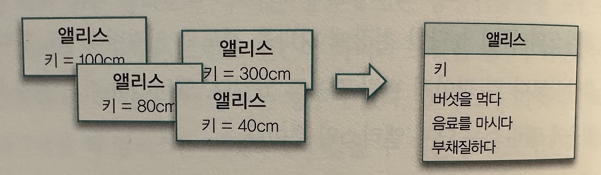

## 타입과 추상화

- `일단 컴퓨터를 조작하는 것이 추상화를 구축하고, 조작하고, 추론하는 것에 관한 모든것이라는 것을 깨닫고 나면 (훌륭한) 프로그램을 작성하기 위한 중요한 전제 조건은 추상화를 정확하게 다루는 능력이라는 것이 명확해 진다`

### 추상화를 통한 복잡성 극복

- `현상은 복잡하다. 법칙은 단순하다. 버릴 게 무엇인지 알아내라 - 파인만`
- 추상화
    - 양상, 세부 사항, 구조를 명확하게 이해하기 위해 특정 절차나 물체를 의도적으로 생략하거나 감춤으로써 복잡도를 극복하는 방법
    - 1> 구체적인 사물들 간의 공통점은 취하고 차이점은 버리는 일반화를 통해 단순하게 만든다
    - 2> 중요한 부분을 강조하기 위해 불필요한 세부 사항을 제거한다

### 객체지향과 추상화

- 그룹으로 나누어 단순화하기
    - `명확한 경계를 가지고 서로 구별할 수 있는 구체적인 사람이나 사물을 객체지향 패러다임에서는 객체라고 한다`
    - 이상한 나라의 엘리스에서 정원하든, 여왕이든, 경비는 트럼프 일뿐이다 &rarr; 그룹화
- 개념
    - 차이점을 무시하고 공통점만을 취해 트럼프라는 개념으로 단순화한 것은 추상화의 일종이다
    - 이처럼 공통점을 기반으로 객체들을 묶기 위한 그릇을 개념(concept)이라고 한다
        - 개념이란 일반적으로 우리가 인식하고 있는 다양한 사물이나 객체에 적용할 수 있는 아이디어나 관념을 뜻한다
    - `개념을 기반으로 그룹화를 시키면 개별적으로 다뤄야 하는 복잡한 상황을 피할 수 있다`
    - 결국, 객체는 특정한 개념을 표현하는 그룹의 일원으로 포함된다
        - 하트 여왕은 트럼프라는 개념 그룹의 일원이고 하얀 토끼는 토끼라는 개념 그룹의 일원이다
        - 개념 그룹의 일원이 될 때 객체를 그 개념의 인스턴스(instance)라고 한다
- 개념의 세 가지 관점
    - 일반적으로 객체의 분류 장치로서 개념을 이야기할 때 아래의 세 가지 관점을 함께 이야기 한다
        - 심볼(symbol) : 개념을 가리키는 간략한 이름이나 명칭
            - 개념을 가리키는 이름이다 '트럼프'라는 이름은 개념의 심볼이 된다
            - 작명한 심볼이 적합한지 확인하기 위해서는 내연에서 정의한 것을 작명한 심볼로 볼 수 있는가? 를 고민하면 된다
            - ex) 몸이 납작하고 두 손과 두 발은 네모 귀퉁이에 달려 있는 등장인물이라면 트럼프라고 볼 수 있는가?
        - 내연(intension) : 개념의 완전한 정의를 나타내며 내연의 의미를 이용해 객체가 개념에 속하는지 여부를 확인 할수 있다
            - 몸이 납작하고 두 손과 두 발은 네모 귀퉁이에 달려 있는 등장인물
        - 외연(extension): 개념에 속하는 모든 객체의 집합(set)
            - 정원사, 병사, 신하, 왕자와 공주, 하객으로 참석한 와과 와비를 하트 잭, 하트와 하트 여왕
- 객체를 분류하기 위한 틀
    - 분류란(classification)란 객체에 특정한 개념을 적용하는 작업이다. 객체에 특정한 개념을 적용하기로 결심했을 때 우리는 그 객체를 특정한 집합의 멤버로 뷴류한다
- `분류는 추상화를 위한 도구이다`
    - 즉 추상화의 원칙은 공통점을 취하고 차이점은 버리는 일반화와 불필요한 세부사항을 제거하는 방법으로 개념을 찾아낼수 있다

### 타입

- 타입은 개념이다
    - `개념을 공학적으로 대체할 수 있는 단어가 타입(type)이다 따라서 타입의 정의는 개념의 정의와 완전히 동일하다`
    - 데이터 타입
        - 1>타입은 데이터가 어떻게 사용되느냐에 관한 것이다
            - 숫자형 테어터가 숫자형인 이유는 사칙연산이 가능하기 때문이다
        - 2>타입에 속한 테이터를 메모리에 어떻게 표현하는지 외부로부터 철저하게 감춰진다
            - 데이터 타입의 표현은 연산 작업을 수행하기에 가장 효과적인 형태가 선택되며, 개발자는 해당 데이터의 타입의 표현 방식을 몰라도 사용하는데 지장이 없다
    - 객체와 타입
        - 객체지향에서 실제로 객체를 일종의 데이터처럼 사용한다 &rarr;객체를 선언하는 것은 새로운 데이터 타입을 선언하는 것과 같다
        - `하지만 객체에서 중요한 것은 객체의 행동이다. 상태는 행동의 결과로 초래된 부수효과를 쉽게 표현하기 위해 도입한 추상적인 개념을 뿐이다`
        - 데이터 타입에서 언급된 두 가지 이야기는 객체에도 동일하게 적용된다
            - 1> `어떤 객체가 어떤 타입에 속하는지를 결정하는 것은 객체가 수행하는 행동이다`
                - 어떤 객체들이 동일한 행동을 수행할 수 있다면 그 객체들은 동일한 타입으로 분류될 수 있다
            - 2> `객체의 내부적인 표현은 외부로부터 철저하게 감춰진다`
                - 객체의 행동을 가장 효과적으로 수행할 수만 있다면 객체 내부의 상태를 어떤 방식으로 표현하더라도 무방하다
- 행동이 우선이다
    - 객체의 내부 표현이 다르더라도 두 객체가 동일하게 행동한다면 그 객체들은 동일한 타입에 속한다
    - `결론적으로 객체의 타입을 결정하는 것은 객체의 행동뿐이다`
    - 행동으로 객체를 구분한다는 것은 '다형성'에 의미를 부여한다
        - `다형성이란 동일한 요청에 대해 서로 다른 방식으로 응답할 수 있는 능력을 의미한다`
    - `데이터의 내부 표현 방식과 무관하게 행동만이 고려 대상이라는 사실은 외부에 데이터를 감춰야 한다는 것을 의미한다 &rarr; 캡슐화 원칙`
    - 책임 주도 설계(Responsibility-Driven Design)은 데이터 주도 설계(Data-Driven Design)의 단점을 개선하기 위해 고안되었다
        - `즉, 데이터를 먼저 결정하고 객체의 책임을 결정하는 것이 아니라, 객체의 행동을 결정한 후 데이터를 책임을 수행하는데 필요한 외부 인터페이스 뒤로 캡슐화 해야한다 `

### 타입의 계층

- 트럼프/트럼프 인간 의 관계는 일반화/특수화(generalization/specialization)관계라고 한다 (트럼프는 일반적인 개념 트럼프인간은 특수한 개념)
- 일반화/특수화 관계
    - 타입 사이에는 일반화/특수화 관계가 존재할 수 있다
    - `일반화/특수화 관계를 결정하는 것은 객체의 상태를 표현하는 데이터가 아니라 행동이다`
        - 특수한 상태(데이터)가 있다고 해서 '특수화' 할 수 없다 &rarr; 행동이 특수해서 특수하다고 할 수 있다
    - 일반적인 타입 : 특수한 타입이 가진모든 행동들 중에서 일부 행동만을 가지는 타입
    - 특수한 타입 : 일반적인 타입이 가진 모든 타입을 포함하지만 거기에 더해 자신만의 행동을 추가하는 타입
    - 타입이 특수해질수로 외연의 종류는 적어지는게 당연하다
- 슈퍼타입과 서브타입(Supertype/Subtype)
    - 어떤 타입이 다른 타입의 서브타입이 되기 위해서는 행위적 호환성을 만족 시켜야 한다
    - 일반적으로 서브타입은 슈퍼타입의 행위와 호환되기 때문에 서브타입은 슈퍼타입을 대체할 수 있어야 한다
        - 트럼프 인간은 트럼프를 대체할 수 있어야 한다

### 정적 모델

- 타입의 목적
    - 타입을 사용하는 이유는 인간의 인지 능력으로는 시간에 따라 동적으로 변하는 객체의 복잡성을 극하기가 어렵기 때문이다
    - 앨리스는 시시각각 변한다
        - 앨리스가 가질 수 있는 모든 경우의 키 값을 나열하는 대신 앨리스의 키가 임의의 값을 가질 수 있다는 사실만을 생각함으로써 상환을 단순하게 만들 수 있다
        - 엘리시의 키가 1미터, 2미터, 3미터가 될 수 있다는 사실을 뒤로 미루고, 단지 앨리스가 변경되는 키라는 상태를 가진다고 단순화하면 그만이다
    - `결국 타입은, 시간에 따라 동적으로 변하는 앨리스의 상태를 시간과 무관한 정적인 모습으로 다룰 수 있게 해준다`
- 그래서 결국 타입은 추상화다
    - 타입을 이용하면 객체의 동적인 특성을 추사화할 수 있다
    - `결국, 타입은 시간에 따른 객체의 상태 변경이라는 복잡성을 단순화할 수 있는 효과적인 방법이다`
- 동적 모델과 정적모델
    - 객체를 생각할 때 두 가지 모델을 동시에 고려한다
    - 1> 객체가 특정 시점에 구체적으로 어떤 상태를 가지느냐(snaphot)
        - UML에서 스냅샷은 객체 다이어그램(object diagram)이라고 불린다. 스냅샷 처럼 실제로 객체가 살아 움직이는 동안 상태가 어떻게 변하고 행동하느지를 포착하는 것을 동적모델(dynamic
          model)이라고 한다
    - 2> 객체가 가질 수 있는 모든 상태와 모든 행동을 시간에 독립적으로 표현 (type diagram)
        - 이 모델은 객체가 속한 타입의 정적인 모습을 표현하기 때문에 정적 모델(static model)이라고 한다
    - `클래스를 작성하는 시점은 객체를 정적인 관점에서 접근하는 것이다. 하지만 실제로 애플리케이션을 실행해 객체의 상태 변경을 추적하고 디버깅 하는 동안에는 동적인 관점에서 접근하는 것이다`
- 클래스
    - 클래스로 정적인 타입을 구현하지만 클래스와 타입이 동일한 것은 아니다 
    - `타입은 객체를 분류하기 위하 사용하는 개념이다. 반면 클래스는 단지 타입을 구현할 수 있는 여러 구현 메커니즘 중 하나일 뿐이다`
    - 클래스와 타입을 구분하는 것은 설계를 유연하게 유지하기 위한 바탕이된다
      - 클래스는 타입 구현 외에도 코드를 재사용하는 요도로도 사용되기 떄문에 클래스와 타입을 동일시하면 안된다
- `결국 객체지향에서 중요한 것은 동적으로 변하는 객체의 '상태'와 상태를 변경하는 '행위'이다`
