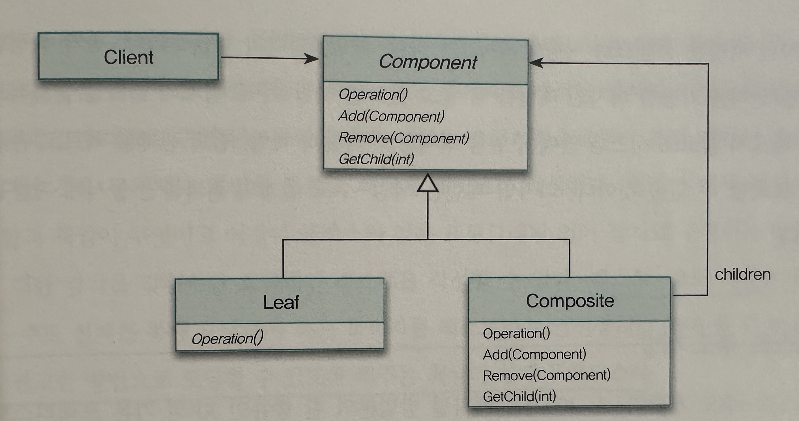

## 역할, 책임, 협력

- `객체를 따로 떼어놓고 봤을 때는 겉모습이 다소 기묘하고 비합리적 이라더라도 중요한 것은 개별 객체가 아니라 객체들 사이에 이뤄지는 협력이다`

### 협력

- 협력은 한 사람이 다른 사람에게 도움을 요청할 때 시작된다
- 요청과 응답은 협력에 참여하는 객체가 수행할 책임을 정의한다

### 책임

- 어떤 객체가 어떤 요청에 대해 대답해 줄 수 있거나, 적절한 행동을 할 의미가 있는 경우 해당 객체가 '책임'을 가진다고 말한다
- `객체지향 개발에서 가장 중요한 능력은 책임을 능숙하게 소프트웨어 객체에 할당하는 것`
- 책임을 어떻게 구현할 것인가 하는 문제는 객체와 책임이 제자리를 잡은 후에 고려해도 늦지 않다. 객체와 책임이 이리저리 부유하는 상황에서 성급하게 구현에 뛰어드는 것은 변경에 취약하고 다양한 협력에 참여 할 수
  없는 비자율적인 객체를 낳게 된다
- 책임의 분류
    - 객체의 책임은 '객체가 무엇을 알고 있는가(knowing)와 무엇을 할 수 있는가(doing)으로 구성된다'
    - 아는 것(knowing)
        - 개인적인 정보에 관해 아는것
        - 관련된 객체에 관해 아는 것
        - 자신이 유도하거나 계산할 수 있는 것에 관해 아는 것
    - 하는 것(doing)
        - 객체를 생성하거나 계산을 하는 등의 스스로 하는 것
        - 다른 객체의 행동을 시작시키는 것
        - 다른 객체의 활동을 제어하고 조절하는 것
    - `즉 책임은 객체의 외부에 제공해 줄 수 있는 정보(knowing)와 외부에 제공해 줄 수 있는 서비스(doing)의 목록이다. 따라서 책임은 객체의 공용 인터페이스(public interface)를 구성한다`
- 책임과 메시지
    - 객체가 다른 객체에게 주어진 책임을 수행하도록 요청을 보내는 것을 메시지 전송(message-send)라고 한다
    - 책임과 메시지의 수준은 같지 않다
        - 책임은 객체가 수행해야 하는 행위를 상위 수준에서 개략적으로 서술한 것이다. 실제로 일을 할 때는 하나의 책임이 여러 메시지로 분할되는 것이 일반적이다
    - 설게를 시작하는 초반에는 어떤 객체가 어떤 책임을 가지고 어떤 방식으로 서로 협력해야 하는지에 대한 개요를 아는 것만으로도 충분하다
        - 책임을 구현하는 방법에 대한 고민은 잠시 뒤로 미루는 것이 좋다

### 역할

- 왕이 재판을 하던 여왕이 재판을 하던, 모자장수가 증언을 하던 앨리스가 증언을 하던 중요한 것은 '누가'가 아니라 '역할'이다 -> 재사용이 가능하다
- `즉, 역할(role)을 사용하면 유사한 협력을 모두 포괄할 수 있는 하나의 협력으로 추상화할 수 있다`
    - 역할을 대체할 수 있는 객체는 동일한 메시지를 이해할 수 있는 객체로 한정된다
    - 단순성(simplicity), 유연성(flexibility), 재사용성(reusability) 확보가 가능해진다
- 협력의 추상화
    - 협력의 추상화는 설계자가 다뤄야 하는 협력의 개수를 줄이는 동시에 구체적인 객체를 추상적인 역할로 대체함으로써 협력의 양상을 단순화한다
    - 왕-토끼-모자장수, 왕-토끼-요리사, 여왕-토끼-앨리스 &rarr; 판사-토끼-증인으로 추상화 할 수 있다
    - `협력을 추상화를 하면 동일한 구조의 협력관계를 다양한 문맥에서 '재사용'할 수 있는 능력이 생기고 이는 객체지향만의 힘이다`
- 대체 가능성
    - 역할은 협력 안에서 구체적인 객체로 대체될 수 있는 추상적인 협력자다. 따라서 본질적으로 역할은 다른 객체에 의해 대체 가능함을 의미한다

### 객체의 모양을 결정하는 협력

- 협력을 따라 흐르는 객체의 책임
    - 1>협력 설계 (요청/응답 흐름)
    - 2> 1에서 설게한 협력은 객체의 책임이 되고, 책임은 객체가 외부에 제공하게 될 행동이 된다
    - 3> 행동을 결정한 후에는 그 행동을 수행하는 데 필요한 데이터를 고민
    - 4> 구체적인 클래스 구현 방법 결정

### 객체지향 설계 기법

- 책임 주도 설계 : 협력에 필요한 책임들을 식별하고 적합한 객체에게 책임을 할당하는 방식으로 애플리케이션을 설계한다
- 디자인 패턴 : 전문가들이 반복적으로 사용하는 해결 방법을 정의해 놓은 설계 템플릿의 모음 (역할, 책임, 협력의 모음)
- 테스트 주도 개발 : 구체적인 코드를 작성해나가면서 역할, 책임, 협력을 식별하고 식별된 역할, 책임, 협력이 적합한지를 비드백 받는다. (테스트 작성이 핵심이 아니다)
- 책임-주도 설계(Responsibility-Driven Design)
    - 1> 시스템이 사용자에게 제공해야 하는 기능인 시스템 책임을 파악한다
    - 2> 시스템 책임을 더 작은 책임으로 분할한다
    - 3> 분할된 책임을 수행할 수 있는 적절한 객체 또는 역할을 찾아 책임을 할당한다
    - 4> 객체가 책임을 수행하는 중에 다른 객체의 도움이 필요한 경우 이를 책임질 적절한 객체 또는 역할을 찾는다
    - 5> 해당 객체 또는 역할에 책임을 할당함으로써 두 객체가 협력하게 한다

- 디자인 패턴(Design Pattern)
    - `디자인 패턴은 책임-주도 설계의 결과를 표현한다`
    - COMPOSITE 패턴 예
        - COMPOSITE 패턴은 전체와 부분을 하나의 단위로 추상화해야 하는 경우에 사용할 수 있는 패턴이다
        - 위 이미지에서 중요한 것은 클래스와 메서드가 아니라 협력에 참여하는 역할과 책임이다
            - Component는 클라이언트와 협력할 수 있는 공용 인터페이스를 정의하는 역할을 수행한다
            - Leaf 역할은 공용 인터페이스에 대한 오퍼레이션 호출에 응답할 수 있는 기본적인 행위를 구현한다
            - Composite는 외부로부터 부분에 대한 세부 사항을 감추고 포함된 부분을 하나의 단위로 행동하는 역할이다
        - `COMPOSTIE 패턴은 부분과 전체가 투명하고 동일한 인터페이스를 제공해야 한다는 제약하에서 식별된 역할, 책임, 협력을 제공하는 한 가지 설계 예제이다`
    - 만약 특정한 상황에 적용 가능한 디자인 패턴을 잘 알고 있다면 책임-주도 설계의 절차를 순차적으로 따르지 않고도 시스템 안에 구현할 객체들의 역할과 책임, 협력 관계를 빠르게 포착 할 수 있다
- 테스트 주도 개발(Test-Driven Development)
    - 테스트-주도 개발은 객체가 이미 존재한다고 가정하고 객체에게 어떤 메시지를 전송할 것인지에 관해 먼저 생각해야한다
    - 테스트-주도 개발은 책임-주도 설계를 통해 도달해야 하는 목적지를 테스트라는 안전장치를 통해 좀 더 빠르고 견고한 방법으로 도달할 수있도록 해주는 최상의 설계 프랙틱스다
    - `하지만 테스트-주도 개발은 다양한 설계 경험과 패턴에 대한 지식이 없는 사람드의 경우에는 온전한 혜택을 누리기가 어렵다`
      - 테스트를 작성하기 위해 객체의 메서드를 호출하고 반환값을 검증하는 것은 순간적으로 객체가 수행해야하는 책임에 관해 생각한 것이기 때문