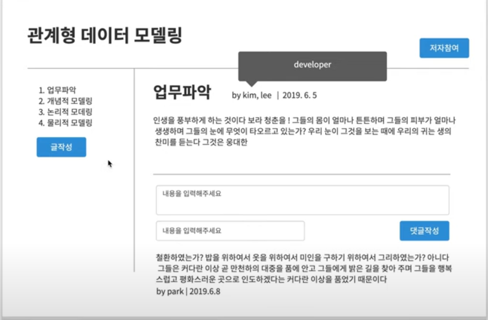
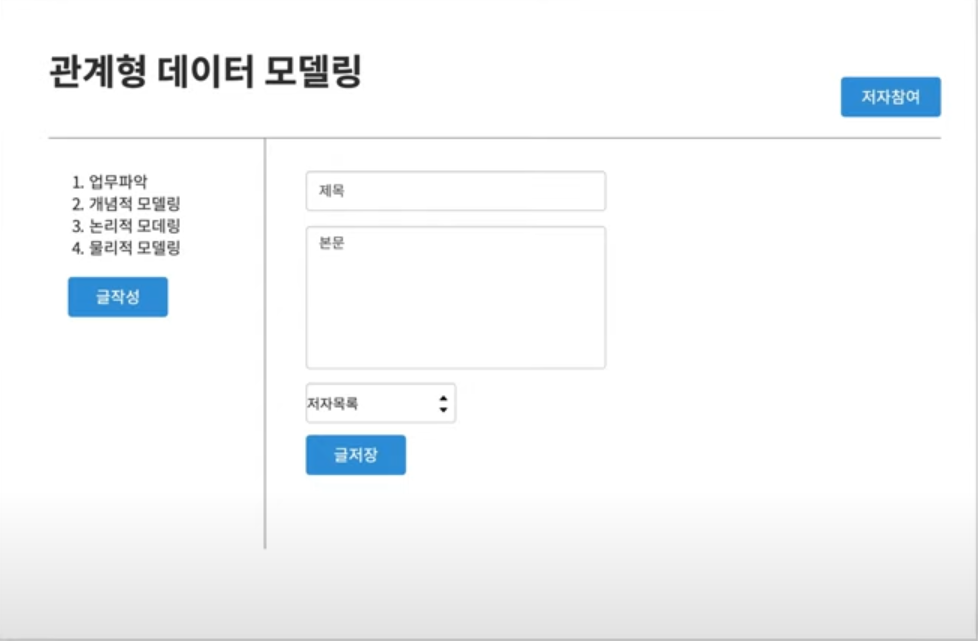
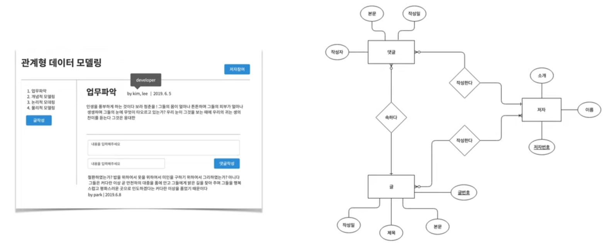
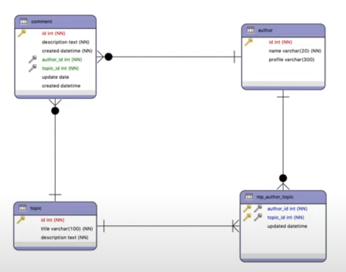
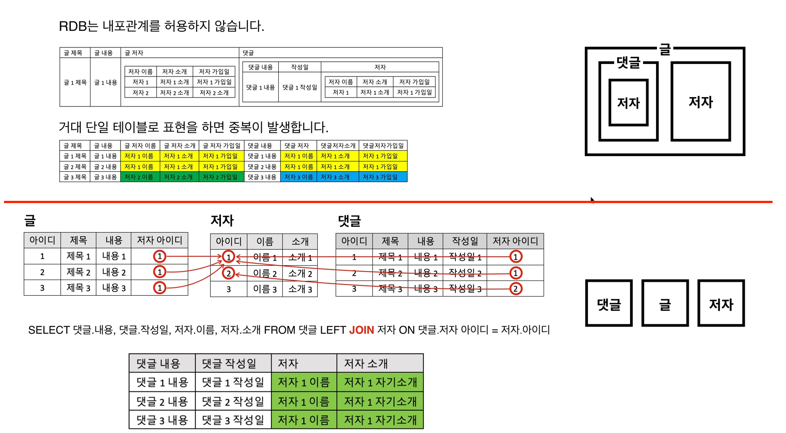
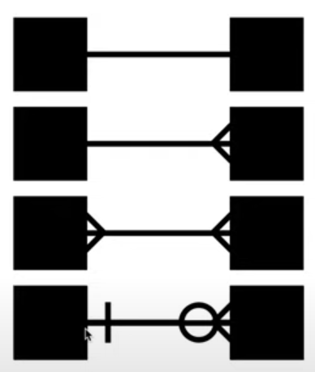
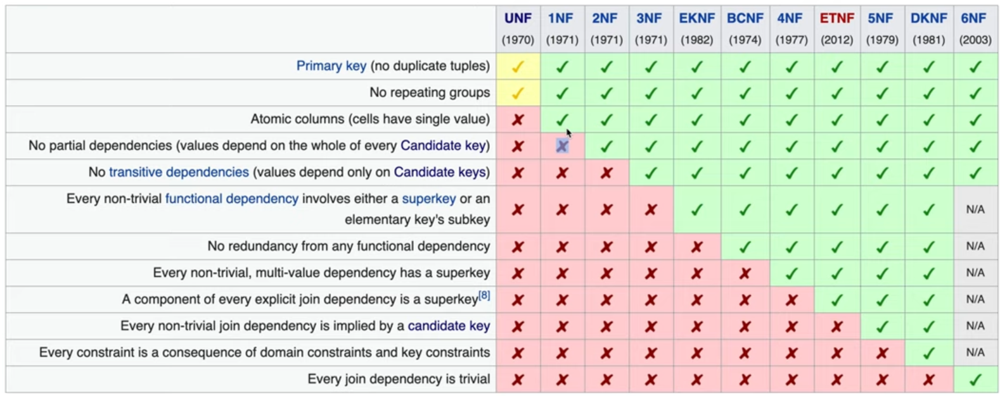
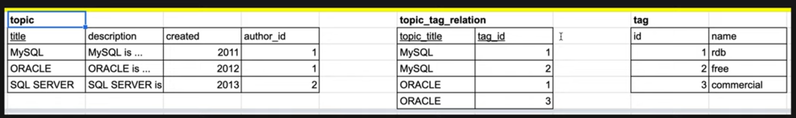

## 모델링
https://www.youtube.com/playlist?list=PLuHgQVnccGMDF6rHsY9qMuJMd295Yk4sa
- 모델링이란
    - 목적을 가지고 진짜를 모방한 것
    - 즉, 현실의 복잡성을 추상화하여 옮겨 담는 작업

## 작업순서

- 업무 파악 &rarr; 개념적 데이터 모델링 &rarr; 논리적 데이터 모델링 &rarr; 물리적 데이터 모델링

### 업무파악

- 말을 믿지 말자
- UI를 만들어서 상호 일치된 합의안을 갖자

### 개념적 데이터 모델링

- 관계형 모델링의 극치! 이걸 잘 했다면 논리적, 물리적 데이터 모델링은 못할 수가 없다
- ERD(Entity Relationship Diagram)
    - 언어로써 작용
        - 정보 : 이미지에서 동그라미, Attribute는 Column이 된다
        - 그룹 : 이미지에서 네모, Entity는 Table이 된다
        - 관계 : 이미지에서 세모 Relation은 PK,FK가 된다
    - 표로 쉽게 변환이 가능 하다

- ERD를 만드는 방법
    - 연관된 정보를 답고 있는 덩어리를 찾는다
    - `빨간줄을 기준으로 윗쪽보다 아랫쪽이 좋다`
        - 아랫쪽처럼 만들어야 그룹별로 조회가 가능하며 조인에 유리하다
        - 윗쪽처럼 아주 큰 덩어리를 만들면 뭐 하나 찾는데 전체를 조회 해야 하고, 중복이 발생한다
    - 식별자(pk) 찾기
        - 컬럼중에서 식별자가 될 수 있는 것이 있고 없는 것이 있다. 일단 구분한다
        - 후보키(candiate key): 식별자가 될 수 있는 키
        - 기본키(primary key): 후보키 중에서 선택된 기본키
        - 대체키(alternate key): 후보키 중에서 선택되지 않은 키
        - 중복키(composite key): 두가지 이상의 키가 합쳐져서 기본키가 된 경우
        - 컬럼중에서 자연스럽게 기본키가 될 수 있는 컬럼이 없는 경우 인조키를 만들어 사용한다
        - ERD에서 PK에는 밑줄을 그어준다
    - Cardinality(기수)
        - 1:1 관계, 1:N 관계, N:M관계
    - Optionality
        - 한쪽에 NUll이 올 수 있는지 없는지 여부
        - 오른쪽이미지 맨아래 에서 1모양은 반듯이 있어야 한다 O모양은 null일수 있다는 뜻
        - 풀어 설명하면 왼쪽은 오른쪽이 없을수도 있지만, 오른쪽은 반드시 왼쪽이 있어야 한다는 뜻

### 논리적 데이터 모델링

- 정규화
    - 이건 따른 자료 참고

### 물리적 데이터 모델링

- 구체적인 제품에 맞는 현실적인 표로 만드는것, 이 단계에서는 성능이 중요하다
- 일단은 운영을 해봐야 알 수 있는 것들이 많다
    - 슬로우 쿼리를 찾아서 최적화 한다
    - index
        - `읽기 성능을 비약적으로 올리고, 쓰기 성능을 비관적으로 희생시킨다`
    - application단에서의 cache를 활용한다
- 최후의 보루는 정규화 되어있는 테이블을 역정규화 하는 것이다
    - 댓가가 크기 때문에 반드시 다른 방법을 모두 시도 해봐야 한다

### 역정규화(반정규화, denormalization)

- 성능이나 개발 편의성을 위해서 정규화를 거스르는것
- 일반적으로 정규화는 대체로 읽기보다는 쓰기에 초점이 맞춰져 있다
    - 정규화를 하게되면 표가 여러개로 쪼개지게 되고 읽기 위해서는 join을 해야 하는데 join을 비싼 작업 이기 때문
    - 결국 역정규화는 중복을 허용하여 join을 없애서 리드 성능을 올리는 작업이다
- `하지만 정규화를 반드시하고 필요한 경우에 역정규화를 하는것이지 읽기를 많이 한다고 역정규화를 바로 하는 것은 말이 안된다`
- 역정규화 사례
    - 1> 조인이 자주 발생하는 테이블을 하나의 테이블로 병합
    - 2> 자주 발생하는 집계를 컬럽으로 추가
    - 3-1> 컬럼을 기준으로 테이블을 분리
        - 용량이 큰 컬럼만 따로 테이블로 분리 (샤딩, 스케일 아웃)
    - 3-2> 행을 기준으로 테이블을 분리
        - id가 몇 이상인 경우에는 다른 테이블로 분리

    

    - 4> 관계의 역정규화
        - FK를 추가하여 join을 줄여서 지름길을 만드는 테크닉
        - 위 이미지에서 author_id가 1번인 경우 tag의 name을 가져오려는 경우, topic, topic_tag_ralation_tag 총 join을 두번해야 한다
        - topic_tag_relation에 author_id(FK)를 추가하여 join 횟수를 한번으로 줄여서 속도를 개선 시킬수 있다
     