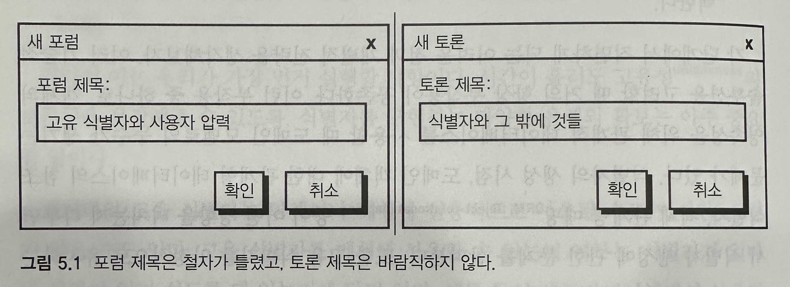
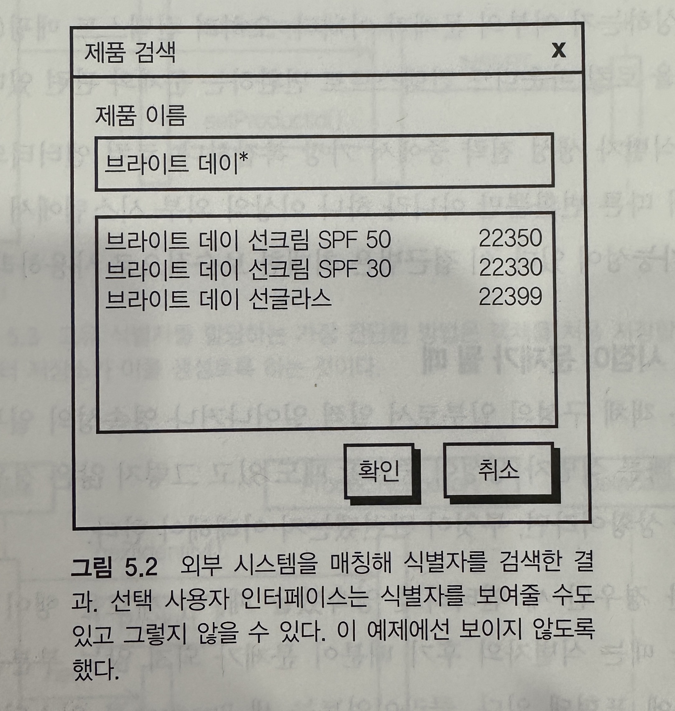
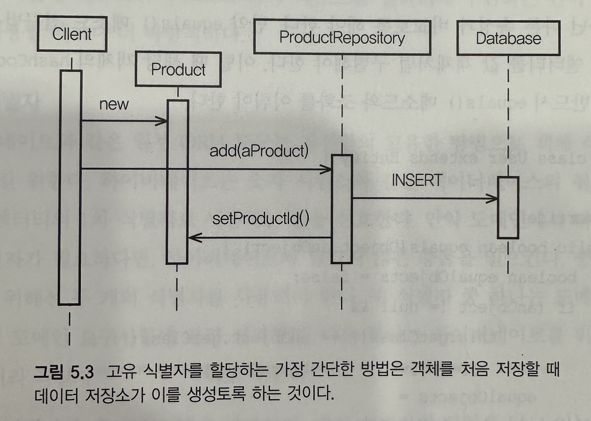
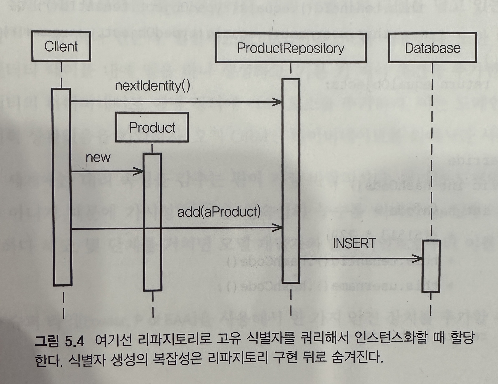

## 엔티티

- 개발자는 도메인보다 데이터에 초점을 맞추려는 경향이 있다. 주로 데이터의 속성(열)과 연결(외래 키)를 먼저 생각하려 한다
    - 이렇게 해서 데이터 모델을 대응하는 객체로 투영하게 되는데, 이로 인해 '도메인 모델'안에 있는 거의 모든 개념이 게터와 세터 메소드를 너무 많이 갖고 있는 엔티티로 코딩된다

- 로드맵
    - 고유한 대상을 설계할 떄 엔티티가 왜 올바른 위치를 가지는지 생각해보자
    - 엔티티를 위한 고유 시별자의 생성 방법을 확인하자
    - 팀이 엔티티 설게에서 유비쿼터스 언어를 잡아내느 설계 회의를 살펴보자
    - 엔티티의 역할과 책임을 표현하는 방법을 학습하자
    - 예제를 통해 엔티티의 유효성을 검사하는 방법과 그 결과를 저장소에 저장하는 방법을 살펴보자

## 엔티티를 사용하는 이유

- 개별성, 한 개념을 시스템내의 나머지 모든 객체와 반드시 구분해야 하는 제약 조건이 있을 때, 이를 엔티티로 설계한다
- 엔티티 고유한 대상으로 긴 시간에 걸쳐 계속해서 변화할 수 있다
- `고유 식별자와 변화 가능성(mutability)이라는 특징이 엔티티와 값 객체 사이의 차이점이다`
- 엔티티가 모델링 도구로 적합하지 않을 떄도 잇다. 잘못된 사용은 많은 사람들이 느끼는 것보다도 훨씬 더 자주 일어 난다
    - 대부분 개념은 값으로 모델링해야 한다
    - 만약 이에 동의할 수 없다면, DDD는 비즈니스 요구에 맞지 않을 수 있으며, CRUD기반의 시스템이 더 적합할 가능성이 상당히 높다
    - 문제는 CRUD 기반의 대안이 자원을 절약하게 해주진 않는다는 점이다

## 고유 식별자

- 엔티티의 설계 초기엔 특성이나 행동에 집중하기보단, 엔티티 객체를 식별하거나 매칭해서 찾을 때 사용되는 기본적인 특성을 파고 들어야 한다
    - 그 후에 개념적으로 필수적인 행동과 그 행동에서 필요로 하는 특성만을 추가해야 한다
    - `이는 시간이 흘러도 고유성(uniqueness)의 보존을 보장해주는 아주 중요한 일이다`
- 고유 실별자는 탐색이나 매칭에 실용적으로 사용될 수도 있지만, 그렇지 않을 수도 있다
    - 고유 식별자를 매칭에 사용할 수 있는지 여부는 식별자가 얼마나 사람이 릭기 쉽도록 돼 있는지에 달려 있다
    - 예를 들어 애플리키에션에서 사용자가 사용할 수 있는 사람의 이름을 검색 할 때, 사람의 이름이 Person 엔티티의 고유 식별자로 쓰일 가능성은 거의 없다. 많은 사람의 이름은 고유하지 않기 때문이다.
      반면 회사의 세무 식별자를 검색한다면, 이 세무 식별자는 company 엔티티의 일차적인 고유 식별자가 될 가능성이 크다. 세무 식별자는 정부가 발행하는 고유한 식별자이기 때문이다
- 식별자 생성의 일반적인 전략
    - 1>사용자는 애플리케이션에 하나 이상의 초기 교유 값을 입력한다. 애플리케이션은 입력한 값이 고유한지 확인해야 한다
    - 2>애플리케이션은 내부적 고유성이 보장되는 알고리즘을 사용해 식별자를 생성한다. 라이브러리나 프레임워크가 이를 대신할 수도 있지만, 애플리케이션이 직접 수행할 수도 있다
    - 3>애플리케이션이 데이터베이스와 같은 영속성 저장소를 사용해 고유 식별자를 생성한다
    - 4>또 하나의 바운디드 컨텍스트에서 먼저 고유 식별자를 결정한다. 이 식별자가 입력되거나, 사용자가 여러 선택지 중 하나를 선택한다
    - 각 단계에서 직면하게 되는 어려운 점과 개별적 전략을 하나씩 살펴보자

### 사용자가 식별자를 제공한다



- 사용자(개발자 말고)가 직접 고유 식별자의 세부사항을 입력하는 편이 간단해 보일 수 있다
- 실제로 간단하기는 하지만 몇가지 문제점이 있다
    - 양질의 식별자를 사용자에게 의하는 것은 문제가 될 수 있다. 고유하더라도 올바르지 않을 수 있다
    - 위 이미지 처럼 포럼과, 토론의 제목을 고유 식별자로 사용했다면, 제목을 잘못 쓴다거나 제목을 바꾸기 위해선 비용이 얼마나 뜰까?
    - `일반적으로 사용자 입력 값은 언제든 매칭에 사용할 엔티티의 속성으로 고려해도 되지만, 이를 고유 식별자로 사용해선 안된다`
- 사람이 읽을 수 있는 식별자가 반드시 필요한 상황에선 워크플로 지원이 가능하다면 식별자의 품질을 확보하기 위해서 몇 가지 사이클을 추가해 품질을 확보해야 한다

### 애플리케이션이 식별자를 생성한다

- 애플리케이션이 클러스터링 되거나 다수의 컴퓨팅 노드에 걸쳐 배포된 상황이라면 신경을 써야겠지만, 고유 식별자를 자동으로 생성할 수 있는 신뢰도 높은 방법이 있다
    - 보편적 고유 식별자(UUID)나 전역 고유 식별자(GUID)가 이런 접근법의 예이다

#### UUID

- UUID는 상대적으로 생성이 빠르너 식별자이고, 영속성 메커니즘과 같은 외부와의 상호 교류가 필요하지 않다
- 1초 동안 특정 종류의 엔티티가 무수히 생성되더라도, UUID 생성기는 그 속도를 유지할 수 있따
- 좀 더 고성능의 도메인에선 얼마나 많은 UUID 인스턴스든 배그라운드에서 캐시를 다시 채우며 캐싱할 수 있다. 만약 캐시된 UUID 인스턴스가 서버의 재시작으로 사라졌더라도, 임의의 만들어진 값에 기반했기 때문에
  식별자에는 빈 공간이 없다. 폐기된 값은 서버의 재시작으로 캐시를 다시 채우는 과정에 나쁜 영향을 미치지 않는다

#### 서드파티

- 써드파티 라이브러리와 프레임워크에서 식별자 생성기를 찾을 수 있다
- 아파치 커먼스 프로젝트는 컨먼스 Id 컴포넌트를 포마하고 있는데, 이는 다섯 종류의 식별자 생성기를 제공한다
- NoSQL인 리악(Riak)rhk 몽고DB등의 영속성 저장소는 식별자를 생성해줄 수 있다

### 영속성 메커니즘이 식별자를 생성한다

- 고유 식별자의 생성을 영속성 메커니즘에 위임하는 방식만의 이점이 있다
    - 데이터 베이스로 시퀀스나 증가 값을 호출한 결과는 언제나 고유하다
- 성능적 측면이 단점이 될 가능성도 있다
    - 값을 얻기 위해 데이터베이스까지 가야 한다는 점이 애플리케이션 안에서 식별자를 생성할 때 비해 유의미하게 많은 시간을 소모할 수 있다
    - 이는 데이터베이스의 부하와 애플리케이션의 요청에 따라 달라진다
    - 이런 문제를 피하는 방법으로 리파지토리 내부와 같이, 애플리케이션의 안쪽에 시퀀스/증가 값을 캐싱하는 방버비 있다
- 생성의 시점이 문제가 될 수도 있는데 이는 후반부에 다룬다
- 식별자 생성의 요구사항 (때론 식별자 엔티티의 생성과 할당이 일어나 시점이 중요하다)
    - 빠른 식별자 생성과 할당은 엔티티가 저장되기 전에 일어난다
    - 늦은 식별자 생성과 할당은 엔티티가 저장될 때 일어난다

### 또 하나의 바운디드 컨텍스트가 식별자를 할당한다



- 또 다른 컨텍스트가 식별자를 할당할 땐 각 식별자의 검색과 매칭과 할당을 위한 통합이 필요하다
    - DDD 통합은 컨텍스트 맵과 바운디드 컨텍스트의 통합에서 다룬다
- 정확하게 들어맞는 매칭이 가장 이상적이다
    - 이미지 처럼 사용자는 의도한 결과를 정확히 표시하기 위해 계좌 번호나 사용자명, 이메일 주소, 기타 고유 기호등 과 같은 속성을 하나이상 제공해야 한다
    - 확정되지 않은 입력에 따라 매칭할 땐 여러 검색 결과가 나올 수 있기 때문에 사용의 선택이 필요할 수 있다(위 이미지)

### 식별자 생성의 시점이 문제가 될 때

- 식별자 생성은 객체 구성의 일부로서 일찍 얼아나거나 영속성의 일부로서 늦게 일어날 수 있다. 시점이 중요한 상황이라면, 무엇이 관련됐는지 이해해야 한다



- 위 이미지는 가장 단순한 경우인 새 엔티티가 영속됐을 때, 즉 새로운 행이 데이터베이스에 삽입되었을 때이다
    - 클라이언트는 새 Product를 인스턴스화하고 이를 ProductRepository에 추가한다
    - Product인스턴스가 새롭게 생성되는 시점에서 클라이언트는 해당 식별자가 필요하지 않다
    - 오직 인스턴스를 저장한 이후에만 식별자를 사용할 수 있다



- 위 이미지에서는 오직 인스턴스를 저장한 이후에만 식별자를 사용할 수 있었다
    - 하지만 이 이미지에서는 식별자를 먼저 생성하기 때문에 인스턴스를 영속성에 저장하기 전에 식별자를 사용할 수 있다
    - 즉, 식별자가 영속성에 저장되기 전에 필요한 경우가 있고, 알아야 한다
- 식별자가 영속성에 저장되기 전에 필요한 경우
    - 첫 번째 이미지처럼 구성되어 있는 경우 클라이언트가 새로운 Product를 ProductRepository에 추가할 기회를 잡기 전에 도메인 이벤트를 수신한다
    - 따라서 이를 올바르게 처리하기 위해서는 식별자 생성을 빠르게 완료해야 한다 (위 그림처럼)
    - 즉, 레이스 컨디션이 발생할 수 있다 Repository에 저장을 완료하기 전에 새로운 Product를 요청하게 되면 저장하려고 한 Product와 새로운 요청의 Product의 식별자가 같아 질 수 있다

#### 대리 식별자

- 하이버네이트와 같은 ORM도구는 자신만의 고유한 방법으로 객체 식별자를 처리하길 원한다
    - 하이버네이트는 숫자 시퀀스와 같은 데이터베이스의 원시 타입을 각 엔티티의 1차 식별자로 사용한다
    - 만약 도메인에서 다른 유형의 식별자가 필요하다면, 하이버네이트와 충동을 일으키며 이를 해결하기 위해서는 두개의 식별자를 사용해야한다
    - 하나는 도메인 모델에 맞춰 도메인 요구사항에 따라 설계한다. 다른 하나는 하이버네이트를 위한 식별자로 대리 식별자 라고 부른다
- 구현 방법
    - 대리 식별자를 담을 특성을 엔티티에 추가한다. 일반적으로 long,int를 사용한다
    - DB에 엔티티 테이블 내에 열을 하나 생성하고, 기본 키 제약 조건을 추가한다
    - 하이버네이트 매핑 정의에 id 를 추가하고, 이는 도메인 식별자와 전형 상관없으며, ORM만을 위해서 사용된다
- 계층 슈퍼타입을 사용해서 한 가지 안전 장치를 추가할 수 있다

```java
public abstract class IdentifiedDomainObject implements Serializable {
    private long id = -1;

    public IdentifiedDomainObject() {
        super();
    }

    protected long id() {
        return this.id;
    }

    protected void setId(long anId) {
        this.id = anId;
    }
}
```

- IdentifiedDomainObject 은 Protected 접근자 메소드를 사용해 클라이언트 뷰에서 대리 기본 키를 감추는 추상 기본 클래스이며 계층 슈퍼타입이다
    - 해당 기본 클래스를 확장한 엔티티의 모듈 밖에서는 가시성이 없기 떄문에 클라이언트는 이 메소드를 사용해야 할지 고민할 필요가 없다
    - 심지어 private 범위도 가능하다
    - 도메인 식별자가 데이터베이스의 기본 키 역할을 수행해야 할 필요는 없으며, 다른 데이블 내에 외래 키로서, 참조 무결성을 제공한다
- 즉 id를 대기 기본키 데이터베이스 식별자로 사용하고 다른 필드를 추가해서 그걸 도메인 식별자로 사용한다는 뜻

#### 식별자 안전성

- 대부분의 경우 고유 식별자는 수정하지 못하도록 보호되고, 할당된 엔티티의 수명주기에 걸쳐 안정적으로 유지돼야 한다
- 식별자 수정을 방지하기 위해서 취할 수 있는 당연한 방법이 있다
    - 식별자 setter를 클라이언트로부터 숨기는 방법이 있고,
    - 이미 존재한다면 식별자의 상태 변화로부터 엔티티 자체를 보호하기 위해 setter 내에 가드를 만들 수 도 있다

```java
public class user extends Entitiy {
    protected void setUsername(String aUsername) {
        if (this.username != null) {
            throw new IllegalStateException("this username may not be changed.");
        }
        if (aUsername == null) {
            throw new IllegalArgumentException("The username may not be set to null");
        }
        this.username = aUsername;
    }
}
```

- 위 코드에서 username 특성은 User엔티티의 도메인 식별자이며, 단 한 반 그리고 내부적으로 변형이 가능하다
    - setUsername()이라는 세터는 클라이언트로부터 스스로를 숨기며 캡슐화를 제공한다
- 이 setter는 영속성으로부터 객체 상태를 재구성해야 할 떄 하이버네이트의 걸림돌이 되지 않는다
    - 객체는 애초에 인수가 없는 기본 생성자로 만들어지기 때문에 처음엔 username이 null이다
    - 이는 깔끔한 재초기화가 가능케 해주며, setter를 통해 일회성인 하이버네이트의 초기값 할당이 일어난다
    - 하이버네이트가 영속성과 복원을 위해 접근자가 아닌 필드(특성) 접근을 사용토록 설정했다면 이는 완전히 생략된다 