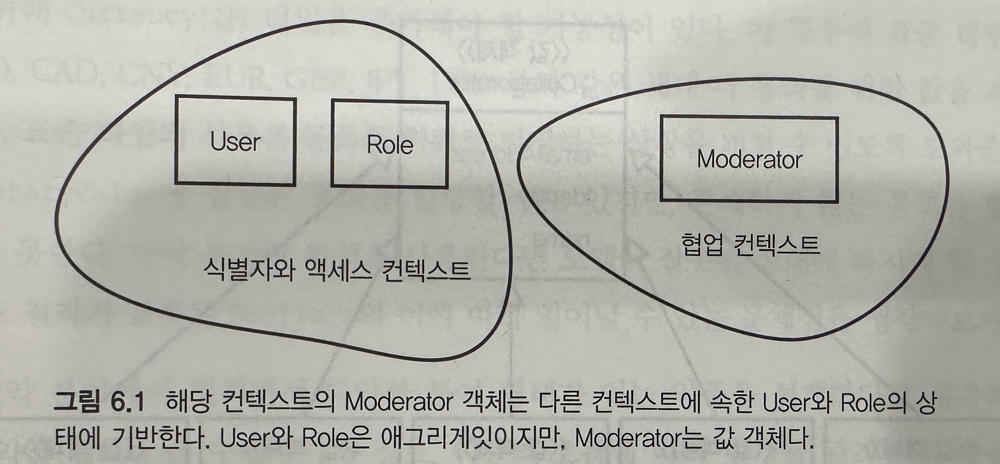
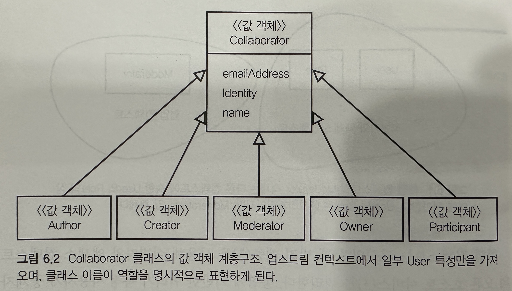
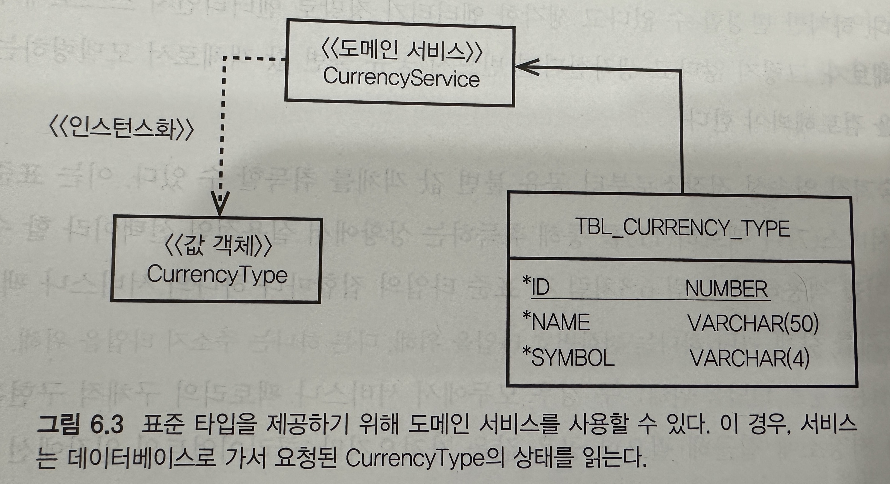

## 값 객체

- `가능한 엔티티 대신 값 객체를 사용해 모델링 해야한다 `
    - 심지어 도메인 개념이 엔티티로 모델링돼야 할 때도 엔티티의 설계는 자식 엔티티의 컨테이너보다는 값의 컨테이너로 동작하는 쪽으로 기울여야 한다

```
모델 요소의 특성에만 신경을 쓰고 있다면, 이를 값 객체로 분리하라.값 객체가 담을 특성의 의미를 표현하고, 그에 관한 기능도 부여하자
값 객체를 변경이 불가능한 것으로 취급하자
식별자는 부여하지 말고, 엔티티를 유지할 떄 필요한 설계 복잡성을 피하도록 하자
```

#### 로드맵

- 값으로 모델링하기 위해 도메인 개념의 특징을 이해하는 방법
- 통합의 복잡성을 최소화하기 위해 값 객체를 활용하는 방법
- 값으로 표현된 도메인 표준 타입의 사용

## 값의 특징

- 개념을 값으로 나타낼지 결정할 땐, 반드시 다음과 같은 특징의 대부분을 포함하고 있는지 판단해야 한다
    - 도메인 내의 어떤 대상을 측정하고, 수량화하고, 설명한다
    - 불변성이 유지될 수 있다
    - 관련 특성을 모은 필수 단위로 개념적 전체를 모델링한다
    - 측정이나 설명이 변경될 땐 완벽히 대체 가능하다
    - 다른 값과 등가성을 시용해 비교할 수 있다
    - 협력자(collaborator)에게 부작용이 없는 행동(side-effect-free behaviro)을 제공한다

### 측정, 수량화, 설명

- 모델 내에 진정한 값 객체가 있다면, 도메인 안에 있지 않다. 대신 이는 도메인 내에 있는 어떤 대상을 측정하고 수량화하고 설명하는 개념이다
    - 사람에겐 나이가 있다. 나이는 실재하는 어떤 대상은 아니지만, 사람이 살아온 햇수를 측정하거나 수량화 한다
    - 사람은 이름이 있다. 이름 자체는 실재하는 사물은 아니지만, 이는 사람(대상)을 어떻게 부를지 설명해준다
- 결국 이는 개념적 전체(Conceptural Whole)의 특징과 깊은 관련이 있다

### 불변성

- 값인 객체는 일단 생성되면 변경할 수 없다

```java
import java.io.Serializable;

public final class BusinessPriority implements Serializable {
    private BusinessPriorityRatings ratings;

    public BusinessPriority(BusinessPriorityRatings aRatings) {
        super();
        this.setRatings(aRatings);
        this.initializae();
    }
}
```

- 위 코드는 다른 값 객체의 참조를 갖는 값 객체 타입의 예제이다
- 인스턴스화 자체가 객체의 불변셩을 보장하진 않는다. 일단 객체가 인스턴스화되고 생성의 방법에 따라 초기화된 후부턴 어떤 메소드도 상태의 변경을 초래할 수 없다
    - 내부에 있는 메소드 setRatings()와 initialize()만이 유일하게 상태를 변경할 수 있다
- 기호에 따라 인티티의 참조를 갖고 있는 값 객체를 설계할 수도 있다
    - 하지만 참조된 엔티티가 상태를 변경 할 떈 값도 함께 변경되는데, 이는 불변성이란 속성을 위반한다
    - 따라서 값 타입이 참조하는 엔티티는 컴포지션의 불변셩, 표현성, 편리함 등을 위해 사용된다는 사고 방식을 갖는 편이 최선이다

```
지금 설자하고 있는 객체가 자신의 행동으로 인해 변경돼야 한다고 생각한다면, 그 필요성을 스스로 질문해야 한다
값을 반드시 변경해야 한다면 대신할 대상을 활용하는 편은 어떨까? 간으한 상황에 이 접근법을 사용하면 설계를 단순하게 해준다 
간혹 객체의 불변성이 아무 의미가 없을 떄도 있다. 이런 상황은 전혀 문제가 되지 않으며, 객체가 엔티티로 모델링돼야 함을 의미한다 
```

### 개념적 전체

- 값 객체는 하나 이상의 개별적 특수성을 가질 수 있으며, 각 특성은 서로 연관돼 있다. 각 특성은 전체에 기여하는 중요한 한 부분으로서, 여러 특성이 설명하는 바를 모아 전체를 나타낸다
- 특성을 개별적으로 사용한다면 응집력 있는 의미를 제공하지 못한다
- 모든 특성이 함께 있어야만 완벽히 의도에 맞는 측정이나 설명이 만들어진다
- 예를 들면 5만 달러의 경우
    - 5만 과 달러가 별개로 존재할 경우 아무런 의미를 같지 못한다

```java
public class ThingsOfWorth {
    private String name;
    private Bingdecimal amoutns;
    private String currency;
}
```

- 위 코드에선 amount와 currency가 개념적 전체를 이루지 않기 때문에, 모델과 그 클라이언트는 언제 어떻게 amount와 currency를 함께 사용해야 하는지 알아야 한다. 즉, 문제다

```java
import java.io.Serializable;
import java.math.BigDecimal;

public final class MonetaryValue implements Serializable {
    private BigDecimal amounts;
    private String currency;

    public MonetaryValue(BigDecimal anAmount, String aCurrency) {
        this.setAmount(anAmount);
        this.setCurrency(aCurrency);
    }
}

public class ThingsOfWorth {
    private ThingsName name;
    private MonetaryValue worth;
}
```

- 위 코드처럼 두 개의 개별적 특성이 아닌, 하나의 전체 값으로 취급해야 한다
- 값 클래스의 생성자는 값 객체의 불변성과 함께 전체 값이 한 번의 오퍼레이션으로 생성됨을 보장해줄 값 클래스의 생성자가 필요하다

### 대체성

- 불변값의 변하지 안는 상태가 현재의 전체 값을 올바르게 나태나고 있는 이상, 엔티티는 반드시 해당 값의 참조를 갖고 있어야 한다
    - 만약 상태가 올바르지 않은 상황이왔다면, 현재의 전체를 올바르게 나타내는 새로운 값으로 전체 값을 완전히 대체해야 한다
- 대체성의 개념은 숫자의 컨텍스트를 통해 쉽게 이해할 수 있다
    - 도메인이 정수인 total의 개념을 포함하고 있다고 생각해보자
    - 현재 값이 3이지만 반드시 숫자4로 수정해야만 하는 상황에선 당연히 숫자3을 4로 바로 수정하지 않는다
    - 대신 total을 정수 4로 설정한다, 즉 새로운 값을 담은 새로운 객체를 리턴한다

### 값 등가성

- 값 객체 인스턴스를 또 다른 인스턴스와 비교할 땐 등가성 테스트가 사용된다
    - 만약 타입과 특성이 모두 같다면, 등가로 간주한다

### 부작용이 없는 행동

- 불변성 값 객체의 메소드는 반드시 부작용이 없는 함수여야 한다
    - 오퍼레이션(함수)를 실행 할 때 어떤 수정도 발생하지 않는다면, 해당 오퍼레이션은 부작용이 없다고 말한다

```
public FullName withMiddleInitial(String aMiddleNameOrInitial){
    if(aMiddleOrInitial == null){
        thow new IllegalArgumentException("must provide a middle name or initial.");
    }
    String middle = aMiddleNameOrInitial.trim();
    if(middle.isEmpty()){
        thow new IllegalArgumentException("must provide a middle name or initial.");
    }
    return new FullName(
        this.firstName(),
        middle.substring(0,1).toUppeCase(),
        this.lastName();
    );
}
```

- 위 코드, 메소드 withMiddelInitial()은 그 자신의 값을 수정하지 않으며, 따라서 부작용이 없다.
    - 대신 자신의 일부와 주어진 가운데 이니셜을 합쳐서 새로운 값을 인스턴스화 한다

```
float priority=businessPriority.priorityOf(product);

float priority=businessPriority.priorty(product.businessPriorityTotals());
```

- 위 처번째 코드에는 여러 가지 잘못된 점이 있다 (2번째 줄 처럼 수정해야 한다)
    - 1> 값이 Product에 의존하도록 한다. 가능하면 의존하는 값을 제한하고 스스로의 타입과 그 특성의 타입을 이해하도록 하는 편이 좋다
    - 2> 코드를 읽는 사람은 Product의 어떤 부분이 사용될지 모른다. 표현이 명시적이지 않으며, 이는 모델의 명확성을 약화시킨다. Product의 실제 속성 일부나 파생된 속성을 전달했따면 더 좋았을
      것이다
    - 3> 엔티티를 매개변수로 갖는 모든 값 메소드가 엔티티의 수정을 유발하지 않는다는 점을 쉽게 증명할 수 없다. 그러므로 테스트하기가 더욱 어려워 진다

- 특정 값 객체를 설게하는 대신에 기본 언어 값 타입을 사용하면 안된다. 이는 모델을 속이는 결과가 된다. 기본 언어 값 타입에는 도메인에 맞춘 부작용이 없는 함수를 할당 할 수 없기 때문이다

## 미니멀리즘으로 통합하기

- 모든 DDD프로젝트에는 항상 다수의 바운디드 컨텍스트가 있으며, 이는 컨텍스트를 통합하는 방법을 찾아야 한다는 의미다
    - 가능한 상황이라면, 값 객체를 사용해 유입되는 업스트림 컨텍스트로부터 다운스트림 컨텍스트의 개념을 모델링하자
    - 이를 통해 우선주위를 미니멀리즘에 따라 통합할 수 있으며, 이는 다운 스트림 모델을 관리하는 책임이라 볼 수 있는 속성의 수를 최소화해준다



- 위 이미지에서 협업 컨텍스트는 User가 중개자 역할에 해당하는 Role을 수행하는지 여부에 관심이 있다
    - 협업 컨텍스트는 자신의 부패방지 계층을 사용해 식별자와 액세스 컨텍스트의 오픈 호스트 서비스를 쿼리한다
    - 쿼리가 특정 사용자가 중재자 역할을 수행하고 있음을 알려주면, 협업 컨텍스트는 이를 대표할 Moderator라는 객체를 생성한다
    - Collabarator의 서브클래스 중 하나인 Moderator는 값 객체로 모델링된다
        - 업스트림인 식별자와 액세스 컨텍스트의 여러 애그리게잇이 협업 컨텍스트에 미치는 영향을 최소화 한다
    - Moderator는 자신의 많지 않은 특성을 통해 협업 컨텍스트에서 이야기되는 유비쿼터스 언어의 필수 개념을 모델링한다. 게다가 Role 애그리게잇의특성을 단 하나도 갖고 있지 않다



- 다운스트림 컨텍스트의 객체가 원격 컨테스트상에 속한 하나 이상의 애그리게잇의 부분적 상태와 결국은 일관성을 유지해야만 할 때도 있다
    - 이런 경우엔 컨텍스트를 소비하는 다운스트림의 애그리게잇을 설계할 텐데, 이는 일련의 연속된 변경을 유지 관리하기 위해 엔티티 사용하기 때문이다
    - 하지만 가능하다면 이런 모델링은 선택하지 않도록 노력해야한다
    - 할 수만 있다면 값 객체로 통합한 설계해야한다
- [생각]결국 같은 User이지만 협업 컨텍스트에서는 User의 특성중 일부만을 받아서 명시적으로 이름을 정해준다 (위 이미지 참고)

## 값으로 표현되는 표준 타입

- 시스템과 애플리케이션에선 표준 타입이 필요한다
    - 표준 타입은 대상의 타입을 나타내는 서술적 객체다. 대상(엔티티)이나 설명(값)은 그 자체로 존재하기도 하지만, 타입에 따라 해당 대상을 구분해주는 표준 타입이 존재할 수도 있다
    - 정해진 이름은 없지만 파워타 타입, 타입 코드, 룩업 이라고 부른다
- 유비쿼터스 언어가 PhoneNumber(값)을 정의했다면, 각 타입에 관한 설명도 필요하다
    - 집 번호인가, 휴대폰 번호인가, 회사 번호인가
    - 이를 클래스 게층구조로 모델링하게 되면 타입별로 별도의 클래스를 사용하면 클라이언트가 이를 구분하기 어려워진다
    - 여기선 표준 타입을 사용해 Home, Mobile, Work등응로 전화의 타입을 나타내느 편이 좋다
- 유지 보수를 위해선 보통 표준 타입을 소비하는 모델의 별로 컨텍스트에 바로 위치시킨다

```java
public enum GroupMemberType {
    GROUP {
        public boolean isGroup() {
            return true;
        }
    },
    User {
        public boolean isUser() {
            return true;
        }
    };

    public boolean isGroup() {
        return false;
    }

    public boolean isUser() {
        return false;
    }
}
```

- 위 코드는 아주 간단한 예제로, 두 타입이 존재하는 그룹의 회원을 모델링하는 표준 타입이다
    - 사용자는 회원이 될 수 있고, 그룹 그 자체인 회원이 있을 수 있다

```
protected GroupMember toGruopMember(){
    GroupMember groupMember = new GroupMember(
        this.tenantId(),
        this.username(),
        GroupMemberType.USER
      );
}

```

- 위 코드는 User 클래스의 toGroupMember() 메소드 구현이다
- 열거형은 매우 경량이며 컨벤션에 따라 부작용이 없는 행동을 갖게 된다
- 텍스트로 나타난 설명은 어디에 있을까?
    - 타입은 때론 설명은 필요하지 않고 이름만이 필요한다
        - 텍스트적 설명은 일반적으로 사용자 인터페이스 게층에서만 유효하며, 뷰 중심의 속성과 티입의 이름을 매칭시켜 제공할 수 있다.
    - 영거형 상태 이름은 GROUPS와 USER가 내포할 수 있는 설명에 제약이 있다
        - 각 타입의 toString()행동을 통해 서술적 이름을 부여할 수도 있다
- isGroup()과 isUser()는 모든 기본값 행동으로 false를 반환한다
    - 이는 매우 올바른 기본 행동이다
    - 그러나 이 메소드는 각 상태의 정의에서 자신의 특정 상태에 맞춰 ture를 반환하도록 재정의(override) 된다
    - 표준 타입의 상태가 GROUP일 때, isGroup()메소드는 true를 리턴하도록 재정의 된다
- 상태 패턴의 구현은 재정의와 특수화를 통해 도메인에 필요한 표준 행동을 추가함으로써 좀 더 복잡해질 수 있다



- 코드 생성을 통해 열거형을 만드는 방법
    - 예를 들면, 코드 생성 접근법은 해당하는 영속성 저장소에서 현존하는 모든 표준 타입을 읽어와, 각 행마다 고유한 타입 상태를 만들어 준다

## 구현

```java
import java.io.Serializable;

public final class BusinessPriority implements Serializable {
    private static final long serialVersionUID = 1L;
    private BusinessPriorityRatings ratings;

    public BusinessPriority(BusinessPriorityRatings aRatings) {
        super();
        this.setRatings(aRatings);
    }

    public BusinessPriority(BusinessPriority aBusinessPriority) {
        this(BusinessPriority.ratings());
    }

    public float costPercentage(BusinessPriorityTotals aTotals) {
        return (float) 100 * this.ratings().coat() / atotals.totalCost();
    }

    public float totalValue() {
        return this.ratings().benefit() + this.ratings().penalty();
    }

    public BusinessPriorityRatings ratings() {
        return this.ratings;
    }
}
```

- 위 코드에서는 값 타입을 Serializable로 선언하하고 있다
    - 값 인스턴스가 반드지 직렬화돼야 할 때가 있다. 원격 시스템과 통신하거나 일부 영속성 전략에 유용할 때가 해당한다
- 값 객체의 생성자는 일반적으로 두 개의 생성자를 지원하는 것이 좋다
    - 1> 모든 상태 특성을 가져오고 설정하는데 필요한 매개변수 전체를 받는다. 프라이빗 세터를 통한 자기 위임을 추천한다
    - 2> 복사 생성자, 기존의 값을 복사해 새로운 값을 생성하는 데 쓰인다

## 값 객체의 저장

- 값 객체 인스턴스를 영속성 저장소로 저장하는 방법에는 여러 가지가 있다
- 데이터 모델이 도메인 모델에 잘못된 영향을 미칠 때 어떤 일이 일어나는지, 그리고 이런 잘못되고 유해한 영향에 맞서기 위해 할 수 있는 일을 먼저 알아본다

### 데이터 모델 누수의 부정적 영향을 거부하라

- 값 객체를 데이터 저장소로 저장하는 대부분의 경우는 비정규화된 방식으로 저장된다
    - 즉 해당 특성은 부모 엔티티 객체와 같은 데이터베이스 테이블 행에 저장된다
    - 이는 저장소와 값을 가져오는 과정을 깔끔하게 최적화하도록 해주고, 영속성 저장소의 누수를 막아준다
- 모델 내의 값 객체가 반드시 관계형 영속성 저장소의 엔티티로 저장돼야 할 때가 있다
    - 즉, 저장 시에 특정 값 객체 타입의 인스턴스가 해당 타입을 위한 관계형 데이터베이스 테이블에서 자신만의 행을 차지하고, 자신만의 데이터베이스 기본 키 열을 갖게 된다
    - 이런 상황에선 값 타입의 영속성 데이터베이스의 엔티티로 모델링 된다. 하지만 이는 값 보다는 엔티티가 돼야 한다는 의미는 아니다. 도메인 모델의 관점을 유지하는 것이 더 중요하다
- 즉, 객체 저장소를 다루기 위해 필요한 방법에 따라 영속성 저장소를 모델링하되, 도메인 모델 내의 값 속성을 개념화하는 방향에 영향을 미치지 않도록 해야한다

### ORM과 단일 값 객체

- 단일 값 객체 인스턴스를 데이터베이스에 저장하는 일은 보통 아주 단순하다
    - 값의 각 특성을 해당 부모 엔티티가 저장되는 행에 별도의 열로 저장하는 방식이 기본적인 계획이다
    - `즉, 단일 값 객체는 해당 부모 엔티티의 행 속으로 비정규화된다`
- 직렬화된 객체의 이름을 짓는 방식을 분명하게 식별하고 표준화하기 위해 열 이름에 관한 컨벤션을 도입하면 분명한 이점이 있다
    - 네이밍 컨벤션은 최종적 부모 값에서 각각의 개별 특성으로 이어지는 탐색 경로에 기반하는 것이 좋다
    - BusinessPriority에서 ValueCostRisRatings 인스턴스의 benefit특성까지의 탐색 경로를 생각해보자
    - businessPriority.ratings.benefit

### ORM과 한 열로 직렬화되는 여러 값

- 여러 값 객체의 컬렉션을(list, set) ORM을 사용해 관계형 데이터베이스로 매핑하는 데는 고유한 문제가 있다
    - 하이버네이트 객체 관계형 매핑의 한 가지 선택지로, 컬렉션의 모든 객체를 텍스트 적으로 직렬화한 후에 그 표현을 하나의 열로 저장하는 방법이 있다
    - 이 접근에는 몇 가지 단점이 있지만, 일부 경우엔 이 단점이 크게 문제가 되지 않으며, 장점이 더 부각되는 상황에선 값 컬렉션 영속성을 사용하기로 결정하게된다
    - 이런 경우에 고려해야할 잠재적 단점은 다음과 같다
- 열 넓이
    - 컬렉션에 포함된 값 요소의 최대 수나 직렬화된 각 값의 최대 크기를 단정할 수 없다
- 쿼리해야만 하는 경우
    - 이 스타일을 사용하면 값 컬렉션이 평면적인 텍스트 표현으로 직렬화되기 때문에 쿼리가 불가능 하다
- 사용자 지정 유저 타입이 필요한 경우
    - 이 타입을 사용하려면 각 집합의 직렬화와 역질렬화를 관리하는 사용자 지정 유저 타입을 개발해야 한다

### ORM과 데이터베이스 엔티티로 지원되는 여러 값

- ORM과 관계형 데이터베이스를 사용해 값 인스턴스의 컬렉션을 저장하는 매우 직관적인 접근법으로, 값 타입을 데이터 모델의 엔티티로 취급하는 방법이 있다
    - 이전에 말한 것처럼, 데이터베이스 엔티티로 나태내기에 알맞다는 이유만으로 개념을 도메인 모델의 엔티티로 모델링하는 잘못으로 이어져서는 안된다
    - 완벽하게 맞아 떨어지는 영속성 스타일을 사용할 수 있다면, 데이터베이스 엔티티 특성에 관해선 조금의 관심도 두지 말고 개념을 값 타입으로 모델링해야 한다

- 이를 실천하기 위해 계층 슈퍼타입(Layer Supertype)을 사용할 수 있다
- 아래 코드 예시들은 두 개의 게층 슈퍼 타입 클래스를 사용하는 대리 키(surrogate key) 접근 법이다
    - 대리키는 식별자가 너무 길거나 여러 개의 속성으로 구성되어 있는 경우 인위적으로 추가하는 식별자로, 인공키라고도 부른다.

```java
import java.io.Serializable;

public abstract class IndentifiedDomainObject implements Serializable {
    private long id = -1;

    public IdentifiedDomainObject() {
        super();
    }

    protected long id() {
        return this.id;
    }

    protected void setId(long anId) {
        this.id = anId;
    }
}
```

- (위 코드)첫번째 계층 슈퍼타입은 IdentifiedDomainObject이다. 이 추상 기본 클래스는 클라이언트의 뷰에선 감춰지는기본적인 대리 기본 키를 제공한다

```java
public abstract class IdentifiedValueObject extends IndentifiedDomainObject {
    public IdentifiedValueObject() {
        super();
    }
}
```

- 위 코든느 값 객체에 특화된 계층 슈퍼타입의 예이다
    - 클래스는 IndentifiedValueObject는 IdentifiedDomainObject의 행동 없는 서브클래스로, 단순한 마커 클래스(marker class)라고 생각 할 수 있다
    - 하지만 이를 통해 더욱 명시적으로 모델링 문제를 다룰 수 있기 떄문에, 소스 코드 문서화의 이점이 있다

```java
public final class GroupMember extends IdentifiedValueObject {
    private String name;
    private TenantId tenantId;
    private GroupMemberType type;

    public GroupMember(TenantId aTenantId, String aName, GroupMemberTpye aType) {
        this();
        this.setName(aName);
        this.setTnantId(aTenantId);
        this.setType(aType);
        this.initialize();
    }
}
```

- 위 코드는 실제로 사용하는 예제 클래스이다
- 클래스 GroupMember는 애그리게잇 클래스 Group의 루트 엔티티로 수집된 값 타입이다
    - 루트 엔티티는 임의의 수 GroupMember 인스턴스를 포함하게 된다
    - 이제 대리 기본 키를 사용해 데이터 모델에서 각 GroupMember인스턴스를 고유하게 식별하느 ㄴ가운데, 도메인 모델상의 값을 유지하면서 데이터베이스 엔티티로서의 영속석을 자유롭게 매핑 할 수 있다

```java
public class Group extends Entitiy {
    private String description;
    private Set<GroupMember> groupMembers;
    private String name;
    private TenantId tenantId;

    public Group(TenantId aTenantId, String aName, String aDescription) {
        this();
        this.setDescription(aDescription);
        this.setName(aName);
        this.setTenantId(aTenantId);
        this.initialize();
    }

    protected Group() {
        super();
        this.setGroupMembers(new HasSet<Groupmember>(0));
    }
}
```

- 클래스 Group은 greoupMembers의 Set에 GroupMember 인스턴스를 쌓아나간다
- 이제 코드는 엔티티를 다루고 있다는 인상을 강하게 받게 된다
    - id라는 이름의 기본 키가 있다
    - group 테이블과 조인 돼하는 별도의 테이블이 있다. group 테이블을 가리키는 외래 키가 있다
    - 분명히 우리는 엔티티를 다루고 있지만, 이는 오직 데이터 모델의 과점에서일 뿐이다. 도메인 모델의 GroupMember는 분명한 값 객체다. 영속성에 관한 관심을 감추기 위해, 도메인 모델에선 그 에
      필요한 절차를 수행했다. 도메인 모델의 클라이언트가 영속서 유출이 일어났다고 짐작할 수 있는 단서를 모두 제거했다

### ORM과 조인 테이블로 지원되는 여러 값

- 하이버네이트트 값 타입 자체가 데이터 모델 엔티티 특성을 가질 필요 없이, 다중 값 컬렉션을 조인 테이블에 저장하는 방법을 제공한다
- 패스

### ORM과 상태로서의 열거형 객체

- 표준 타입이나 상태 객체를 모델링할 때 열거형이 효과적이라고 생각한다면, 이를 저장할 방법이 필요하다

```java
public enum GroupMemberType {
    GROUP {
        public boolean isGroup() {
            return true;
        }
    },
    User {
        public boolean isUser() {
            return true;
        }
    };

    public boolean isGroup() {
        return false;
    }

    public boolean isUser() {
        return false;
    }
}
```

- 이건 프레임워크마다 방법을 찾아봐야 한다