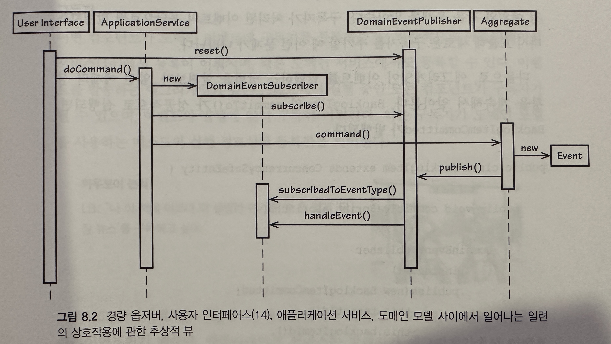

## 도메인 이벤트

- 도메인에서 발생한 사건을 포착하기 위해 도메인 이벤트를 사용하자

#### 로드맵

- 도메인 이벤트가 무엇인지, 그리고 왜 사용하는지 알아보자
- 어떻게 이벤트가 객체로 모델링되는지, 언제 고유하게 식별돼야 하는지 배우자
- 경량의 발행-구독 패턴을 알아보고, 클라이언트에 알림을 보내기 위해 이를 사용하는 방법을 알아보자
- 이벤트를 발행시키는 컴포넌트와 구독하는 컴포넌트를 확인하자
- 이벤트 저장소(Event Store)를 개발해야 하는 이유와 개발하는 방법, 사용되는 위치를 생각해보자

## 언제 그리고 왜 도메인 이벤트를 사용할까


- 위 이미지는 이벤트가 어떻게 발생하는지, 어떻게 저장되고 전달되는지, 어디에 사용되는지 보여준다
    - 이벤트의 소비는 로컬, 외부, 바운디드 컨텍스트를 통해 이뤄진다

## 이벤트 모델링

```java
import java.util.Date;

public class BacklogItemCommitted implements DomainEvent {
    private Date occurredOn;
}

public interface DomainEvent {
    public Date OccrredOn();
}
```

- 애그리게잇으로부터 이벤트를 발행할 땐 이벤트의 이름에 발생의 과거 시점을 반영하는 것이 중요하다
    - 위 코드는 이를 반영하고 있다
    - 모든 이벤트에서 구현되는 최소한의 인터페이스인 DomainEvent는 occurrenOn()접근자의 지원을 보장한다
    - 이는 모든 이벤트의 기본 계약을 강화한다

```java
import java.util.Date;

public class BaclogItemCommitted implements DomainEvent {
    public Date occurredOn;
    private BacklogItemId backlogItemId;
    private SprintId committedToSpringId;
    private TenantId tenantId;
}
```

- 이제 팀은 일어난 일의 의미를 나타내기 위해 필요한 다른 속성이 무엇인지 결정한다
    - 보통 발생한 애그리게잇 인스턴스의 식별자를 포함하거나 관련된 애그리게잇 인스턴스를 포함한다

```java
public class BaclogItemCommitted implements DomainEvent {

    public BacklogItemCommitted(
            TenantId tenantId,
            BacklogItemId backlogItemId,
            SprintId aCommittedToSprintId
    ) {
        super();
        this.setOccurrendOn(new Date());
        this.setBacklogItemId(backlogItemId);
        this.setCommittedToSprintId(aCommittedToSprintId);
        this.setTenantId(tenantId);
    }

    @Override
    public Date occurredOn() {
        return this.occurredOn;
    }

    public BacklogItemId backlogItemId() {
        return this.backlogItemId;
    }

    public SprintId committedToSprintId() {
        return this.backlogItemId;
    }

    public TenantId tenantId() {
        return this.backlogItemId;
    }
}
```

- 이벤트가 제공하는 행동적 오퍼레이션은 어떻게 모델링 될까? (위코드)
    - 일반적으로 아주 간단하다. 이벤트가 보통 불변으로 설계되기 떄문이다
    - 무엇보다도 이벤트의 인터페이스는 해당 원인을 반영한 속성을 운반하려는 목적을 갖고 있다는 점이 중요하다
    - 대부분의 이벤트는 전체 상태의 초기화를 허용하는 단 하나의 생성자만을 갖고 있으며, 읽고 접근만을 포함하게 된다

```
MessageConsumer.instance(messageSource, false).receiveOnly(
        new String[] {"BacklogItemCommitted"} new MessageListener(Type.TEXT
    ){
        @Override
            public void handelMessage(
                String type, messageId, timeStamp, testMessage, deliveryTag, isRedelivery
              ) throws Exception{
                  // messageId를 가진 중ㅂ고되지 않은 첫 번째 메시지
                  // JSON에서 tenantid, sprintid, backlogitemid를 가져온다
                  Sprint sprint = sprintReposiroy.sprintOfId(tenantId, sprintId);
                  BacklogItem backlogItem = backlogItemRepository.backlogItemOfId(tenantid, backlogItemId);
                  sprint.commit(backlogItem);
              }
    }
```

- 구독자가 이 이벤트를 어떻게 수신하는지는 8장 후반부에 나온다
- 위 코드에는 약간의 문제가 있다
    - Sprint의 업데이트 트랜잭션을 어떻게 관리해야 할까?
    - 메시지 핸들러를 사용할 수도 있지만, 어쨌든 핸들러의 코드는 리팩토링이 필요하다
    - 애플리케이션 서비스로 위임해 핵사고날 아키텍처와 조화를 이루도록 하는 접근이 최선일 것이다
    - 이렇게 함으로써 애플리케이션 서비스가 트랜잭션을 관리하게 되고, 이는 실제로 애플리케이션에서 다뤄야할 문제다
    - 아래 코드 처럼 구현된다

```
MessageCosumer.instance(messageSource, false).receiveOnly(
        new String[] {"BacklogItemCommitted"} new MessageListener(Type.TEXT
    ){
        @Override
            public void handelMessage(
                String type, messageId, timeStamp, testMessage, deliveryTag, isRedelivery
              ) throws Exception{
                  // messageId를 가진 중ㅂ고되지 않은 첫 번째 메시지
                  // JSON에서 tenantid, sprintid, backlogitemid를 가져온다
                  Sprint sprint = ...
                  BacklogItem backlogItem = ...
                  
                  ApplicationServiceRegistry.sprintService().commitBaclogItem(tenantid, sprintId, backlogItemId);
              }
    }
```

### 애그리게잇의 특성과 함께하기

- 클라이언트가 직접 요청한 내용을 바탕으로 이벤트가 생성되도록 설계하기도 한다
    - 이는 모델 내 애그리게잇 인스턴스상에 위치한 행동을 실행한 직접적인 결과가 아닌, 다른 일부 사건에 따른 응답으로써 이뤄진다
    - 이런 일이 일어나면 이벤트를 애그리게잇으로서 모델링할 수 있으며, 고유의 리파지토리로부터 취득할 수 있다
    - 이는 과거에 일어난 일부 사건을 나타내기 때문에, 해당 리파지토리는 삭제를 허용하지 않는다
- 이벤트를 이런방식으로 모델링하면, 이벤트는 애그리게잇처럼 모델 구조의 일부가 된다
    - 즉 이벤트가 과거에 일어난 일부 사건의 기록일 뿐만 아니라, 더 넓은 의미를 갖게된다
- 이벤트는 여전히 불변이지만, 고유 식별자를 할 당 할 수 있다
- `이와 같은 방식으로 이벤트를 모델링하면 해당 리파지토리에 추가될 뿐만 아니라 메시징 인프라를 통해 발행할 수도 있다`
    - 클라이언트는 이벤트의 생성을 위해 도메인 서비스를 호출할 수 있으며, 이렇게 만들어진 이벤트를 리파지토리에 추가하고, 메시징 인프라를 통해 발행한다

### 식별자

- 고유 식별자를 할당하는 이유
    - 이벤트를 서로 구분해야 할 떄가 있지만, 그런 상황은 굉장히 드물다
- 이벤트가 발생한 로컬 바운디드 컨텍스트의 밖에서 이벤트가 발행되면 메시징 인프라 스트럭처가 이를 전달하기 위해 고유 식별자가 필요해진다
    - 일부 경우에선 개별 메시지가 한 번 이상 전달될 수 있는데, 이런 상황은 메시징 인프라가 메시지의 발송을 확인하기에 앞세 메시지 발송자의 작동이 중단됐을 때 일어날 수 있따
    - 어떤 이유로 메시지의 재발송이 일어났든, 그 해결책은 원격 구독자로 하여금 중복 메시지 전달을 감지하고 이미 수신된 메시지를 무시하도록 하는 것이다

## 도메인 모델에서 이벤트를 발행하기

- 도메인 모델이 어떤 종류의 미들웨어 메시징 인프라로든 노출되지 않도록 해야한다
    - 이런 컴포넌트는 오직 인프라 내에만 위치한다
    - 도메인 모델이 이런 인프라를 간접적으로 사용할 때 절대 명시적 결합을(coupling)을 형성하지 않는다
- 도메인 이벤트를 도메인 모델 외부의 컴포넌트와 결합하지 않고 발행하는 가장 간단하고 효과적인 방법은 경량 옵저버를 생성하는 것이다

### 발행자

- 도메인 이벤트를 사용하는 가장 흔한 상황은 애그리게잇이 이벤트를 생성해서 발행할 때이다
- 발행자는 모듈내에 위치하지만, 여기엔 도메인의 어떤 면도 모델링되지 않는다. 이는 이벤트의 구독자에게 알림을 보내야 하는 애그리게잇에게 단순한 서비스를 제공한다

```java
import java.util.ArrayList;
import java.util.List;

public class DomainEventPublisher {
    @SuppressWarnings("unchecked")
    private static final ThreadLocal<List> subscribers = new ThreadLocal<List>();

    private static final ThreadLocal<Boolean> publishing = new ThreadLocal<Boolean>() {
        protected Boolean initialValue() {
            return Boolean.FALSE;
        }
    };

    public static DomainEventPublisher instance() {
        return new DomainEventPublisher();
    }

    public DomainEventPublisher() {
        super();
    }

    @SuppressWarnings("unchecked")
    public <T> void pulish(final T aDomainEvent) {
        if (publishing.get()) {
            return;
            ;
        }
        try {
            publishing.set(Boolean.TRUE);
            List<DomainEventSubscriber<T>> registeredSubscribers = subscribers.get();
            if (registerSubscribers != null) {
                Class<?> eventType = aDomainEvent.getClass();
                for (DomainEventSubscriber<T> subscriber : registeredSubscribers) {
                    Class<?> subscribeTo = subscriber.subscribedToEventType();
                }
                if (subscribedTo == eventType || subscribedTo == DomainEvent.class) {
                    subscriber.handelEvent(aDomainEvent);
                }
            }
        } finally {
            publishing.set(Boolean.FALSE);
        }
    }

    public DomainEventPublisher reset() {
        if (!publishing.get()) {
            subscribers.set(null);
        }
        return this;
    }

    @SuppressWarnings("unchecked")
    public <T> void subscribe(DomainEventSubscriber<T> aSubscriber) {
        if (publishing.get()) {
            return;
        }
        List<DomainEventSubscriber<T>> registeredSubscribers = subscribers.get();
        if (registeredSubscribers == null) {
            registeredSubscribers = new ArrayList<DomainEventSubscriber<T>>();
        }
        registeredSubscribers.add(aSubscriber);
    }

}
```



- 시스템 사용자의 모든 요청이 별도의 전용 스레드에서 처리되기 때문에, 스레드를 기준으로 구독자를 구분했다
    - 두 ThreadLocal 변수인 subscribers와 publishing은 스레드별로 할당된다
- 해당 스레등에는 단 하나의 구독자만이 등록된다. 메소드 subscribe()의 구현을 보면, 발행자가 발행 작업 중이지 않을 때만 구독자를 등록할 수 있음을 알 수 있다
    - 이는 List의 도잇 수정 예외와 같은 문제를 막아준다
    - 구독자가 처리된 이벤트의 응답으로써 발행자를 다시 호출해 새로운 구독자를 추가할 때 이런 문제가 발생한다

```java
public class BacklogItem extends ConcurrencySafeEntity {
    public void commitTo(Spring aSprint) {
        DomainEventPublisher
                .instance()
                .publish(new BacklogItemcCommitted(
                        this.tenantId(),
                        this.backlogItemId(),
                        this.sprintId()
                ));
    }
}
```

- 위 코드는 애그리게잇이 이벤트를 발행하는 방법이 담긴 코드이다
    - BacklogItem의 commitTo()가 성공적으로 실행되면 BacklogItemCommiteed가 발행된다

### 구독자

- 어떤 컴포넌트가 도메인 이벤트에 구독자를 등록 해야할까?
    - 일반적으로 애플리케이션 서비스에서 등록이 이뤄지며, 때론 도메인 서비스에서도 등록할 수 있다
    - 이벤트를 발송하는 애그리게잇과 같은 스레드에서 실행 중인 모든 컴포넌트가 구독자가 될 수 있으며, 이벤트의 발행에 앞서 구독이 이뤄진다
    - 이는 구독자가 도메인 모델을 사용하는 메소드의 실행 경로상에 등록됨을 의미한다

```java
public class BacklogItemApplicationService {
    public void commitBacklogItem(
            Tenant aTenant,
            BacklogItemId aBacklogItemId,
            SprintId aSprintId
    ) {
        DomainEventSubscriber subscriber = new DomainEventSubscriber<BacklogItemCommitted>() {
            @Override
            public void handleEvent(BacklogItemCommitted aDmoainEvent) {
                // 이벤트를 처리한다 
            }

            @Override
            public Class<BacklogItemCommitted> subscribedToEventType() {
                return BacklogItemCommitted.class;
            }
        }

        DomainEventPublisher.instance().subscribe(subscriber);
        BacklogItem backlogItem = backlogItemRepository.backlogItemOfId(aTenant, aBacklogItemId);
        Sprint sprint = sprintRepository.sprintOfId(aTenant, aSprintId);
        backlogItem.commitTO(sprint);
    }
}
```

- 핵사고날 아키텍처를 사용할 땐 애플리케이션 서비스가 도메인 모델의 직접적인 클라이언트이기 때문에, 애플리케이션 서비스는 발행자가 애그리게잇에서 이벤트 생성 행동을 실행하기 전에 구독자를 등록할 수 있는 이상적인
  위치이다
- 위 부자연 스러운 에제에서, BacklogItemApplicationService는 서비스 메소드 commitBacklogItem()을 포함하고 있는 애플리케이션 서비스이다
    - 이 메소드는 익명의 DomainEventSubscriber인스턴스를 인스턴스화한다
    - 이어서 애플리케이션 서비스의 태스크 코디네이터는 DomainEventPublisher를 통해 구독자를 등록한다
    - 마지막으로, 서비스 메소드는 리파지토리를 사용해 BacklogItem과 Sprint의 인스턴스를 가져오고, 백로그 항목의 commitTo()행동을 실행한다
    - commitTo()메소드는 BacklogItemCommitted타입의 이벤트를 발행한다
- 구독자가 이벤트로 무엇을 하는지는 예제에 나타나지 않았다
    - 구독자는 이메일을 발송할지도 모른다
    - 이벤트를 이벤트 저장소에 저장하거나, 유스 메시징 인프라를 통해 이벤트를 전달할지도 모른다
    - 저장이나 전달의 경우라면 유스케이스에 특정되는 애플리케이션 서비스를 만들어 이런 방식으로 이벤트를 처리하는 대신, 단일 구독 컴포넌트가 처리토록 할 것이다
    - 이벤트 저장소로 저장하는 단일 책임 컴포넌트의 예제는 '이벤트 저장소'에서 살펴본다
- 구독자는 또 다른 애그리게잇 인스턴스를 가져와서 변경을 유발하는 커맨드 행동을 수행해선 안 된다
    - 애그리게잇에서 논의했든, 가장 중요한 규칙인 단일 트랜잭션당 단일 애그리게잇 인스턴스 수정의 원칙을 침해하기 때문이다
- 메시징 인프라를 통해 이벤트를 전달하면 비동기적으로 대역 외 구독자에게 보낼 수 있다
    - 이벤트는 도메인을 아우리는 개념이지 하나의 바운디드 컨텍스트만의 개념이 아니다
    - 이벤트 발행의 계약은 적어도 엔터프라이즈 범위나 그보다 더 넓은 범위에 속해야 한다

## 뉴스를 원격 배운디드 컨텍스트로 전파하기

- 원격 바운디드 컨텍스트가 바운디드 컨텍스트에서 일어난 이벤트에 관해 알도록 하는 방법에는 여러가지가 있다
- 수많은 메시징 컴포넌트가 존재하며 일반적으로 이는 미들웨어로 분류된다
    - 액티브MQ, 래빗MQ, 아카(Akka), N서비스버스(NServiceBus), 매스트랜짓(MassTransit)등 많은 옵셥이 있다
    - 이는 모두 발행-구독의 범주 안에 속하며, 다양한 측면에서 각자의 장단점을 자고 있다
- 바운디드 컨텍스트 사이에서 사용하는 모든 메시징 메커니즘을 사용하기 위해선 결과적 일관성을 달성하려는 의지가 필요하며 포기할 수 없는 부분이다

### 메시징 인프라의 일관성

- 메시징 솔루션에서 적어도 두 가지 메커니즘은 반드시 항상 서로 일관성을 유지해야 한다
    - 1> 모델이 사용하는 영속성 정장소
    - 2> 모델이 발행한 이벤트를 전달하기 위해 사용하는 메시징 인프라의 영속성 저장소
    - 이는 모델 변경의 저장이 이벤트의 전달을 보장하고, 메시징을 통한 이벤트의 전달이 해당 이벤트를 발행한 모델에 실제 상황이 반영됐음을 보장하기 위해 필요하다
- 위 사항을 어떻게 달성할 수 있을까? 여기엔 세 가지 기본적인 방법이 있다
    - 1> 도메인 모델과 메시징 인프라가 같은 영속성 저장소를 공유한다
        - 이는 모델의 변경과 새로운 메시지의 삽입이 같은 로컬 트랜잭션하에 커밋되도록 해준다
        - 성능이 좋다는 장점이 있다.
        - 하지만 메시징 시스템의 저장 공간이 반드시 모델과 같은 데이터베이스에 위치해야 한다는 단점이 있다
    - 2> 도메인 모델의 영속성 저장소와 메시징 영속성 저장소가 글로벌 XA 트랜잭션(2단계 커밋)하에 제어 된다
        - 이는 모델과 메시징 저장소를 서로 분리할 수 있다는 장점이 있따
        - 그러나 글로벌 트랜잭션을 위한 특별한 지원이 필요하다는 단점 있다
        - 글로벌 트랜잭션은 고비용이고 성능이 나쁜 경향이 있따
        - 또한 모델의 저장소나 메시징 메커니즘의 저장소 중 하나 혹은 둘다 XA오아 호환되지 않을 수 있따
    - 3> 도메인 모델을 저장하기 위해 사용하는 영속성 저장소에 이벤트를 위한 특별한 저장 영역(ex. 데이터베이스 테이블)을 생성한다
        - 이런 저장소를 이벤트 저장소라고 하며 후반부에 알아 본다
        - 옵션1과 비슷하지만 메시징 메커니즘이 아닌 바운디드 컨텍스트가 소유하고 제어한다
        - 생성한 대역 외 컴포넌트는 저장됐으나 발행되지 않은 모든 이벤트를 메시징 메커니즘을 통해 발행하기 위해 이벤트 저장소를 사용한다. 이는 모델과 이벤트가 단일 로컬 트랜잭션 안에서 일관성을 유지한다고
          보장해주는 장점이 있다
        - 또한 REST 기반의 알림 피드의 생성 기능을 비롯해 이벤트 저장소의 특성을 반영한 추가적인 장점도 가지고 있다
        - 이 접근법은 메시징 저장소가 완전히 프라이빗한 메시징 인프라를 사용할 수 있도록 해준다
        - 이벤트 저장 후에 미들웨어 메시징 메커니즘을 사용할 수 있는 상황에선, 메시징 메커니즘을 통해 발송하기 위해 반드시 이벤트 전달자를 직접 개발해야 하고, 클라이언트는 반드시 돌아오는 메시지의 중복을
          제거하도록 설계도애ㅑ 핟나느 다점이 있다
        - 이 책의 예제에서 사용한다

### 자치 서비스와 시스템

- 도메인 이벤트를 사용하면 어떤 수의 엔터프라이즈 시스템이든 자치 서비스와 시스템으로 설계할 수 있다
    - 자치 서비스 &rarr; 대단위 서비스(엔터프라이즈 내의 다른 '서비스'로부터 상당한 독립성을 갖고 동작하는 시스템이나 애플리케이션)
    - 자치 서비스에는 다수의 서비스 인터페이스 엔드포인트가 있을 수 있는데, 이는 원격 클라이언트에게 다양한 기술적 서비스를 제공할 수 있다는 의미다
    - 대역 내 원격 프로시저 호출(RPC, remote procedure call)을 지양함으로써 다른 시스템으로부터의 높은 독립성을 달성할 수 있며, 여기서 사용자 요청은 원격 시스템으로의 API 요청이
      성공적으로 완료돼야만 충족된다
- 원격 시스템을 전혀 사용할 수 없는 상황이나 부하가 높은 상황에 높일 때가 있기 때문에 RPC는 의존성을 갖고 있는 시스템의 성공에 영향을 미친다
    - 이는 주어진 시스템이 의존하는 RPC API를 가진 시스템의 수가 증가할 때 위험이 배가 된다
    - 그러므로 서로 묶이는 RPC를 피하는 편이 의존성, 관계된 인스턴스의 완전할 실패, 사용할 수 없거나 너무 낮은 처리량을 가진 원격 시스템으로 인한 허용ㅇ할 수 없는 수준의 성능 등과 같은 문제를 줄여준다
- `다른 시스템을 호출하는 대신에 비동기적 메시징을 사용해 시스템 사이에서 높은 수준의 독립성을 달성해야 한다`
    - 엔터프라이즈를 둘러싼 바운디드 컨텍스트로부터 도메인 이벤를 전달해주는 메시지를 수신하면, 바운디드 컨텍스트 안의 모델에서 해당 이벤트의 의미를 반영하고 있는 행동을 실행하자
- 이벤트를 구족하고 있는 바운디드 컨텍스트가 올바르게 반응할 수 있도로 제한적인 수의 커맨드 매개변수나 애그리게잇 상태를 담을 수 있다
    - 이벤트가 구독자에게 충분한 정보를 제공하지 못한다면 새로운 버전을 설계하거나 완저닣 다른 이벤트를 설계해야 한다

### 지연 시간 허용

- 메시지를 수신할 때 오래 소요될 수도 있는 지연시간이 문제를 유발할 수 있다
    - 상태의 일관성을 달성하기 위해 얼마나 긴 시간을 허용할지, 감당할 수 없는 한계는 어디인지를 질문해봐야 한다

## 이벤트 저장소

- 한 바운디드 컨텍스트의 모든 도메인 이벤트를 하나의 저장소에서 유지 관리하면 몇 가지 장점을 취할 수 있다
    - 실행되는 모든 모델 커맨드 행동마다 이벤트를 저장 해야한다고 생각하보자. 아래와 같은 방식을 취할 수 있다
- 1> 이벤트 저장소를 큐로 사용해, 메시징 인프라를 통해 모든 도메인 이벤트를 발행한다
    - 이로써 바운디드 컨텍스트 사이의 통합이 가능해지고, 원격 구독자는 자신의 컨텍스트가 필요로 하는 측면에 맞춰 이벤트에 반응한다
- 2> 풀링 중인 클라이언트에게 REST 기반 이벤트 알림을 전달하기 위해 같은 이벤트 저장소를 사용할 수 있다
    - 논리적으로 1번과 같은데, 실제 사용헤서 차이가 난다
- 3> 모델에서 실행했ㄷ던 모든 커맨드의 결과 내역을 살펴보자
    - 모델뿐만 아니라 클라이언트의 버그를 추정할 때도 도움이 된다
    - 이벤트 저장소는 단순한 감시 로그가 아니라는 점을 아는 것이 중요하다
    - 감시 로그도 디버깅에 도움이 될 수는 있지만, 감지 로그가 애그리게잇 커맨드에 따른 결과를 전부 담아내는 경우는 드물다
- 4> 트렌드 파악과 예측을 비롯한 다양한 비즈니스 분석에 데이터를 활용하자
- 5> 리파지토리에서 애그리게잇 인스턴스를 가져올 땐 이벤트를 사용해서 그 상태를 재구성하자
    - 이벤트 소싱을 위해 필요한 요소인제, 지금까지 저장된 모든 이벤트를 시간 순서에 따라 하나의 애그리게잇에 적용하면 된다
    - 저장된 이벤트의 스냅샷을 원하는 만큼 만들 수 있으며, 이를 통해 인스턴스 재구성을 최적화할 수 있다
- 6> 앞의 항목에 해당하는 애플리케이션에서는 애그리게잇에서 일어난 변경의 묶음을 원상태로 되돌리자
    - 이는 해당 애그리게잇 인스턴스를 재구성할 때 특정 이벤트는 사용하지 않도록 막음으로써 가능해진다
    - 이벤트 스트림의 버그를 주어하기 위해선 이벤트를 수정하거나 추가적인 이벤트를 집어 넣을 수 있다


- 1번과 2번의 장점을 구체화하기 위해선 몇 가지 단계를 거쳐야 한다 (위 이미지)
- 어떤 이유로 이벤트 저장소를 사용하든, 가장 먼저 해야할 일 중 하나는 모델에서 발행되는 모든 이벤트를 수신할 수 있도록 구독자를 생성하는 일이다

```java

@Aspect
public class IdentityAccessEventProcess {
    @Before("excution(* com.ssasovation.identityaccess.application.*.*(..))")
    public void listen() {
        DomainEventPublisher
                .instance()
                .subscribe(new DomainEventSubscriber<DomainEvent>() {
                    public void handleEvent(DomainEvent aDomainEvent) {
                        store(aDomainEvent);
                    }

                    public Class<DomainEvent> subscribedToEventType() {
                        return DomainEvent.class // 모든 도메인 이벤트
                    }
                });
    }

    private void store(DomainEvent aDmainEvent) {
        EventStore.instance().append(aDmainEvent);
    }
}
```

- 위 코드는 간단한 이벤트 처리기로, 같은 임주를 갖고 있는 다른 모든 바운디드 컨텍스트에서도 이와 유사한 방식을 사용할 수 있다
- 애플리케이션 서비스 메소드가 실행되면, 이 처리기는 애플리케이션의 모델과의 상호작용에서 발행되는 모든 도메인 이벤트를 리스닝하도록 맞춰진다
- 처리기는 스레드에 바인딩된 DomainEventPublisher의 인스턴스에 구독자를 등록한다
    - subscribedToEventType()이 반환하는 DomainEvent.class에서 나타나듯, 구독자의 필터는 폭넓게 열러 있다
    - 이 클래스를 반환함으로써 구독자가 모든 이벤트를 수신하길 원한다는 점을 알릴 수 있다
    - 해당 handleEvent()가 호출되면 이는 store()를 호출하며, 이어서 클래스 EventStore가 호출돼 실제 이벤트 저장소의 마지막에 이벤트를 덧붙인다

```java
public class EventStore {
    public void append(DomainEvent aDomainEvent) {
        String eventSerialization = EventStore.objectSerializer().serialize(aDomainEvent);

        SotredEvent storeEvent = new StoreEvent(
                aDomainEvent.getClass().getName(),
                aDomainEvent.occurredOn(),
                eventSerialization
        );
        this.session().save(storeEvent);
        this.setStoreEvent(storeEvent);
    }
}
```

- 메소드 store()는 DomainEvent 인스턴스를 직렬화해서 새로운 StoredEvent인스턴스에 집어넣고, 이렇게 생성한 객체를 이벤트 저장소에 기록한다

```java
public class StoredEvent {
    private String eventBody;
    private long eventId;
    private Date occurredOn;
    private String typeName;

    public StoredEvent(String aTypeName, Date anOccurrendOn, String anEventBody) {
        this();
        this.setEventBody(anEventBody);
        this.setOccurredOn(anOccurrendOn);
        this.setTypeName(aTypeName);
    }
}
```

- 위 코드는 직렬화된 DomainEvent를 담고 있는 StoredEvent클래스의 일부다
    - 각 StoredEvent 인스턴스는 데이터베이스가 자동으로 생성해주는 고유 시퀀스 값을 얻어서 eventId로 설정한다
    - eventBody에는 DomainEvent의 직렬화가 담긴다
    - 모든 StoredEvent 객체는 테이블로 저장된다. 이벤트 직렬화를 위해 넓은 공간을 예약하게 되며, 어떤 단일 인스턴스도 65,000보다 큰 저장 공간을 필요로 하진 않을 것이다

## 저장된 이벤트의 전달을 위한 아키텍처 스타일

- 이벤트 저장소가 채워지면서 관련 당사자에게 이벤트의 알림을 전달할 준비가 된다
    - 이벤트를 사용할 수 있도록 해주는 두 가지 스타일을 살펴본다
    - 1> 클라이언트가 쿼리한 레스트풀 리소스 사용
    - 미들웨어 메시징 제품이 토픽/익스체인지를 통해 메시지 발송

### 레스트풀 리소스로서 알림 발행하기

- 이벤트 알림의 REST 스타일은 발행-구독의 기본 전제를 따르는 환경에서 사요오딜 떄 가장 잘 작동한다
    - 즉, 많은 소비자는 단일 생산자가 발행한 이벤트를 사용한다
    - 반면에 REST 기반 스타일을 큐로 사용하려고 할 땐 문제가 발생하기 쉽다
- 장단점
    - 장점
        - 잠재적으로 많은 수의 클라이언트가 잘 알려진 하나의 URI로 알림의집합을 요청할 땐 레스트풀 접근법이 잘 작동한다
        - 기보적으로 알림은 임의의 수의 폴링 소비자에게로 펼쳐진다
        - 푸시 모델이 아닌 풀 모델을 사용하지만, 근본적으로 발행-구독 패턴을 따르게 된다
    - 단점
        - 하나 이상의 소비지가 특정 순서에 맞춰 수행되는 여러 태스크의 집합을 가져오기 위해 여러 생산자로부터 리소스를 풀링해야 하는 상황에서 레스트풀 접근법은 좋지 않다
        - 잠재적으로 여러 생산자가 하나 이상의 소비자에게 알림을 전달해야 하는 상황에서 사용되는 큐를 나타내며, 수신의 순서가 중요하다
        - 큐를 구현하기에는 풀링 모델은 좋지 않은 선택이다
- 이벤트 알림을 발행하는 레스트풀 접근법은 일반적인 메시징 인프라를 사용한 발행과는 정 반대의 위치에 있다
    - 관심을 갖고 있는 쪽으로 푸시할 필요가 없기 때뭉네 '발행자'는 등록된 '구독자'의 집합을 유지하지 않는다
    - 대신, 이접근법에선 REST클라이언트가 잘 알려진 URI를 통해 알림을 풀링해야 한다
- 클라이언트는 HTTP get 메소드를 사용해 현재 로그라 알려진 대상을 요청한다
    - 현재 로그는 발행된 가장 최신의 알림을 포함하고 있따
- 클라이언트가 로컬에서 이벤트 알림을 소비하는 방법
    - 일련의 이벤트를 타입에 따라 해석해서, 적절한 데이터는 모두 로컬 바운디드 컨텍스트에 맞게 변환한다
    - 여기엔 해당 모델에서 관련 애그리게잇 인스턴스를 찾아서, 적용 가능한 이벤트의 해석에 기반해 커맨드를 실행하는 과정이 포함될 수 있다
    - 물론 이벤트는 반드시 발생한 순서대로 적용돼야 한다


- 위 이미지에서, 로그 상태를 기준으로 볼 때 1부터 58까지는 이미 로컬에 적용된 상황이다. 이는 59부터 65번째의 알림이 아직 적용되지 않았음을 의미한다
    - 클라이언트는 자신의 데이터베이스로부터 가장 최근에 적용된 알림의 식별자에 관한 추적기록(예제에서는 58)을 읽어 온다
    - 이어서 적용할 알림을 추적할 책임은 서버가 아닌 클라이언트에게 있다
- 로그 뭉치가 N개씩유지 되는 이유는 리소스가 그 전체 수명주기에 걸쳐 항상 안적으로 유지돼야 하기 때문이다. 이를 통해 일관성있는 액세스가 가능해지고, 캐싱이 올바르게 작동하게 된다
- 클라이언트의 알림 리소스 폴링이 웹 서버에 원치 않았던 엄청난 양의 트래픽을 발생시키지는 않을까?
    - 레스트풀 리소스가 캐싱을 효과적으로 사용하지 않는다면 그럴 수도 있다
    - 예를 들어 클라이언트 스스로가 약 1분마다 현재 로그를 캐시할 수도 있다
    - 또한 서버에서도 캐시를 제공할 수 있다

### 메시징 미들웨어를 통한 알림 발행

- 래빗MQ와 같은 메시징 미들웨어 제품은 직접 다뤄야할 REST스타일에 관한 세부사항을 관리해준다
- 메시징 시스템은 두 경우 모두 푸시 모델을 사용해 등록된 구독자나 리스너로 이벤트 알림 메시지를 발송한다
- 래빗MQ의 패아웃 인스체인지(fanout exchange)를 활용해 발행-구독을 계속 해보자. 이를 위해서 다음의 내용을 순서대로 수행할 컴포넌트 집합이 필요하다
    - 1> 이벤트 저장소에서 아직 지정된 익스체인지로는 발행되지 않은 모든 도메인 이벤트 객체를 쿼리한다. 쿼리된 객체는 고유 식별자 순서에 따라 오름차순으로 정렬한다
    - 2> 쿼리된 객체를 오름차순으로 순회하면서 각 객체를 익스체인지로 발송한다
    - 3> 메시징 시스템이 메시지가 성공적으로 발행됐음을 알려주면, 해당 익스체인지를 통해 발행된 도메인 이벤트를 추적한다
    - 구독자가 수신을 확인해주길 기다리지 않는다. 각 구독자는 자신만의 기간 범위에 맞춰서 메시지를 처리할 책임을 수행한다
    - 우린 단순히 메시징 메커니즘이 전달을 보장토록 할 뿐이다

## 구현

### RESTfull 클라이언트로 발행

```java
public class NotificationService {
    @Transactional(readOnly = true)
    public NotificationLog currentNotificiationLog() {

    }

    @Transactional(readOnly = true)
    public NotificationLog NotificationLog(String aNotificationLogId) {

    }

    @Transactional
    public void publishNotifications() {

    }

}
```

- 알림 발행 행동의 핵심은 NotificationService 애플리케이션 서비스의 뒤편에 위치해 있다
    - 이는 데이터 소스에서 발생하는 변경에 관한 트랜잭션의 범위를 관리할 수 있도록 해준다
        - 또한 이는 이벤트가 모델로부터 발생한 알림으로써 밸행됐더라도, 도메인의 관심사가 아닌 애플리케이션의 관심자라는 점을 강조한다
    - NotificationService가 분리된 인터페이스를 갖고 있어야 할 필요는 없다
        - 애플리케이션 서비스의 구현이 오직 하나만 존재할 것이며, 간결함을 유지해야 한다
        - 위 코드에서는 해당 메소드 내용을 생략했다

```java
public class NotificationService {
    @Transactional(readOnly = true)
    public NotificationLog currentNotificiationLog() {
        EventStore eventStore = EventStore.instance();
        return this.findNotificationLog(
                this.calculateCurrentNotificationLogId(eventStore),
                eventStore
        );
    }

    @Transactional(readOnly = true)
    public NotificationLog notificationLog(String aNotificationLogId) {
        EventStore eventStore = EventStore.instance();
        return this.findNotificationLog(
                new NotificationLogId(aNotificationLogId),
                eventStore
        );
    }
}
```

- 현재 로그와 보관된 로그라는 두 가지 유형의 알림 로그가 있었던 점을 상기하자
    - 따라서 NotificationServcie 인터페이스는 각 타입에 맞는 쿼리 메소드를 제공한다
- 결국 이 두 메소드 모두는 반드시 NotificationLog를 '찾아야'만 한다
    - 이는 결국 이벤트 저장소로부터 DomainEvent 인스턴스가 직렬화된 부분을 찾아서 각 인스턴스를 Notification으로 캡슐화하고, 그 결과를 NotificationLog로 모은다는 의미다
    - 일단 NotificationLog 인스턴스가 생성되면, 이를 레스트풀 리소스로 나타내 요청하는 클라이언트에게 제공한다
    - 현재 로그는 멈추지 않고 움직이는 대상으로 볼 수 있기 때문에 반드시 요청할 때 마다 그 식별자를 계산 해야 한다

```java
public class NotificationService {
    protected NotificationLogId calculateCurrentNotificationLogId(EventStore anEventStore) {
        long count = anEventStore.countStoredEvents();
        long remainder = count % LOG_NOTIFICATION_COUNT;

        if (remainder == 0) {
            remainder = LOG_NOTIFICATION_COUNT;
        }
        long low = count - remainder + 1;

        // 아직 알림이 완전히 가득 차지 않은 상황에서도 만들어진 식별자의 값을 보장해준다
        long high = low + LOG_NOTIFICATION_COUNT - 1;

        return new NotificationLogId(low, hight);
    }
}
```

- 위 코드는 식별자를 계산하는 코드이다

```java
public class NotificationLogId {
    public NotificationLogId(String aNotificationLogId) {
        super();
        String[] textIds = aNotificationLogId.splict(",");
        this.setLog(Long.parseLong(textIds[0]));
        this.setHigh(Long.parseLong(textIds[1]));
    }
}
```

- 반면에 보관된 로그는 단순히 식별자의 최소값과 최대값의 범위를 캡슐화한 NotificationLogId만 있으면 된다
    - 21~40과 같이 낮은 값과 높은 값 사이의 범위로 텍스트로 표현함으로써 식별자를 나타내는다는 점을 기억하자

```java
import java.util.ArrayList;

public class NotificationService {
    protected NotificationLog findNotificationLog(NotificationLogId aNotificationLogId, EventStore anEventStore) {
        List<StoredEvent> storedEvents = anEventStore.allStoredEventsBetween(aNotificationLogId.low(), aNotification.hight());

        long count = anEventStore.countStoredEvents();

        boolean archivedIndicator = aNotificationLogId.high() < count;

        NotificationLog notificationLog = new NotificationLog(aNotificationLogId.encoded(), NotificationLogId.encode(
                aNotificationLogId.next(LOG_NOTIFICATION_COUNT),
                NotificationLogId.encoded(aNotificationLogId.previouse(LOG_NOTIFICATION_COUNT)),
                this.notificationFrom(storedEvents),
                archivedIndicator
        ));
        return notificationLog;
    }

    protected List<Notification> notificationFrom(List<StoreEvent> aStoredEvent) {
        List<Notification> notifications = new ArrayList<Notification>(sStoredEvents.size());

        for (StoredEvent storedEvent : aStoredEvents) {
            DomainEvent domainEvent = EventStore.toDomainEvent(StoredEvent);
            Notification notification = new Notification(
                    domainEvent.getClass().getSimpleName(),
                    storedEvent.eventId(),
                    domainEvent.occurredOn(),
                    domainEvent
            );
            notifications.add(notification);
        }
        return notifications;
    }
}
```

- 현재 로그를 쿼리하든 보관된 로그를 쿼리하든 상관없이, 이젠 findNotificationLog()메소드가 쿼리할 대상을 나타내는 NotficationLogId를 갖고 있다
- Notification 인스턴스나 전체 로그를 전혀 저장할 필요가 없다는 사실을 꽤 흥미롭다
    - 필요할 때마다 이를 만들어 낼 수 있다. 이런 이유로 요청 시점에서 NotificationLog를 캐싱하면 성능과 확장성에 도움을 받을 수 있다

```java
public class EventStore {
    public List<StoredEvent> allStoredEventBetween(long aLowStoredEventId, long aHightStoredEventId) {
        Query query = this.session().createQuery(
                "from StoredEvent as _obj_" + "where _obj_.eventId between ? and ?" + "order by _obj_.eventId"
        );
        query.setParameter(0, aLowStoredEventId);
        query.setParameter(1, aHightStoredEventId);

        List<StoredEvent> storedEvents = query.list();
        return storedEvents;
    }
}
```

- findNotificationLog()메소드는 EventStore 컴포넌트를 사용해 주어진 로그에서 필요한 StoreEvnt인스턴스를 쿼리한다
- 위 코드는 EventStore가 이를 찾는 방법이다

```java
import java.lang.annotation.Target;

@Patch("/notifications")
public class NotificationResource {
    @GET
    @Produces({OvationMediaType.NAME})
    public Response getCurrentNotificationLog(@Context UriInfo aUriInfo) {
        NotificationLog currentNotificationLog = this.notificationService().currentNotificationLog();

        if (currentNotificationLog == null) {
            throw new WebApplicationException(Response.Status.NOT_FOUND);
        }
        Response response = this.currentNotificationLogResponse(currentNotificationLog, aUriInfo);
        return response;
    }

    @GET
    @Path("{notificationid}")
    @Produces({OvationsMediaType.ID_OVATION_NAME})
    public Response getNotificationLog(@PathParam("notificationId") String aNotificationId, @Context UriInfo aUriInfo) {
        NotificationLog notificationLog = this.notificationServce().notificationLog(aNotificationId);

        if (notificationLog == null) {
            throw new WebApplicationException(Response.Status.NOT_FOUND);
        }
        Response response = this.currentNotificationLogResponse(currentNotificationLog, aUriInfo);
        return response;
    }
}
```

- 위 코드는, 마지막으로 웹 티어에서 현재 로그와 보관된 로그를 발행하는 코드이다

### 메시지에 기반한 알림 발행하기

```java
public class NotificationService {
    @Transactional
    public void publishNotifications() {
        PublishedMessageTracker publishedMessageTracker = this.publishedMessageTracker();
        List<Notification> notifications = this.listUnpublishedNotifications(publishedMessageTracker.mostRecentPublishedMessageId());

        MessageProducer messageProducer = this.messageProducer();

        try {
            for (Notification notification : notifications) {
                this.publish(notification, messageProducer);
            }
            this.trackMostRecentPublishedMessage(publishedMessageTracker, notifications);
        } finally {
            messageProducer.close();
        }
    }
}
```

- 위 코드에서 NotificationService는 메시징 인프라를 통해 DomainEvent 인스턴스를 발행하는 한가지 방법을 제공한다
    - publishNotifications()메소드는 우선 PublishedMessageTracer를 가져오며, 이는 앞서 어떤 이벤트가 발행됐는지에 대한 기록을 저장하는 객체다

```java
public class PublishedMessageTracker {
    private long mostRecentPublishedMessageid;
    private long trackerId;
    private String type;
}
```

- 위 코드의 클래스는 도메인 모델의 일부가 아닌 애플리케이션에 속한다는 점이 중요한다
    - trackId는 단지 이 객체의 고유 식발자일 뿐이다
    - type 특성은 이벤트가 발행된 토픽/채널의 타입에 관한 String 설명ㅇ르 갖고 있다
    - DomainEvent를 직렬화해서 StoreEvent로 저장하는데, 그 고유 식별자가 mostRecentPublishedMessageid 특성이다
    - 따라서 이는 가장 최근에 발행한 이늣턴스의 StoredEvent eventId값을 갖게 된다
    - 모든 새로운 Notification메시지의 발송을 완료하면, 서비스 메소드는 현 시점에서 가장 최근에 발행된 이벤트의 식별자로 PublishedMessageTracker가 저장됐는지 확인한다

```java
public class NotificationService {
    private static final String EXCHANGE_NAME = "sassovation.identity_access";

    private PublishedMessageTracker publishedMessageTracker() {
        Query query = this.session().createQuery(
                "from PublishedMessageTracker as _obj_" + "where _obj_.type = ?"
        );
        query.setParameter(0, EXCHANGE_NAME);

        PublishedMessageTacker publishedMessageTacker = (PublishedMessageTacker) query.uniqueResult();

        if (publishedMessageTacker == null) {
            publishedMessageTacker = new PublishedMessageTracker(EXCHANGE_NAME);
        }
        return publishedMessageTacker;
    }
}
```

- type 특성과 이벤트 식별자는 하나의 동일한 알림을 여러 시점에 걸쳐서 얼마든지 많은 수의 토픽/채널로 발행할 수 있도록 해준다
    - 단순히 해당 통픽/채널의 이름으로 PublishedMessageTracker의 새로운 인스턴스를 생성해서, 첫번째 StoredEvent 부터 다시 진행한다

```java
public class NotificationService {
    private static final String EXCHANGE_NAME = "sassovation.identity_access";

    protected List<Notification> listUnpublishedNotifications(long aMostRecentPublishedMessageId) {
        EventStore eventStore = EventStore.instance();

        List<StoredEvent> sotredEvents = eventStore.allStoredEventSince(aMostRecentPublishedMessageId);

        List<Notification> notifications = this.notificationsFrom(sotredEvents);

        return notifications;
    }
}
```

- 다채널(multi-channel)발행은 아직 지원되지 않지만, 약간의 리랙토링을 거쳐 손쉽게 추가할 수 있다

```java
public class NotificationService {
    protected void publish(Notification aNotification, MessageProducer aMessageProducer) {
        MessageParameter messageParameter = MessageParameters.durableTextParameters(
                aNotification.type(),
                Long.toString(aNotification.notificationId()),
                aNotification.occurredOn()
        );
        String notification = NotificationService.objectSerializer().serialize(aNotification);

        aMessageProducer.send(notification, messageParameter);
    }
}
```

- 이 publish 메소드는 MessageParameters를 생성한 후 MessageProducer를 사용해 JSON으로 직렬화 DomainEvent를 전송한다
    - MessageParameters에는 선택 속성이 메시지 본문과 함께 담겨 있다
    - 이벤트 type 문자열, 고유 메시지 ID로 사용되는 알림 식별자, 이벤트의 occurredOn 타임스탬프 등이 이런 특별한 매개변수에 해당한다

```java
public class NotificationService {
    private MessageProducer messageProducer() {
        // 내 익스체인지가 아직 없다면 하나 만들어 준다
        Exchange exchange = Exchange.fanOutInstance(ConnectionSettings.instance(), EXCHANGE_NAME, ture);

        // 이벤트를 전달하기 위해 사용할 메시지 생성자를 만든다
        MessageProducer messageProducer = MessageProducer.instance(exchange);

        return messageProducer;
    }
}
```

- 메소드 publishNotifications()는 messageProducer()를 통해 익스체인지가 존재하는지 확인하고, 발행을 위해 사용할 MessageProducer의 인스턴스를 가져온다
- 래빗MA는 익스체인지의 멱등성을 지원하며, 따라서 익스체인지는 첫 요청 시점에서 생성되고 그 후엔 앞서 생성한 익스체인지를 제공한다
- 뒤편의 브로커 채널에 문제가 생기는 상황에 대비해 MessageProducer의 인스턴스를 열어둔 채로 유지하지 않는다
    - 발생이 수행될 때마다 연결을 다시 설정하면 전혀 동작할 수 없는 상태에 빠진 발행자가 생기지 않도록 막아준다
    - 만약 지속적인 재연결이 병목현상을 일으킨다면 성능 문제를 살펴봐야 할 수도 있다
    - 여기에서는 오퍼레이션 사이에 일시 중지를 넣는 방법을 사용한다
- 오퍼레이션 사이의 일시 중지를 넣는 방법에는 여러 가지 방법이 있다
    - 그중 한가지로 JMX을 사용해 반복할 시간의 간격을 관리할 수 있다

```
mbeanServer.addNotificationListener(
    timer.getObjectName(),
    new NotificationListener(){
        public void handleNotification(Notification aTimerNotification, Object aHandback){
            ApplicationServiceRegistry.notificationService().publishedNotifications();
        }
    },
    null,
    null
    )
)
```

- 적절한 간격을 결정해서 타이머에 설정했다면 위 코드의 NotificationListener를 등록해서 지정된 간격의 시간이 흐를 때마다 MBeanServer가 알림을 보낼 수 잇도록 한다
    - 타이머의 작동에 따라 handleNotification()메소드가 호출되면, NotificationService를 통해 PublishNotifications()의 수행을 요청한다
    - 이것이 필요한 것의 전부다
    - TimerMBean이 정해진 간격으로 정기적으로 반복되는 한, 익스체인지를 통해 도메인 이벤트를 계속해서 발행하며 엔터프라이즈 전체의 구독자가 소비하도록 한다
- 애플리케이션-서버가 관리하는 타이머를 사용하면, 발행 과정의 수명주기를 모니터링 하는 컴포넌트를 만들 필요가 없다는 추가적인 이점이 있다
    - 예를 들면 어떤 이유에서든 publishedNotifications()가 수행중에 문제가 발생해 예외와 함께 종료하더라도, TimerMBean은 게속해서 실행돼 지정된 간격이 지난 후 다시 작동한다
    - 관리자는 아마도 래빗MQ의 인프라 오류를 처리해야 하겠지만, 문제만 정리하고 나면 메시지는 계속해서 발행된다

#### 이벤트 중복 제거

- 하지만 여전히 메시지 중복 제거에 관한 질문이 남아 있다. 메시지 중복 제거가 무엇일까? 그리고 메시징 구독자가 이를 지원해야 하는 이유는 무엇일까?
    - 이벤트 중복 제거 : 메시징 시스템을 통해 발행된 단일 메시지가 구독자에게 한 번 이상 전달될 수 있는 환경에선 메시지 중복 제거가 필요하다
    - 다음은 중복 메시지가 발생할 수 있는 방법 중 하나다
    - 1> 래빗 MQ가 하나 혹은 그 이상의 구독자에게 새롭게 발생된 메시지를 전달한다
    - 2> 구독자가 메시지를 처리한다
    - 3> 구독자가 메시지를 수신해 처리했음을 나타내는 확인을 보내기에 앞서, 실패한다
    - 4> 래빗MQ는 확인을 받지 못한 메시지를 다시 전달한다
- 메시지를 한 번 이상 발송하게 되는 상황 시나리오
    - 1> NotificationService는 발행되지 않은 세 개의 Notification 인스턴스를 쿼리하고 발행한다. PublishedMessageTracker를 통해 이에 관한 기록을 갱신한다
    - 2> 래빗MQ 브로커는 세 개의 메시지 모두를 수신하고, 모든 구독자에 이를 보낼 수 있도록 준비한다
    - 3> 그러나 애플리케이션 서버의 예외적인 조건으로 인해 NotificationService의 실패가 발생한다. PublishedMessageTracker의 수정은 커밋되지 않았다
    - 4> 래빗MQ는 새롭게 발송된 메시지를 구독자에게 전달한다
    - 5> 애플리케이션 서버의 예외 조건이 고쳐진다. 발행 프로세스가 다시 시작되고, NotificationService는 모든 발행되지 않은 이벤트의 메시지를 발송한다. 여기엔 앞서 발행됐지만
      PublishedMessageTracker에는 기록되지 않은 모든 이벤트의 메시지가 포함돼 발행된다
    - 6> 래빗MQ는 새롭게 발송된 메시지를 구독작에게 전달하고, 적어도 이 중 세가지는 중복해서 전달된다
- 반복 메시지 전달의 가능성을 처리하는 방법중 하나로 구독자 모델의 오퍼레이션이 멱등하도록 하는 방안이 있다
    - 문제는 도메인 객체나 그 밖의 어떤 객체를 멱등한 오퍼레이션으로 설계하기 어렵거나 비실용적이거나 심지어 불가능할 수도 있다는 점이다
- 도메인 객체의 멱등성이 가능한 옵션이 아니라면, 그 대신 구독자/수신자 자체를 멱등하게 설계할 수도 있다
    - 수신자는 반복된 메시지에 따른 동작의 수행을 거부하도록 설계할 수 있다
    - 보통의 메시징 미들웨어 제품을 사용할 때 최근에 처리된 메시지의 기록만 저장해서는 충분하지 않다
        - 이는 메시지가 순서를 지키지 않고 수신될 수 있기 때문이다
- REST기반의 알림 접근법을 사용할 때 사실 중복 제거가 중요하지 않다
    - 클라이언트 수신자는 가장 최근에 적용된 알림 식별자만 저장하면 되는데, 수신자는 항상 해당 시점 이후에 발행하는 이벤트 알림만을 적용하면 되기 때문이다
    - 각 알림 로그는 언제나 알림 식별자 시간의 반대(내림차순)순서로 작성된다
- 두 경우 모두에서, 처리된 메시지의 식별자 추척 내용이 모든 로컬 도메인 모델의 상태에 일어난 변경과 함께 커밋돼야 한다는 점이 중요하다
    - 그렇지 않으면, 이벤트와 응답에 발생한 변경의 추적 일관성을 유지할 수 없다 