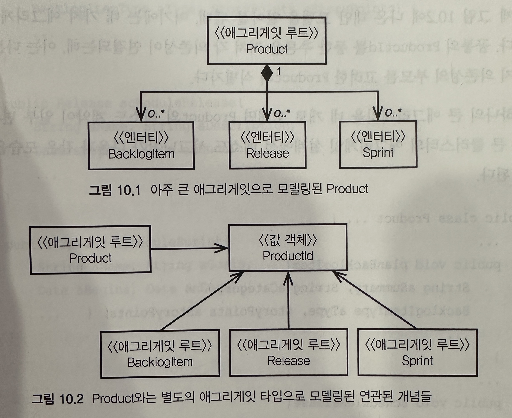
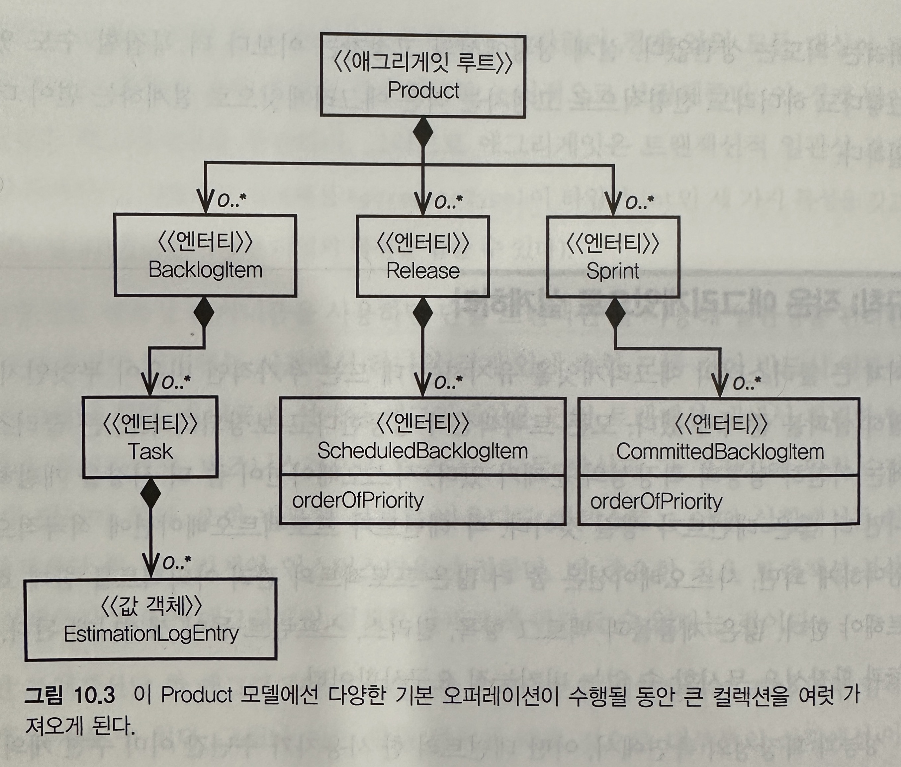
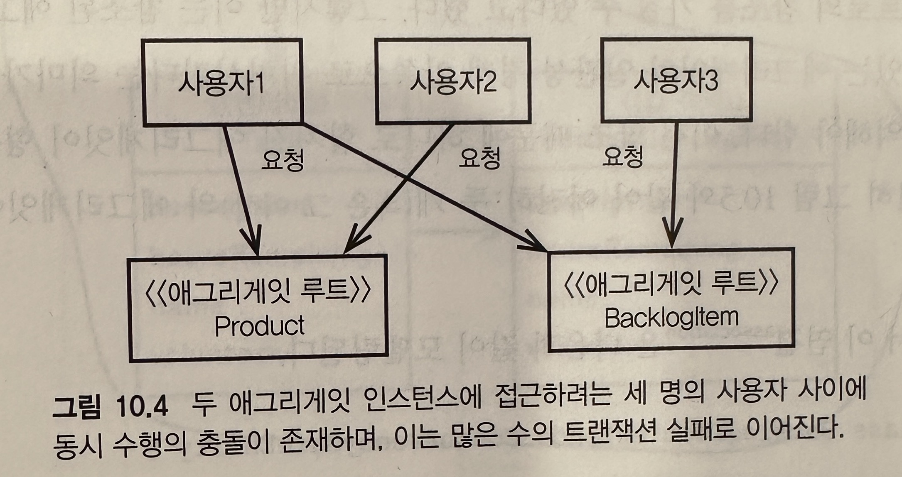
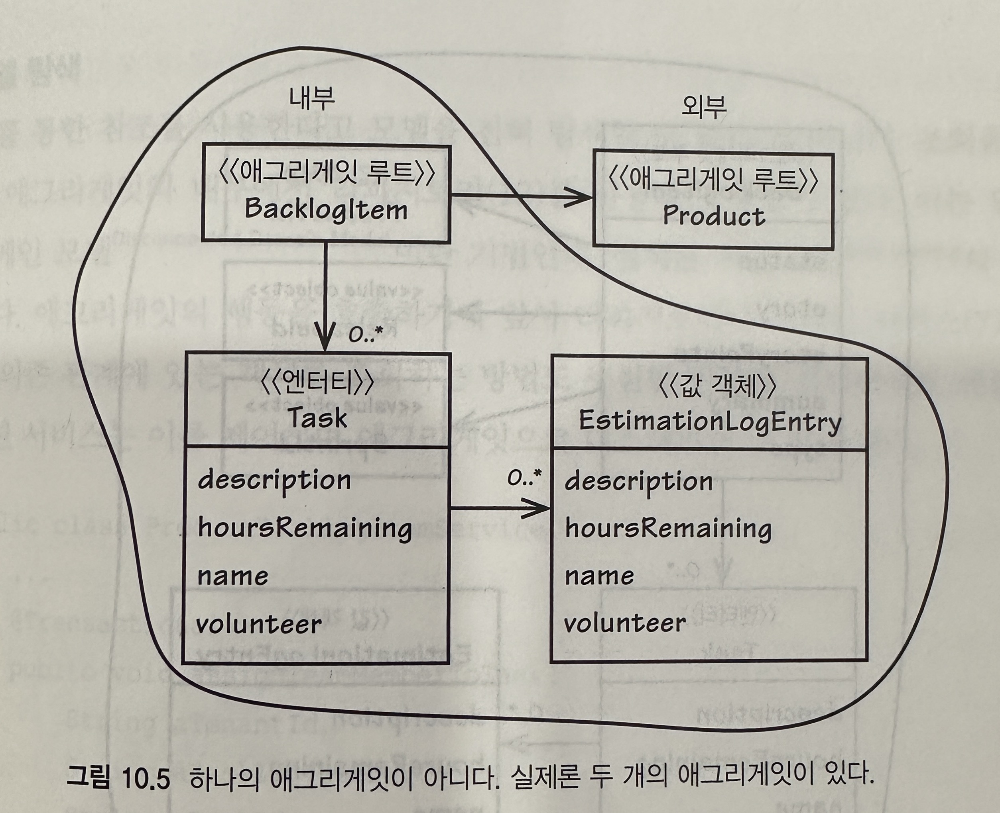
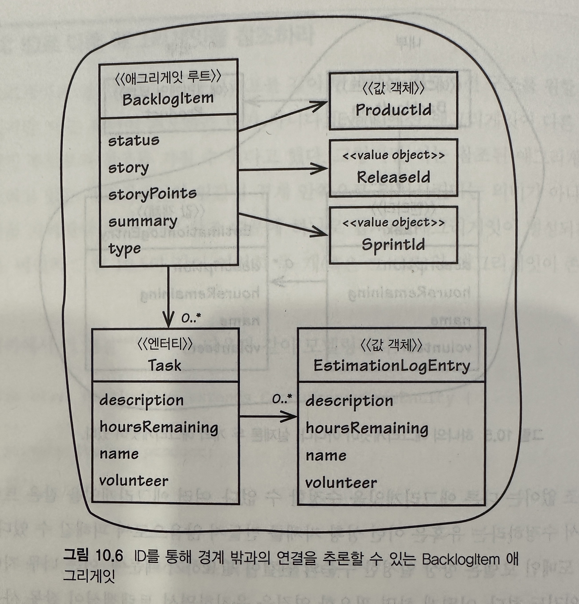

## 애그리게잇

- 신중을 기해서 일관성의 경게를 통해 인티티와 값 객체를 애그리게잇으로 묶는 일이 쉬워 보일 수 있지만, 애그리게잇은 모든 DDD의 전술적인 지침중에서도 무엇보다 정확히 규명되지 않은 패턴중 하나다
- 컴포지션의 편의에 맞춰 설계하다 보면 애그리게잇을 너무 크게 만들어비리는 함정에 빠질 수 있다. 반대로 애그리게잇을 모두 걷어내는 바람에 결과적으로 진정한 고정자를 보호하지 못하는 경우도 있다

#### 로드맵

- 잘못된 애그리게잇의 모델링이 초래하는 부정적인 결과
- 우수 사례 중 하나로 애그리게잇 경험 법칙(Rules of Thumb)에 따라 설계하는 방법
- 일관성의 경계 안에서 실제 비즈니스 규칙에 따라 진정한 고정자(invarient)를 모델링하는 방법
- 애그리게잇이 다른 애그리게잇을 참조할 때 식별자를 사용하도록 설계해야 하는 이유
- 애그리게잇 경계 바깥에서 결과적 일관성을 사용해야 하는 중요성
- '묻지 말고 시켜라'와 '데메테르 법칙' 같은 애그리게잇의 구현 기법

## 스크럼 핵심 도메인에서 애그리게잇 사용하기 (예제)

- 제품은 백로그 아이템과 릴리스, 스프린트를 포함한다
- 새로운 제품 백로그 아이템을 계획했다
- 새로운 제품 릴리스를 계획 했다
- 새로운 제품 스프린트의 일정을 수립했다
- 계획된 백로그 아이템에 관한 릴리스 일정을 수립할 수 있다
- 일정이 잡힌 백로그 아이템은 스프린트로 커밋할 수 있다



### 첫 번째 시도 : 큰 클러스터의 애그리게잇

- 팀은 첫 번째 문장의 "제품이 ~를 포함한다" 라는 부분에 중점을 뒀다

```java
public class Product extends ConcurrencySafeEntitiy {
    private Set<BacklogItem> backlogItems;
    private String description;
    private String name;
    private ProductId productId;
    private set<Release> release;
    private Set<Spring> sprint;
    private TenantId tenantId;
}
```

- 그 결과 위 코드처럼 Product는 아주 큰 애그리게잇으로 모델링 됐다
- 크기가 큰 애그리게잇은 그럴싸해 보였지만, 실제론 실용적이지 않았다
    - 일단 의도한 대로 다수의 사용자 환경에서 애플리케이션을 실행하면, 트랜잭션이 주기적으로 실패하기 시작했다

- 실패 원인
    - 애그리게잇 인스턴스는 낙관적 동시성을 활용해 다른 클라이언트가 영속성 객체를 동시에 중복 수정하지 않도록 보호하며, 데이터베이스 락의 사용을 피했다
    - 이 접근법은 애그리게잇 고정자를 동시에 발생하는 변경으로부터 보호하는 중요한 역할을 한다
    - 이 영속성의 문제는 사용자가 단 둘이었을 때도 나타났으며, 사용자 수가 더해지면 더 큰 문제가 발생한다
    - `새 백로그 항목을 계획하는 일은 새로운 릴리스 일정의 수립과 논리적으로 아무런 상관이 없다!`
    - 커밋이 실패한 이유가 뭘까?
        - 그 중심에는 큰 클러스터의 애그리게잇이 실제 비즈니스 규칙이 아닌 잘못된 고정자를 기준으로 설계했다는 문제가 있다
        - 이 잘못된 공정자는 개발자가 만들어낸 인위적인 제약 조건이다
        - 이런 설게는 트랜잭셔의 문제를 일이킬 뿐 아니라, 성능과 확장성의 측면에서도 안 좋은 영향을 미친다

### 두 번째 시도: 다수의 애그리게잇

- 위 이미지에서 아래 방법이다. 여기에는 네 가지 애그리게잇이 있다
    - 공통의 ProductId를 통한 추론을 거쳐 각 의존성이 연결되는데, 이는 다른 세 가지 의존성의 부모를 고려한 Product의 식별자다
- 하나의 큰 애그리게잇을 네 개로 쪼개면 Product의 메소드 계약이 일부 변경 된다

```java
public class Product {
    public void planBacklogItem(String aSummary, String aCategory, BacklogItemType aType, StoryPoints aStoryPoints) {
    }

    public void scheduleRelease(String aName, String aDescription, Date aBegins, Date anEnds) {
    }

    public void scheduleSprint(String aName, String aGoals, Date aBegins, Date anEnds) {
    }
}
```

- 위 코드는 큰 애그리게잇의 코드이다
    - 여기선 모든 메소드가 CQS 커맨드다
    - 즉 새로운 컴포넌트를 컬렉션에 추가해 product의 상태를 수정하는데, 이에 따라 void 반환 타입을 갖게 된다

```java
public class Product {
    public BacklogItem planBacklogItem(String aSummary, String aCategory, BacklogItemType aType, Storypoint aStoryPoints) {
    }

    public Release scheduleRelease(String aName, String aDescription, Date aBegins, Date anEnds) {
    }

    public Sprint scheduleSprint(String aName, String aGoals, Date aBegins, Date anEnds) {
    }
}
```

- 위 코드는 여러 애그리게잇으로 나눈 코드이다
- CQS 쿼리 계약을 맺고 있으며 팩토리로서 동작한다
    - 즉 각 메소드는 새로운 애그리게잇 인스턴스를 생성해서 그 참조를 반환한다
    - 이제 클라이언트가 백로그 항목의 계획을 세우려 하면, 트랜잭션을 수행하는 애플리케이션 서비스는 다음과 같이 동작해야 한다 (아래 코드)

```java
public class ProductBacklogItemService {
    @Transactional
    public void planProductBacklogItem(
            String aTenantId, String aProductId, String aSummary, String aCategory, String aBacklogItemType, String aStoryPoints
    ) {
        Product product = ProductRepository.productOfId(new TenantId(aTenantId), new ProdcutId(aProductId));
        BacklogItem plannedBacklogItem = product.planBacklogItem(
                aSummary,
                aCategory,
                BacklogItemType.valueOf(aBacklogItemType),
                StoryPoints.valueOf(aStoryPoints)
        );
        backlogItemRepository.add(plannedBacklogItem);
    }
}
```

- 위 코드 처럼 밖으로 빼서 모델링함으로써 트랜잭션 실패 문제를 해결했다
    - 이제 BacklogItem, Release, Sprint 등의 인스턴스가 사용자의 요청에 따라 얼마든지 동시적으로 안전하게 생성될 수 있다
- 하지만 트랜잭션의 이점에도 불구하고 클라이언트가 사용하는 관점에서 보면 네 개의 작은 애그리게잇은 사용이 불편하다
    - 어쩌면 큰 애그리게잇을 조금 다듬어서 동시성 문제를 해결할 수 있을지도 모른다
    - 하이버네이트 매핑에서 optimistic-lock 옵션을 false로 설정해 트랜잭션의 실패가 도미노처럼 전달되는 상황을 피할 수 있다

## 규칙: 진짜 고정자를 일관성 경계 안에 모델링하라

- 바운디드 컨텍스트에서 애그리게잇을 찾으려면 모델의 진짜 고정자를 찾아야만 애그리게잇으로 묶어야할 객체가 무엇인지 결정할 수 있다
- 고정자는 언제나 일관성을 유지해야만 한다는 비즈니스 규칙이다
    - 일관성의 종류
        - 트랜잭션 일관성 : 즉각적으로 원자적이라 간주된다
        - 결과적 일관성
- 고정자

```
ArrgegateType1{
    int a;
    int b;
    int c;

    operations ...
}
```

- c = a+b 고정자가 있다고 가정해보자
- a가 2이고 b가 3이라면 c는 반드시 5여야 한다
- 이 규칙과 조건이라면, c가 5가 아닌 모든 경우에 시스템 고정자를 위반하게 된다
- c가 일관성을 갖게 하기 위해, 다음과 같이 모델의 특성을 둘러싸는 경계를 설계한다 (위 코드)
- 일관성 경계는 어떤 오퍼레이션이 수행되는 상관없이 경계 안의 모든 대상이 특정 비즈니스 고정자 규칙 집합을 준수하도록 논리적으로 보장해준다
    - 이 경게 밖의 일관성은 애그리게잇과 무관한다
    - `그러므로 애그리게잇은 트랜잭션적 일관성 경계와 동의어다`
- 올바르게 설계된 애그리게잇은 단일 트랜잭션 내에서 완벽한 일관성을 유지하면서, 비즈니스적으로 요구되는 모든 방식과 그 고정자에 맞춰 수정될 수 있어야 한다
    - 또한 바르게 설계된 바운디드 컨텍스트는 어떤 상황에서든 한 트랜잭션당 한 애그리게잇 인스턴스만을 수정한다
- 애그리게잇이 일관성에 초점을 두고 설계돼야 한다는 사실은, 사용자 인터페이스는 단일 커맨드가 하나의 애그리게잇 인스턴스상에서만 수행되도록 매 요청마다 집중해야 함을 의미한다

## 규칙: 작은 애그리게잇으로 설계하라



- 모든 트랜잭션이 성공한다고 보장되더라도, 큰 클러스터에는 여전히 성능과 확정성의 문제가 있다
- 위 이미지에서 0..*에 속지말라. 이 연결의 수가 0이 되는 상황은 거의 없으며, 시간이 지남에 따라 이는 계속 증가하게 된다
    - 단순한 오퍼레이션을 수행하기 위해서도 무수히 많은 객체를 메모리로 가져와야 할 가능성이 높다
- 애그리게잇을 설계할 때 '작다'는 단어는 어떤 수준일까?
    - 필요한 만큼 담아야 한다. 필요한 만큼이 얼마만큼인가?
    - 도메인 전문가가 규칙으로 구체화하지 않더라도, 다른 대상과 일관성을 유지해야 한다
    - 예를 들면 Product는 name과 description 속성을 갖는다
    - name과 description이 일관성이 없이 다른 애그리게잇으로 모델링되는 상황은 상상할 수 없다
    - name을 바꿀 때 description도 바꾸게 된다. 둘 중 하나를 바꾸고 다른 하나는 그대로 두는 경우가 생긴다면, 그건 아마도 철자를 고친다거나 description을 좀 더 name에 적합헤게
      바꾸는 상황일 것이다
- 크기가 작은 애그리게잇은 성능과 확장성이 더 좋을 뿐 아니라, 커밋을 가로막는 문제가 거의 일어나지 않기 때문에 트랜잭션이 성공할 가능성이 높다. 따라서 가능한 작게 유지하자

### 유스케이스를 전부 믿지는 말자



- 각 유스케이스는 현재의 모델 및 설계와 조화를 이뤄야 하며, 여기엔 애그리게잇에 관한 결정도 포함된다
- 특정 유스케이스 때문에 애그리게잇 인스턴스를 여럿 수정해야 하는 문제가 종종 발생한다
    - 이런 상황에선 명세된 사용자의 큰 목적이 여러 영속성 트랜잭션에 걸쳐 있는지, 아니면 하나의 트랜잭션 안에서 이뤄지는지 반드시 판단해야 한다
    - 후자라면 한 번쯤 의심해봐야 한다
    - 얼마나 잘 작성됐든지 간에 이런 유스케이스는 모델의 진짜 애그리게잇을 정확히 반영하지 못할 수 있다
    - 즉, 새로운 유스케이스가 이미 잘 설계된 여러 애그리게잇을 하나의 트랜잭션으로 변경하려는 경우이다 (위 이미지)
- 이런 경우 새로운 유스케이스는 애그리게잇을 리모델링해야 한다는 이해로 이어질 수 있지만, 비판적 시각을 유지해야 한다
    - 여러 애그리게잇으로 하나의 애그리게잇을 만들어내면 거대 애그리게잇 문제가 발생한다
- 단순히 하나의 트랜잭션 내에서 일관성을 유지해주길 기대하는 유스케이스가 주어졌다고 해서 이를 반드시 지켜야 하는 것은 아니다
    - 이런 경우 대부분 애그리게잇 사이의 결과적 일관성을 통해 비즈니스 목표를 달성할 수 있다
    - 새로운 유스케이스에선 결과적 일관성과 허용 간으한 업데이트 지연시간을 명시하게 만든다 (10장 후반부에서 다룬다)

## 규칙: ID로 다른 애그리게잇을 참조하라



- 애그리게잇을 설계하면서 객체 그래프를 깊이 탐색하는 컴포지션 구조를 원할 수도 있겠지만, 이는 패턴이 의도하는 바가 아니다
    - `애그리게잇이 다른 애그리게잇 루트로의 참조를 가질 수 있다고 했지만 참조된 애그리게잇을 참조하고 있는 애그리게잇의 일관성 경계 안쪽으로 위치시킨다는 의미가 아니다`
    - 이런 참조 때문에 하나로 합쳐진 애그리게잇이 형성되진 않는다. 위 이미지 처럼 여전히 두 개 이상의 애그리게잇이 존재한다
    - 자바에서 연결은 아래 코드 처럼 모델링된다. 즉, BacklogItem은 Product와 직접 연결된다

```java
public class BacklogItem extends ConcurrencySafeEntitiy {
    private Product product;
}
```

- 알 수 있는 사실
    - 1> 참조한는 애그리게잇(BacklogItem)과 참조된 애그리게잇(Product)을 같은 트랜잭션 안에서 수정해선 안된다. 하나의 트랜잭션에선 둘 중 한쪽만 수정해야 한다
    - 2> 하나의 트랜잭션에서 여러 인스턴스를 수정하고 있다면 일관성 경계가 잘못 됐다는 신호일 가능성이 높다. 이런 상황은 유비쿼터스 언어를 발견하지 못해서 모델링의 기회를 놓쳤기 때문일 수 있다
    - 3> 2번 시점에 맞춰 변화를 시도 할 때 크게 묶여 있는 애그리게잇에 영향을 미친다면, 이는 원자적 일관성 대신 결과적 일관성을 사용해야 한다는 표시일 수 있다
- 다른 애그리 게잇을 참조 하지 않으면 수정할 일이 없지만, 도메인 모델은 항상 일정한 수준의 연결이 필요하기 때문에 지나친 제약 일 수 있다
    - 어떻게 하면 트랜잭션을 보호 하면서 성능과 확장성을 갖도록 할 수 있을까?

### 애그리게잇이 ID 참조를 통해 서로 함께 동작하도록 해보자



```java
public class BaclogItem extends ConcurrencySafeEntitiy {
    private ProductId productId;
}
```

- 외부 애그리게잇보다는 참조를 사용하되, 객체 참조(포인터)를 직접 사용하지 말고 전역 고유 식별자를 사용하자 (위 코드)
- 추론 객체 참조(inferred object reference)를 가진 애그리게잇은 참조를 즉시 가져올 필요가 없기 떄문에 당연히 더 작아진다
    - 인스턴스를 가져올 때 더 짧은 시간과 적은 메모리가 필요하기 때문에, 모델의 성능도 나아진다

### 모델 탐색

- ID를 통한 참조를 사용한다고 모델을 전혀 탐색할 수 없는 건 아니다
    - 조회를 위해선 애그리게엣의 내부에서 리파지토리를 사용하는 방법이 있다
    - 이는 단절된 도메인 모델(Disconnected Domain Model)이란 기법인데, 실제론 지연 로딩의 한 형태다
    - 애그리게잇의 행동을 호출하기에 앞서 리파지토리나 도메인 서비스를 통해 의존 관계에 있는 객체를 조회하는 방법도 추천할 만하다
    - 클라이언트 애플리케이션 서비스는 이를 제어하며 애그리게잇으로 디스패치할 수 있게 된다

```java
public class ProductBacklogItemService {
    @Transactional
    public void assignTeamMemberToTask(String aTenantId, String aBacklogItemId, String aTaskId, String aTeamMeberId) {
        BacklogItem backlogItem = backlogItemRepository.backlogItemOfId(new TenantId(aTenantId), new BacklogItemId(aBacklogItemId));

        Team ofTeam = teamRepository.teamOfId(backlogItem.tenantId(), backlogItem.teamId());

        backlogItem.assignTeamMemberToTask(new TeamMemberId(aTeamMeberId), ofTeam, new TaskId(aTaskId));

    }
}
```

- 애플리케이션 서비스가 의존성을 풀어내게 되면, 애그리게잇은 리파지토리나 도메인 서비스에 의지할 필요가 없어진다
    - 하지만 매우 복잡한 도메인별 의존성을 해결 하기 위해선 도메인 서비스를 애그리게잇의 커맨드 메소드로 전달하는 방법이 최선일 수 있다
    - 그러면 애그리게잇은 참조를 엮어주기 위해 이중 디스패치를 수행할 수 있다
- 모델이 오직 ID만을 사용해 참조하도록 제한한다면 클라이언트에게 사용자 인터페이스 뷰를 조합해서 보여주기가 어려워질 수 있다
    - 하나의 유스케이스에 해당하는 뷰를 만들기 위해 여러 리파지토리를 사용해야만 하는 상황에 놓일 수 있다
    - 쿼리의 성능에 문제가 발생한다면 세타 조인(theta join)이나 CQRS의 사용도 고려해볼 만 하다

### 확장성과 분산

- 애그리게잇은 다른 애그리게잇으로의 직접 참조를 사용하는 대신 ID를 통해 참조하기 때문에, 이들의 영속성 상태를 확장을 위해 주변으로 옮겨둘 수 있다
    - 애그리게잇 데이터 저장소의 연속저 재파티셔닝(repartitioning)을 허용함으로써 무한에 가까운 확장성을 달성할 수 있다
- 분산은 저장소의 경계를 넘어서까지 연장된다
    - ID를 통한 참조는 분산된 모데인 모델로 하여금 멀리 떨어진 대상과 연결을 형성하도록 해준다
    - 이벤트 중심의 접근법을 사용하면, 애그리게잇 ID를 담고 있는 메시지 중심의 도메인 이벤트를 엔터프라이즈 주변으로 보내게 된다. 외부 바운디드 컨텍스트의 메시지 구독자는 자신의 도메인 모델 내에서
      오퍼레이션을 수행하기 위해 ID를 사용한다
    - 분산된 오퍼레이션은 '양자 간 액티비티(two-party-activities)'라고 부르는 방식으로 관리되지만, 발행-구독이나 옵저버와 같은 맥락에서 둘 이상이 관련될 수 있다
    - 분산된 시스템에 걸친 트랜잭션은 원자적이지 않다. 많은 시스템에선 여러 애그리게잇이 결과적 일관성을 달성하도록 하고 있다

## 규칙: 경계의 밖에선 결과적 일관성을 사용하라

- `하나의 애그리게잇 인스턴스에서 커맨드를 수행할 때 하나 이상의 애그리게잇에서 추가적인 비즈니스 규칙이 수행돼야 한다면 결과적 일관성을 사용하자`
- 한 인스턴스를 수정할 경우에 그 와 관련된 다른 수정이 완료될 때가지 어느 정도의 시간 지연을 용납할 수 있는지 도메인 전문가에게 물어보자

```java
public class BacklogItem extends ConcureencySafeEntitiy {
    public void commitTo(Sprint aSprint) {
        DomainEventPublisher
                .instance()
                .publish(new BacklogItemCommitted(
                        this.tenantId(),
                        this.backlogItemId(),
                        this.sprintId()
                ));
    }
}
```

- DDD 모델 내에서 결과적 일관성을 지원한 실용적인 방법이 있다
    - 애그리게잇 커맨드 메소드 하나 이상의 비동기 구독자에게 제때 전달되는 도메인 이벤트를 발행한다 (위 코드)
    - 그러고 나면 각각의 구독자가 다른 유형의 애그리게잇 인스턴스를 가져오고 그에 기반해 동작을 수행한다
    - 각 구독자는 분리된 트랜잭션 내에서 수행되며, 트랜잭션당 하나의 인스턴스만을 수정한다는 애그리게잇 규칙을 따른다
- 구독자가 다른 클라이언트와 동시성 경합을 겪어서 수정에 실패하면 어떻게 될까?
    - 구독자가 메시징 메커니즘을 통해 수정 성공을 알리지 않으면 수정을 재시도할 수 있다
    - 메시지가 재전달되고 새로운 트랜잭션이 시작되며, 필요한 커맨드를 실행하려는 시도를 새롭게 시작하고, 그에 따른 커밋이 이뤄진다
    - 이 재시도 프로세스는 일관성이 달성될 때까지 재시도 제한에 이를 때까지 계속된다
    - 완전시 실패하게 된다면, 그에 따른 대응을 하거나 최소한 대기 중인 관련 작업을 위해 실패했음을 알려야 한다
- BacklogItemCommiteed도메인 이벤트를 발행해 얻을 수 있는 결과는 무엇일까?
    - BacklogItem이 이미 커밋된 Sprint의 ID를 가지고 있다는 점을 생각해보면, 더 이상 무의미한 양방향 연결을 유지할 필요가 없다
    - 그보다는 이 이벤트를 통해 최종적으로 CommittedBacklogItem을 생성해서, Sprint가 작업 수행의 기록을 만들 수 있도록 해준다
    - 각 CommittedBacklogItem은 ordering특성을 갖고 있어서 Sprint로 하여금 각 BacklogItem 인스턴스에 기록된 BusinessPriority 예상과는 연결되지 않는다
    - 따라서 Product와 Release는 ProductBacklogItem과 ScheduleBacklogItem이라는 유사한 연결을 각각 갖게 된다

### 누가 해야 하는 일인지 확인하자

- 일부 도메인 시나리오에선 트랜잭션이나 결과적 일관성 중 무엇을 사용할지 결정하는 일이 어려울 수 있다
    - 고전전/전통적 방법으로 DDD를 사용한다면 트랜잭션 쪽으로 CQRS를 사용한다면 결과적 일관성으로 기울 수 있다
    - 어느쪽이 정답이라기 보다는 기술적인 선호일 뿐이다
- 올바른 정답을 찾기 위해선 유스케이스를 논의할 때 데이터의 일관성을 보장하는 주체가 유스케이스를 수행하는 사용자의 일인지를 질문해야 한다
    - 그렇다면, 다른 애그리게잇의 규칙들은 고수하는 가운데 트랜잭션을 통해 일관성을 보장하도록 하자
    - 만약 다른 사용자나 시스템이 해야 할 일이라면 결과적 일관성을 선택하다

## 규칙을 어겨야 하는 이유

- 가끔 하나의 트랜잭션에서 여러 애그리게잇 인스턴스를 저장하기로 결정할 때가 있지만 여기에는 충분한 이유가 있어야 한다

### 첫 번째 이유: 사용자 인터페이스의 편의

```java
public class ProductBacklogItemService {
    @Transactional
    public void planBatchProductBacklogItems(String aTenantId, String productId, BacklogItemDescription[] aDescriptions) {
        Product product = productRepository.productOfId(new TenantId(aTenantId), new ProductId(productId));

        for (BacklogItemDescription desc : aDescriptions) {
            BacklogItem plannedBacklogItem = product.planBacklogItem(
                    desc.summary(), desc.category(), BacklogItemType.valueOf(desc.backlogItemType()), StoryPoints.valueOf(desc.storyPoints())
            );
            backlogItemRepository.add(plannedBacklogItem);
        }
    }
}
```  

- 편의를 위해 사용자가 한 번에 여러 일의 공통 특성을 정의해 배치를 생성할 수 있도록 허용할 때도 있다
- 이 때문에 고정자의 관리에 문제가 생기지는 않는다
    - 한 번에 생성했든 배치로 생성했든 상관없기 때문이다

### 두 번째 이유: 기술적 메커니즘의 부족

- 결과적 일관성을 위해선 메시징이나 타이머, 또는 백그라운드 스레드와 같은 추가 적인 처리 기능의 사용이 필요할 수 있다
    - 사용하는 프로젝트가 이런 메커니즘을 제공하지 않는다면 제약이 있을 수 있다
- 이런 상황에서 다시 큰 클러스터의 애그리게잇을 설계하는 방향으로 기울지도 모르지만 그러면 안된다 &rarr; 확장성, 성능 제약이 생긴다
    - 이런 경우 시스템의 애그리게잇을 전반적으로 변경해, 모델을 통해 문제를 해결할 수 있다
- 설계를 변경할 수 없는 상황에선, 때론 다수의 애그리게잇 인스턴스를 하나의 트랜잭션에서 수정하는 편이 더 바람직 할 수 있다
- 사실 그냥 방법이 없다 그냥 동시 수정해라

### 세 번째 이유: 글로벌 트랜잭션

- 레거시 기술과 엔터프라이즈 정책의 영향도 고려해야 할 한 가지 요소다
    - 글로벌한 2단계 커밋 트랜잭션을 엄격히 지켜 사용해야 할 때가 그렇다
- 글로벌 트랜잭션을 사용한다고 해도, 바운디드 컨택스트 내에서 다수의 애그리게잇 인스턴스를 한 번에 수정할 필요는 없다
    - 이렇게 하지 않을 수 있다면 적어도 핵심 도메인 내에서 트랜잭션 충돌이 발생하지 않도록 막을 수 있고, 실제로 애그리게잇의 규칙을 최대한 따를 수 있게 된다
- 글로벌 트랜잭션의 단점으로는 2단계 커밋을 사용하지 않을 수 있는 상황에서 달성할 수 있었을 확장성을 얻을 수 없고, 그에 따라 즉각적인 일관성을 보장할 수 없게 된다는 점이다

### 네 번째 이유: 쿼리 성능

- 다른 애그리게잇으로의 직접 객체 참조를 유지하는 편이 최선일 떄가 있다
    - 이는 리파지토리의 성능 문제를 해결하는데 사용할 수 있다

## 발견을 통해 통찰 얻기

### 결과적 일관성의 구현

- Task가 estimateHoursRemaining() 커맨드를 처리할 때 해당하는 도메인 이벤트가 발행된다
    - 팀은 이제 이 이벤트를 활용해서 결과적 일관성을 달성할 것이다
    - 이벤트는 다음과 같은 속성으로 모델링 된다

```java
public class TaskHoursRemainingEstimated implements DomainEvent {
    private Date occurredOn;
    private TenantId tenantId;
    private BacklogItemId backlogItemId;
    private TaskId taskId;
    private int hoursRemaining;
}
```

- 구독자는 이제 이를 리스닝하면서, 일관성 처리를 조정하기 위해 도메인 서비스로 위임한다. 서비스는 다음과 같은 동작을 수행한다
    - 식별된 BacklogItem을 가져오기 위해 BacklogItemRepository를 사용한다
    - 식별된 BaclogItem과 연결된 모든 Task 인스턴스를 가져오기 위해 TaskRepository를 사용한다
    - 도메인 이벤트의 hoursRemaining과 가져온 Task 인스턴스를 전달해 estimateTaskHoursRemaining이라는 이름의 BacklogItem 커맨드를 실행한다
- 팀은 이를 최적화할 방안을 마련해야 한다
    - 이 세 단계로 이뤄진 설계는 재예측할 때마다 모든 Task 인스턴스를 로드해야만 한다
    - 리파지토리를 통해 모든 Task 인스턴스를 가져오는 대신, 단순히 데이터베이스의 계산을 통해 모든 Task 시간의 합계를 알 수 있다(아래코드)

```java
public class HibernateTaskRepository implements TaskRepository {
    public int totalBacklogItemTaskHoursRemaining(TenantId aTenantId, BacklogItemId aBacklogItemId) {
        Query qeury = session.createQuery(
                "select sum(task.hoursRemaining) from Task task where task.tenantId = ? and task.backlogItemId = ?"
        );
    }
}
```

- 결과적 일관성 때문에 사용자 인터페이스가 복잡해질 수 있다. 수백 밀리초 안에 상태가 바뀔 수 없다면, 사용자 인터페이스가 어떻게 새로운 상태를 보여줘야 할까?
    - 어쩌면 최선의 해결책은 가장 단순한 방법일 지도 모른다
    - 스크린상에 시작적 큐를 사용해서 사용자에게 현재 상태가 확실하지 않다고 안내할 수도 있다
    - 뷰에서 재확인이나 새로 고침의 시간 간격을 제안할 수도 있다
    - 다른 아전한 대안으론, 다음의 렌더링된 뷰에 변경된 상태를 보여주는 방법이 있다

## 구현

### 고유 ID와 루트 엔티티를 생성하라

- 하나의 엔티티를 애그리게잇 루트로 모델링하라

```java
public class Product extends ConcurrencySafeEntity {
    private Set<ProductBacklogItem> backlogItems;
    private String description;
    private String name;
    private ProductDiscussion productDiscussion;
    private ProductId productId;
    private TenantId tenantId;
}
```

- 엔티티에서 설명했든, 클래스 ConcurrencySafeEntity는 대리 식별자와 낙관적 동시성 버전을 관리하기 위해 사용한 계층 슈퍼타입이다
- 각 루트는 전역 고유 식별자와 함께 설계돼야 한다
    - Product는 ProductId라는 이름의 값 타입과 함께 모델링 됐다
    - 이 타입은 도메인 특정 ID이고, 이는 ConcurrencySafeEntity에서 제공된 대리 식별자와는 다른다
    - ProductRepository의 구현은 nextIdentity()를 통해 ProductId를 UUID로 생성토록 해준다(아래코드)
    - nextIdentitiy()를 사용하면 클라이언트의 애플리케이션 서비스가 전역 고유 식별자와 함께 Product를 인스턴스화할 수 있다(아래코드)
    - 애플리케이션 서비스는 ProductRepository를 사용해 ID를 생성하고, 새로운 Product인스턴스를 저장한다. 이는 새로운 ProductId의 플레인 Strinf 표현을 반환한다

```java
public class HibernateProductRepository implements ProductRepository {
    public Productid nextIdentity() {
        return new ProductId(java.util.UUID.randomUUID().toString().toUpperCase());
    }
}

public class ProductService {
    @Transactional
    public String newProduct(String aTenantId, aProductName, aProductDescription) {
        Product product = new Product(
                new TenantId(aTenantId),
                this.productPrespository.nextIdentity(),
                "My Product",
                "THis is the description of my product",
                new ProductDisscussion(
                        new DiscussionDescriptor(DiscussionDescriptor.UNDEFINED_ID),
                        DiscussionAvailability.NOT_REQUEST
                )
        );
        this.productRepository.add(product);
        return product.productId().id();
    }
}
```

### 값 객체 파트를 선호하라

- 가능하다면 포함된 애그리게잇 파트를 엔티티보다는 값 객체로서 모델링하는 편을 선택하자
- Product모델은 두 개의 단순한 특성과 세 개의 값 타입 속성으로 설계됐다
    - description과 name 모두 완전히 대체될 수 있는 String 특성이다
        - ProductId와 tenantId 값은 ID로서 안정적으로 유지된다
        - 즉, 이들은 구성된 이후 엔 절대 바뀌지 않는다. 이들은 객체로의 직접 참조가 아닌 ID로의 참조를 지원한다
    - ProductDiscussion은 값 타입의 속성과 결과적 일관정을 유지한다
        - Product가 처음 인스턴스화될 때 해당 논의 특성이 필요할 수 있지만, 이는 어느 정도 시간이 지나면 더 이상 존재하지 않는다
        - 이는 협업 컨텍스트내에 생성돼야만 한다
        - 다른 바운디드 컨텍스트에 생성이 완료됐다면 ID와 상태가 Product상에 설정된다
    - ProductBacklogItem은 값이 아니라 엔티티로 모델링돼야 하는 몇가지 이유가 있다
        - 값 객체에서 논의 했든 하이버네이트를 통해 데이터베이스를 사용하기 때문에, 값의 컬렉션을 데이터베이스의 엔티티로 모델링해야 한다

### '데메테르의 법칙'과 '묻지 말고 시켜라'를 사용하기

- 데메테르의 법치과 묻지말고 시켜라 모두 애그리게잇을 구현할 때 사용할 수 있는 설계 원칙으로, 둘 모두 정보 인닉을 강조하고 있따
- 데메테르의 법칙: 이 원칙은 최소 지식의 원칙을 강조한다
- 뭉지말고 시켜라 : 이 원칙은 단순히 객체게 할 일을 알려줘야 한다는 점을 강조한다

```java
public class Product extends ConcurrencySateEntitiy {
    public void reorderFrom(BacklogItemId anId, int anOrdering) {
        for (ProductBacklogItem pbi : this.backligItems()) {
            pbi.reorderFrom(anId, anOrdering);
        }
    }

    protected void reorderFrom(BaclogItemId anId, int anOrdering) {
        if (this.backlogItemId.equals(anId)) {
            this.setOrdering(anOrdering);
        } else if (this.ordering() >= anOrdering) {
            this.setOrdering(this.ordering() + 1);
        }
    }

    public Set<ProductBacklogItem> backlogItems() {
        return this.backlogItems;
    }
}
```

- 위 코드는 두 원칙을 적용한 코드이다
    - reorderFrom에서 클라이언트는 깊게 살펴보다라도 Product의 형태를 판단할 수 없다
    - 클라이언트의 입장에서 반환된 컬렉션 인스턴스는 단일 오퍼레이션만을 위해 생성된 것이고, Product의 명확한 특정 상태를 드러내진 않는다
    - 구현에서 알 수 있듯이 클라이언트는 절대 ProductBacklogItem인스턴스로 상태 변경 커맨드를 수행하지 않느다
- 하나뿐인 상태 변경 행동이 프로택티드 메소드로 선언돼 감춰졌다
    - 따라서 클라이언트는 이 커맨드를 확인하거나 사용할 수 없다
    - 클라이언트는 오직 Product의 퍼블릭 reoderFrom()커맨드 메소드만 사용하게 되고 호출이 일어나면 protected로 위임된다

### 낙관적 동시성

- 낙관적 동시성 version 특성을 어디에 위치시켜야 하는지 생각해봐야 한다
    - 애그리게잇의 정의를 생각해보면, 버젼은 오직 루트 엔티티에서만 관리하면 편이 안전할 듯 보인다
    - 루트의 버전은 애그리게잇 경계의 안쪽 어디에서든 상태 변경 커맨드가 실행될 때마다 증가하게 된다
    - Product가 버젼 특성을 갖게 되고 describeAs(), initiateDiscussion(), rename(), reoderFrom() 커맨드 메소드가 실행될 때마다 항상 버젼이 증가한다
    - 이는 다른 클라이언트가 Produt내부의 어느 위치에서든 특성이나 속성을 동시에 수정하는 상황을 막아준다
    - 애그리게잇 설계에 따라서 이를 관리하기 어려워지거나 어쩌면 아예 필요하지 않을 수 있다
- backlogItems의 순서가 변경될 때 Product의 버젼이 증가 됐는지 알 수 있는 방법은 무엇일까?
    - 사실 알 수 있는 방법이 없을 수도 있고, 적어도 자동으로 알아 차릴 방법은 없다
    - 하이버네이트는 ProductbacklogItem 파트 인스턴스의 수정을 Product자체의 수정으로 생각하지 않는다
    - 아래 코드 처럼 단순히 직접 고유의 버젼을 증가 시키는 방법이 있다 (아래코드)

```java
public class Product extends ConcurrencySafeEntitiy {
    public void reorderFrom(BacklogItemId anId, int anOrdering) {
        for (ProductBacklogItem pbi : this.backlogItems()) {
            pbi.reorderFrom(anId, anOrdering);
        }
        this.version(this.version() + 1);
    }
}
```

- 한 가지 문제는 이 코드는 리오더링 커맨드가 실제론 아무 영향이 없더라도 항상 Product를 더티로 만든다는 점이다
    - 게다가 이 코드에선 인프라의 관심사가 모델로 흘러들어 오게 된다
    - 다른 방법은 없을까?
- 사실 Product와 그 ProductBacklogItem 인스턴스의 경우, backlogItems를 수정하더라도 루트의 버전을 수정할 필요가 없을 가능성이 있다
    - 모아둔 인스턴스는 그 자체가 엔티티이기 때문에, 자신만의 낙관적 동시성 버젼을 가지고 있따
    - 만약 두 클라이언트가 같은 productBacklogItem 인스턴스의 순서를 다시 매긴다면, 그 이후에 변경을 커밋하는 클라이언트가 실패하게 된다
- 모든 엔티티 파트를 버전 관리하는 방식이 항상 옳은 것은 아니다

### 의존성 주입을 피하라

- 일반적으로 리파지토리나 도메인 서비스의 애그리게잇으로의 의존성 주입은 나쁘다고 볼 수 있다
    - 이런 상황에서의 의존성 주입은 애그리게잇 내부에서 의존적 객체 인스턴스를 찾고 싶기 때문일 것이고, 그 객체가 다른 애그리게잇과 의존성을 갖고 있을 수 있다
    - 규칙: ID로 다른 애그리게잇을 참조하라 에서 언급했듯, 의존적 개체는 애그리게잇 커맨드 메소드가 호출되기 전에 찾아서 전달하는 편이 좋다
- 게다가 트래픽이 많고 크기가 크며 높은 성능을 발휘해야 하는 도메인에서 메모리 크기와 가비지 컬렉션 사이클의 부담을 느끼고 있다면, 리파지토리와 도메인 서비스 인스턴스를 애그리게잇으로 주입하는 데 따른 잠재적
  오버헤드를 생각해보자
    - 얼마나 많은 추가적인 객체 참조의 요청이 이뤄질까?
    - 일부는 운영 환경에 부담을 주기엔 충분하지 않다고 주장할 수도 있지만, 아마 그 도메인은 이런 유형이 아닐 것이다
    - 애그리게잇 커맨드 메소드를 호출하기 전에 의존성을 찾아주는 방법과 같이 다른 설계 원칙을 사용해 쉽게 피할 수 있는 불필요한 오버헤드를 굳이 추가하지 않도록 하자 