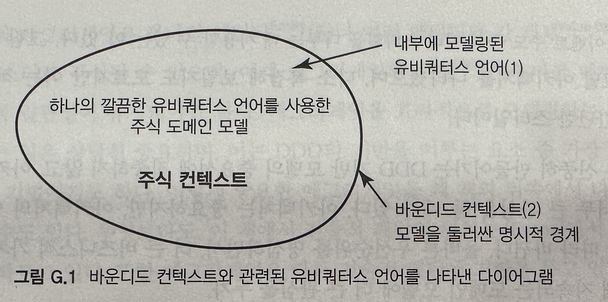
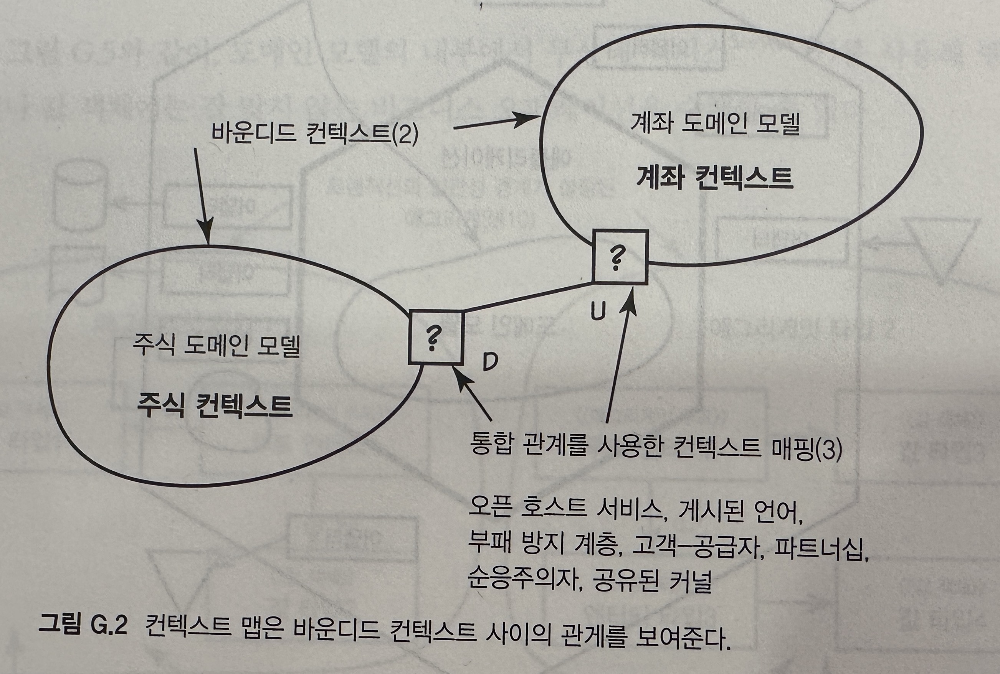
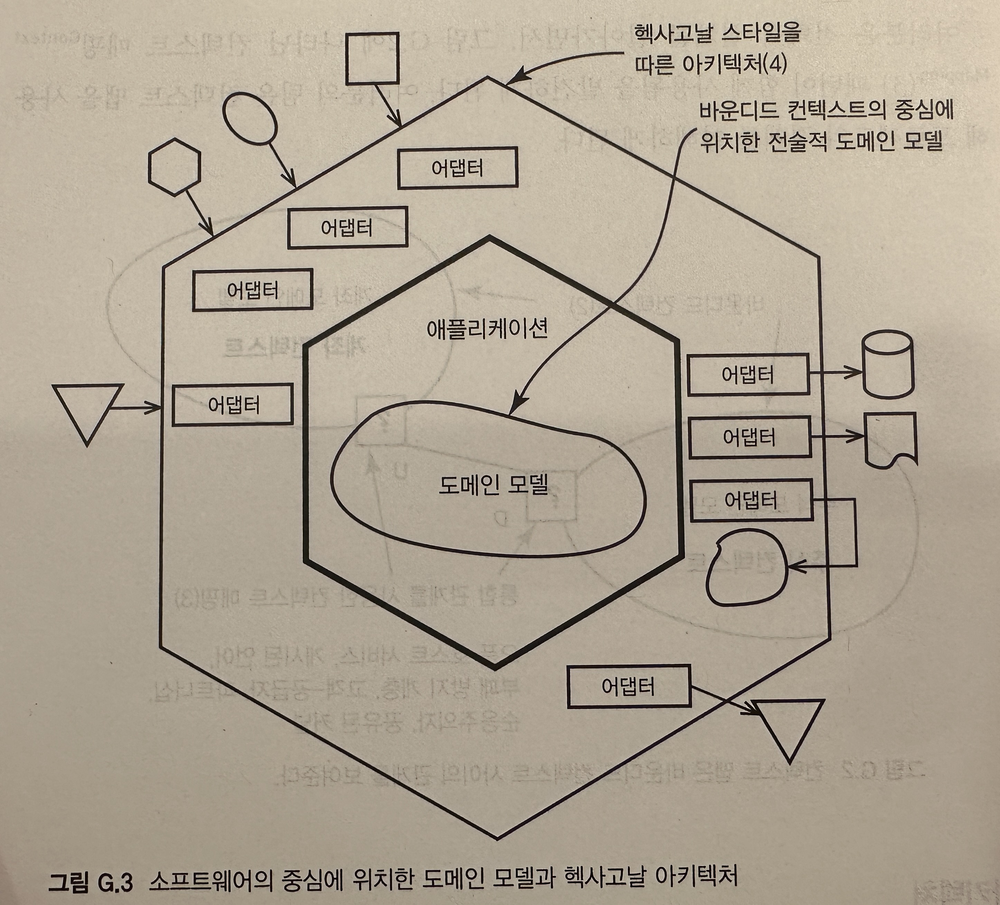
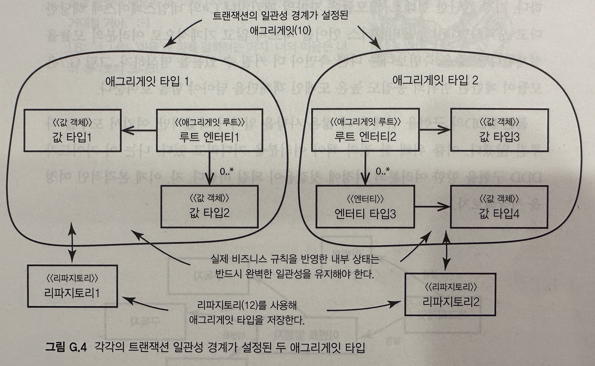
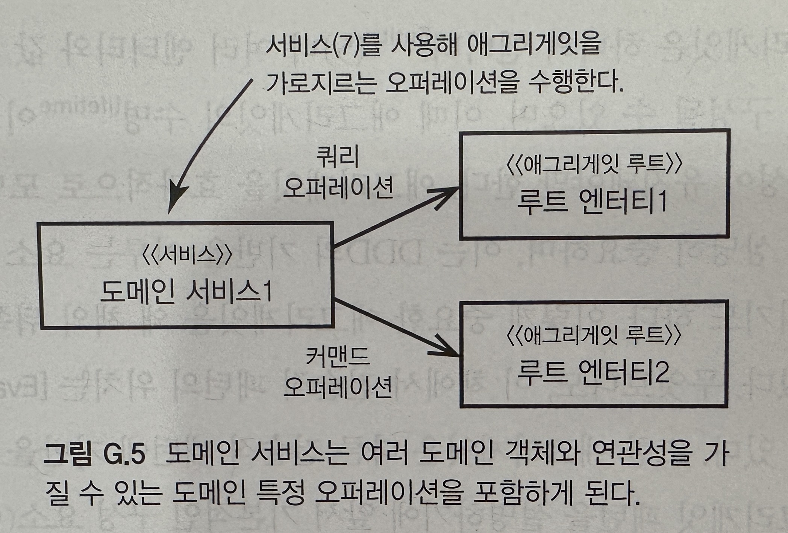
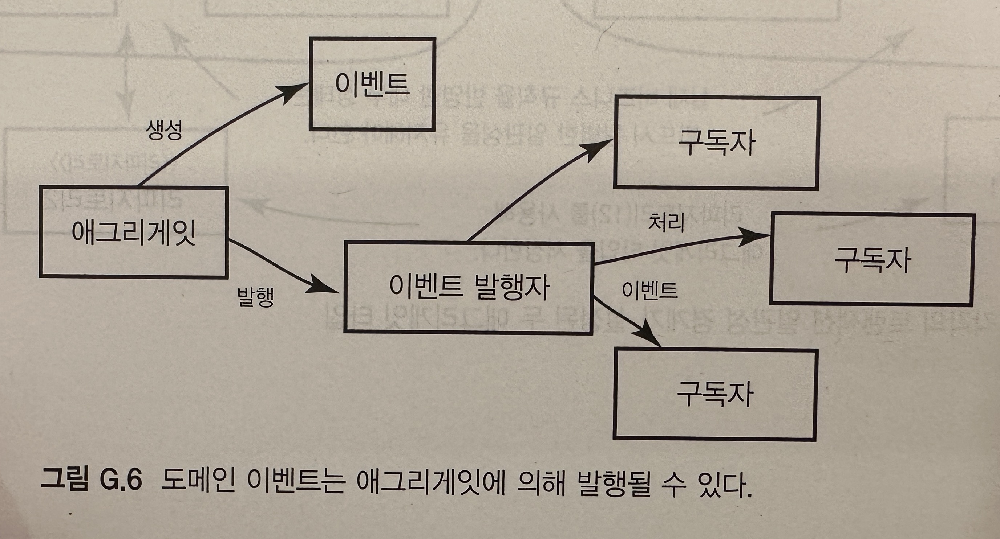
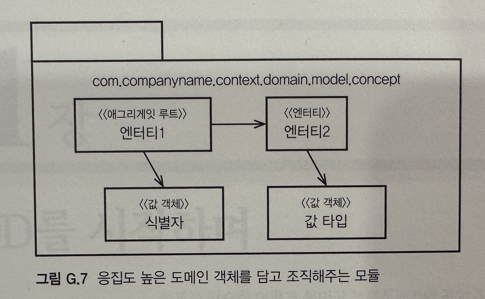

## 각 장의 내용

### 1장: DDD를 시작하며

- DDD를 사용할 때 얻을 수 있는 이악과 DDD를 달성하는 방법
- 프로젝트가 DDD에 투자해도 좋을지 평가할 방법을 찾아보고, DDD의 대안이 무엇이고, 왜 그런 대안이 흔히 문제를 일으키는지 알아 본다
- DDD의 기반을 다룬
- 실제 현실에서 겪게 되는 DDD의 도전을 마주하고 있는 가상 회사의 팀의 케이스 스터디

### 2장 : 도메인, 서브도메인, 바운디드 컨텍스트

- 도메인, 서브도메인, 핵심 도메인, 바운디드 컨텍스트는 무엇이고, 왜, 어떻게 사용해야 할까?
- 케이스 스터디에서 프로젝트 팀이 저지르는 실수를 통해 이 질문에 대한 답을 찾아 본다
- 기술적인 측면에서만 DDD를 적용하며 고통을 느꼈던 사람은 2장에서 크게 공감하게 될 것이다

### 3장: 컨텍스트 맵

- 컨텍스트 맵은 팀이 비즈니스 도메인과 여러 모델 사이의 경계와 통합이 진행되는 형태를 이해할 수 있도록 도와주는 강력한 도구다
- 복잡한 비즈니스를 갖고 있는 엔터프라이즈에서 바운디드 컨텍스트를 제대로 구성하기 위해선 이 도구의 사용이 중요하다
- 프로젝트 팀이 처음으로 생성했던(2장) 바운디드 컨텍스트의 문제를 이해하기 위해 컨텍스트 매핑을 적용하는 과정을 살펴본다

### 4장: 아키텍처

- 계층 아키텍처는 이미 알고 있다. 계층이 정말 DDD 애플리케이션을 다루는 유일한 방법일까? 그렇지 않다면 어떤 다른 아키텍처가 있을까?
- 여기선 핵사고닐(Hexagonal)/ 포트와 어답터(Ports and Adapter), 서비스 지향, REST, CQRS, 이벤트 중심(파이프와 필터), 장기 실행 프로세스(Long-Running
  Process), 나 사가(Saga), 이베트 소싱(Event sourcing), 데이터 패브릭(Data Fabric)/그리드(Grid)기반 등의 여러 아키텍처 안에서 DDD를 사용하는 방법을 고민한다

### 5장: 엔티티

- 첫 번째로 다룰 DDD 전술 패턴은 엔티티다
- 프로젝트 팀은 엔티티에 너무 크게 의존해서 값 객체로 설께해야 하는 중요성을 간과한다. 이로 인해 데이터 베이스와 영속성 프레임워크의 관도한 간섭으로 엔티티를 남용하는 문제에 관해 논의 한다
- 엔티티를 사용하는 올바른 방법에 익숙해진 다음 엔티티를 설계하는 방법에 관한 다양한 예제를 다룬다
- 유비쿼터스 언어를 엔티티로 표현하는 방법은 무엇일까? 어떻게 엔티티를 테스트하구 현하고 저장할까?

### 6장: 값 객체

- 프로젝트 팀은 여러 관련 속성을 분변하는 묶음으로 모으는 데 주의를 기울여야 했을 순간에, 엔티티의 개별적 속성에만 너무 집중했다
- 이 장에선 엔티티가 아닌 값을 사용해야 하는 시기를 결정하기 위해 모델의 특성을 식별하는 방법을 논의하면서 값 객체의 설계를 여러 방향에서 살펴본다
- 통합을 진행할 때 값이 수행하게 되는 역할이나 표준 타임의 모델링과 같은 다른 중요한 주제도 함께 다룬다
- 도메인 중심 테스트를 설계하는 방법, 값 타입을 구현하는 방법, 에그리게잇의 일부로 이들을 저장해야 할 때 영속성 메커니즘으로 인한 나쯘 영향을 피하는 방법 등도 이야기 한다

### 7장: 서비스

- 7장에선 하나의 개념을 도메인 모델 안의 잘 짜여진 무상태 서비스로 모델링 해야 하는 시점이 언제인지 보여준다
- 엔티티나 값 객체가 아닌 서비스를 설계해야 하는 시점과, 비즈니스 도메인 로직을 처리하거나 기술적 통합을 위해 도메인 서비스를 구현하는 방법을 알아본다
- 서비스를 사용하는 시점과 서비스를 설계하는 방법에 관한 사례를 통해 프로젝트 팀이 내린 결정을 살펴본다

### 8장: 도메인 이벤트

- 에릭 에반스가 출반했던 시점은 도베인 이벤트가 DDD의 한 부분으로 소개되기 이전이었다
- 모델에서 발행하는 도메인 이벤트가 왜 강력한지와, 비즈니스 서비스의 통합과 자동화를 지원하는 가운데 도메인 이벤트를 사용하는 여러 방법을 배운다
- 도메인 이벤트만의 특징이 무엇인기 구분해 논의하며, 설계와 구현을 위한 가이드를 제공하고, 선택할 수 있는 옵션과 그에 따른 장단점을 알려준단
- 발생 구독(펍-섭)매커니즘을 만드는 방법, 엔터프라이즈를 아우르며 구독자를 통합하는 방법, 이벤트 저장소를 생성하고 관리하는 방법, 메시징 문제에 대처하는 방법 등에 논의 한다

### 9장: 모듈

- 다른 컨테이너에 속한 객체와의 결합도는 제한하면서 올바른 크기의 컨테이너에 모델 객체를 담아내는 방법은 무엇일까?
- 이런 컨테이너가 유비쿼터스 언어를 반영하도록 하려면 어떻게 이름을 붙여야 할까? 패키지나 네임스페이스를 넘어서, 언어와 프레임워크에서 제공하는 좀 더 최신의 모듈화 기능(OSGi, 직소(Jigsaw)은 어떻게
  활용할 수 있을까?

### 10장: 애그리게잇

- 애그리게잇은 아마도 DDD의 전술 도구 가운데 가장 이해도가 낮은 도구일 것이다
- 하지만 몇 가지의 경험 법칙을 적용하면 애그리게잇을 더 간단하고 빠르게 구현할 수 있다
- 작은 객체 클러스터의 주변으로 일관성 경계를 구축하면서 복잡도의 벽을 부수고 애그리게잇을 사용하는 방법을 학습한다
- 트랜잭션과 결과적 일관성을 올바르게 적용해 분산 처리 환경에서 확장성과 성능을 더 높은 모델을 설계하며 자신들이 저지른 실수를 고쳐가는 과정을 살펴본다

### 11장: 팩토리

- 팩토리에 관한 새로운 이야기가 아니라 팩토리가 어디에 위치해야 하는지 이해하는데 집중한다
- DDD의 설정에 맞춰 제 역할을 하는 팩토리를 설계하는 팁도 함께 소개한다
- 프로젝트 팀이 클라이언트 인터페이스를 단순화하고 모델의 사용자가 멀티테넌트(multitenant)환경에 재앙적인 버그를 유발하지 않도록 막으면서 팩토리를 생성하는 방법을 확인한다

### 12장 : 리파지토리

- 리파지토리는 단순한 데이터 접근 객체가 아닌가? 왜 우린 데이터베이스가 아닌 켈렉션을 흉내 내기 위하 리파지토리를 설계하는 방안을 고려해야 할까?
- 그리드 기반의 코히어런스(Coherence)분산 캐시를 지원하거나 NoSQL 저장소를 사용하는, ORM을 사용하는 리파지토리를 설계하는 방법을 학습한다

### 13장: 바운디드 컨텍스트의 통합

- 지금까지 컨텍스트 매핍의 상위 수준 기법을 이해했고 전술 패턴을 활용할 수 있게 됐지만, 모델의 통합을 실제로 구현할 때는 어떤 일이 일어날까?
- DDD에선 어떤 통합 옵션이 주어질까? 13장에선 컨텍스트 매핑을 통해 모델의 통합을 구현하는 몇가지 방법을 소개한다
- 프로젝트 팀이 핵심 도메인과 그를 지원하는 바운디드 컨텍스트를 통합하는 방법에 기반해 통합의 지침을 제공한다

### 14장: 애플리케이션

- 핵심 도메인과 유비쿼터스 언어에 따라 모델을 설계했다. 하지만 다른 구성원이 애플리케이션의 다른 영역을 설게할 때는 어떻게 해야 할까? 모델과 사용자 인터페이스 사이에서 데이터를 전달하기 위해 DTO를 사용해야
  할까? 애플리케이션 서비스와 인프라는 어떻게 동작할까?
- 14장에선 익숙해졌을 프로젝트에서 선택할 수 있는 옵셥을 살펴보며 이 분제를 다룬다

### 15장: 애그리게잇과 이벤트 소싱(A+ES)

- 이벤트 소싱은 애그리게잇을 저장하기 위한 중요한 기술적 접근법이며, 이벤트 중심 아키텍처를 반드는 기반을 제공한다. 애그리게잇이 생성된 후 발생하는 일련의 이멘트를 통해 애그리게잇의 전체 상태를 표현하기 위해
  이벤트 소싱을 사용할 수 있다. 이벤트를 발생 순서를 지켜 다시 재생함으로써 애그리게잇의 상태를 재구축할 수 있다. 따라서 이벤트는 영속성을 단순화하고 복잡한 행동 속성에 개념을 포착하도록 해주는 가운데, 이벤트
  자체가 자신의 시스템과 외부 시스템에 지대한 영향을 미치는 요소가 된다

## DDD의 큰 그림

- 유비쿼터스 언어는 단일 바운디드 컨텍스트의 경게 안쪽에서 적용하게 된다
- 소프트웨어 모델이 전술적으로 어떻게 설계됐든, 전략적으로 바운드디 컨텍스트에 다라 명시적으로 모델링된 깔끔한 유비쿼터스 언어를 반영해야 한다

#### 전략적 모델링

- `바운디드 컨텍스트는 도메인 모델을 적용할 수 있는 개념적 경계다`
    - 소프트웨어 모델 안에서 유비쿼터스를 위한 컨텍스트(문맥정보)를 제공한다

- `컨텍스트 맵은 바운디드 컨텍스트 사이의 관계를 보여준다`
- 전략적 설계를 알아가면서, 위 이미지에 나타난 컨텍스트 매핑 패턴이 함께 사용됨을 발견하게 된다
- 컨텍스트 맵을 사용해 프로젝트의 경계를 이해하게 된다

### 아키텍처

- 새로운 바운디드 컨텍스트나 컨텍스트 매핑을 통해 상호작용하는 기존의 바운디드 컨텍스트에 따라 새로운 스타일의 아키텍처를 선택해야 할 때가 있따
- `바운디드 컨텍스트를 다루는 강력한 아키텍처 스타일로는 핵사고날`(서비스 지향, REST, 이벤트 주도 등의 여러 스타티일을 다루는데 사용할 수 있는)이 있다

- 위 이미지는 핵사고날 이미지 이다
- 복잡해 보이지만 적용이 상당히 간단한 스타일이다
- 아키텍처 보다는 더 오래 지속되는 도메인 모델에 더 큰 관심을 두는 것이 중요하다

### 전술적 모델링

- DDD의 기반을 이루는 패턴을 사용해서 전술적 측면에서 바운디드 컨텍스트 내부를 모델링한다
- `전술적 설게 중 가장 중요한 패턴은 애그리게잇이다`
    - 하나의 애그리게잇은 하나의 엔티티나 여러 엔티티와 값 객체의 클러스터로 구성될 수 있으며, 수명(lifetime)이 다할 때까지 트랜잭션 일관성이 유지돼야만 한다
    - 애그리게잇의 인스턴스는 리파지토리를 사용해 저장되며, 리파지토리로부터 검색해 가져올 수 있다

- 도메인 서비스
    - 위 이미지 처럼 도메인 모델의 내부에서 무상태 서비스를 사용해 엔티티나 값 객체에는 잘 맞지 않는 비즈니스 오퍼레이션을 수행할 수 있다

- 도메인 이벤트
    - 도메인 이벤트를 사용해 도메인에서 발생하는 중요한 사건을 나타낼 수 있다
    - 도메인 이벤트는 몇 가지 다른 방법으로 모델링 할 수 있다
    - 도메인 이벤트가 애그리게잇 컨맨드 오퍼레이션의 결과로서의 사건을 나타낸다면 위 그림처럼 애그리게잇 스스로가 이벤트를 발생한다

- 모듈
    - 보통 깊게 고려되는 사항은 아니지만, 모듈의 올바를 설계는 굉장히 중요하다
    - 가장 간단한 형태로서, 모듈은 자바의 패키지나 C#의 네임스페이스에 해당한다고 생각하면 된다
    - 유비쿼터스 언어를 따르지 않고 기계적으로 모듈을 설계하면 안된다
    - 위 이미지는 모듈이 제한된 범위의 응집도 높은 도메인 객체만을 담아야 함을 보여주낟 