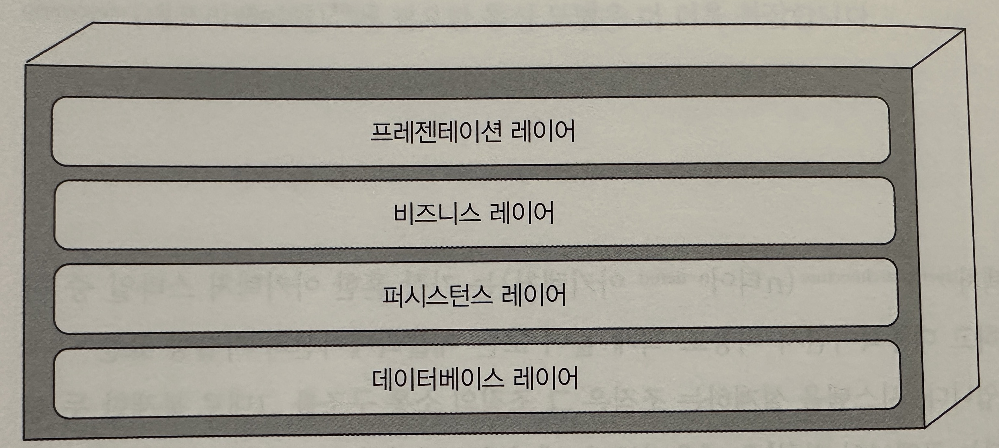
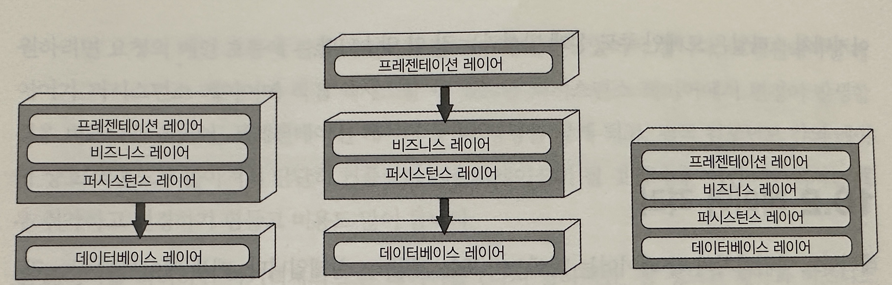
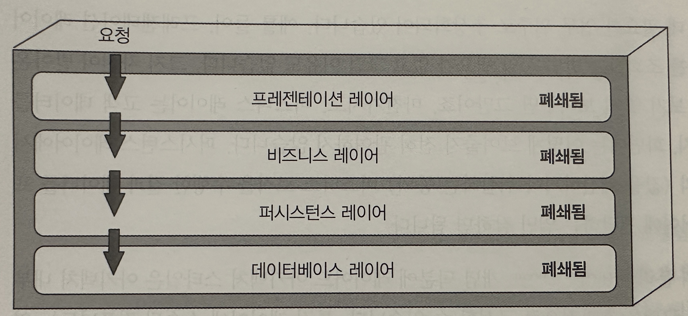
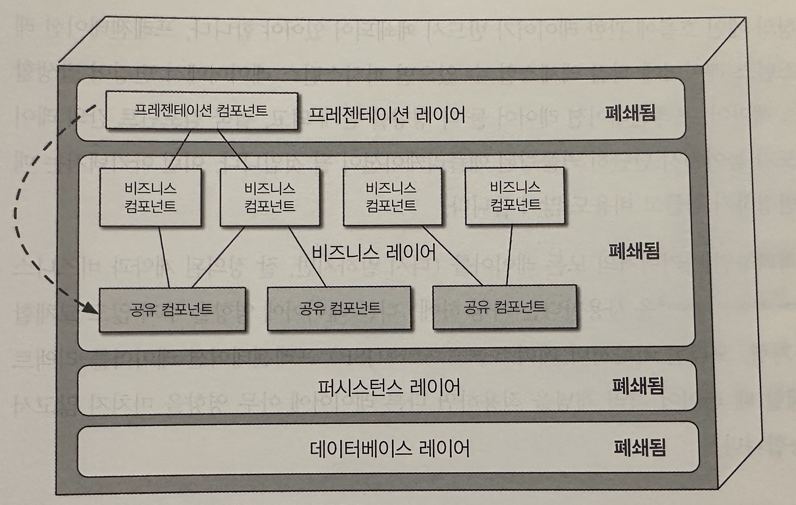
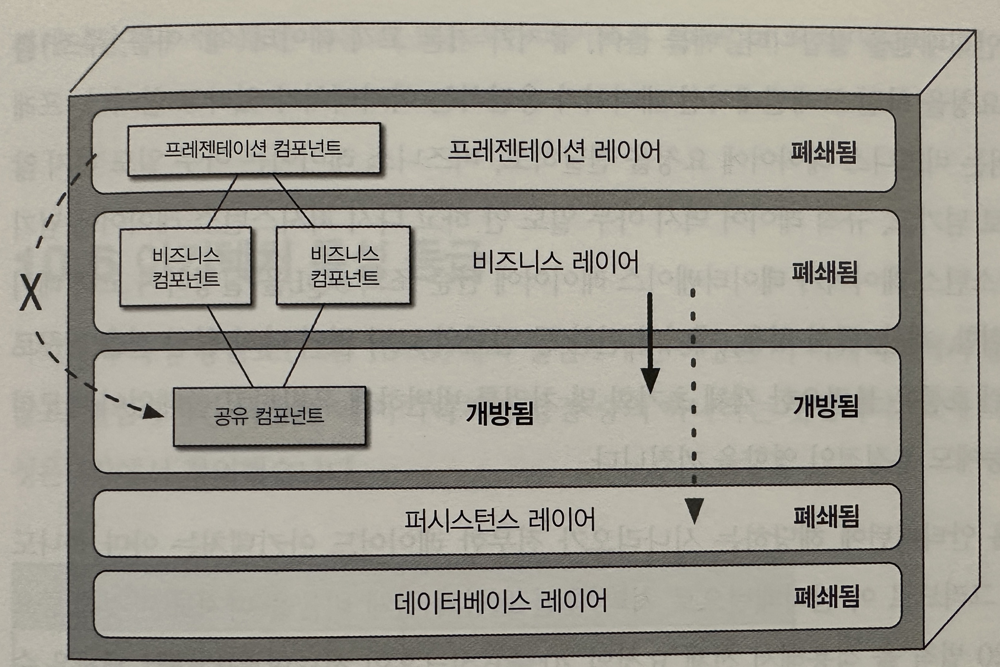
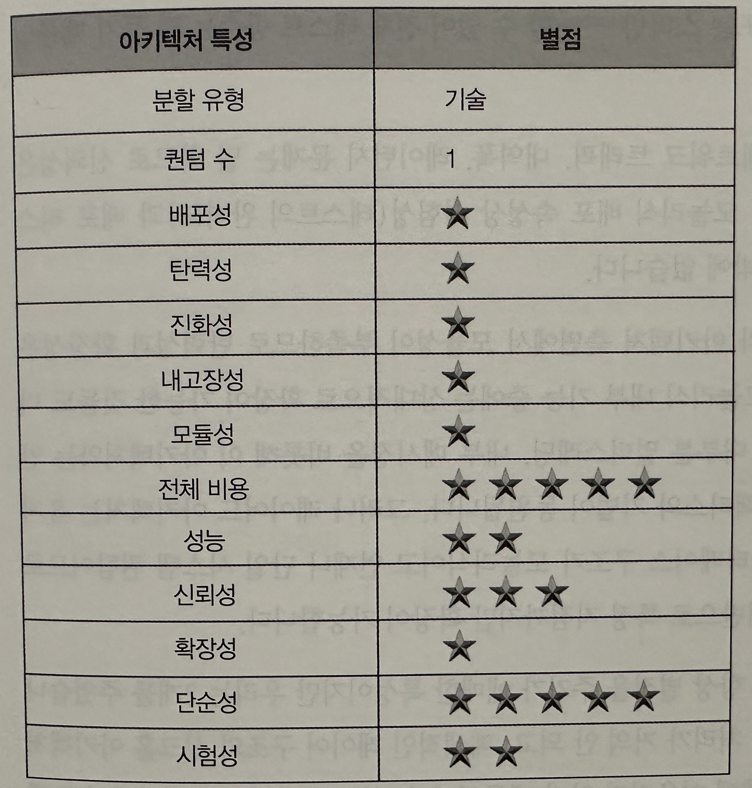

## 레이어드 아키텍처 스타일

- 레이어드 아키텍처는 가장 흔한 아키텍처 스타일 중 하나이다
- 가장 단순하고 대중적이고 비용이 적게들어 모든 애플리케이션의 사실상 표준 아키텍처이다
- 하지만 묵시적 아키텍처 안티패턴, 우발적 아키텍처 안티패턴 등의 몇몇 안키텍처 안티패턴의 범주에 속한다
- "일단 코딩을 시작"해보기로 했다면 좋은 선택지가 될 수도 있다

### 토폴로지 (망 구성방식)

- 레이어드 아키텍처에서 내부 컴포넌트는 논리적으로 수평한 레이어들로 구성되며, 각 레이어는 애플리케이션에서 주어진 역할을 수행한다
- 레이어의 갯수 제한은 없지만 일반적으로, Presentation, Business, Persistence, Database의 4개의 표준 레이어로 구성한다
    - SQL과 같은 퍼시스턴스 로직이 비즈니스 레이어 컴포넌트에 내장된 경우에는 퍼시스턴스 레이어를 비즈니스 레이어에 병합시킬수 있다

- 위 이미지는 물리적 계층화(배포)의 관점에서의 다양한 토폴로지 변형이다
- 왼쪽은 데이터베이스 레이어만 별도로 분리된 배포형태이다
- 가운데는 프리젠테이션 레이어를 자체 배포 단위로 하고 비즈니스 레이어와 퍼시스턴스 레이어를 두번째 배포 단위로, 데이터베이스는 외부에 둔 형태이다
- 오른쪽은 4개의 표준 레이어를 모두 단일 배포 단위로 뭉뚱그린 형태이다
    - 이 경우에는 애플리케이션에 데이터베이스가 내장되어 있거나 인메모리 데이터베이스를 사용하는 소규모 애플리케이션에 적합하다

- - - 

- 레이어별 역활
    - 각 레이어는 주어진 요청을 충족하는데 필요한 업무 위주로 추상화되어 있다
    - 예를 들어 프리젠테이션 레이어는 고객 데이터를 조회하는 방법은 알 필요가 없고 그럴 이유도 없다
- `관심사의 분리` 덕분에 레이어드 아키텍처 스타일은 아키텍처 내부의 역할 및 책임 모델을 효과적을 구성할 수 있다
- `레이어드 아키텍처는(도메인 분할 아키텍처의 반대)기술 분할된 아키텍처이다`
    - 즉 컴포넌트를(고객 같은)도메인 단위로 묶는 것이 아니라, 아키텍처의(레이어) 기술 역할에 따라 묶기 때문에 비즈니스 도메인이 각각 모든 아키텍처 레이어에 분산된다
    - 예를 들어 "고객" 도메인은 프리젠테이션, 비즈니스, 규칙, 서비스, 데이터베이스 모든 레이어에 다 포함되므로 이 도메인에 어떤 변경을 가하는 일이 쉽지 않다
    - 이런 이유로 레이어드 아키텍처는 도메인 주도 설계 방식과는 잘 맞지 않는다

### 레이어 격리

- 레이어드 아키텍처의 각 레이어는 폐쇄(closed)또는 개방(open)상태이다
    - 폐쇄 레이어란 상위 레이어에서 하위 레이어로 이동하므로 중간의 어떤 레이어도 건너뛸 수 없고 현재 레이어를 거쳐야 바로 다음 레이어로 나아갈 수 있다는 뜻
- 단순 조회 요청의 경우 불필요한 레이어를 건너뛰고 프리젠테이션 레이어가 데이터베이스를 직접 액세스 하는 편이 더 빠르고 간편할 것이다
    - 이를 추월 차선 리더 패턴(fast-lane reader pattern)이라고 한다
    - 이렇게 하려면 비즈니스 레이어, 퍼시스턴스 레이어는 개방 되어 있어야 한다
- 레이어 격리란
    - 레이어 격리는 어느 레이어에서 변경이 일어나도 다른 레이어에 있는 컴포넌트에 아무런 영향을 끼치지 않기에 레이어 간 계약은 불변임을 의미한다
    - 각 레이어는 서로 독립적으로 작동되므로 다른 레이어의 내부 작동 로직은 거의/전혀 알지 못한다
    - 레이어 격리를 지원하려면 레이어가 반드시 폐쇄되어 있어야 한다

### 레이어 추가

- 내부적으로 폐쇄 레이어를 이용해 변경을 격리할 수 있지만, 어떤 경우에는 개방하는 것이 더 합리적인 경우도 있다
- 위 이미지
    - 비즈니스 레이어에 (날짜, 문자열 유틸티, 로깅 클래스)공통 비즈니스 기능이 구현된 객체를 구현하여 공유하고 프리젠테이션 레이어에서는 이 공유를 객체를 직접 사용할 수 없도록 결정한 경우
    - 이미지 처럼 프리젠테이션 레이어가 비즈니스 레이어를 액세스 할 수 있고 그 내부의 공유 객체 역시 갖다 쓸수 있는, 지배/통제하기 어려운 아키텍처 구조가 된다
    - (내 생각)즉 문제는 비즈니스 컴포넌트의 공유 컴포넌트는 프리젠테이션 컴포넌트가 사용하게 하고 싶지 않다

- 위 문제를 해결하기 위해서는 공유 비즈니스 객체가 모두 포함된 새로운 서비스 레이어를 아키텍처에 추가하면 된다
    - 이렇게 하면 비즈니스 레이어는 폐쇄되어 있으니 아키텍처 구조상 프리젠테이션 레이어가 공유 비즈니스 객체를 직접 액세스할 수는 없다
    - 하지만 새로 추가된 서비스 레이어는 개방 레이어로 설계했기 때문에 비즈니스 레이어가 퍼시스턴스 레이어를 액세스할 때 서비스 레이어를 뚫고 갈 수 있다
    - (내 생각) 이렇게 만들면 비즈니스 레이어는 공유컴포넌트 레이어를 건너뛸 수 있기 대문에 프리젠테이션 레이어가 공유 컴포넌트를 못 건들게 할 수 있다
- 개방/폐쇄 레이어 개념을 잘 활용하면 아키텍처 레이어 간 관계와 요청 흐름을 정의할 떄 유용하다
    - 내부의 다양한 레이어 액세스 제약에 관한 필수 정보와 지침을 제공 할 수 있다(개방/폐쇄 여부와 이유)
    - 하지만 정확히 문서화하여 소통하지 않으면, 테스트, 유지보수, 배포 작업이 아주 힘든, 단단히 커플링되어 큰 문제가 될 수 있다

### 기타 고려 사항

- 아직 아키텍처 스타일을 결정하기 못했다면 레이어드 아키텍처는 좋은 출발점이 될 수 있다
    - 하지만 재사용은 최소한으로, 객체 계층은 최대한 가볍게 맞추어 적절한 모듈성을 유지하는 것이 중요하다. 그래야 나중에 아키텍처 스타일 교체가 쉽다
- `아키텍처 싱크홀(architecture sinkhole)안티패턴`을 조심해야 한다
    - 요청이 한 레이어에서 다른 레이어로 이동할 때 각 레이어가 아무 비즈니스 로직도 처리하지 않고 그냥 통과시키는 안티패턴을 말한다
    - 사용자가 고객 데이터 요청 -> 프리젠테이션 레이어 -> 비즈니스 레이어(아무것도 안함) -> 규칙 레이어(아무것도 안함) -> 퍼시스턴스 레이어(데이터 단순 조회) -> 리턴
    - 이런 흐름은 객체 초기화 및 처리를 빈번하게 유발하고 쓸데없이 메모리를 소모하며 성능에도 부정적인 영향을 끼친다
    - 하지만 이 안티패턴은 전혀 없을 수는 없다 80대20 법칙을 적용해서 비율을 따져보는 것이 중요하다
        - 20프로를 넘으면 레이어드 아키텍처가 적합하지 않다는 증거일수 있다
        - 혹은 아키텍처의 모든 레이어를 개방하는 것도 방법이 될 수 있다

### 왜 이 아키텍처 스타일을 사용하는가

- 작고 단순한 애플리케이션이나 웹사이트에 알맞은 스타일이다
- 처음 구축을 시작할 때, 예산과 일정이 빠듯한 경우 출발점으로 괜찮은 선택이다
- 규모가 커질수록 유지 보수성, 민첩성, 시험성, 배포성 같은 아키텍처 특성이 점점 나빠진다

### 아키텍처 특성 등급

- 전체 비용과 단순성이 레이어드 아키텍처 스타일의 주요 강점이다
- 이 아키텍첵처는 원래 모놀리식에 가깝기 때문에 분산 아키텍처 스타일에 따른 복잡도가 낮고, 구조가 단순해서 알기 쉬운데다 구축 및 유지보수 비용도 비교적 적게든다
- 성능은 병렬 처리가 거의 안 되고, 폐쇄적인 레이어 구조와 싱크홀 아키텍처 안티패턴 때문에 고성능 시스템에 어울리지 않는다
