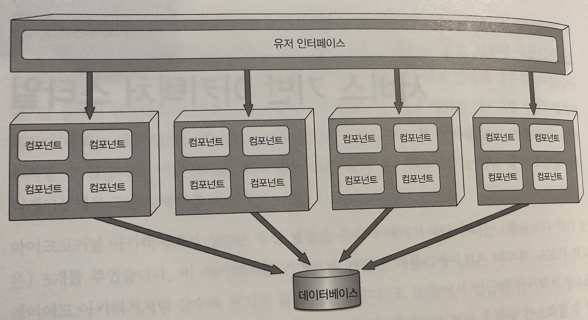
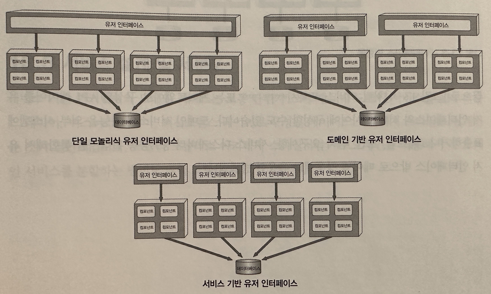
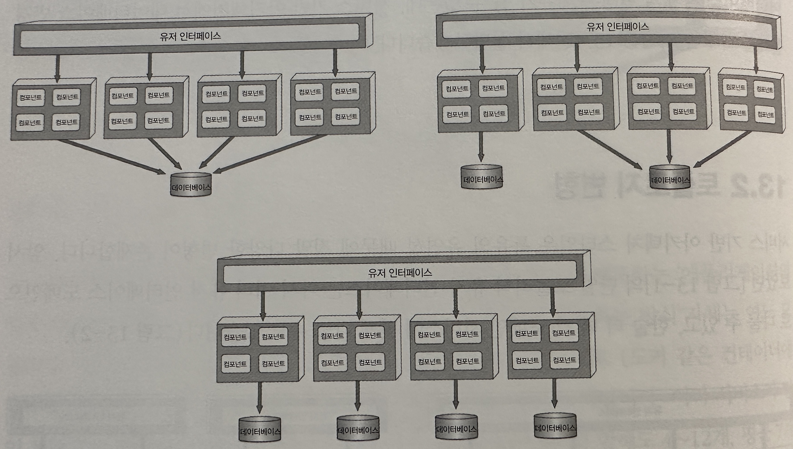
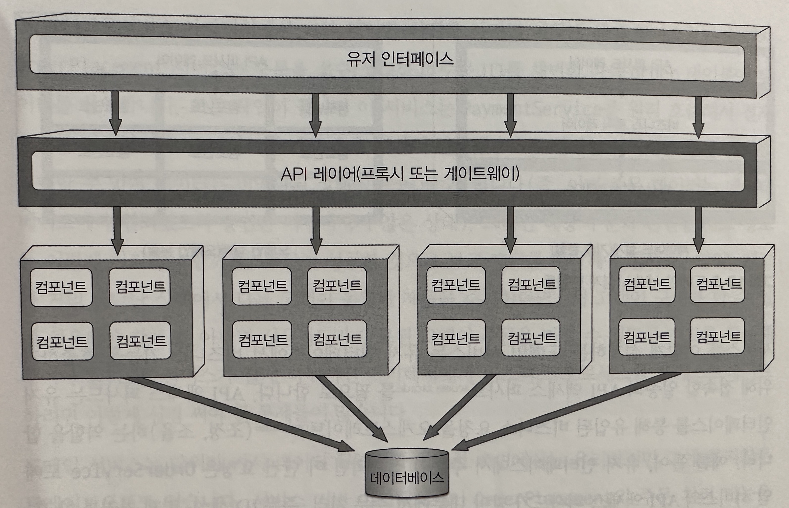
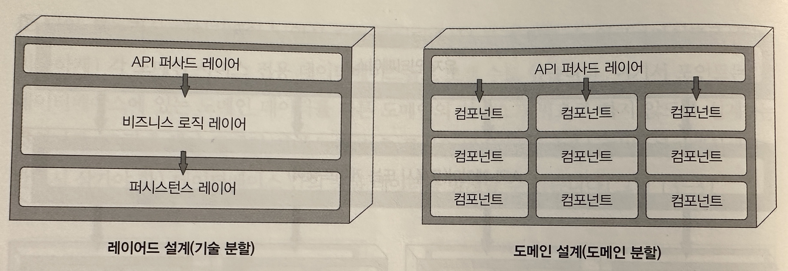
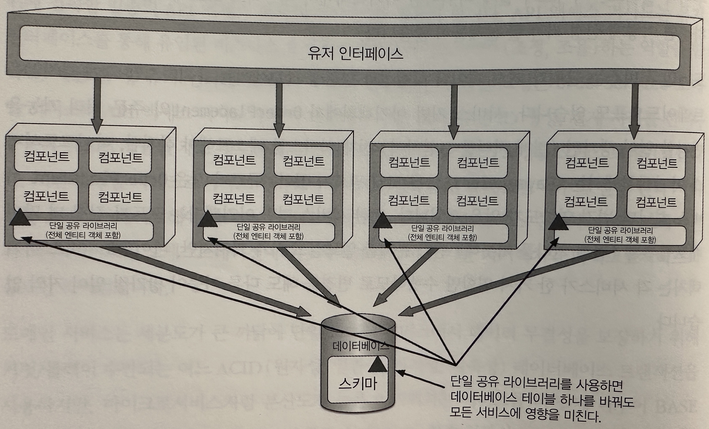
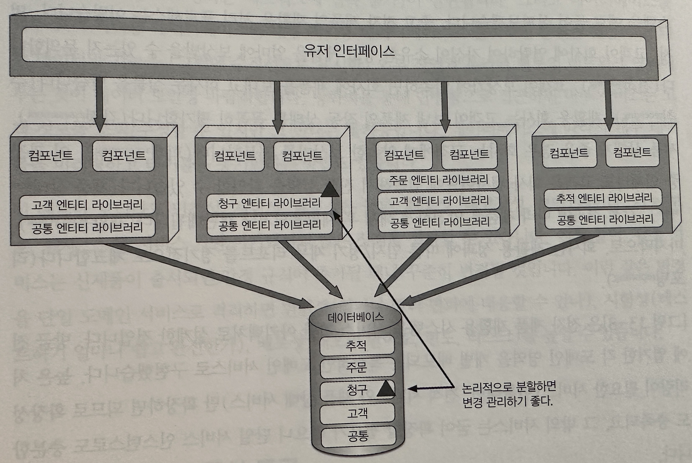
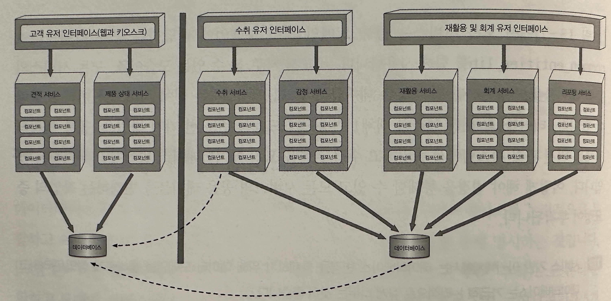
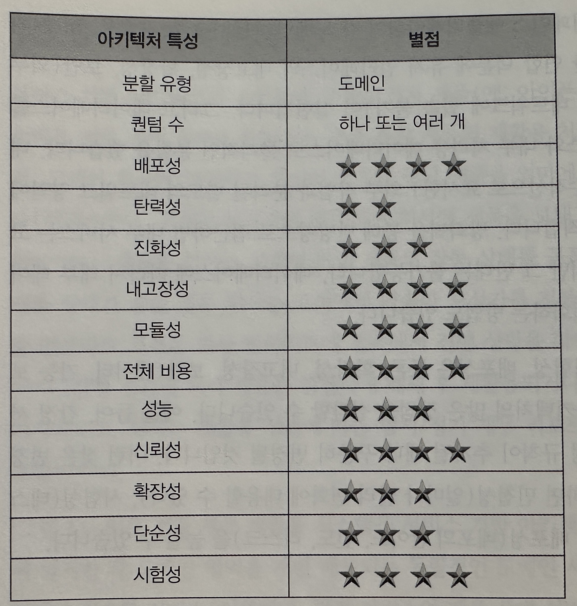
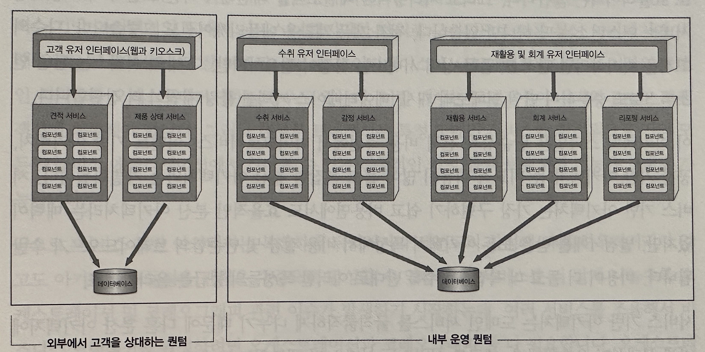

## 서비스 기반 아키텍처 스타일

- 서비스 기반 아키텍처(service-based architecture)는 마이크로 서비스 아키텍처 스타일의 일종으로, 유연하고 가장 실용적인 스타일 중 하나이다
- 마이크로 서비스나 이벤트 기반 아키텍턱처와 마찬가지로 분산 아키텍처지만 비교적 덜 복잡하고 비용이 많이 들지 않아서 널리 채택된 아키텍처이다

### 토폴로지

- 모노 유저인터페이스 + 분산 서비스 + 모노 데이터베이스 구조
- 서비스
    - 보통 도메인 서비스(domain service)라고 함
    - 여러 서비스는 모놀리식 데이터베이스를 공유하므로 서비스는 일반적으로 4~12개 이고 평균 7개이다
    - 단일 인스턴스로 배포하지만, 확장성, 내고장성, 처리량 요구사항에 따라 인스턴스를 여럿 둘 수도 있으며 이 경우 부하 분산 기능이 필요하다
    - 서비스는 원격 액세스 프로토콜로 유저 인터페이스 외부에서 접속할 수 있다
        - 프로토콜을 일반적으로 REST를 많이 쓰지만 메ㅣ징, 원격 프로시저 호출(RPC), SOAP도 사용 가능하다
- 유저 인터페이스(또는 다른 외부 요청)은 포록시나 게이트웨어로 구성된 API레이어를 통해 서비스에 접속할 수 있지만, 대게는 서비르 로케이터 패턴에 따라 유저 인터페이스, API게이트웨이, 프록시에 내장된 유저
  인터페이스를 직접 액세흐 한다
- 중앙 공유 데이터베이스를 사용한다는 특징이 중요하다
    - 기존 모놀리식 레이어드 아키텍처와 동일한 방식으로 SQL쿼리와 조인 기능을 사용하면 된다
    - 서비스 개숫가 적어서 데이터베이스 커넥션은 대게 문제가 안되지만 데이터베이스 자체의 변경은 이슈가 될 수 있다

### 토포로지 변경

- 특유의 유연성 때문에 정말 다양한 변형이 존재한다
- 유저 인터페이스를 도메인 별로 나눌수도 있고 도메인 서비스에 맞게 나눌소도 있다
- 데이터베이스 역시 도메인별로 나눌수도 있다
    - 여기에서 포인트는 각 데이터베이스에 있는 도메인 데이터를 다른 도메인의 서비스가 필요로 하지 않도록 설계하는 것이다
    - 도베인 서비스 간 상호 통신을 방지

- 위 이미지 처럼 리버스 프록시(reverse proxy) 또는 게이트웨이로 구성된 API레이어를 유저 인터페이스와 서비스 사이에 구성할 수도 있다
  도메인 서비스의 기능을 외부 시스템에 표출하거나 (메트릭, 보안, 감사 요구사항, 서비스 디스커버리 등) 고통 관심사를 통합해서 유저 인터페이스 밖으로 떼어낼 경우 유용

### 서비스 설계 및 세분도

- (왼쪽)서비스 기반 아키텍처의 도메인 서비스는 보통 단위가 크기 때문에 도메인 서비스를 API퍼사드 레이어, 비즈니스 레이어, 퍼시스턴스 레이어로 구성된 레이어드 아키텍처 스타일로 설계하는 것이 일반적이다
- (오른쪽)모듈러 모놀리스 아키텍처 스타일 처럼 서브도메인을 이용해서 각 도메인 서비스를 분할하는 방법도 많이 쓰인다
- API 액세스 퍼사드
    - 서비스를 어떻게 설계하든 도메인 서비스는 유저 인터페이스에서 비즈니스 기능을 호출하기 위해 접속할 일종의 API액세스 퍼사드를 필요로 한다
    - API 액세스 퍼사드는 유저 인터페이스를 통해 유입된 비즈니스 요청을 오케스트레이트(조정, 조율)하는 역할을 한다
    - 예를 들어 유저 인터페이스에서 주문이 접수되면 이 단건 요청은 OrderService 도메인 서비스의 API 액세스 퍼사드가 받아 내부에서 주문처리 등등 일련의 비즈니스 요청을 오케스트레이트 한다
        - 이를 마이크로서비스 아키텍처에서 처리한다면 별도 배포된 다수의 전용 원격 서비스를 오케스트레이트 해야 한다
        - `세분도 관점에서보면 내부 클래스 수준의 오케스트레이션과 외부 서비스의 오케스트레이션이라는 차이점이 서비스 기반 아키텍처와 마이크로서비스의 중요한 차이점이다`
- 트랜잭션
    - 도메인 서비스는 세분도가 크기 때문에 데이터 무결성을 보장하기 위해 커밋/롤백이 수반되는 여느 ACID(원자성,일관성,격리성,지속성)데이터베이스 트랜잭션을 사용한다
    - 마이크로서비스는 세분도가 높기 때문에 BASE트랜잭션(기본적 가용성basic availability, 소프트 상태soft state, 최종 일관성eventual consistency)이라고 알려진
      트랜잭션을 사용한다
        - 이 기법은 그 기반이 최종 일관성이므로 서비스 기반 아키텍처의 ACID트랜잭션 레벨의 데이터 무결성은 지원하지 않는다
- 트레이드오프
    - 도메인 서비스 단위가 커서 데이터 무결성과 일관성 측면에서는 유리하지만 코드 변경 영향도가 높다
    - 도메인은 Order가 Payment도메인안에 있어서 Order를 고치려면 Paymet에도 영향이 갈수 있지만, 마이크로는 분리되어 있어 영향도가 없다

### 데이터베이스 분할

- 도메인 서비스는 일반적으로 단일 모놀리식 데이터베이스를 공유한다
    - 이러한 데이터베이스 커플링은 테이블 스키마 변경 시 문제가 될 수 있다
    - 데이터베이스 테이블 스키마를 나타낸 공유 클래스 파일(엔티티 객체라고 함)은 젠체 도메인 서비스가 함께 사용하는 커스텀 공유 라이브러리에 두며 SQL코드도 이 라이브러리에 있다
    - 단일 공유 라이브러리를 자세히 분석해보지 않는 이상, 어느 서비스가 실제로 테이블 변경에 영향을 받을지를 미리 에측하기가 어렵다

- 데이터베이스 변경 영향도와 리스크를 낮추는 한 가지 방법은 데이터베이스를 논리적으로 분할하고 논리 분할을 연합 공유 라이브러리(federated shared library)를 통해 명시하는 것이다
    - 이미지에서는 5개의 개별 도메인(공통, 고객, 청구, 주문, 추적)으로 논리 분할하고 도메인 서비스마다 논리 분할한 데이터베이스를 바라보는 전용 공유라이브러리를 5개를 둔 구조이다
- `서비스 기반 아키텍처에서는 데이터베이스 변경을 통제하기 위해 데이터 도메인을 올바르게 정의 관리하고 데이터베이스는 가급적 논리적으로 잘게 나누는 것이 좋다`

### 아키텍처 예시

- 위 이미지를 보면 높은 처리량이 필요한 서비스만 확장하면 되므로 확장성을 충족하고 있고, 그 밖의 서비스는 굳이 확장할 필요가 없으니 단일 서비스 인스턴스로 구축하고 있다
- 위 구조만 봐도 민첩성, 시험성, 배포성은 물론 확장성, 내고장성, 보안 등 서비스 기반 아키텍처의 많은 장점을 실감할 수 있다

### 이키텍처 특성 등급

- `기술 관심사 보다는 도메인을 위주로 구성된 아키텍처이다`
- 분산 아키텍처이므로 퀀텀은 하나 또는 그 이상일 것이다

- 위 이미지를 보면 퀀텀은 2이다
    - 개별 고객 유저 인터페이스, 데이터베이스
- 개별 배포되는 여러 도메인 서비스로 나누면 신속한 변경이 가능하고(민첩성), 도메인 범위가 한정되므로 테스트 커버리지가 향상(시험성)되어 덩치크 모놀리스보다 안전하더 더 자주 배포 할 수 있다(배포성)
- 확장성은 서비스를 나누는 단위가 크기때문에 중간 정도이다
- 단순성과 전체 비용 측면에서 마이크로서비스, 이벤트 기반 아키텍처, 공간 기반 아키텍처 등 비교적 비용이 많이 들고 복잡한 분산 아키텍처와는 차별화 된다
    - 서비스 기반 아키텍처는 구가장 구현하기 쉽고 비용면에서도 효율적인 분산 아키텍처라는 매력이 있다
- 서비스 기반 아키텍처는 도메인 서비스를 굵직굵지하게 나누기 때문에 다른 분산 아키텍처에 비해 신뢰성이 우수하다
    - 대규모 서비스는 서비스 간 네트워크 트래픽이 적고 대역폭을 더 사용하며, 분산 트랜잭션이 많지 않기 떄문에 전반적으로 네트워크 측면에서 신뢰성이 좋다

### 언제 이 아키텍처 스타일을 사용하는가

- `스타일의 유연성 덕분에 어쩌면 가장 실용적인 아키텍처이다`
    - 이보다 더 강력한 분산 아키텍처 스타일도 잇지만, 그 강력함은 곧 가파른 비용 상승을 동반하고 그렇게까지 강력할 필요가 없음을 알게 된다
- 서비스 기반 아키텍처는 도메인 주도 설게와 궁합이 잘 맞는다
    - 서비스를 큰 단위로 나누고 그 범위를 도메인으로 한정하기 때문에 각 도메인은 개별 배포된 도메인 서비스에 딱 맞어 떨어 진다
- 분산 아키텍처에서는 데이터베이스 트랜잭션을 관리/조율 하는 일이 골칫거리이다
    - 전통적인 ACID트랜잭션이 아닌 최종 일관성에 의존하는 방식으로 수행되기 때문
    - 하지만 서비스 기반 아키텍처의 도메인 서비스는 큼지막한 단위로 구서되므로 다른 분산 아키텍처에 비해 ACID트랜잭션이 더 잘 보존된다
