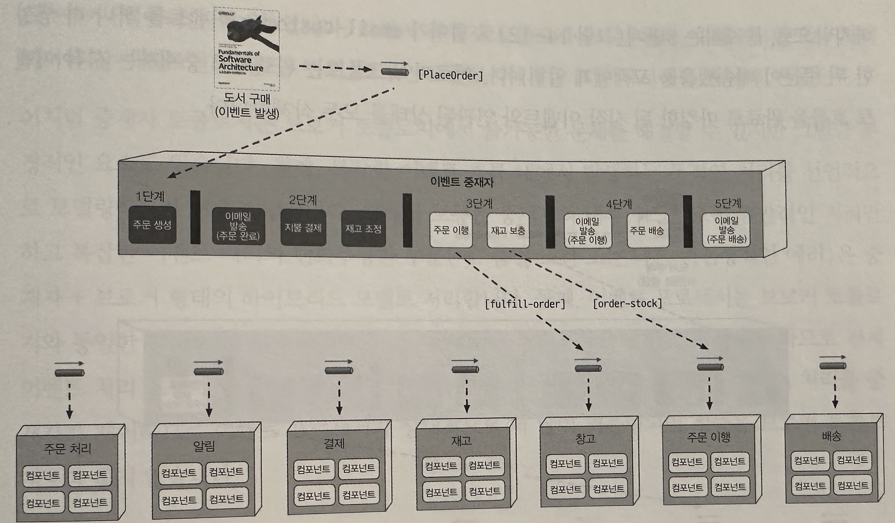

## 이벤트 기반 아키텍처 스타일

- `이벤트 기반 아키텍처(event-driven architecture)는 확장성이 뛰어난 고성능 애플리케이션 개발에 널리 쓰이는 비동기 분산 아키텍처 스타일이다`
- 적응성이 매우 좋기 대문에 소규모 부터 대규모 애플리케이션까지 두루 사용 가능하다
- 이벤트를 `비동기` 수신/처리 하는 별도의 이벤트 처리 컴포넌트들로 구성되며, 스탠드얼론 아키텍처 스탈일로 사용하거나 다른 아키텍처 스타일에 내장 할 수 있다
    - ex) 이벤트 기반 마이크로 서비스 아키텍처
- 애플리케이션은 대부분 요청 기반 모델(request-based model)을 따른다
    - 이 모델에서는 어떤 액션을 수행하도록 시스템에 요청하면 요청 오케스트레이터(reqeust orchestrator)가 접수한다
    - 요청 오케스트레이터는 보통 유저인터페이스이지만 API레이어나 엔터프라이즈 서비스로도 구현 가능하다
    - 요청 오케스트레이터는 확정적으로(deterministically) 동기적으로(syschronously)요청을 전달한다
    - 요청 프로세서서는 요청을 받아 데이터베이스에서 정보를 조회/수정하는 등의 작업을 수행하는 식으로 요청을 처리한다

## 토폴로지

- 토폴로지로는 중재자 토폴로지(mediator topology)와 브로커 토폴로지(broker toplogy)가 있다
    - 중재자 토폴로지 : 주로 이벤트 처리 워크플로를 제어해야 할 경우
    - 브로커 토폴로지 : 신속한 응답과 동적인 이벤트 처리 제어가 필요할 경우

### 브로커 토폴로지

- 중앙에 이벤트 중재자가 없다는 점에서 중재자 토폴로지와 차이가 있다
- 메시지는 (Kafka, RabbitMQ, ActiveMQ, HornetQ 등의)`경량 메시지 브로커`를 통해 브로드캐스팅되는 식으로 이벤트 프로세서 컴포넌트에 분산되어 흘러들어간다
- 비교적 이벤트 처리 흐름이 단순하고 굳이 중앙에서 이벤트를 조정할 필요가 없을 때 유용하다
- 컴포넌트 구성
    - 시작 이벤트, 이벤트 브로커, 이벤트 프로세서, 처리 이벤트
    - 1> 시작 이벤트(initiating event)는 전체 이벤트 흐름을 개시하는 이벤트를 말하며, 이벤트를 개시한다
    - 2> 시작 이벤트는 이벤트 브로커의 이벤트 채널로 전송된다
    - 3> 이벤트를 관리/제어하는 중재자 브로커가 없으므로 단일 이벤트 프로세서는 이벤트 브로커에서 시작 이벤트를 받자마자 관련되 처리 작업을 마친뒤 처리 이벤트를 생성하고 비동기로 알린다
    - 4> 처리 이벤트는 필요시 부가적인 처리를 위해 이벤트 브로커에 비동기 전송된다
    - 5> 다른 이벤트 프로세서는 처리 이벤트를 리스닝 하고 있다가 이벤트가 들어오면 그에 맞는 작업을 수행한 뒤 다시 새로운 이벤트를 발생함으로써 자신이 한일을 모두에게 알린다
    - 6> 위 과정이 최종 이벤트 프로세서가 한 일에 아무도 관심이 없을 때가지 반복된다
    - 즉, 이벤트 프로세서가 처리 하고 모두에게 알리고 아무도 관심이 없으면 종료된다
- 이벤트 브로커 컴포넌트는 보통 연합체(도메인 기반으로 클러스터링 된 다수의 인스턴스)로 구성되며 연합된 각 브로커에는 주어진 도메인의 이벤트 흐름에서 사용되는 모든 이벤트 채널이 들어 있다
- 브로커 토폴로지는 속성상 파이어 앤드 포겟 방식으로 비동기 브로드캐스팅을 하므로 토빅(AMQP는 토픽 인스체인지)은 일반적으로 발행-구독 메시징 모델을 사용하는 브로커 토폴로지에서 사용된다

- 보로커 토폴로지에서는 다른 이벤트 프로세서의 관심 여부와 무관하게 각 이벤트 프로세서가 자신이 한 일을 모두에게 알리는 게 항상 바람직하다
    - 그래야 나중에 이벤트를 처리하는 과정에서 기능 추가가 필요하게 되더라도 아키텍처를 쉽게 확장할 수 있다
    - 어차피 무시될 메시지를 보내는 것이 리소스 낭비라고 생각할 수 있지만 아니다 확장성의 좋은 사례이다

- 위 예제를 보면 이벤트 프로세서가 고도로 분리되어 있고 서로 독립적으로 움직인다
- 브로커 토폴로지는 릴레이(이어 달리기) 경주 같다고 생각하면 이해가 빠르다
- 단점
    - 성능, 응답성, 확장성 측면에서 장점이 많지만 그만큼 단점도 많다
    - 무엇보다 시작 이벤트와 연관된 전체 워크플로를 제어할 수가 없다
        - 따라서 다양한 조건에 따라 상황이 매우 유동적이고 어느 시스템 파트도 실제 주문 트랜잭션이 언제 끝났는지 모른다
        - 마찬가지로 에러 처리 역시 어렵다
        - 비즈니스 트랜잭션은 관찰/통제하는 중재자가 없으므로 처리가 실패해도 다른 파트는 그 사실을 모른다
        - 트랜잭션을 재시작하는 기능(복구성)도 브로커 토폴로지에서는 지원되지 않는다
- 장담점 비교

| 장점              | 단점       |
|-----------------|----------|
| 이벤트 프로세서가 디커플링됨 | 워크플로 제어  |
| 확장성 높은          | 에러 처리    |
| 응답성 우수함         | 복구성      |
| 성능 우수함          | 재시작 능력   |
| 내고장성 뛰어남        | 데이터 비일관성 |

### 중재자 토폴로지

- 중재자 토폴로지(mediator topology)는 브로커 토로로지의 단점들을 일부 보완한다
    - 여러 이벤트 프로세서 간의 조정일 필요한 시작 이벤트에 대하여 워크플로를 관리/제어하는 이벤트 중재자가 핵심이다
    - 중재자 토폴로지는 시작 이벤트, 이벤트 큐, 이벤트 중재자, 이벤트 프로세서, 5개의 아키텍처 컴포넌트로 구성된다

- 시작 이벤트가 전체 이벤트 프로세스를 개시하는 것은 브로커 토폴로지와 동일하지만, 중재자 토폴로지에서는 시작 이벤트는 큐를 거쳐 이벤트 중재자로 전달된다
- 이벤트 중재자는 이벤트 처리에 관한 단계 정보만 갖고 있으므로 점대점 메시징으로 각각의 이벤트 채널로 전달되는 처리 이벤트를 생성한다
    - 그러면 각 이벤트 프로세서는 자신의 이벤트 채널에서 이벤트를 받아 처리한 다음 중재자에서 작업을 완료했다고 응답한다
    - `각 이벤트 프로세서가 다른 프로세서에게 자신이 한 일을 알리지 않는다는 것도 브로커 토폴로지와의 차이점이다`
- 중재자 토폴로지 구현체에는 특정 도메인이나 이벤트 그룹과 연관된 `중재자가 여럿 존재한다`
    - 전체 고객에 관한 이벤트는 고객 중재자가 처리하고 주문 관련 이벤트는 주문 중재자가 처리하는 식이다
    - 이런 이유로 단일 장애점을 줄이고 전체 처리량과 성능을 높일 수 있다
- 이벤트 중재자는 처리하는 이벤트의 특성과 복잡도에 따라 다양한 방법으로 구현이 가능하다
    - 간단한 에러처리와 오케스트레이션이 필요한 이벤트는 아파치 카멜, 뮬ESB, 스프링 인티그레이션 등의 중재자로도 충분하다
        - 보통 이런 중재자는 이벤트 워크플로를 코드로 제어한다
    - 이벤트 워크플로에 조건부 처리가 많고 동적 경로가 많아 에러 처리가 복잡하다면 아파치 ODE나 오라클 BPEL프로세스 관리자 같은 중재자가 좋다
        - 보통 이런 중재자는 이벤트 처리 단게를 기술하는(XML구조와 비슷한)BPEL을 기반으로 하며, BPEL 아티팩트에는 에러 처리, 리다이렉션, 멀티 캐스팅 기능을 하는 요소들이 체계적으로 구현되어
          있다
        - BPEL은 강력한 만큼 배우기도 쉽지 않은 언어라서 일반적으로 BPEL엔진 제품군에 내장된 GUI도구를 이용해서 만든다
        - BPEL은 복잡하고 동적인 워크플로에는 잘 맞지만, 이벤트 처리 단계중 사람이 개입하는 실행 시간이 긴 트랜잭션이 필요한 이벤트 워크플로에는 적합하지 않다
            - ex)이벤트 처리 단계중 사람이 개입하여 승인을 해야 하는 경우

- 알맞은 인벤트 중재자 구현체를 선택하려면 먼저 중재자를 통해 어떤 종류의 이벤트를 처리할 것인지 생각해봐야 한다
- 이벤트 복잡도를 한 가지 기준으로 평가하는 경우는 거의 없으므로 알기 쉽게 단순함, 어려움, 복잡함 정도로 분류한 뒤 모든 이벤트가 항상 단순한 중재자를 거치도록 하는 것이 좋다
    - 그러면 이 중재자는 이벤트 등급에 따라 이벤트를 직접 처리하거나 더 복잡한 다른 이벤트 중재자에게 위윔한다
    - 이런 식으로 모든 종류의 이벤트를 그 에 알맞는 중재자가 효과적으로 처리할 수 있도록 구성한다

- Customer 중재자는 시작이벤트를 받아 처리 이벤트를 생성하는데, 2,3,4 단게의 처리 이벤트는 모두 동시에 발생하면서 단게별로 처리된다
    - 즉, 3단계가 끝나고 4단계가 시작되어야 한다

[1단계]

- 1> Customer 중재자는 먼저 create-order 처리 이벤트를 생성하고 이 메시지를 order-placement-queue로 보낸다
- 2> OrderPlacement 이벤트 프로세서는 이 이벤트를 받아 문제가 없는지 확인한 뒤 주문ID와 함게 중재자에게 확인 응답한다
- 3> 중재자는 해당 주문ID를 바로 고객에게 보내 주문 접수 사실을 알릴 수도 있고 모든 단게가 완료될 때까지 계속 진행 할 수도 있다

[2단계]

- 4> email-customer, apply-payment, adjust-inventory를 동시에 만들어 각자 지정된 큐로 전달한다
- 5> Notification, Payment, Inventory 세 이벤트 프로세서는 모두 메시지를 받아 해야할 일을 한 다음 처리가 완료됐음을 중재재에게 알린다
- 6> 중재자는 다음 3단게로 이동하기 전에 이 3개의 병렬 프로세스로 부터 모두 확인응답을 받을 때까지 대기하는데, 어느 한곳이라도 에러가 발생하면 중재자는 문제 해결을 위한 조치를 취할 수 있다

[3단계]

- 7> fullfill-order, order-stock 두 이벤트는 동시에 발생할 수 있고, OrderFullfillment, Warehouse 이벤트 프로세서는 이 두 이벤트를 받아 각자 해야할 일을 하고
  중재자에게 확인응답한다

[4단계]

- 8> ship-order 이벤트와 email-customer(배송 준비가 완료됐음을 고객에게 알림) 처리 이벤트도 함께 생성한다
- 9> 배송이 완료되고 난후 email-customer 이벤트를 하나 더 생성 한 뒤 주문이 배송됐음을 고객에게 알린다
- 10> 이로써 워크플로는 완료되고 중재자는 시작 이벤트 흐름을 완료로 마킹한 뒤 시작 이벤트와 연관된 상태를 모두 삭제한다

- 워크플로
    - 중재자 컴포넌트는 브로커 토폴로지와는 달리 워크플로에 대해 잘 알고 있고 통제가 가능하다
    - 중재자는 워크플로를 제어하므로 이벤트 상태를 유지하면서 필요시 에러 처리, 복구, 재시작을 할 수 있다
    - 예를 들어 신용카드가 만료되어 결제 처리가 안 됐다면, 이 에러 사실을 통보 받은 중재자는 결제 처리가 완료 될 때까지 주문을 이해할 수 없다(3단계)는 사실을 알고 있기 때문에 워크플로를 중단시킨 후
      자체 데이터 저장소에 요청 상태를 기록한다
    - 나중에 언제가 결제 처리가 완료되면 중단된 시점부터 워크플로를 다시 시작하면 된다
- 처리 이벤트
    - 두 토폴로지는 처리 이벤트의 의미와 사용 방법이 본질적으로 다르다
    - 브로커 토폴로지에서는 시스템에서 발생한 이벤트로서 처리 이벤트가 발행되고 이벤트 프로세서는 각자 맡은 일을 하면서 나머지 이벤트 프로세서는 그 액션에 반응하는 식이다
    - 중재자 토폴로지에서는 같은 처리 이벤트는 사건이 아니라 커맨드이다
        - 따라서 중재자 토폴로지에서는 처리 이벤트가 반드시 처리되어야 할 이벤트(커맨드)인 반면 브로커 토폴로지에서는 그냥 무시해도 된다
- 차이점
    - 중재자 토폴로지는 브로커 토폴로지에서 불가능한 문제를 해결했지만 그 만큼 부정적인 요소도 있다
    - 1> 복잡한 이벤트 흐름 내에서 발생하는 동적인 처리를 선언적으로 모델링하기가 매우 어렵다
        - 보통은 중재자의 내무 워크플로는 일반적인 처리만 하고 복잡한 이벤트 처리의 변화무쌍한 부분은 중재자+브로커의 형태의 하이브리드 모델로 처리한다
    - 2> 이벤트 프로세서 브로커 토폴로지와 동일한 방식으로 쉽게 확장할 수 있지만, 그러자면 중재자도 함께 확장해야 하므로 전체 이벤트 처리 흐름에 병목 지점이 생기기 쉽다
    - 3> 중재자 토폴로지는 이벤트 처리를 중재자가 제어하므로 이벤트 프로세서가 상대적으로 더 많이 커플링되어 성능은 브로커 토폴로지보다 좋지 않다
    - 결국, 워크플로 제어와 에러 처리 기능이 우선인가, 아니면 고성능과 확정성이 더 중요한가의 트레이드오프를 잘 따져 선택해야 한다

| 장점      | 단점             |
|---------|----------------|
| 워크플로 제어 | 이벤트 프로세서가 커플링됨 |
| 에러 처리   | 확장성 낮음         |
| 복구성     | 성능 낮음          |
| 재시작 능력  | 내고장성 좋지 않음     |
| 데이터 일관성 | 워크플로 모델링 복잡함   |

### 비동기 통신

- 이벤트 기반 아키텍처 스타일은 (이벤트 컨슈머의 응답을 받아야 하는)요청/응답 처리 뿐만 아니라 (응답이 필요 없는)파이어 앤드 포겟 처리 모두 비동기 통신 사용한다는 점에서 다른 아키텍처 스타일과 차별화 된다
- 비동기 통신은 시스템 응답성을 전반적으로 높이는 강력한 기법으로 활용할 수 있다
- 동기/비동기 차이
    - 위 이미지에서 동기 방식으로 댓글 API를 구현하면 받는 50(대기 시간)+ 3000(댓글 게시 작업시간) + 50(대기 시간)이 소요 된다
    - 하지만 비동기 방식으로 처리하면 25 밀리초밖에 안걸린다 &rarr; 실제로 댓글 게시 작업시간은 3000 걸린다
    - 하지만 중요한 점은 비동기 방식은 성능을 올린 것이 아니라 응답성을 올려준 것이다
    - 문제점은 동기 방식은 사용자의 댓글이 게시 되었음을 보장해주지만 비동기 방식을 그렇지 못하다. 예외가 작업 처리중 예외가 발생 할 수도 있기 때문
- `따라서 비동기 방식의 가장 큰 문제점은 에러 처리이다`
    - 이 문제는 `워크플로 이벤트 패턴이라는 리액티브 아키텍처 패턴`으로 해결 한다

### 에러 처리

- 리액티브 아키텍처의 워크플로 이벤트 패턴은 비동기 워크플로에서 에러 처리 문제를 해결하는 한 가지 방법이다
- 시스템을 응답성에 영향을 미치지 않고 탄력적으로 에러를 처리할 수 있게 만든는 패턴이다 (탄력성과 응답성 둘다 향상)
- 흐름
    - 1> 이벤트 프로듀서는 메시지 채널을 통해 데이터를 이벤트 컨슈머에게 비동기 전송을 한다
    - 2> 이벤트 컨슈머가 데이터를 처리하는 도중 에러가 발생하면 즉시 해당 에러를 워크플로 프로세서에게 위임하고 다음 큐로 넘어간다 (응답성에 영향이 없기 위해서)
    - 3> 에러를 수신한 워크플로 프로세서는 메시지에 뭐가 잘못됐는지 살펴본후 원데이터를 변경해서 긴급 조치한 후 원래 큐로 돌려 보낸다
    - 4> 이벤트 컨슈머는 이 메시지를 새로운 메시지로 간주하여 이번에는 성공을 기대하며 재처리를 시도한다
    - 5> 워크플로 프로세서가 파악할수 없는 문제가 있는 경우 대시보드라고 부르는 애플리케이션이 받는다
        - 대시보드는 보통 업무 담당자의 데스크탑에 위치하는데, 담장자는 직접 메시지를 확인해 조치하고 원래 큐로 다시 전송한다

### 데이터 소실 방지

- 비동기 통신을 할 때 데이터 소실은 언제나 중요한 관심사인데, 불행하게도 이벤트 기반 아키텍처는 데이터가 소실될 만한 곳이 많다
    - 데이터 소실이란 메시지가 도중에 삭제되거나 최종 목적지에 도달하지 못한 상태를 말한다

- 이벤트 프로세서 A가 큐에 메시지를 비동기 전송하고 이벤트 프로세서 B는 이 메시지를 받아 데이터베이스에 삽입한다고 가정할 경우, 다음 세가지에서 소실이 발생할 수 있다
    - 1> 이벤트 프로세서 A에서 메시지가 큐로 전달되지 않는다. 아니면 전달되어도 다음 이벤트 프로세서가 메시지를 가져오기 전에 브로커가 다운된다
    - 2> 이벤트 프로세서 B가 큐에서 다음 메시지를 꺼내 이벤트를 처리하기 전에 장애가 발생한다
    - 3> 데이터 에러로 인해 이벤트 프로세서 B가 데이터베이스에 메시지를 저장할 수 없다
- 1번 문제는 `동기 전송`과 `퍼시스턴트 메시지 큐`를 이용하면 해결 할 수 있다
    - 퍼시스턴스 메시지 큐는 이른바 전달 보장(guranteed delivery)도 지원한다
    - 즉, 메시지 브로커가 메시지를 수신하면 신속한 조회를 위해 메모리에 저장하는 동시에 물리적 데이터 저장소에도 메시지를 정한다
    - 이렇게 처리하면 메시지 브로커가 다운돼도 메시지가 디스크에 물리적으로 저장되어 있기 때문에 브로커가 다시 살아나면 메시지 처리를 게속할 수 있다
    - 동기 전송은 브로커가 메시지를 저장했다고 확인응답을 줄 때까지 메시지 프로듀서를 차단하여 기다리게 한다
    - 이렇게 하면 메시지는 프로듀서 또는 퍼시스턴스 메시지 큐에 있기 때문에 소실될 일은 없다
- 2번 이슈는 `클라이언트 확인응답 모드`(client acknowledge mode)라는 기본적인 메시징 기술을 이용하면 해결 가능하다
    - 원래 메시지는 큐에서 빠져나가는 즉시 삭제되는데(자동 확인 응답모드 auto acknowledge mode), 클라이언트 확인응답 모드는 메시지를 큐에 보관한 채 다른 컨슈머가 메시지를 읽을 수 없게
      클라이언트 ID를 메시지에 부착한다
    - 따라서 이벤트 프로세서 B가 잘못돼도 메시지는 큐에 계속 남아 있으니 데이터 소실을 방지 할 수 있다

- 3번 이슈는 데이터베이스 본연의 ACID 트랜잭션의 커밋으로 해결 가능하다
    - 데이터베이스에 커밋이 일어나면 데이터가 확실하게 저장된다
    - `최종 참여자 지원(last participant support, LPS)`를 활용하면 메시지 처리가 끝나 데이터베이스에 저장됐음을 확인한 이후 큐에서 메시지가 삭제 된다
    - 따라서 이벤트 프로세서 A에서 데이터베이스로 가는 도중에 메시지가 소실될 일은 없다

### 브로드캐스팅

- 이미지 처럼 이벤트 기반 아키텍처는 메시지를 누가 받든, 그 메시지로 무슨 일을 하든 상관없이 이벤트를 브로드캐스트(전파)할 수 있다
    - 그러므로 브로드캐스팅은 이벤트 프로세서를 가장 높은 수준으로 디커플링하는 수단이며, 최종 일관성, 복잡한 이벤트 처리(complex event processing, CEP)등 다양한 쓰임새를 지닌 필수
      기능이다

### 요청-응답

- 이벤트 기반 아키텍처는 동기 통신이 필요한 경우에는 요청-응답 메시징(reqeust-reponse messaging, 의사 동기 통신 이라고도 함)방식으로 수행한다

- 요청-응답 메시징 내부의 각 이벤트 채널은 요청 큐, 응답 큐로 구성된다
    - 처음 정보를 요청하면 요청 큐에 비동기 전송된 후 메시지 프로듀서에게 제어권이 반환되며, 메시지 프로듀서는 응답 큐에 응답이 도착하길 기다리며 차단 대기(blocking wait)상태가 된다
    - 메시지 컨슈머가 메시지를 받아 처리한 후 응답 큐에 응답을 보내면 이벤트 프로듀서는 응답 데이터가 포함된 메시지를 수신한다

- 요청-응답 메시징 구현 주요 기술

- 첫째, 일반적인 기술로, 메시지 헤더에 상관(correlation)ID를 사용하는 것이다
    - 상관ID는 응답 메시지의 필드로, 대부분 원요청 메시지의 메시지 ID로 세팅된다
- 1> 이벤트 프로듀서는 요청 큐에 메시지를 보내고 고유한 메시지 ID(위 이미지에서 124)를 기록한다. 아직 상관ID(CID)는 null이다
- 2> 이벤트 프로듀서는 메시지 필터(메시지 셀렉터라고도 함)로 응답 큐를 차단 대기한다. 이 때 메시지 헤더에는 원메시지 ID 124와 동일한 상관ID가 있다. 현대 응답 큐에는 상관ID가 120인 메시지 ID
  855, 상관 ID가 122인 메시지 ID855가 있다. 이 두 메시지 모두 이벤트 컨슈머가 찾고 있는 상관 ID(CID 124)와 일치하지 않으므로 어느 것도 선택되지 않는다
- 3> 이벤트 컨슈머는 메시지(ID 124)를 받아 요청을 처리한다
- 4> 이벤트 컨슈머는 응답 메시지를 생성하고 메시지 헤더의 상관 ID(CID)를 원메시지 ID(124)로 세팅한다
- 5> 이벤트 컨슈머는 새 메시지(ID 857)를 응답 큐로 보낸다
- 6> 2단계의 메시지 셀렉터와 상관ID(124)가 일치하므로 이벤트 프로듀서는 메시지를 수신한다

- 둘째, 응답 큐에 임시 큐를 두고 요청-응답 메시징을 구현하는 방법이다
    - 임시 큐는 지정된 요청에만 사용되는데, 요청이 들어오면 생성되고 요청이 종료되면 삭제된다
    - 임시 큐는 각 요청별로 이벤트 프로듀서만 알고 있는 전용 큐이므로 상관ID는 필요하지 않다
- 1> 이벤트 프로듀서는 임시 큐를 생성하고 (또는 메시지 브로커에 따라 자동 생성됨) reply-to헤더(또는 사전 정의된 다른 커스텀 헤더)에 임시 큐 이름을 세팅하여 요청 큐에 메시지를 보낸다
- 2> 이벤트 프로듀서는 임시 큐를 차단 대기하면서 응답이 도착하길 기다린다. 이 큐에 전달됨 메시지는 원메시지를 보낸 이벤트 프로듀서에게만 속하므로 따로 메시지 셀렉터는 필요 없다
- 3> 이벤트 컨슈머는 메시지를 받아 요청을 처리한 후 reply-to 헤더에 세팅된 이름을 가진 응답 큐로 응답 메세지를 보낸다
- 4> 이벤트 프로세서는 메시지를 수신한 다음 임시 큐를 삭제한다
- 기술적으로는 임시 큐가 훨씬 단순하지만 메시지 브로커는 매번 요청을 할 때마다 임시 큐를 생성/폐기하는 일을 반복해야 한다
    - 대용량 메시지 처리 시 브로커의 속도가 크게 떨어지고 전체 성능과 응답성 역시 영향을 받을 수 있다
    - 일반적으로 상관ID를 사용하는 쪽을 권장 한다

### 요청 기반이이냐, 이벤트 기반이냐

- 워크플로의 확정성과 제어가 중요하면 체게적인 데이터 기반의 요청에 특화된 요청 기반 모델을
- 복잡하고 동적인 유저 처리 등 주로 고도의 응답성과 확장성을 요하는 유연한 액션 단위의 이벤트를 처리한다면 이벤트 기반 모델이 좋은 선택이다

- 이벤트 기반 모델의 장담점

| 요청 기반보다 좋은 점        | 장단점                  |
|---------------------|----------------------|
| 동적인 유저 콘텐츠의 응답성이 좋음 | 최종 일관성만 지원됨          |
| 확장성, 탄력성이 우수홤       | 처리 흐름을 제어하기 곤란함      |
| 민첩성과 변화 관리가 우수함     | 이벤트 흐름의 결과를 예측하기 어려움 |
| 적응성과 확장성이 뛰어남       | 테스팅, 디버깅이 어려움        |
| 응답성과 성능이 좋음         |                      |
| 실시간 의사 결정이 가능함      |                      |
| 상황 인지에 따른 반응성이 좋음   |                      |

### 하이브리드 이벤트 기반 아키텍처

- 이벤트 기반 아키텍처와 다른 아키텍처 스타일을 함께 사용하는 하이브리드 아키텍처 기반의 애플리케이션도 있다
    - 이벤트 기반 아키텍처를 다른 아키텍처 스타일의 일부로 활용하는 아키텍처 스타일로 마이크로 서비스 아키텍처, 공간 기반 아키텍처가 대표적이다
    - 그 밖에 이벤트 기반 마이크로커널 아키텍처, 이벤트 기반 파이프라인 아키텍처도 하이브리드 아키텍처로 사용 가능하다
- 어떤 아키텍처 스타일이든지 이벤트 기반 아키텍처를 추가하면 병목 지점을 제거하고 이벤트 요청을 백업하는 배압 지점(back pressure point)를 확보하는 데 유용하며, 다른 아키텍처 스타일에서는 찾아 볼
  수 없는 유저 응답성이 보장된다
- 마이크로서비스 아키텍처, 공간 기반 아키텍처는 데이터 펌프에 메시징을 활용하며, 다른 프로세서에 데이터를 비동기 전송하여 데이터베이스 데이이터를 업데이트 한다
    - 또 서비스 간에 메시지를 주고 받으며 통신 할 때 마이크로서비스 아키텍처의 서비스와 공간 기반 아키텍처의 처리 장치 모두 이벤트 기반 아키텍처를 활용함으로써 프로그래밍 방식의 확장성을 달성 할 수 있다

### 아키텍처 특성 등급

- 이벤트 기반 아키텍처는 특정 도메인이 여러 이벤트 프로세서에 분산되어 있고 중재자, 큐, 토픽을 통해 서로 묶여 있는 기술 분할된 아키텍처 이다
    - 한 도메인에 변경이 발생하면 많은 이벤트 프로세서, 중재자, 다른 메시징 아티팩트에도 영향을 미치므로 이벤트 기반 아키텍처는 도메인 분할 아키텍처는 아니다
- 이벤트 기반 아키텍처는 각 이벤트 프로세서의 데이터베이스 상호작용 및 요청-응답 처리를 기반으로 하므로 퀀텀 수는 1개 이상 가능하다
- 성능, 확장성, 내고장성은 만점이다 이게 이 스타일의 주요 강점이다
- 이 아키텍처 특유의 비결정적, 동적인 이벤트 흐름 때문에 단순성과 시험성은 낮다 
- 진화성은 만점