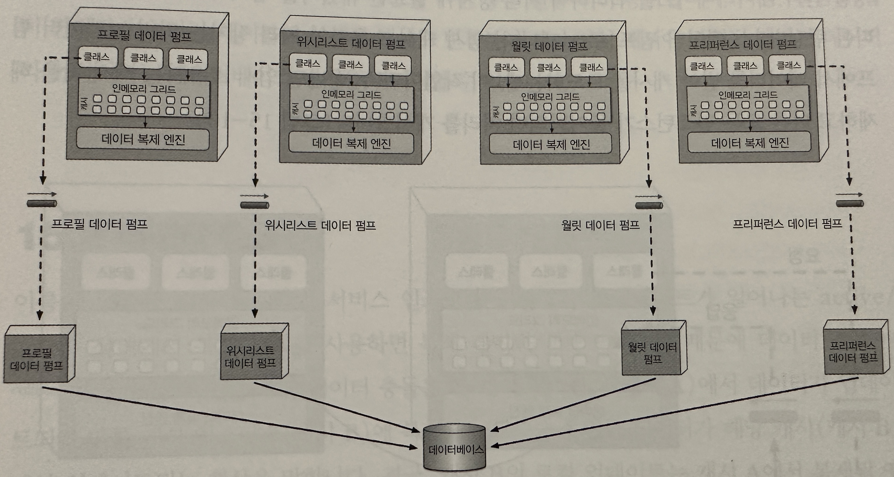

## 공간 기반 아키텍처 스타일


- 웹 기반 비즈니스 애플리케이션은 대부분 일반적인 요청 흐름을 따라간다 (브라아저&rarr;웹 서버&rarr;애플리케이션 서버&rarr;데이터베이스 서버)
    - 이런 패턴은 유저가 많지 않으면 별 문제가 없지만 유저 수가 늘어나면 점점 병목 현상이 나타난다
    - 처음에는 웹 서버 레이어에서 발생하다가 나중에는 애플리케이션, 데이터베이스 서버에서도 나타난다
    - 가장 일반 적인 해결 방법은 웹 서버 확장이며 가장 쉽고 저렴하며 효과적이지만 유저 부하가 높을 때 웹 서버를 확장 하면 병목접은 애플리케이션으로 이동하기 쉽다
    - `결국 앞단을 늘리면 병목은 점점 뒤로 이동할 뿐이며 뒤로 이동 할 수록 복잡하고 비용이 커지며 위 이미지 처럼 화살표 모양의 삼격형 토폴로지가 그려진다`

- 공간 기반 아키텍처 스타일(space-based architecture style)은 높은 확장성, 탄령성, 동시성 및 이와 관련된 문제를 해결하기 위해 설계퇸 아키텍처 스타일이다
    - 동시 유저 수가 매우 가변적이라서 예측조차 곤란한 애플리케이션에서도 유용하다
    - `극단적으로 가변적인 확장성 문제는 데이터베이스를 확장하거나, 확장성이 떨어지는 아키텍처에 맞게 캐시 기술을 적용하는 것보다 이케텍처적으로 해결하는 것이 더 좋다`

## 토폴로지


- 공간 기반 아키텍처 명친은 튜플 공간에서 유래 됐다
    - 튜플 공간 : 공유 메모리를 통해 통신하는 다중 병렬 프로세서를 사용 하는 기술
- 시스템에서 동기 제약조건인 중앙 데이터베이스를 없애는 대신, 복제된 인메모리 데이터 그리드(in-memory data grid)를 활용하면 확장성, 탄력성, 성능을 높일 수 있다
    - 애플리케이션 데이터는 메모리에 둔 상태로 모든 활성 청리 장치들이 데이터를 복제한다
    - 처리 장치는 데이터를 업데이트 할 때 퍼시스턴스 큐(persistent queue)에 메시지를 보내는 식으로 데이터베이스에 `비동기` 전송한다
    - 유저 부하의 증가/감소에 따라 처리 장치는 독적으로 시작/종료할 수 있어 `가변적`으로 확장할 수 있다
    - 중앙 데이터베이스가 애플리케이션의 표준 트랜잭션 처리에 관여하지 않으므로 데이터베이스 병목 현상이 사라지고 애플리케이션은 `무한한 확장성`이 보장된다
- 컴포넌트 구성
    - 애플리케이션 코드가 구현된 처리 장치(processing unit)
    - 처리 장치를 관리/조정 하는 가상 미들웨어 (virtualized middleware)
    - 업데이트된 데이터를 데이터베이스에 비동기 전송하는 데이터 펌프(data pump)
    - 데이터 펌프에서 데이터를 받아 업데이트를 수해하는 데이터 라이터(data writer)
    - 처리 장치가 시작되자마자 데이터베이스의 데이터를 읽어 전달하는 데이터 리더(data reader)

### 처리 장치


- 처리 장치는 애플ㄹ케이션 로직을 갖고 있다. 보통 백엔드 비즈니스 로직이 포함되나 애플리케이션 종류마다 내용물은 달라진다
    - 작은 웹 기반 애플리케이션은 단일 처리 장치에 배포할 수 있지만, 대규모 애플리케이셔은 기능별로 여러 처리 장치에 나누어 배포 해야 한다
- 애플리케이션 로직 외에도 해이즐캐스터, 아파치 이그나이트, 오라클 코히어런스 등의 제품에 있는 인메모리 데이터 그리드 및 복제 엔진도 처리 장치에 포함된다

### 가상 미들 웨어

- 가상 미들웨어는 아키텍처 내부에서 데이터 동기화 및 요청 처리의 다양한 부분을 제어하는 인프라를 담당한다
- 미들웨어는 메시징 그리드(messaging grid), 데이터 그리드(data grid), 처리 그리드(processing grid), 배포 관리자(deployment manager) 등의 컴포넌트로 구성된다
    - 이들 컴포넌트는 사용자가 직접 작성하거나 서드파티 제품으로 구매할 수 있다

#### 메시징 그리드


- 위 이미지 처럼 입력 요청과 세션 상태를 관리한다. 가상 미들웨어에 요청이 유입되면 메시징 그리드는 어느 활성 처리 장치가 요청을 받아 처리할지 결정하여 해당 처리 장치로 요청을 전달한다
- 메시징 그리드의 복잡도는 단순 라운드 로빈 알고리즘부터 처리 장치가 요청 처리 상태를 추적하는 복잡한 알고리즘까지 다양한다
- 이 컴포넌트는 보통 부하 분산이 가능한 일반 웹 서버(ex. HA프록시, 엔진엑스 Nginx)로 구현한다

#### 데이터 그리드


- 이 아키텍처 스타일에서 가장 중요하고 필수적인 컴포넌트이다
- 요즘은 데이터 그리드가 거의 대부분 복제 캐시로서 처리 장치에만 구현되어 있지만, 외부 컨트롤러가 필요한 복제 캐시 구현체나 분산 캐시(distributed cache)를 사용할 경우, 데이터 그리드는 가상
  미들웨어 내부의 데이터 그리드 컴포넌트와 처리 장치 모두에 위치한다
- 메시징 그리드는 가용한 모든 처리 장치에 요청을 전달할 수 있으므로 각 처리 장치는 자신의 인메모리 데이터 그리드에 정확히 동일한 데이터를 갖고 있어야 한다
    - 위 이미지는 처리 장치 간 동기식 데이터 복제 흐름을 나타낸 것이다
    - 실제로 데이터 동기화는 비동기 방식으로 매우 신속하게, 대게 100밀리초 미만으로 이루어 진다
- 데이터는 이름이 동일한 데이터 그리드가 포함된 처리 장치 간에 동기화 된다

```
HazlecastInstance hz = Hazlecast.newHazelcastInstance();
Map<String, CustomerProfile> porfileCache = hz.getReplicateMap("CustomerProfile");
```

- 위 코드는 헤이즐 캐스트로 고객 프로필 정보를 담고 있는 처리 장치에 대해 내부 복제 데이터 그리드를 생성하는 코드이다
    - 이 코드는 고객 프로필 정보에 액세스 하는 모든 처리 장치에 포함될 것이다
    - 만약 처리 장치 어디서건 CustomerProfile이라는 캐시에 변경이 일어나면 동일한 이름의 캐시가 포함된 다른 모든 처리 장치에 변경된 데이터가 복제된다
- 처리 장치는 작업을 마치는 데 필요한 만큼의 복제 캐시를 소유할 수 있다
    - 한 처리 장치가 다른 처리 장치를 원격 호출해서 데이터를 요청하거나(코레오그래피)처리 그리드를 이용해서 요청을 오케스트레이트하는 방법도 있다
- 데이터 처리 장치 내부에서 복제되므로 데이터베이스에서 데이터를 읽지 않아도 서비스 인스턴스의 가동/중지가 가능하다
    - 단, 이름을 부여한 복제 캐시를 가진 인스턴스가 하나이상 필요하다
- 각 처리 장치는 멤버 리스트(member list)를 사용해 다른 모든 처리 장치 인스턴스를 인지한다
    - 멤버 리스트에는 동일한 이름의 캐시를 사용하는 다른 모든 처리 장치의 IP주소 및 포트가 들어 있다 (아래코드)

```
Instance 1:
Members {size:2, ver:2}[
  Member [172.19.248.89]:5701 - 129afdsfljk1-saldf-123nkadvjn-aksjd
  Member [172.19.248.90]:5702 - adsf123112fs-saldf-23fasdf23r2asf12
}
Instance 2:
Members {size:2, ver:2}[
  Member [172.19.248.89]:5701 - 129afdsfljk1-saldf-123nkadvjn-aksjd
  Member [172.19.248.90]:5702 - adsf123112fs-saldf-23fasdf23r2asf12
}
```

#### 처리 그리드


- 처리 그리드는 가상 미들웨어에서 필수 컴포넌트는 아니지만, 다수의 처리 장치가 단일 비즈니스 요청을 처리할 경우 요청 처리를 오케스트레이트하는 일을 한다
- 또 종류가 다른 처리 장치(예: 주문 처리 장치와 결제 처리 장치)사이에 조정이 필요한 요청이 들어오면 처리 그리드가 두 처리 장치 사잉에서 요청을 중재/조정한다

#### 배포 관리자

- 배포 관리자는 부하 조건에 따라 처리 장치 인스턴스를 동적으로 시작/종료하는 컴포넌트이다
- 응답 시간, 유저 부하를 게속 모니터링하다가 부하가 증가하면 새로운 처리장치를 가동하고 반대로 감소하면 기존 처리 장치를 종료한다
- 애플리케이션에서 다양한 확장성(탄력성)요구사항을 구현하는데 꼭 필요한 컴포넌트이다

#### 데이터 펌프


- 데이터 펌프는 데이터를 다른 프로세서에 보내 데이터베이스를 업데이트하는 장치이다
    - 공간 기반 아키텍처는 처리장치가 데이터를 데이터베이스에서 직접 읽고 쓰지 않으므로 데이터 펌프는 반드시 필요하다
- 데이터 펌프는 항상 비동기로 동작하면서 메모리 캐시와 데이터베이스의 최종 일관성을 실현한다
    - 처리 장치 인스턴스가 요청을 받고 캐시를 업데이트하면 처리 장치가 그 업데이트의 소유자가 되므로 데이터베이스 역시 데이터 펌프를 통해 최종 일관적으로 업데이트 되도록 업데이트를 전송해야 한다
    - 위 이미지에서 보다시피, 데이터 펌프는 대개 메시징 기법으로 구현하며, 공간 기반 아키텍처에서 메시징은 데이터 펌프를 구현하는 효과적인 방법이다
    - 메시징은 비동기 통신을 지원하고 전달을 보장하며 FIFO큐를 통해 메시지 순서도 유지한다
    - 메시징을 이용하면 처리 장치와 데이터 라이터를 분리할 수 있기 때문에 데이터 라이터를 사용할 수 없는 경우에도 처리 장치에서 무중단 처리가 가능하다
- 대부분의 경우 데이터 펌프는 도메인이나 그 서브도메인(예: 고객, 재고)별로 여러 개를 사용한다
    - 캐시 종류(예: CustomerProfile, CustomerWishList 등)별로 전용 데이터 펌프를 두거나 이보다 훨씬 더 크고 일반적인 캐시를 포함한 처리 장치 도메인(예:Customer)별로
      배정할 수도 있다
- 데이터 펌프는 계약 데이터와 연관된 액션(추가,삭제, 수정)을 포함한다
    - 계약 포맷은 JSON스키마, XML스키마, 객체, 값 기반 메시지(value-driven message)등 다양한다
- 업데이트 데이터는 보통 데이터 펌프 안에 새 데이터 값만 보관한다
    - 가령, 고객이 자신의 프로필에서 전화 번호를 변경할 경우, 고객ID, 데이터 업데이트 액션, 그리고 새 전화 번호만 전송 된다

### 데이터 라이터


- 데이터 라이터는 데이터 펌프에서 메시지를 받아 그에 맞게 데이터베이스를 업데이트하는 컴포넌트이다
- 데이터 라이터는 서비스나 애플리케이션, 데이터 허브(예: 앱 이니셔,Ab Initio)로 구현할 수 있다
- 데이터 라이터의 세분도는 데이터 펌프와 처리 장치의 범위마다 다른다
    - 도메인 기반의 데이터 라이터는 데이터 펌프 수와 무관하게 특정 도메인(예:고객)의 전체 업데이트를 처리하는 데 필요한 모든 데이터베이스 로직을 갖고 있다
    - 위 이미지를 보면 고객 도메인(Profile, WishList, Wallet, Preferences)을 처리 장치 4개와 데이터 펌프 4개로 처리하지만 데이터 라이터는 하나밖에 없다



- 위 이미지처럼 처리 장치 클래스마다 자체 전용 데이터 라이터를 두는 경우도 있다
    - 각 데이터 라이터가 자신의 전용 데이터 펌프를 소유하고 해당 처리 장치(예:Wallet)의 데이터 베이스 로직을 처리한다
    - 이 모델은 데이터 라이터가 너무 많은 단점이 있지만, 처리장치, 데이터 펌프, 데이터 라이터가 나란히 정렬되어 확장성, 민첩성은 더 좋다

### 데이터 리더


- 데이터 리더는 데이터베이스에서 데이터를 읽어 리버스 데이터 펌프(reverse data pump)를 통해 처리 장치로 실어 나르는 컴포넌트이다
- 공간 기반 아키텍처에서 데이터 리더는 세가지 경우에만 작동된다
    - 1> 동일한 이름의 캐시를 가진 모든 처리 장치 인스턴스가 실패하는 경우
    - 2> 동일한 이름의 캐시 안에서 모든 처리 장치를 재배포 하는 경우
    - 3> 복제 캐시에 들어있지 않은 아카이브 데이터를 조회하는 경우
- 즉, 인스턴스가 모조리 다운되면 데이터는 데이터베이스에서 읽어올 수밖에 없다
    - 처리 장치 인스턴스가 하나 둘 살아나기 시작하면서 각 인스턴스는 캐시에서 락을 확득하려고 한다
    - 락을 손에 넣은 첫 번째 인스턴스는 임시 캐시 소유자가 되고 한발씩 늦은 나머지 인스턴스들은 락이 해제될 때기 마냥 기다린다 (캐시 구현체 마다 로직은 조금씩 다르지만 여기에서 캐시 소유자 하나라고
      가정)
    - 임시 캐시 소유자가 된 인스턴스는 데이터를 요청하는 큐에 메시지를 보내 캐시를로드한다
    - 그러면 데이터 리더가 읽기 요청을 받아 데이터베이스를 쿼리하여 처리 장치에 필요한 데이터를 검색하고 그 결과 데이터를 다른 큐(리버스 데이터 펌프)에 보낸다
    - 임시 캐시 소유자인 처리 장치는 리버스 데이터 펌프에서 데이터를 받아 캐시를 로드하는데, 이 작업이 모두 끝나면 임시 소유자는 캐시 락을 해제하고 다른 모든 인스턴스가 동기화되면 처리를 개시한다
- 데이터 리더도 데이터 라이터처럼 도메인 기반으로 할 수 있지만 특정 처리 장치의 클래스 전용으로 사용하는 게 보통이다
    - 서비스, 애플리케이션, 데이터 허브 모두 구현체는 데이터 라이트와 동일하다
- 데이터 라이터와 데이터 리더는 본질적으로 데이터 추상 레이어(또는 어떤 경우에는 데이터 액세스 레이어)를 형성 한다
    - 두 레이어의 차이점은 처리 장치가 데이터베이스의 테이블(또는 스키마)구조를 얼마나 자세히 알고 있는가 이다
    - 데이터 액세스 레이어는 처리 장치가 데이터베이스의 하부 데이터 구조와 커플링되어 있으므로 데이터 리더/라이터만 사용해서 간접적으로 데이터베이스에 액세스 한다
    - 하지만 이와 달리, 데이터 추상 레이어는 처리 장치가 별도의 계약에 의해 하부 데이터베이스의 테이블 구조와 분리되어 있다
    - 읿잔적으로 공간 기반 아키텍처는 데이터 추상 레이어 모델에 기반하므로 처리 장치마다 복제 캐시 스키마는 하부 데이터베이스의 테이블 구조와 다를 수 있고, 따라서 처리 장치에 영향을 미치지 않고서도
      데이터베이스 증분 변경이 간으하며, 데이터 리더/라이터에 이미 변환 로직이 포함되어 있기 때문에 이런 증분 변경에 더 용이하다
    - 가령, 컬럼 타입이 변경되거나 컬럼/테이블이 삭제될 때에도 변경분이 처리 장치 캐시에 반영될 때까지 데이터 리더/라이터는 데이터베이스 변경을 버퍼링할 수 있다

## 데이터 충돌

- 이름이 동일한 캐시가 포함된 서비스 인스턴스에서 시시각각 업데이트가 일어나는 active/active 상태에서 복제 캐시를 사용하면 복제 레이턴스(replication latency)때문에 데이터 충돌(data
  collision)이 발생할 수 있다
    - 데이터 충돌은 한 캐시 인스턴스(캐시 A)에서 데이터가 업데이트되어 다른 캐시 인스턴스(캐시 B)에 복제하는 도중에 동일한 데이터가 해당 캐시(캐시 B)에서 업데이트 되는 현상을 말한다
    - 결국, 캐시 B의 로컬 업데이트는 캐시 A에서 복제된 옛 데이터 때문에 덮어씌워지고, 반대로 캐시 A에서는 동일한 데이터가 캐시 B에서 발생한 업데이트 때문에 덮어씌워지는 불상사가 일어난다
    - [예제]
    - 파란색 제품의 현재 재고는 500개 이다
    - 서비스 A는 파란색 제품의 재고 캐시를 490개(10개 판매)로 업데이트 한다
    - 캐시를 복제하는 동안 서비스 B는 파란색 제품의 재고 캐시를 495개(5개 판매)로 업데이트 한다
    - 서비스 A의 업데이트를 복제했기 때문에 서비스 B의 재고 캐시는 490로 업데이트 된다
    - 서비스 A의 캐시는 서비스 B의 업데이트를 복제했기 때문에 495개로 업데이트 된다
    - 서비스 A,B 두 캐시 모두 값이 정확하지 않고 동기화가 어긋난다(재고는 485개가 되어야 한다)
- 데이터 충돌 발생 빈도는 동일한 캐시를 포함한 처리 장치 인스턴스 수, 캐시 업데이트 율, 캐시 크기, 캐시 제품의 복제 레이턴시 등 여러 팩터가 영향을 미친다
    - 데이터 충돌 발생 빈도는 수학적으로 공식이 있으며 이를 통해서 복제 캐시를 선택하는게 좋은지 나쁜지 고려할 수 있다
    - 가변적인 복제 레이턴시는 데이터 일관성에 중대한 영향을 미치기 떄문에 (네트워크 유형, 처리 장치가 물리적 거리등)운영 환경에서 직접 측정을 해야 한다

## 클라우드 대 온프레미스 구현


- 공간 기반 아키텍처는 배포 환경 측면에서 독자적인 선택지가 있다
    - 처리 장치, 가상 미들 웨어, 데이터 펌프, 데이터 리더/라이터, 데이터베이스 등 전체 토폴로지는 클라우드 기반의 환경이다 온프레미스(자체운영)에 배포할 수 있다
    - 하지만 이 두 환경 사이에 어중간하게 배포할 수도 있는데, 이것이 다른 아키텍처 스타일에서는 찾아볼 수 없는 이 아키텍처의 특징이다
- 이미지 처럼 물리 데이터베이스와 데이터를 온프레미스에 그대로 둔 상태로, 클라우드 기반의 매니지드(관리형) 환경에서 처리 장치와 가상 미들웨어를 통해 애플리케이션을 배포하는 하이브리드 클라우드가 가능 하다는 것이
  강점이다
- 즉, 트랜잭션은 탄력적인 동적 클라우드 기반의 환경에서 처리하되, 물리적인 데이터 관리, 리포팅, 데이터 분석 데이터는 안전한 로컬 온프레미스 환경에서 보관할 수 있다

## 복제 캐시 대 분산 캐시


- 공간 기반 아키텍처는 캐시 기술을 활용하여 애플리케이션 트랜잭션을 처리하고 데이터베이스에 직접 읽기/쓰기를 할 필요가 없어서 확장성, 탄력성 성능이 우수하다
    - 대부분의 공간 기반 아키텍처는 복제 캐시를 사용하지만 분산 캐시도 사용할 수 있다
- 복제 캐시를 사용할 경우 위 이미지 처럼, 각 처리 장치는 이름이 동일한 캐시를 사용하는 모든 처리 장치 간에 동기화되는 자체 인메모리 데이터 그리드를 갖고 있다
    - 한 처리 장치에서 캐시가 업데이트되면 다른 처리 장치도 새로운 데이터로 자동 업데이트되는 구조이다
    - 복제 캐시는 속도가 매우 빠르고 높은 수준의 내고장성을 지원하며 중앙 서버에서 캐시를 자고 있는 형태가 아니므로 단일 장애점이 없다
    - 그러나 어떤 캐시 구현체를 사용하는지에 따라 이 규칙에도 예외가 있을 수 있다
    - 예를 들어 처리 장치 간 데이터 복제를 제어하고 모니터링하면서 외부 컨트롤러가 반드시 필요한 캐시 제품도 있다. 물론, 대부분의 제품 개발사는 이런 모델링을 지양하는 추세이다
- 복제 캐시는 공간 기반 아키텍처의 표준 캐시 모델이지만, 데이터량(캐시 크기)가 엄청나게 많거나 캐시 데이터가 너무 빈번하게 업데이트되는 등 복제 캐시를 사용할 수 없는 경우도 있다
    - 실제로 내부 메모리 캐시가 100MB를 초과하면 각 처리 장치마다 메모리를 점유하기 때문에 탄력성, 확장석에 문제가 발생할 수 있다
    - 캐시 데이터 업데이트율이 매우 높은 경우에는 모든 처리 장치 인스턴스에서 데이터 일관성이 보장되도록 업데이트도 신속하게 이루어져야 하지만 데이터 그리드가 미처 이 속도를 따라잡지 못할 수도 있다 이럴 경우
      분산 캐시를 사용하면 좋다


- 분산 캐시를 구현하려면 이미지처럼 중앙 캐시를 갖고 있는 전용 외부 서버 또는 서비스가 필요하다
- 처리 장치는 데이터를 내부 메모리에 저장하는 대신, 전용 프로토콜을 통해 중앙 캐시 서버에 있는 데이터를 액세스 한다
- 모든 데이터가 한 곳에 있고 복제할 필요가 없으니 분산 캐시는 높은 수준의 데이터 일관성을 보장하지만, 캐시 데이터를 원격에서 가져와야 하므로 복제 캐시보다 성능이 낮고 시스템 전체 레이턴시가 증가하며 내고장성도
  낮아 진다
- 결국 분산 캐시냐 복제 캐시냐는 데이터 일관성이냐 성능/내고장성 이냐의 문제이다
    - 일관성이 중요한 데이터는 분산 캐시를 사용하고
    - 자주 변경되지 않는 데이터는 복제 캐시를 사용하여 빠른 조회를 꾀한다

| 결정 기준   | 복제 캐시      | 분산 캐시       |
|---------|------------|-------------|
| 최적화     | 성능         | 일관성         |
| 캐시 크기   | 적다 < 100MB | 크다 > 500 MB |
| 데이터 유형  | 교적 정적임     | 매우 동적임      |
| 업데이트 빈도 | 비교적 낮음     | 매우 높음       |
| 내고장성    | 좋음         | 나쁨          |

## 니어 캐시


- 니어 캐시(near-cache, 준캐시)는 분산 캐시와 인메모리 데이터 그리드를 접합한 일종의 하이브리드 캐시 모델이다
- 이미지처럼, 이 모델에서 분산 캐시는 풀 백킹 캐시(full backing cache), 각 처리 장치에 포함된 인메모리 데이터 그리드는 프런트 캐시(front cache)라고 한다
    - 프런트 캐시는 항상 풀 백킹 캐시보다 작은 서비세트를 담고 있고, 방출 정책(eviction policy)을 통해 옛 항목을 삭제 한 다음 최근 항목을 추가한다
    - 프런트 캐시는 가장 최근에 사용한 항목에 포함되 MRU(most recentely used)캐시 또는 가장 자주 사용한 항목이 포함되는 MFU(most frequently used)캐시로 사용한다
    - 새 항목을 추가할 공간이 필요할 때마다 무작위로 항목을 삭제하는 랜덤 교체(RR, Randon Replcaement)도 프런트 캐시에서 적용가능한 방출 정책이다
        - 랜텀 캐시는 가장 최근에 사용된 데이터와 가장 자주 사용된 데이터를 확실하게 분석할 수 없을 경우에 유용한 정책이다
- 프런트 캐시는 항상 풀 백킹 캐시와 동기화되지만 각 처리 장치에 포함된 프런트 캐시는 동일한 데이터를 공유하는 다른 처리 장치와 동기화되지 않는다
    - 즉, 동일한 데이터 큰텍스트(예: 고객 프로필)를 공유하는 여러 처리 장치가 동일하지 않은 데이터를 갖자의 프런트 캐시에 소유하게 될 수도 있다
    - 이처럼 처리 장치마다 상이한 데이터를 프런트 캐시에 갖게 되고 처리 장치 간 성능과 응답성의 일관성이 결여 된다
    - 따라서 공간 기반 아키텍처에서 니어 캐시 모델을 권장하지 않는다

## 구현 예시

- 공간 기반 아키텍처는 유저 수나 요청량이 갑자기 폭증하는 애플리케이션이나 10,000명이 넘는 동시 유저를 처리해야 하는 종류의 애플리케이션에 적합하다
    - 온라인 콘서트 티켓 판매 시스템과 온라인 경매 시스템이 공간 기반 아키텍처로 구축하기에 좋은 후보들이다
    - 공통적으로 높은 확장성, 탄력성, 고성능이 보장되어야 한다

### 콘서트 티켓 판매 시스템

- 티켓 발매가 시작되면 티켓을 사려는 동시 유저 수가 급증하는 패턴을 보인다
- 좌석 선호도와 상관없이 티켓 수량은 정해져 있다. 엄청난 동시 요청 수를 감당하려면 좌석 가능 여부가 가능한 신속하게, 지속적으로 업데이트돼야 한다
    - 중앙 데이터베이스에 동기적으로 액세스하면 머지않아 작동이 멎게 될 가능성이 높다
    - 일반적인 데이터베이스가 이 정도로 표준 트랜잭션을 수만개나 동시 처리하기는 매우 어렵다
- 공간 기반 아키텍처는 이런 애플리케이션에서 꼭 필요한 고도의 탄력성을 제공하므로 안성맞춤이다
    - 배포 관리자가 동시 유저 스파크를 바로 인지하여 대량 요청을 감당할 수 잇도록 다수의 처리 장치를 기동한다

## 아키텍처 등급


- 탄력성, 확장성, 성능의 끝판왕이다
    - 인메모리 데이터 캐시를 활용하고 제약조건에 해당되는 데이터베이스를 없앴기 때문에 세가지 특성을 높은 수준으로 달성할 수 있다
    - 수백만 명의 동시 유저도 거뜬히 처리할 수 잇다
- 탄력성, 확정성, 성능의 트레이드 오프로 전체적인 단순성과 시험성 측면이 있다
    - 주요 데이터 저장소에서 캐시를 사용하고 최종 일관성이라는 개념을 적용하기 때문에 구조가 매우 복잡한 아키텍처이다
    - 때문에 수많은 가동부에서 충돌이 발생해도 데이터가 소실되는 일은 없도록 특별한 주의를 기울여야 한다
- 비용이 단점이다
    - 클라우드 및 온 프레미스 시스템에서 높은 확장성과 탄력성을 실현하려면 상용 캐시 제품을 사용해야 하는데, 라이선시 비용을 지불해야 하기때문에 비싸다
- 분할 유형은 도메인 + 기술 분할이다 

