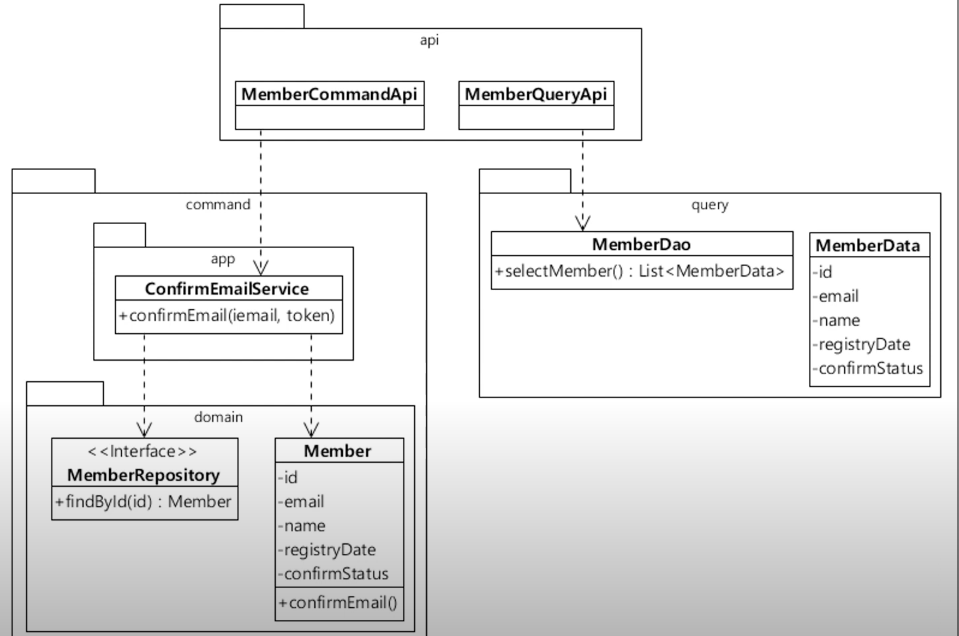
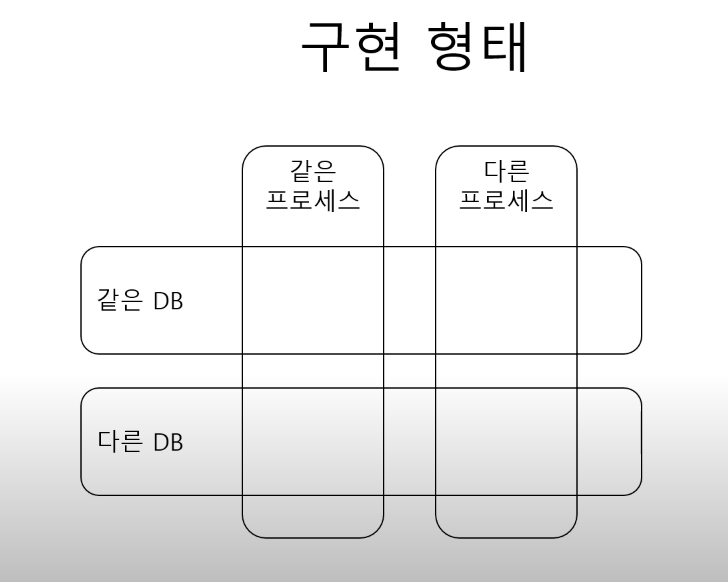
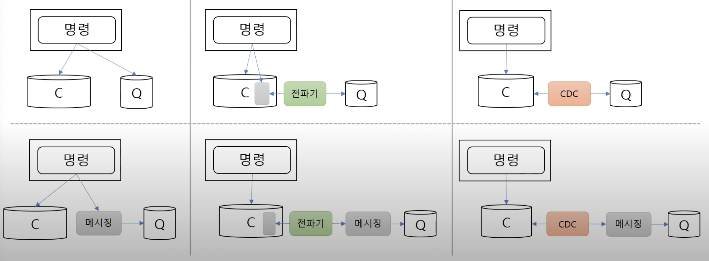

## 커맨드-쿼리 책임 분리(CQRS, Command-Query Responsibility Segregation)

- 책에 없는 자료이고 외부 자료이지만 아키텍처 스타일이 가장 많이 나온 책에 포함 시켰음

### 개념

- CQRS는 시스템을 변경 하는 것과 조회 하는 것의 구성요소(코드, 서버 등등)를 분리하는 아키텍쳐이다
- 예를 들면 커맨드, 쿼리는 API 부터 다르다
- 위 이미지를 보면 Member나 Memberdata나 거의 비슷한데 이렇게 해야할까?
    - 이렇게 나누지 않으면 Member는 잡탕이 된다
    - 코드 역할/책임 모호, 의미/가독성이 나빠짐, 유지보수성이 떨어진다
    - 애초에, 명령과 조회는 다루는 데이터가 다르다. 일반적으로 명령은 한 영역의 데이터, 쿼리는 여러 영역의 데이터를 다루는 경우가 많다. 또한 명령과 쿼리는 코드의 변경 빈도, 사용자도 다르다
    - 즉 단일책임 원칙을 지키기 위해서는 분리가 필요하다

### 구현 형태

#### 같은 프로세스, 같은DB

- 가장 단순한 형태, 코드 수준에서만 명령과 쿼리가 분리
- 명령/쿼리 동일 데이터 보장
- 트랜잭션 처리도 쉬움

#### 같은 프로세스, 같은 DB, 다른 테이블

- 쿼리 전용 테이블 사용
    - ex) 최근 조회수 많은 글 목록
- 명령과 쿼리가 코드/테이블 수준에서 분리된다
    - 즉 쿼리 전용 테이블이 존재한다
- 명령이 쿼리 전용 데이터 변경 유발

#### 같은 프로세스, 다른 DB

- ex)상품 목록을 Redis와 같은 저장소에 캐싱, 쿼리모델은 레디스를 사용하는 방식
- 명령으로 인해서 변경된 내용을 쿼리 DB에도 전파해야 한다
    - 다양한 변경 방법이 존재한다

#### 다른 프로세스, 다른 DB

- 마이크로서 서비스에서 많이 사용하는 방식
- 명령으로 인해서 변경된 내용을 쿼리 DB에도 전파해야 한다
    - 다양한 변경 방법이 존재한다
    - 1> 명령이 쿼리DB를 직접 수정한다 (메시징 방식) 구현이 가장 쉽지만 유실 가능성이 있다
    - 2> 전파기를 이용하여 명령이 변경내용을 기록한다 (전파이 다음에 메시징을 둘 수 있다)
    - 3> DB가 제공하는 CDC를 사용한다 (CDC 다음에 메시징을 둘 수 있다)

### 다른 DB 사용시 주의 사항

- 데이터 유실
- 허용 가능 지연 시간
- 중복 전달