## 아키텍처 리스크 분석

- 리스크 스토밍활동을 통해 리스크를 도출, 평가, 식별하는 핵심 기술과 프랙틱스

## 리스크 매트릭스

- 리스크 매트릭스를 활용하면 주관성을 낮추고 특정한 아키텍처 영역에서 리스크를 찾아내는 데 도움이 된다

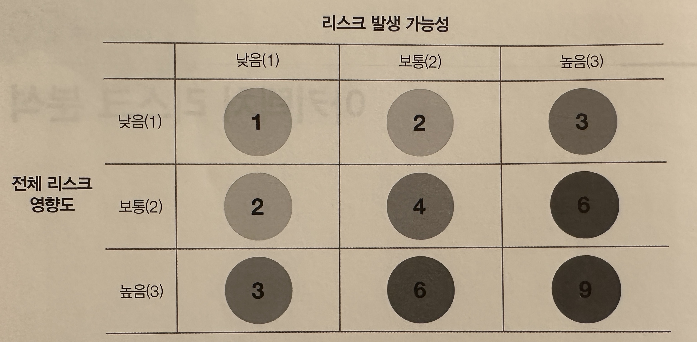

- 리스크 매트릭스는 위 이미지와 같다. 전체 리스크 영향도와 발생 가능성, 두 가지 차원으로 리스크를 평간한 뒤 낮음, 중간, 높은 등급을 매긴 것이다
- 괄호 안 숫자와 매트릭스 각 그리드의 숫자를 곱하면 리스크를 객관적인 수치로 정량화 할 수 있다
- 1,2는 낮은 리스크, 3,4는 중간, 6~9까지는 높은 리스크를 나타낸다
- 예를 들어 중앙 데이터베이스의 가용성이 문제가 됐다고 할 경우,
    - 1> 전체 리스크 영향도 차원을 생각한다. 데이터베이스가 다운되어 사용할 수 없게 되면 전체 시스템이 망함으로 리스크가 높다고 보 3,6,9중 하나로 평가할 것이다
    - 2> 하지만 이 리스크의 발생 가능성 차원을 보면, 다운되어 불용 상태가 될 가능성은 희박하다. 따라서 3점 정도로 평가할 것이다

## 리스크 평가

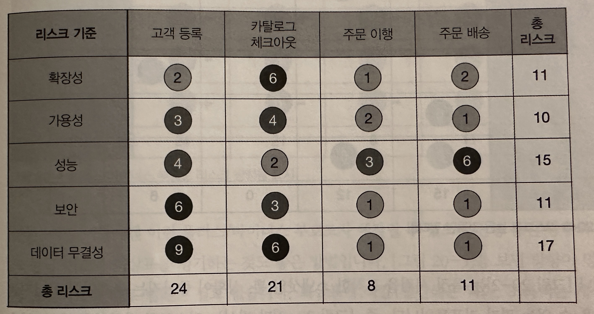

- 리스크 매트릭스를 활용하면 리스크 평가를 작성할 수 있다. 리스크 평가는 전체 아키텍처 리스크를 요약할 리포트이다
- 위 이미지는 기본적인 리스크 평가 리포트 포맷이다
- 리스크 매트릭스로 정량화한 리스크는 평가 기준별로, 서비스 또는 도메인 영역별로 누적치를 계산할 수 있다
    - 데이터 무경성에 관한 누적 리스크는 17점으로 가장 높다
- 상대적 수치를 비교하면 어떤 리스크 범주나 도메인 영역에서 리스크가 개선됐는지, 아니면 악화됐는지 파악할 수 있다
- 위 이미지는 모든 항목의 리스크 분석 결과를 담고 있지만, 이렇게 표현하는 경우는 겅의 없다
    - 주어진 맥락에 맞게 전달하려믄 메시지를 잘 표현하려면 필터링이 필요하다

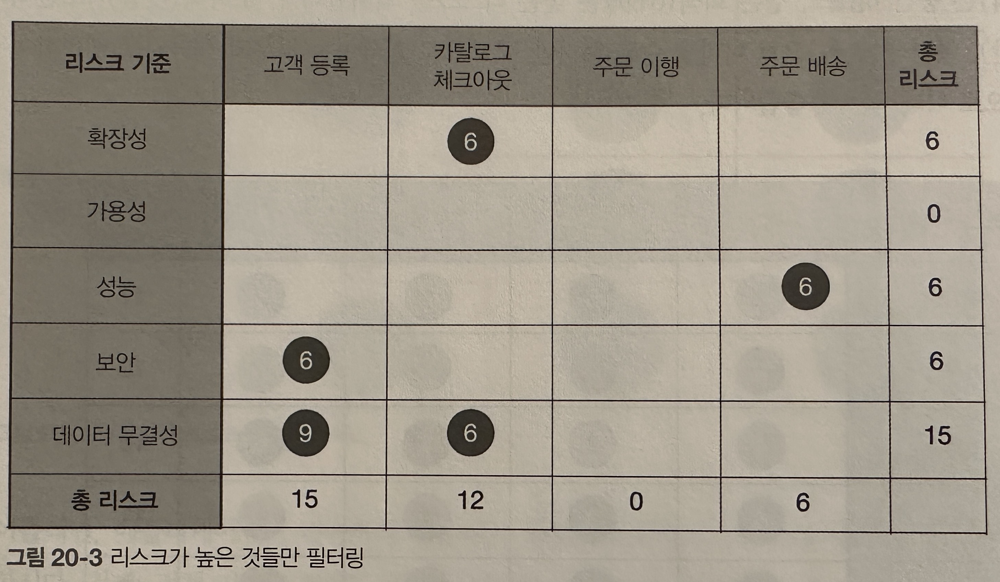

- 위 그림처럼 필터링을 거쳐 리스크가 높은 영역만 표시하면 전체적인 신호 대 잡음비가 개선되고, 시스템이 지금 좋은 상태인지, 나쁜 상태인지 명확하게 드러난다

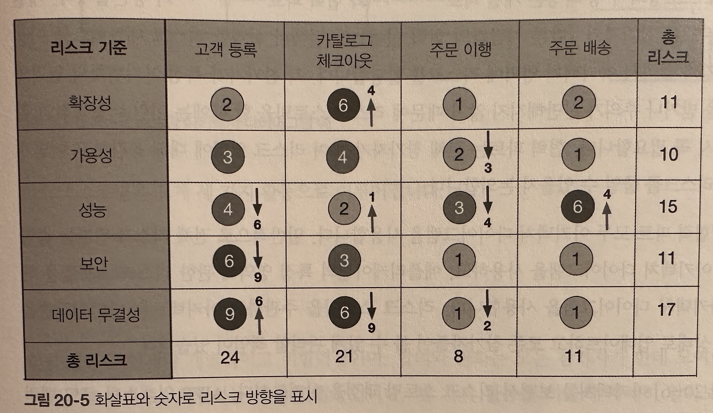

- 위 이미지를 보면 +,- 기호를 이용해서 상확이 좋아지고 있는지 나빠지고 있는지를 보여주고 있다
    - +는 개선, -는 악화

### 리스크 스토밍

- 아키텍트 혼자서 모든 리스크를 결정할 수는 없다. 시스템 전 부문을 완벽하게 알고 있는 아키텍트도 없기 때문에 리스크 스토밍을 하는 것이 좋다
- 리스크 스토밍은 특정 범위 내에 있는 아키텍처 리스크를 찾아내는 협렵적인 활동이다
    - 일반적인 리스크 영역으로는 점증되지 않은 기술, 성능, 확장성, 가용성, 데이터 소실, 단일 장애 지점, 보안 등이 있다
- 리스크 스토밍의 수행 과정은 개별 파트와 협력 파트가 공존한다
    - 개별 파트는 모든 참가자가 앞 절에서 설명할 리스크 매트릭스를 이용하여 각자 알아서 아키텍처 영역에 리스크를 할당한다(상호 협력 없이)
    - 합력 파트는 전체 참가자가 모여 리스크 영역에 대해 공감하고 어떻게 하면 리스크를 줄일 수 있을지 논의한다

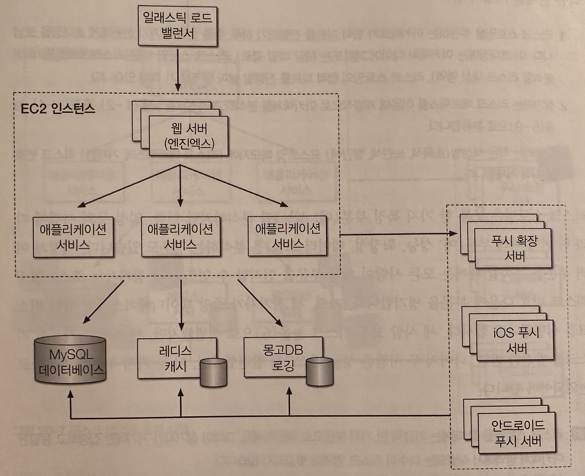

- 리스크 스토밍은 크게 세 가지 활동으로 이루어 진다
    - 식별(identification)
    - 합의(consensus)
    - 완화(mitigation)

### 식별

- 각 참여자가 아키텍처 내부의 리스크 영역을 개인적으로 리스크 매트릭스를 이용해 개별적으로 아키텍처를 분석하고 분류한다(낮음, 중간, 높음)

### 합의

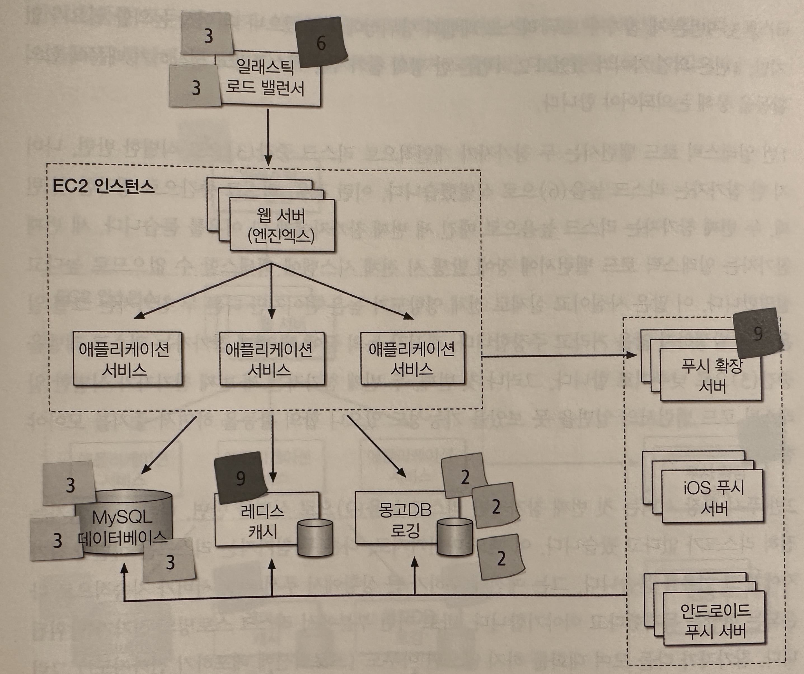
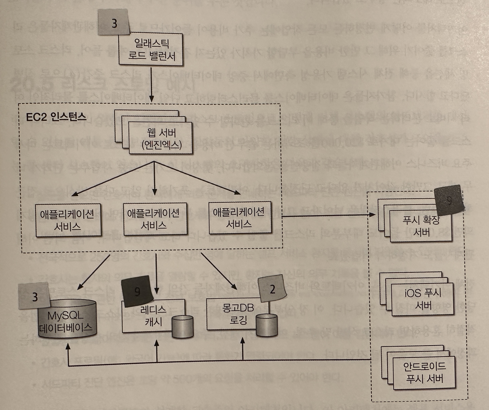

- 참가자 모두가 아키텍처 내부의 리스크에 대해 뜻을 함께 한께 한다는 목표를 생각해보면 매우 협력적인 활동이다
- 참가자들은 각자 리스크를 발견한 영역의 아케텍처 다이어그램에 포스트잇을 붙인다
- 목표는 참가자들이 한 팀이 되어 리스크 영역을 분석하고 그것이 리스크가 맞는지 합의를 이끌어내는 것이다
- 왼쪽에서 오른쪽이미지로 합의 결과를 볼 수 있다

### 완화

- 리스크 영역에 합의한 후 마지막으로 가장 중요한 리스크 완화 활동을 한다
- 합의와 마찬가지로 협력 파트인 완화 활동에서 참가자는 앞서 식별된 리스크를 줄이거나 없앨 방법을 모색한다
    - 아키텍처를 어떻게 변경하든 모든 작업에는 추가 비용이 들어가므로 주요 이해관계자들은 리스크를 줄이기 위해 그 만한 비용을 부담할 가치가 있는지 결정한다

## 리스크 스토밍 예시

- 시스템 요구 사항
    - 질문을 받으면 간호사나 환자에게 의료 문제를 안내하는 서드파티 진단 엔진을 사용한다
    - 환자는 콜 센터에 전화를 걸어 간호사와 통화하거나 간호사 없이 직접 진단 엔진에 액세스하는 셀프 서비스 웹사이트를 이용한다
    - 전국적으로 250명의 간호사와 수십만 명에 달하는 셀프 서비스 환자를 동시에 지원할 수 있어야 한다
    - 간호사는 환자의 의무 기록을 열람할 수 있지만, 환자는 자신의 의무 기록을 볼 수 없다
    - 의무 기록에 관한 미국 의료정보 보호법을 준수해야 한다. 즉 간호사 이외의 그 누구도 의무 기록을 열람할 수 없다
    - 전염병과 독감이 유행하는 시즌에 데이터 요청이 급증해도 시스템이 이를 감당해야 한다
    - 간호사 프로필(예: 외국어 가능)에 따라 통화가 연결되어야 한다
    - 서드파티 진단 엔진은 초당 약 500개의 요청을 처리할 수 있어야 한다

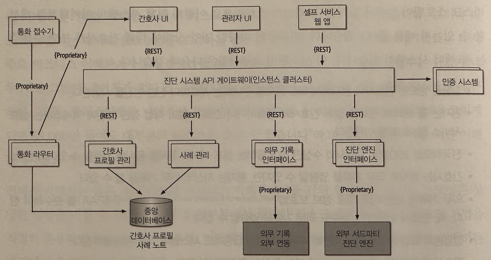

- 위 이미지는 아키텍트가 설계한 고수준의 아키텍처이다
    - 셀프 서비스용 인터페이스, 전화를 받는 간호사용 인터페이스, 관리 직원이 간호사 프로필과 시스템 설정값을 추가하는 관리용 인터페이서, 3개의 웹 기반 유저인터페이스가 있다
    - 사례 관리 서비스, 간호사 프로필 관리 서비서, 의무 기록 인터페이스, 외부 서드 파티 진단 엔진 이렇게 4개의 주요 서비스로 구성된다
- 아키텍처는 가용성, 탄력성, 보안 측면에서 어느 정도의 리스크가 있는지 알오보려고 한다

### 가용성

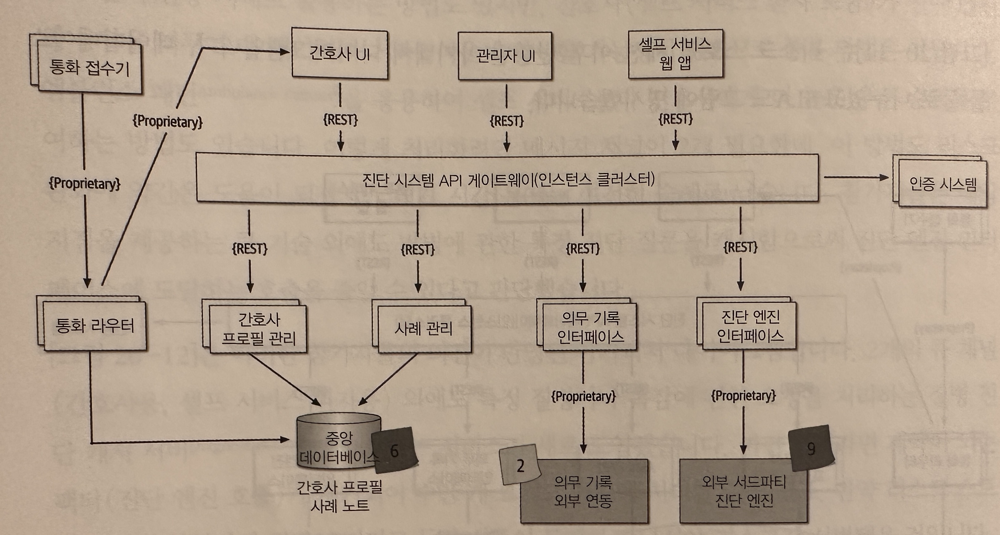

- 위 이미지는 리스크 스토밍 결과이다
    - 중앙 데이터베이스를 사용하는 아키텍처는 영향도가 높고 기능성이 중간이므로 리스크 높은(6)으로 식별 됐다
    - 진단 엔진 가용성은 영향도가 높고 기능성을 알 수 없으므로 리스크 높은(9)로 식별 됐다
    - 의무 기록 가용성은 시스템 실행에 필수 컴포넌트가 아니므로 리스크 낮음(2)로 식별 됐다
    - 각 서비스는 여러 인스턴스로 구성되어 있고 API게이트웨이도 클러스터링되어 있으니 다른 시스템 파트는 기용성 측명에서 리스크로 보이지 않는다
- 데이터베이스 리스크를 완화하려면 하나의 물리적인 데이터베이스를 간호사 프로필 정보가 저장된 데이터베이스 클러스터, 단일 인스턴스 형태의 사례 기록용 데이터베이스, 이렇게 2개로 분리하는게 낫다는 결론을 내렸다
    - 데이터베이스 가용성에 대한 우려가 사라지고 사례 기록은 관리자만 볼 수 있도록 보안성도 개선되는 효과가 있었다
    - 간호사 프로필 정보를 통화 라이터에 캐시하는 방법도 생각해볼 수 있지만, 통화 라이투어ㅢ 구현 코드가 서드파티 제품일 가능성이 높아 데이터베이스 액세스방식을 채택했다
- 외부 시스템(진단 엔진, 의무 기록 시스템)은 마음대로 제어할 수 없기 떄문에 가용성 관리가 어렵다
    - 이런 종류의 가용성 리스크를 완화하는 한 가지 방법은, 시스템 별로 SLA(서비스 수준 계약)이나 SLO(서비스 수준 목표)가 명시된 문서를 확인해보는 것이다
    - 진단 엔진의 SLA가 99.99%(연간 다운타임 56.60분), 의무 기록 시스템이 99.9%(연간 다운 타임8.77시간)으로 리스크가 없다고 봐도 무방하다

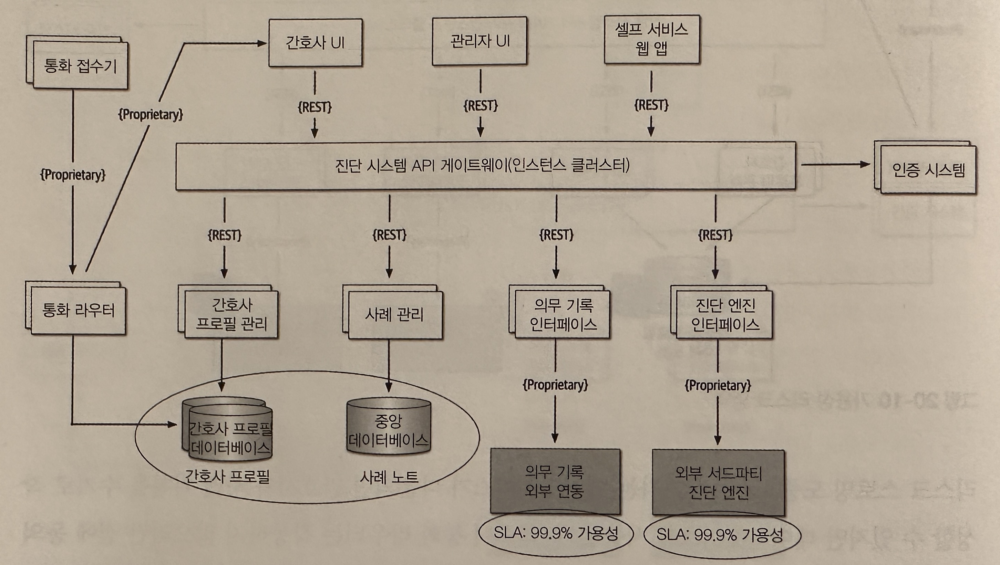

- 위 이미지는 가용성 결과를 반영한 아키텍처이다

### 탄력성

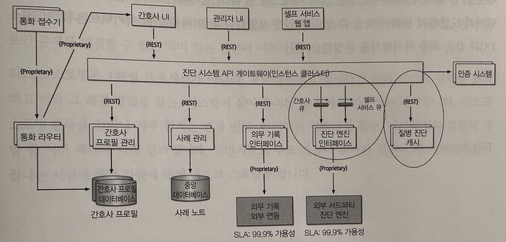

- 간호사는 250명에 불과하지만 셀프 서비스 파트도 진단 엔진과 간호사 정보를 액세스할 수 있으므로 진단 인터페이스에 상당한 요청이 몰릴 수 있다
    - 참가자 모두 진단 엔진 인터페이스를 리스크 높음(9)로 식별했고, 가뜩이나 REST를 연계 프로토콜로 사용하는 아키텍처라면 더 더욱 감당하기 어렵다
- 완화 방안
    - API 게이트웨이와 진단 엔진 인터페이스 간의 배압 지점에 비동기 큐(메시징)를 두고 진단 엔진 호출의 완충 지대로 활용하는 방법도 있지만, 간호사(셀스 서비스 환자 포함)가 진단 엔진의 응답을 너무 오래
      대기하거나 타임아웃이 발생할 가능성이 있으므로 좋은 방법은 아니다
    - 앰뷸런스 패턴을 응용하여 셀프 서비스보다 간호사에게 더 높은 우선 순위를 부여하는 방법도 있다. 이방법은 채널이 2개 필요한데, 이 방법도 리스크 완화에 약간은 도움이 되겠지만 대기 시간 문제는 여전히
      숙제로 남는다
    - 참가자들은 배압지점을 제공하는 큐 기술 외에도 발병에 관한 특정 진단 질문을 캐시함으로써 진단 엔진 인터페이스에 도달하는 호출을 줄일 수 있다고 판단했다
- 위 이미지는 이런 의견들이 반영된 아키텍처 다이어그램이다
    - 2개의 큐 채널(간호사용, 셀프 서비스 환자용)외에도 특정 질병이나 독감에 관한 요청을 처리하는 질변 진단 캐시서버 서비스가 도입됐다

### 보안

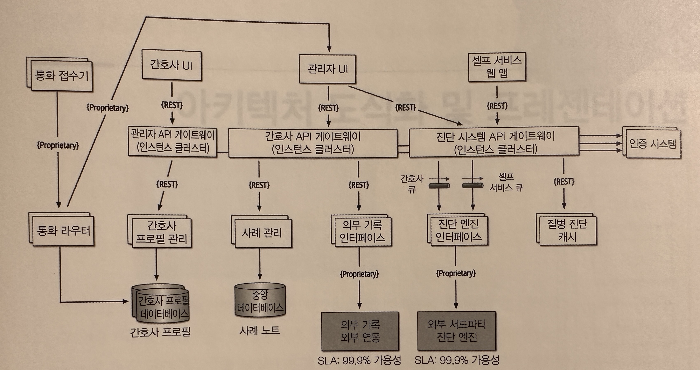

- 참가자 전원 진단 시스템 API 게이트웨이를 리스크 높음(6)으로 식별했다
- 참가자 들은 유저 유형별로 API게이트웨이를 사용하면 관리자용 웹 유저 인터페이스 또는 셀프 서비스용 웹 유저 인터페이스의 호출이 의무 기록 시스템까지 도달하지 못하게 막을 수 있다고 입을 모았다
- 위 이미지는 이를 반영한 완성된 최종 아키텍처이다 