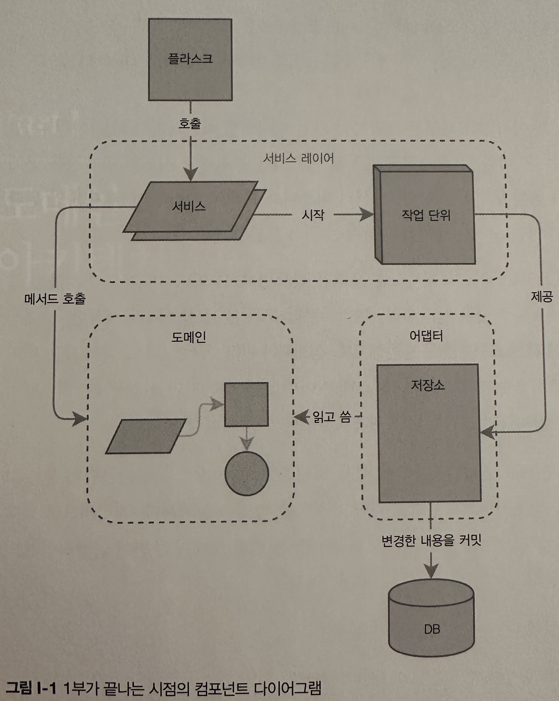

- 데이터베이스 스키마 부터 정하는게 아니라 `먼저 행동하고 저장에 대한 요구 사항은 행동에 맞춰 정해야져야 한다`
- 파트1에서는 TDD를 통해 풍부한 객체 모델을 만든느 방법을 살펴본다(1장) 그 후 이 모델을 기술적인 고려 사항으로부터 분리해 유지하는 방법을 사펴본다
- 적극적으로 리팩토링할 수 있도록 영속성을 모르는 코드를 만드는 방법과 도메인 주변에 안정적인 API를 만드는 방법을 보여준다
    - 이를 위한 4가지 설계 패턴
    - 저장소 패턴(repository pattern)은 영속적인 저장소에 대한 추상화다
    - 서비스 계층 패턴(service layer pattern)은 유스 케이스의 시작과 끝을 명확하게 정의하기 위한 패턴이다
    - 작업 단위 패턴(unit of work pattern)은 원자적 연산을 제공한다
    - 애그리게이트 패턴(aggregate pattern)은 데이터 정합성을 강화하기 위한 패턴이다

- 위 이미지는 1부가 끝난 시점의 컴포넌트 다이어그램이다
