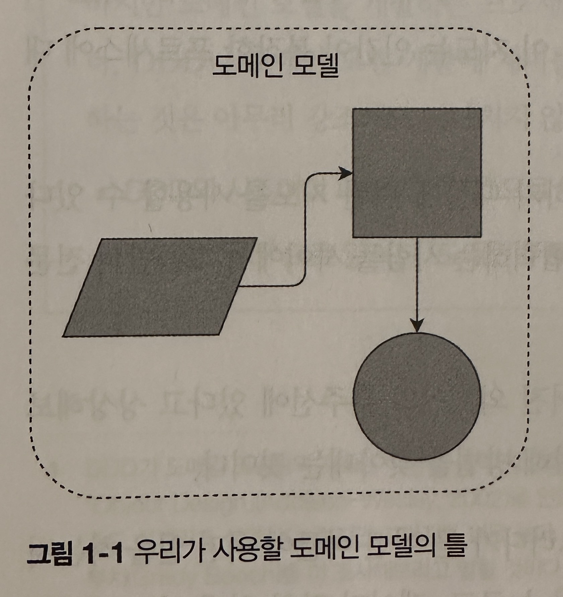
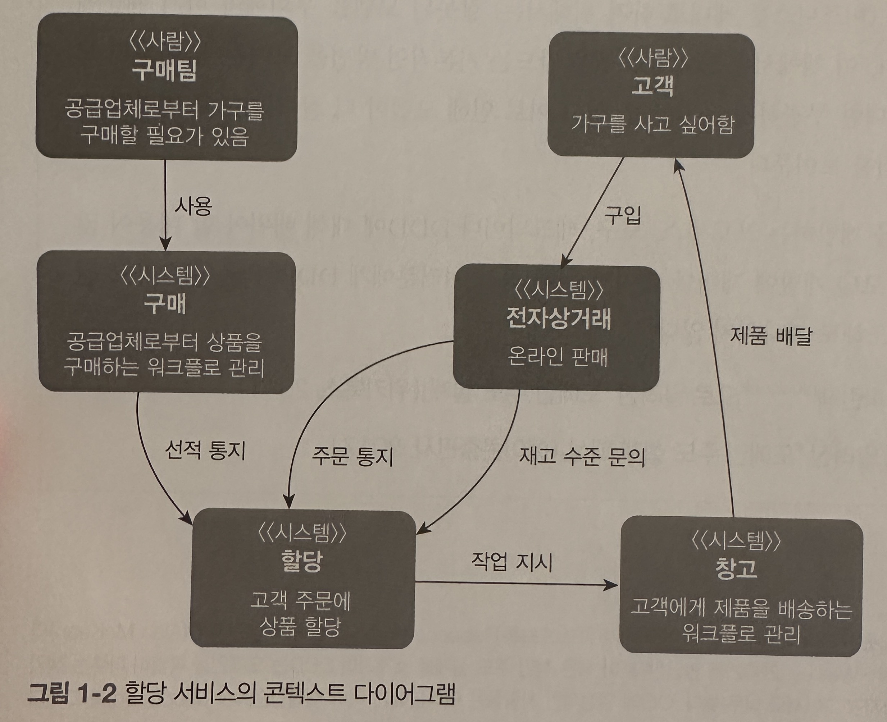
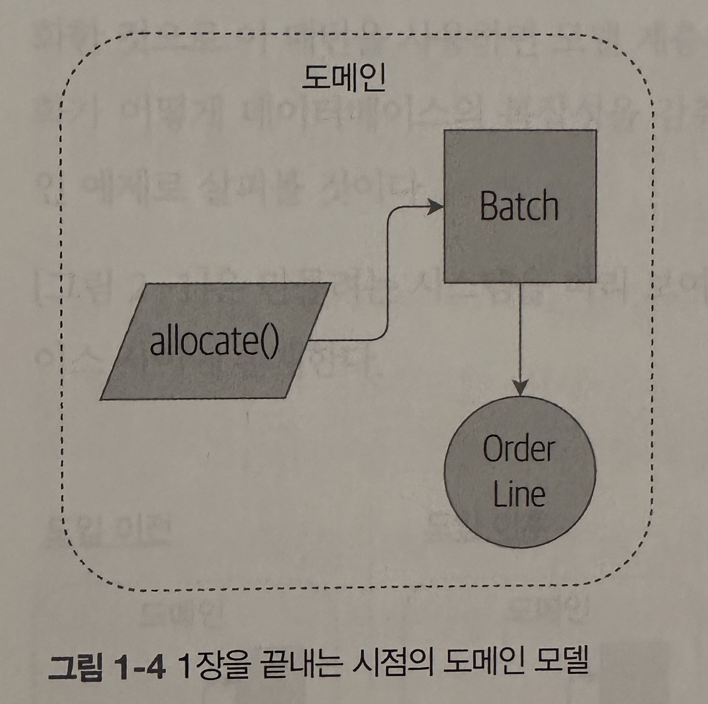

- 도메인 모델링이이 왜 중요한지 알아보고 도메인 모델링을하기 위한 핵심 패턴인 엔티티(entitiy), 값 객체(value object), 도메인 서비스(domain service)에 대해 살펴본다
- 위 이미지는 도메인 모델 패턴 시각화에 사용할 틀을 보여준다
- 1장에서는 이 그림 안에 세부 내용을 채워넣고, 2장 부터는 도메일 모델 중심으로 여러 요소를 구축해 나간다
- 따라서 이 책에서 다룰 모든 패턴의 핵심에서 엔티티, 값 객체, 도메인 서비스가 서로 관계를 맺고 있는 모습을 항상 찾을 수 있어야 한다

## 1.1 도메인 모델이란?

- `도메인이란 단어는 해결하려는 문제를 더 멋지게 표현할 뿐이다`
- `모델은 유용한 특성을 포함하는 프로세스나 현상의 지도를 뜻한다



- 위 이미지는 메이드닷컴의 실제 구매 프로세스이다
- 비즈니스가 재고를 할당하는 방법을 새롭게 구현하기로 결정했다고 가정하자
    - 기존 : 재고가 없으면 재고없으로 표현
    - 혁신 : 재고에는 없더라도 창고로 배송 중인 상품을 실제 재고로 간주

## 1.2 도메인 언어 탐구

- 유비쿼터스 언어

- 모데인 전문가와 대화할 때 참고하면 좋은 기록 방법
    - 예제 사용 유비 쿼터스 언어 : SKU, customer, order, oder reference, order line
        - ex) RED-CHAIR 10 단위

## 1.3 도메인 모델 단위 테스트

```python
def test_allocating_to_a_batch_reduces_the_available_quantity():
    batch = Batch('batch-001', "SMALL-TABLE", qty=20, eta=date.today())
    line = OrderLine('order-ref', "SMALL-TABLE", 2)

    batch.allocate(line)

    assert batch.available_qunantity == 18
```

- 위는 필자가 처음 만든 테스트이다

```python
@dataclass(frozen=True)
class OrderLine:
    orderid: str
    sku: str
    aty: int


class Batch:
    def __init__(self, ref: str, sku: str, qty: int, eta: Optional[data]):
        self.reference = ref
        self.sku = sku
        self.eta = eta
        self.available_quantity = qty

    def allocate(self, line: OrderLine):
        self.available_quantity -= line.qty
```

- 위 코드는 필자가 만든 요구 사항에 맞는 도메인 모델이다

```python
def make_batch_and_line(sku, batch_qty, line_qty):
    return (
        Batch("batch-001", sku, batch_qty, eta=date.today()),
        OrderLine("order-123", sku, line_qty)
    )


def test_can_allocate_if_available_greater_than_required():
    larget_bat, small_line = make_batch_and_line("ELEGANT-LAMP", 20, 2)
    assert large_batch.can_allocate(small_line)


def test_cannot_allocate_if_available_smaller_than_required():
    small_batch, large_line = make_batchand_line('ELEGANT-LAMP', 2, 20)
    assert small_batch.can_allocate(large_line) is False


def test_can_allocate_if_available_equal_to_required():
    batch, line = make_batch_and_line("ELEGANT-LAMP", 2, 2)
    assert batch.can_allocate(line)


def test_cannot_allocate_if_skus_do_not_match():
    batch = Batch("batch-001", "UNCOMFORABLE-CHAIR", 100, eta=None)
    different_sku_line = OrderLine("order-123", "EXPENSIVE_TOASTER", 10)
    assert batch.can_allocate(different_sku_line) is False
```

- 위코드는 실패하는 테스트 작성이다
    - 테스트에 사용된 이름이 도메인 전문가들의 언어를 따르며 전문가들과 대화하면서 동의한 에제를 그대로 코드로 작성했다는 사실에 유의해야 한다

```python
def test_can_only_deallocate_aloocated_lines():
    batch, unallocated_line = make_batch_and_line("DECORATIVE-TRINKET", 20, 2)
    batch.deallocate(unallocated_line)
    assert batch.available_quantity == 20
```

- 위 코드를 통과하는 모델은 더 똑똑한 모델이어야 한다

```python
class Batch:
    def __init__(self, ref: str, sku: str, qty: int, eta: Optional[data]):
        self.reference = ref
        self.sku = sku
        self.eta = eta
        self.available_quantity = qty
        self._allocations = set()

    def allocate(self, line: OrderLine):
        if self.can_allocate(line):
            self._allocations.add(line)

    def deallocate(self, line: OrderLine):
        if line in self._allocations
            self._allocations.remove(line)

    @property
    def allocated_quantity(self) -> int:
        return sum(line.qty for line in self._allocations)

    @property
    def available_quantity(self) -> int:
        return self._purchased_quantity - self.allocated_quantity

    def can_allocate(self, line: OrderLine) -> bool:
        return self.sku == line.sku and self.available_quantity >= line.qty
```

- 이 모델은 이제 할당된 라인을 추적할 수 있다 (더 똑똑한 모델)



- 위 이미지를 보면 이제 상황은 달라졌다
    - 배치는 OrderLine객체들의 집합을 유지핟나. 배치를 할당할 때 가용 수량이 충분하면 이를 set에 추가하기만 한다
    - 코드에서 available_quantity는 이제 구매수량에서 할당 수량을 빼는 공식에 의헤 제공되는 프로퍼티가 된다

```python
def test_allocation_is_idempotent():
    batch, line = make_batch_and_line("ANGULAR-DESK", 20, 2)
    batch.allocate(line)
    batch.allocate(line)
    assert batch.available_quantity == 18
```

- 위 코드는 마지막 배치 테스트이다
- 현실은 이 모델보다 훨씬 복잡할 것이다
    - 고객의 위치에서 가장 가까운 창고에서 배송으 ㄹ시작해야 하며, 특정 날짜에 배송을 요구할 경우 등등
    - `하지만 이런 간단한 도메인 모델을 더 복잡한 모델을 채워 넣는 틀로 간주한다`
- [Tip] 더 나은 타입 힌트를 얻기 위해 더 많은 타입을 사용한다
    - 타입 힌트를 제대로 쓰고 싶다면 typing.NewType으로 원시 타입을 감싸면 된다
    - 아래 예시 코드가 좋은지 나쁜지는 논란의 여지가 있다
  ```python
  
  Quantity = NewType("Quantitiy, int)
  Sku = NewType("Sku", str)
  Reference = NewType("Referene", str)
  
  
  class Batch
      def __init__(self, ref: Reference, sku: Sku, qty: Quantity):
          self.sku = sku
          self.reference = ref
          self._purchased_quantity = qty
  
  ```

### 1.3.1 값 객체로 사용하기 적합한 데이터 클래스

- 앞선 코드에서는 Line을 자유롭게 사용했다. 하지만 대체 라인이란 무엇일까?
    - 비즈니스 전문용어에서 order에는 여러 line이 원소로 있고, 한 라인은 한쌍의 SKU와 수량으로 이루어진다

```yaml
Order_reference:12345
Lines:
  - sku: RED-CHAIR
    qty:25
  - sku: BLUE-CHAIR
    qty:25
  - sku: GRN-CHAIR
    qty:25
```

- 주문에는 그 주문을 식별할 수 있는 유일한 참조 번호가 있지만 라인은 그렇지 않다
    - 데이터는 있지만 유일한 식별자가 없는 비즈니스 개념이 있으면, 이를 표현하기 위해 값 객체패턴을 선택하는 경우가 종종 있고, 보통 값 객체를 불변 객체로 만들곤 한다
    - [생각] 그렇지 않은 값 객체 패턴은 값이 변하지 않는 경우에 사용해야함

```python
@dataclass(froze=True)
class ORderLine:
    orderIid: OrderReference
    sku: ProductReference
    qty: Quantity
```

- 데이터클래스(또는 네임드 튜플)의 장점은 값 동등성(value equality)를 부여할 수 있다는 것이다
- 값 동등성이란 값이 같다면 두 객체를 같은 객체로 판단한다는 뜻이다. [생가]반대는 동일성(indentity)

### 1.3.2 값 객체와 엔티티

- 값과 달리 엔티티에는 정체성 동등성(identity equality)이 있다
    - 엔티티의 값을 바꿔도, 바뀐 엔티티는 이전과 같은 엔티티로 인식된다
    - 엔티티에 대한 동등성 연산자를 구현함으로써 ㅇ네티티의 정체성 관련 동작을 명시적으로 코드로 작성할 수 있다 (아래코드)

```python
class Batch:
    def __eq__(self, other):
        if not isinstance(other, Batch):
            return False

    def __hash__(self):
        return hash(self.reference)
```

- `파이썬의 __eq__ 매직 메소드를 사용해 이 클래스가 ==연산자에 대해 작동하는 방식을 정의한다`
- __hash__는 객체를 집합에 추가하거나 딕셔너리의 키로 사용할 때 동작을 제어하기 위해 파이선이 사용하는 매직 메서드다
    - __eq__를 변경하지 않았다면 __hash__를 변경해서는 안된다
    - [생각] hash는 같다고 비교되는 객체들이 같은 정수를 리터하면 된다. 때문에 id로 해쉬를 많이 한다

## 1.4 모든 것을 객체로 만들 필요는 없다: 도메인 서비스 함수

- `에반스는 엔티티나 값 객체로 자연스럽게 표현할 수 있는 도메인 서비스 연산이라는 개념에 대해 이야기 했다`
    - 주어진 배치 집합에 대해 주문 라인을 할당한다는 말은 마치 함수를 설명하는 것처럼 들린다 &rarr; 그래서 여기에서는 함수로 만들었다

```python
def test_prefers_curren_stock_batches_to_sipments():
    in_stock_batch = Batch('in-stock-batch', 'RETRO-CLOCK', 100, eta=None)
    shipment_batch = Batch('shipment-batch', 'RETRO-CLOCK', 100, eta=tomorrow)
    line = OrderLine('oref', 'RETRO-CLOCK', 10)

    allocate(line, [in_stock_batch, shipment_batch])

    assert in_stock_batch.available_quantity == 90
    assert shipment_batch.available_quantity == 100


def test_prefers_earlier_batches():
    earliest = Batch('speedy-batch', "MINIMALIST-SPOON", 100, eta=today)
    medium = Batch('normal-batch', "MINIMALIST-SPOON", 100, eta=tomorrow)
    latest = Batch('slow-batch', "MINIMALIST-SPOON", 100, eta=later)
    line = OrderLine('order1', "MINIMALIST-SPOON", 10)

    allocate(line, [medium, earliest, latest])

    assert earliest.available_quantity == 90
    assert medium.available_quantity == 100
    assert latest.availalbe_quantity == 100


def test_returns_allocated_batch_ref():
    in_stock_batch = Batch('in-stock-batch-ref', 'HIGHROW-POSTER', 100, eta=None)
    shipment_batch = Batch('shipment-batch-ref', 'HIGHROW-POSTER', 100, eta=tomorrow)
    line = OrderLine('oref', 'HIGHTROW-POSTER', 10)
    allocation = allocate(line, [in_stock_batch, shipment_batch])
    assert allocation == in_stock_batch.reference
```

- 위 테스트 코드는 도메인 함수를 테스트하기 위한 코드이다

```python
def allocate(line: OrderLine, batches: List[Batch]) -> str:
    batc = next(
        b for b in sorted(batches) if b.can_allocated(line)
    )
    batch.allocate(line)
    return batch.reference
```

- 위 코드는 도메인 서비스 함수이다

### 1.4.1 파이썬 마법 메서드 사용 시 모델과 페이썬 숙어 함께 사용 가능

- 위 테스트 코드에 있는 sorted()가 작동하게 하려면 __gt__를 도메인 모델이 구현해야 한다

```python
class Batch
    def __gt__(self, other):
        if self.eta is None:
            return False
        if other.eat is None:
            return True
        return self.eta > other.eta
```

### 1.4.2 예외를 사용해 도메인 개념 표현 가능

- 예외로 도메인 개념을 표현하는 것이다
    - 품절로 주문을 할당할 수 없는 경우도 있다. 이런 개념을 도메인 예외(doamin exception)를 사용해 찾아낼 수 있다

```python
def test_raises_out_of_stok_exception_if_cannot_allocate():
    batch = Batch('batch1', 'SMALL-FORK', 10, eta=today)
    allocate(orderLine('order1', 'SMALL-FORK', 10), [batch])

    with pytest.raises(OutofStock, match='SMALL-FOR')
        allocate(OrderLine('order2', 'SMALL-FORK', 1)[batch])
```

- 품절 예외 테스트 코드

```python
class OutOfStock(Exception):
    pass


def allocate(line: OrderLine, batches: List[Batch]) -> str:
    try:
        batch = next(...)
    except StopIteration:
        raise OutOfStock(f'Out of stock for sku{line.sku}')
```

- 도메인 예외 발생 코드 