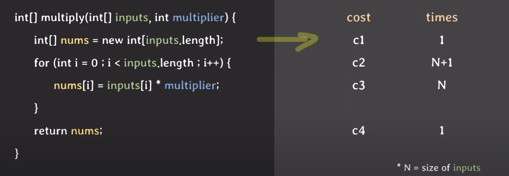
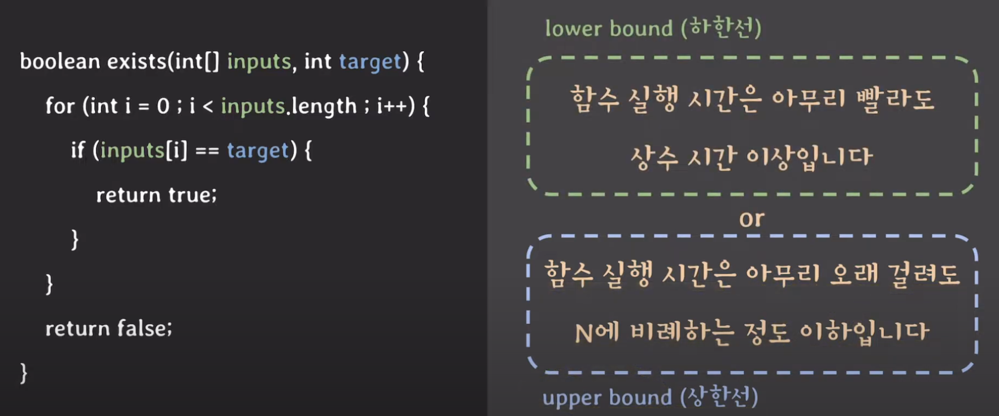
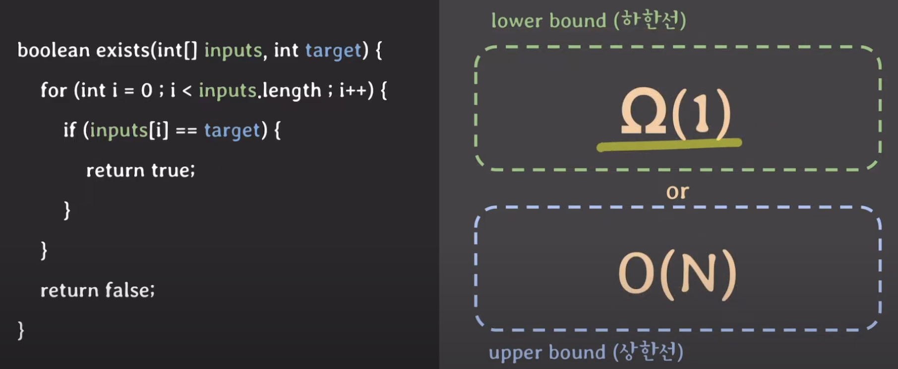
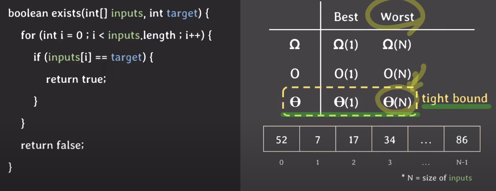
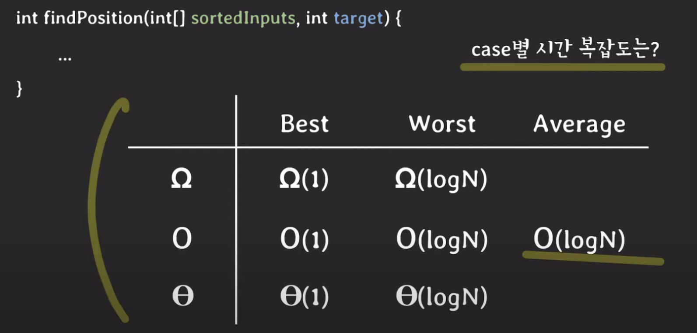
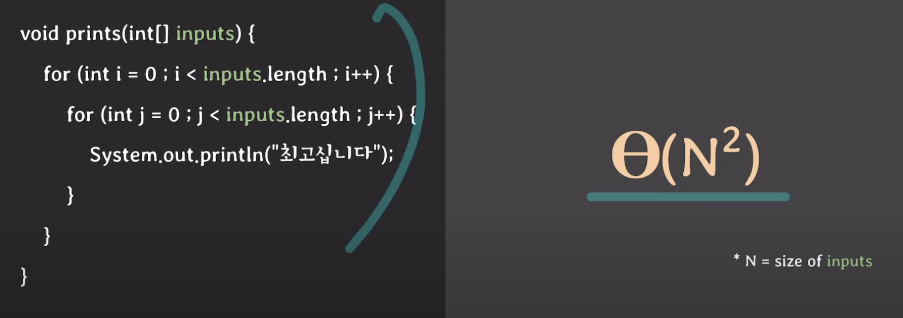
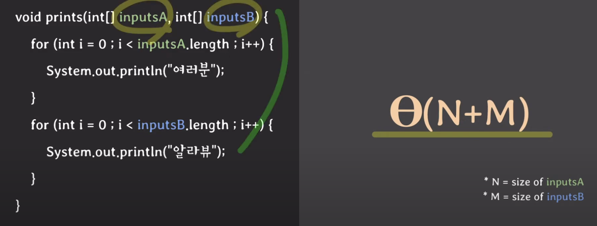
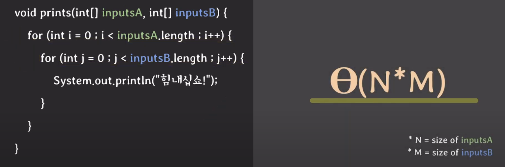
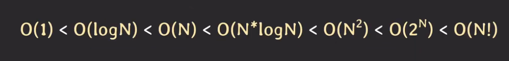

## 복잡도

- 시간 복잡도 : 특정한 크기의 입력에 대하여 알고리즘의 수행 시간 분석
- 공간 복잡도 : 특정한 크기의 입력에 대한 알고리즘의 메모리 사용량 분석

### 시간 복잡도

- 함수의 실행 시간을 표현하기 위한 방법
- `실행 시간은 실제 물리적인 시간이 아니라 step(단계)로 표현한다`
- 위 이미지에서 정확한 step의 수는 c1 + c2*(N+1) + c3*N +1이다
    - 간단하게 표현하면 a*N + b로 표현 할 수 있다
    - 하지만 궁금한것은 N의 크기가 무한대로 갈때 이기떄문에 최고차향만 고려한다
    - 따라서 최종 step의 수는 Θ(N) 이다
    - 이런 접근 방법을 `점근적 분석`이라고 하며 위와 같은 표현법은 `점근적 표기법`이라고 한다
- `즉 시간 복잡도는 점근적 분석을 통해 함수의 실행 시간을 점근적 표기법으로 표현한 것이다`

#### 점근적 표기법

- 함수의 실행 시간은 함수의 파라미터 데이터에 따라 다를수 있다
    - 케이스로 분류 할 수 있다 (best/하한선, worst/상한선)
    - 하한선은 오메가로 표기하고, 상한선은 빅오로 표기한다
    - 1은 상수를 의미하고, N은 인풋 사이즈를 의미한다

- 세타는 tight bound라고도 한다
    - 최악, 최선이 같은 경우 세타로 표현할 수 있다
    - 이 뜻은 상한선과 하한선이 아주 가까이 있다는 뜻이다
    - 즉 베스트 케이스에서 세타N인 경우, 하한, 상한 모드 N이라는 뜻이다
    - 평균은 일반적으로 표현하기 어려운 경우가 많다

#### 빅오를 주로 사용하는 이유

- 일반적으로 upper bound만 알아도 충분하기 때문(최악을 아는게 중요하다)

### 예시

#### 이진 검색

- Best case
    - 한번 실행 할 때마다 input size가 절반으로 준다 -> 언제 사이즈가 1이 될까()
    - N * (1/2)^k = 1 이고 K는 log2N이다
    - 이걸 점근법으로 표현하면 세타log2N이다
- Worst case
    - 오메가(1)

#### 동일 인풋 이중 루프

#### 다른 인풋 두개를 별도로 순회

#### 다른 인풋 두개를 겹쳐서 순회

### 시간복잡도 랭킹

