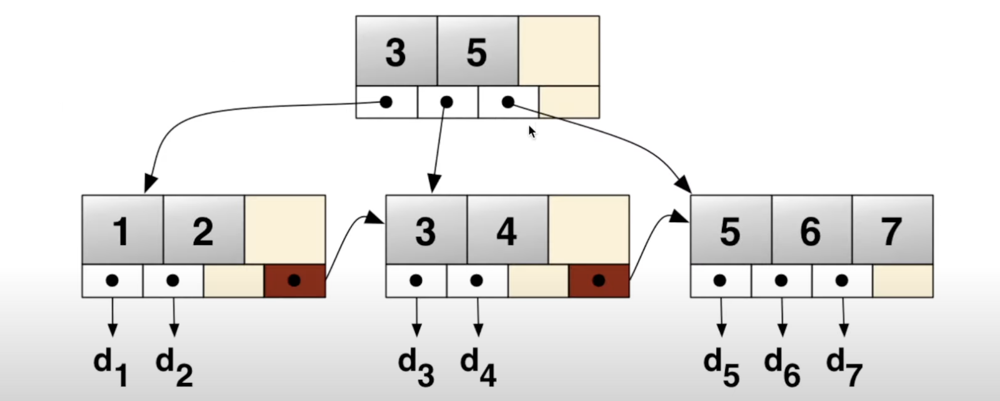
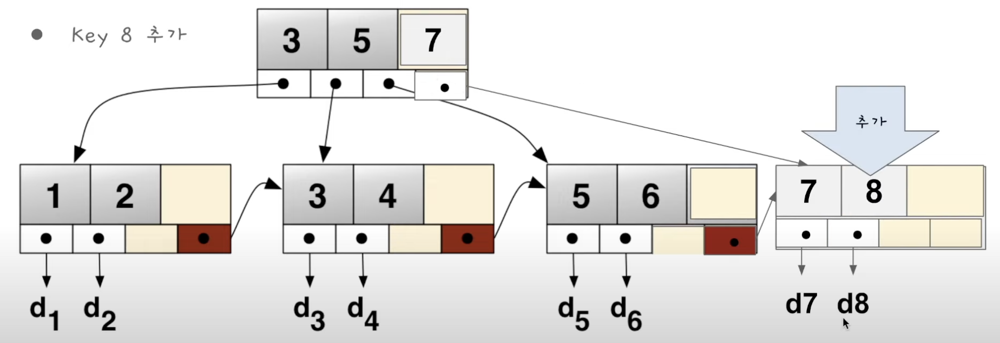

## B+Tree

### 특징

- 트리 구조를 가지고 있다
- key 값으로 정렬되어 있다
- Child 노드가 여러개이다
- 각각의 노드가 메모리가 아닌 디스크에 있다
- 실제 데이터는 리프노드에만 있다
- sibling 포인터가 있다 -> Range 쿼리가 가능하게한다

### Update

- 리드와 다를게 없다 그냥 리드 하듯이 찾아가서 실제 데이터만 갱신하면 된다

### Create

- 여러번의 디스크 쓰기가 발생할 수 있다
  - 새로운 노드를 만들어야 한다
  - 부모 노드를 업데이트 해야 한다
  - 옆 노드에서 데이터를 옮겨야 한다
  - 새로 들어온 데이터를 넣어야 한다
- 여러번의 쓰기가 발생하므로 중간에 데이터베이스가 죽으면 데이터가 오염될 수 있다
  - 이를 방지 하기 위해서 실제로 데이터를 쓰기 전에 WAL(Write-ahead log)파일에 어떤 write를 할 지 미리 써 놓고, 실제 업데이트를 진행한다

## B+Tree VS LSM Tree

- 일반적으로 B+Tree는 읽기가 빠르고 LSM Tree는 쓰기가 빠르다
- 읽기
  - B+Tree는 트리를 따라서 내려가면 바로 읽을 수 있음
  - LSM Tree는 membtable에 없는 데이터일 경우 여러개의 SSTable을 확인해야 한다
- 쓰기
  - LSM Tree는 memtable과 log-file에 쓰면 끝
  - B+Tree는 여러번의 Disk쓰기가 필요할 수 있다 + WAL에도 써야 한다