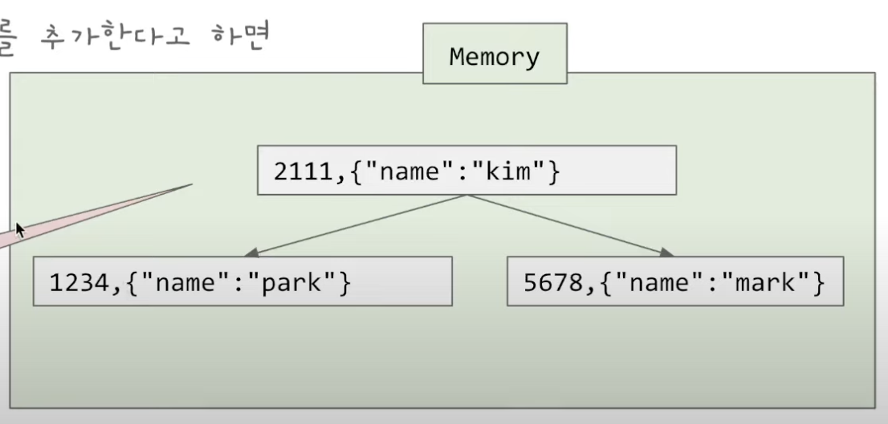

## LSM Tree

- NoSql 데이터베이스에서 사용하는 인덱스 방식이다

### Log Structured Storage Engine

- log 파일을 기반으로 작동하는 방식이다
- log 파일은 append-only이다 (수정이 없다)
- 위 이미지 처럼 키-벨류 방식으로 저장하낟
  - 따라서 쓰기는 매우 쉽다
  - 하지만 읽기는 풀 스캔을 해야한다
- 읽기가 느린 문제점을 해결하기 위해서 인메모리 인덱스를 사용한다
  - 메모리에 키와 실제 값이 아니라, 키와 실제 값의 주소값만 저장한다
- 이 방식의 문제점은 계속 쓰기만 하기 때문에 데이터 중복이 발생한다
  - 이를 해결 하기 위해서 Segment File과 Compaction을 사용한다

#### Segment 와 Compaction

- Segment
  - 통으로 한나의 파일에 저장하는 것이 아니라 여러 파일로 나눈다
  - 이 때 현재 쓰고 있는 파일을 제외한 파일은 더이상 변하지 않는다
    - 더 이상 변하지 않기 때문에 최적화를 할 수 있다 (Compaction)

#### 단점

- 존재하는 모든 키가 메모리에 있어야 한다
- 위 이미지처럼 파일은 나눠지만 그 파일에 있는 값들의 인덱스는 메모리에 가지고 있어야 하기 때문
- Range 쿼리가 어렵다

### LSM Tree

- LSM Tree는 Sorted String Table을 사용해서 Log Structured Storage Engine의 단점을 극복한다
- Sorted String Table은 Segment File과 비슷한데 파일 안에 Key로 `Sort(정렬)` 되어있다 (유저가 쓴 순서가 아니다)

#### LSM Tree의 쓰는 방법

- 우선 실제 디스크에 쓰는게 아니라 일단 메모리에 쓴다
  - 이 메모리에 있는 테이블을 MemTable이라고 한다
- 일정 용량이 넘어가면 물리 디스크(SSTable)에 작성 한다
  - SSTable에 쓰고 난 후에서 log file을 비운다
- SStable에 쓰기전에 데이터베이스가 죽으면 유실이 발생하기 때문에 log 파일을 보조 장치로 쓴다
  - MemTable에도 쓰고 log file에도 쓴다(append-only방식ㅇ으로)

#### LSM Tree 읽기 방법

- 위 이미지에서 중요한 것은 메모리에 있는 인덱스에서 모든 키가 있을 필요가 없다는 점이다
  - SSTable에 정렬이 되어 있는것을 알기 때문에 2111을 찾을때 1234와 5678사이에 있다는 것을 알 수 있고
  - 이제 SSTable 가서 스캔을 하면 값을 읽을 수 있다

#### LSM Tree 전체구조

- SSTable이 많아지면 확인할 파일들이 많아지기 때문에 Compaction을 진행해서 더큰 SSTablee을 만들어 나간다
