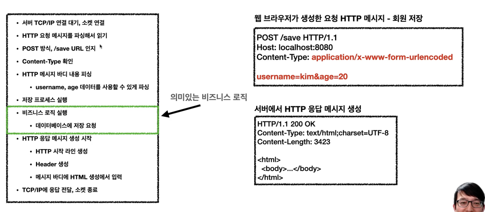
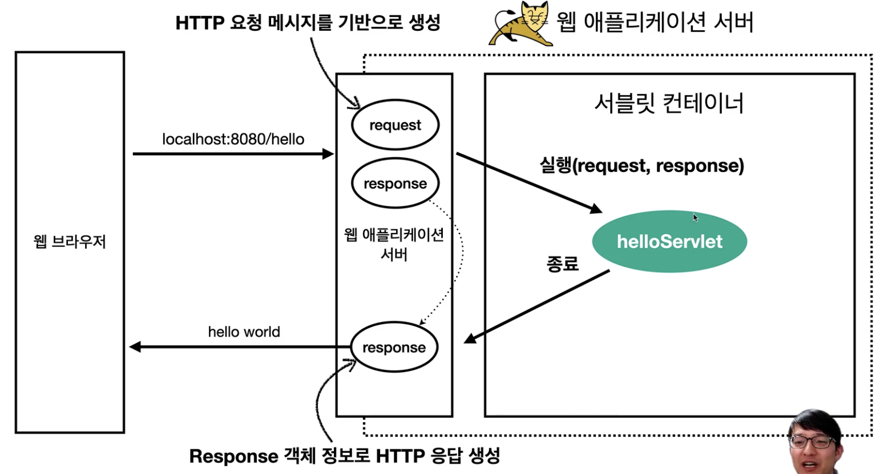
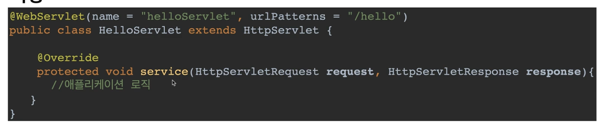
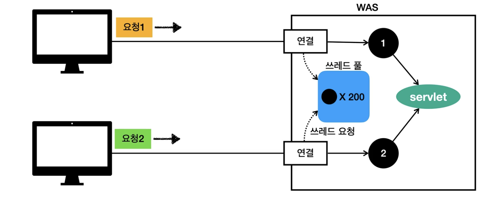

## 서블릿

- WAS를 직접 구현 한다면 위 이미지에 있는 모든 작업을 다 구현해야 한다
    - 비즈니스 로직을 실행 시키기 위해서 그전에 필요한 http text를 파싱 하는 등등의 작업을 다 구현해야함
- 이런 문제를 해결하기 위해서 서블릿을 만들었다
    - 서블릿은 비즈니스로직 실행 (녹색)을 제외한 모든 부분을 처리 해준다

### 서블릿 기능

  
  

- urlPatterns(/hello)의 URL이 호출되면 서블릿 코드가 실행
- HTTP 요청 정보를 편리하게 사용할 수 있는 HttpServletReqeust
- HTTP 응답 정보를 편리하게 제공할 수 있는 HttpServletResponse
- 개발자는 HTTP 스펙을 매우 편리하게 사용

### 서블릿 컨테이너

- 톰캣처럼 서블릿을 지원하는 WAS를 서블릿 컨터네이너라고 함
- 서블릿 컨테이너는 서블릿 객체를 생성, 초기화, 호출, 종료하는 생명주기 관리
- 서블릿 객체는 싱글톤으로 관리
    - 고객의 요청이 올 때마다 계속 객체를 생성하는 것은 비효율적
    - 최초 로딩 시점에 서블릿 객체를 미리 만들어두고 재활용
    - 모든 고객 요청은 동일한 서블릿 객체 인스턴스에 접근
    - 공용 변수 사용 주의
    - 서블릿 컨테이너 종료시 함께 종료
- JSP도 서블릿으로 변환 되어서 사용
- `동시 요청을 위한 멀티 쓰레드 처리 지원`

### 동시 요청 - 멀티 쓰레드

- `요청별로 쓰레드를 만들고 쓰레드가 서블릿을 호출한다`
- 요청 마다 쓰레드 생성
    - 장점
        - 동시 요청을 처리할 수 있다
        - 리소스 (CPU,메모리)가 허용할 때 까지 처리 가능
        - 하나의 쓰레드가 지연 되어도, 나머지 쓰레드는 정상 동작한다
    - 단점
        - 쓰레드는 새성 비용이 매우 비싸다
            - 고객의 요청이 올 때 마다 쓸데르르 생성하면, 응답 속도가 늦어진다
        - 쓰레드는 컨텍스트 스위칭 비용이 발생한다
        - 쓰레드 생성에 제한이 없다
            - 고객 요청이 너무 많이 오면, CPU, 메모리 임게점을 넘어서 서버가 죽을 수 있다
- 멀티 쓰레드에 대한 부분은 WAS가 처리
- 개발자가 멀티 쓰레드 관련 코드를 신경쓰지 않아도 됨
- `멀티 쓰레드 환경이므로 싱글톤 객체(서블릿, 스프링 빈)은 주의해서 사용`

#### 쓰레드 풀

- `이런 단점을 극복하기 위해서 쓰레드 풀에 쓰레드를 만들어 놓고 사용한다`
- 쓰레드가 미리 생성되어 있으므로, 쓰레드를 생성하고 종료하는 비용이 절약되고, 응답 시간이 빠르다
- 생성 가능한 쓰레드의 최대치가 있으므로 너무 많은 요청이 들어와도 기존 요청은 안전하게 처리할 수 있다
- 쓰레드 풀이 꽉찰 경우 특정 숫자만큼만 대기하도록 설정할 수 있다
- 튜닝
    - WAS의 주요 튜닝 포인트는 최대 쓰레드 수이다
    - 이 값을 너무 낮게 설정 하면
        - 동시 요청이 많으면, 서버 리소스는 여유롭지만, 클라이언트는 금방 응답 지연
    - 이값을 너무 높게 설정 하면
        - 동시 요청이 많으면, CPU, 메모리 리소스 임계점 초과로 서버 다운
    - 장애 발생시?
        - 클라우드면 일단 서버부터 늘리고, 이후에 튜닝
        - 클라우드가 아니면 열심히 튜닝
    - 정적 숫자는 어떻게 찾지?
        - 애플리케이션 로직의 복잡도, CPU, 메모리, IO리소스 상황에 따라 모두 다른
        - 성능 테스트
            - 최대한 실제 서비스와 유사하게 성능 테스트 시도
            - 툴: 아파치 ab, 제이미터, nGrinder(요게 좋음)