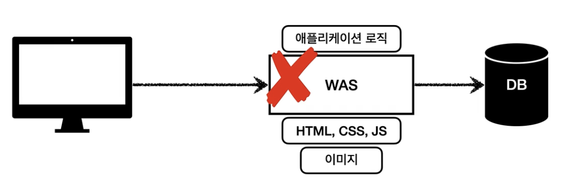
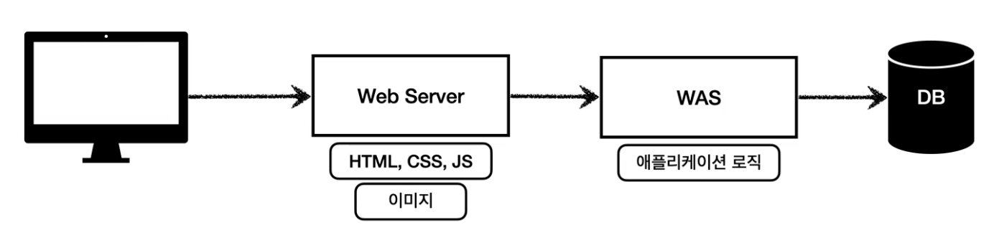
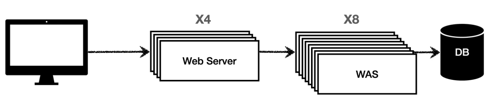

## 웹 서버, 웹 애플리케이션(WAS)

- 웹 서버는 정적 리소스, WAS는 애플리케이션 로직
    - 하지만 사실 둘의 용어 경계도 모호함
    - 웹 서버도 프로그램을 실행하는 기능을 포함하기도 함
    - 웹 애플리케이션 서버도 웹 서버의 기능을 제공함
- 자바는 `서블릿 컨테이너` 기능을 제공하면 WAS
    - 서블릿 없이 자바코드를 실행하는 서버 프레임워크도 있음
- WAS는 애플리케이션 코드를 실행하는데 더 특화

## 웹 시스템 구성 - WAS, DB

- WAS가 너무 많은 역할을 담당, 서버 과부하 우려
- 가장 비싼 애플리케이션 로직이 정적 리소스 때문에 수행이 어려울 수 있음
- WAS 장애시 오류 화면도 노출 불가능

## 웹 시스템 구성 - WEB, WAS, DB

- 정적 리소스는 웹 서버가 처리
- 웹 서버 애플리케이션 로직같은 동적인 처리가 필요하면 WAS에 요청을 위임
- WAS는 중요한 애플리케이션 로직 처리 전담
- 효율적인 리소스 관리
    - 정적 리소스가 많이 사용되면 web서버 증설
    - 애플리케이션 리소스가 많이 사용되면 WAS 서버 증설
- WEB서버는 잘 죽지 않기 때문에 오류화면을 띄워질 수 있다

## 서버사이드 렌더링, 클라이언트 사이드 렌더링

#### 서버사이드 렌더린 (SSR)

- HTML 최종 결과를 서버에서 만들어서 웹 브라우저에 전달
- 주로 정적인 화면에 사용
- 관련 기술: JSP(사장 됨), 타임리프(스프링 권장) -> 백엔드 개발자

#### 클라이언트 사이드 렌더링 (CSR)
- HTML 결과를 자바스크립트를 사용해 웹 브라우저에서 동적으로 생성해서 적용
- 주로 동적인 화면에 사용, 웹 환경을 마치 앱 처럼 필요한 부분부분 변경할 수 있음
- ex) 구글 지도, Gamil, 구글 켈린던
- 관련 기술 : React, Vue.js -> 웹 프론트엔드 개발자
