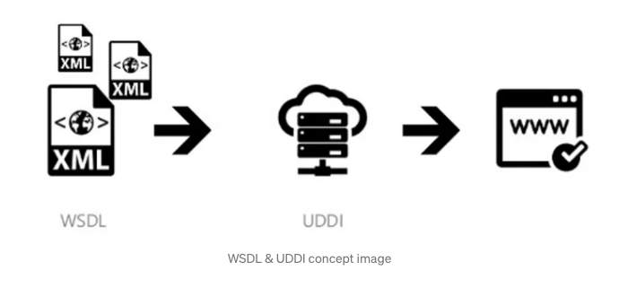

## SOAP(Simple Object Access Protocol)

- SOAP라는 것은 SOA(Service Oriented Architecure)를 지원하기 위한 Protocol이다
- 그렇다면 우리가 알아야 할것은 SOA가 어떤 구조로 되어있는지를 알아야 한다

### SOA의 구조

- 모든 data가 XML로 표현되고 data와 data를 다루는 operation이 WSDL로 정의되면, UDDI에 등록되어 누구라도 service를 검색, 접근할 수 있도록 공개하는 구조이다
- 사람들이 특정 서비스를 사용하고 싶은 경우 웹에 올라와 있는 UDDI에 가서 가져와서 사용한다

#### WSDL(Web Service Description Language)

- 웹 서비스를 기술한 언어이며 XML로 작성되어 있다
- 데어터와 데이터를 다루는 오퍼레이션 즉, 서비스를 WSDL이라는 포맷로 정의를 해준다
- 즉 WSDL이라는 언어로 작성된 서비스 이다

#### UDDI(Universal Description, Discovery and Integration)

- WSDL이 저장된 웹 서비스 서장소

### 한계

- 복잡한 구조 -> http에서 전달되기 힘들다, WSDL이 복잡하고 무겁다
- 접근이 힘들다 -> UDDI를 거쳐야만 사용할 수 있다

## REST(REpresentational State Transfer)

- 정의 : 자원의 표현에 의한 상태 전달
    - 자원(resource)의 표현(representation) -> resource(사진, 음악, 글자 등 모든 것)의 이름
    - 상태 전달 -> data가 요청되면 JSON혹은 XML로 전달되낟
- 목적 : ROA를 구현하기 위한 규약
    - ROA : Resource Oriented Architecture로 중간 매개체(ex.UDDI)가 없이 resource를 직접 주고 받는 architecture
- 구성
  - 자원 : 모든 자원은 고유한 ID(URI)가 존재하고, 서버에 저장된다
  - 행위 : http method이다 (get, post, put, delete)
  - 표현(Representational) : Client의 data요청에 Server가 응답한다. JSON, XML등의 형태
- 특징
  - Client-Server 구조
  - Stateless -> http를 기반으로 하기에 REST역시 무상태성을 갖는다
- 한계
  - 표준이 없다
  - 사용할 수 있는 method가 4개 뿐이다
  - 때로는 RESTful하게 만드려고 method를 사용하여 속도가 느려질 수 있다 (get이 post보다 빠르기 때문)

### RESTful이란?
- 정의 : RESTful은 REST라는 아키텍처를 구현하는 웹 서비시를 나타내기 위해 사용되는 용어
  - REST API를 제공하는 웹 서비스를 RESful하다고 할 수 있다

## SOAP와 REST의 차이

- 대부분의 레거시 시스템에서 SOAP를 준수하며, REST는 그보다 뒤에 고려하거나 웹 기반 시나리오에서의 더 빠른 대안으로 여기는 경우가 많다.
- REST는 유연한 구현을 제공하는 가이드라인 세트고, SOAP는 XML 메시징과 같은 특정 요건이 있는 프로토콜입니다.
- REST API는 경량화되어 있기 때문에 사물 인터넷(IoT), 모바일 애플리케이션 개발, 서버리스(servreless) 컴퓨팅과 같이 보다 새로운 컨텍스트에 이상적입니다.
- SOAP 웹 서비스는 많은 기업에서 필요로하는 기본 보안과 트랜잭션 컴플라이언스를 제공하지만, 이로 인해 좀 더 무거운 경향이 있습니다.
- 또한 Google Maps API와 같은 대부분의 퍼블릭 API는 REST 가이드라인을 따릅니다.