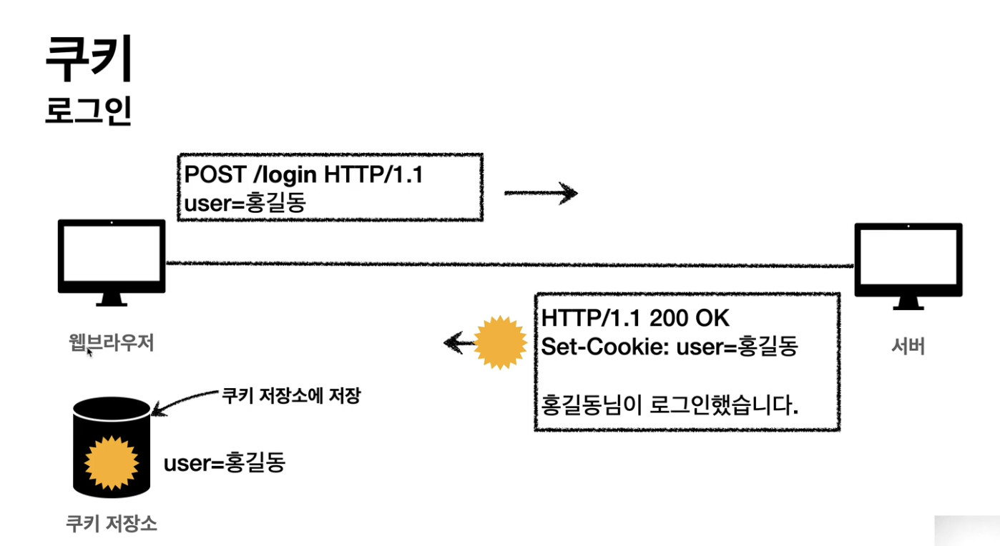

## Header

- 용도
  - HTTP 전송에 필요한 모든 부가정보
    - 메시지 바디의 내용, 메시지 바디의 크기, 압축, 인증, 요청 클라이언트, 서버 정보,...
  - 표준 헤더가 너무 많음
  - 필요시 임의의 헤더 추가 가능
    - helloword: hihi
- RFC72x 변화
  - 엔티티(Entity) &rarr; 표현(Representation)
  - Representation = Representation Metadata + Representation Data
  - 표현 헤더는 표현 데이터를 해석할 수 있는 정보 제공
    - 데이터 유형, 데이터 길이, 압축 정보 등등

### 표현 관련 헤더

- 표현 헤더는 전송, 응답 둘다 사용
- Content-Type
  - 표현 데이터 형식
  - 미디어 타입, 문자 인코딩
  - ex) text/html; charset=utf-8
  - ex) application/json 기본이 utf-8
  - ex) image/png
- Content-Encoding
  - 표현 데이터를 압축하기 위해 사용
  - 데이터를 전달하는 곳에서 압축 후 인코딩 헤더 추가
  - 데이터를 읽는 쪽에서 인코딩 헤더의 정보로 압축 해제
  - ex) gzip, deflate, identity
- Content-Language
  - 표현 데이터의 자연 언어
  - ex) ko, en, en-uS
- Content-Length
  - 표현 데이터의 길이
  - 바이트 단위
  - Transfer-Encoding(전송 코딩)을 사용하면 Content-Length를 사용하면 안됨

### 협상 헤더(Content Negotiation)

- 클라이언트가 선호하는 표현 요청
- 협상 헤더는 요청시에만 사용

#### 협상 방법

- Quality Values(q)값 사용
  - 0~1, 클수록 높은 우선순위, 생략하면 1
  - ex) Accept-Languae:ko-KR,ko;q=0.9,en-US;q=0.8
- 구체적인 것이 우선한다
  - Accep:text/*, text/plain, text/plain;format=flowed, */*
  - text/plain;format=flowed 이 가장 우선시됨
- 구체적인 것을 기준으로 미디어 타입을 맞춘다
  - Accept: text/*;q=0.3, text/html;q=0.7, text/html;level=1, text/html;level=2;q=0.5, */*;q=0.5

| Media Type        | Quality |
|-------------------|---------|
| text/html;level=1 | 1       |
| text/html         | 0.7     |
| text/plain        | 0.3     |
| image/jpeg        | 0.5     |
| text/html;level=2 | 0.4     |
| text/html;level=3 | 0.7     |

#### 헤더 종류

- Accept
  - 클라이언트가 선호하는 미디어 타입 전달
- Accept-Charset
  - 클라이언트가 선호하는 문자 인코딩
- Accept-Encoding
  - 클라이언트가 선호하는 압축 인코딩
- Accept-Language
  - 클라이언트가 선호하는 자연 언어
  - 언어별 우선순위를 보낼수 있음

### 전송방식 헤더

#### 단순 전송

- Content-Length를 알수 있는 경우

#### 압축 전송

- ex) Content-Encoding: gzip

#### 분할 전송

- Content-Length를 사용하면 안됨, 전송시 알수 없기 때문
- ex) Transfer-Encoding:chunked

#### 범위 전송

- ex) Content-Range:bytes 1001~2000/ 2000

### 일반 정보 헤더

- Referer
  - 현재 요청된 페이지의 이전 웹 페이지 주소
  - 유입 경로 분석가능
  - 요청에 사용
  - referer는 단어 referrer의 오타
- User-Agent
  - 클라이언트 애플리케이션 정보
  - 통계 정보
  - 요청에서 사용
  - 어떤 종류의 브라우저에서 장애가 발생하는지 파악 가능
- Server
  - 요청을 처리하는 ORIGIN 서버의 소프트웨어 정보
  - Server:Apache/2.2.22(Debian)
  - Server:nginx
  - 응답에서 사용
- Date
  - 메시지가 발생한 날짜와 시간
  - 응답에서 사용

### 특별한 정보

- Host
  - 요청한 호스트 정보(도메인)
  - 요청에서 사용
  - 필수
  - 하나의 서버가 여러 도메인을 처리해야 할 때
  - 하나의 IP주소에 여러 도메인이 적용되어 있을 때
  - ex) Host:aaa.com
- Location
  - 웹 브라우저는 3xx응답의 결과에 Location헤더가 있으면, Location위치로 자동 이동(리다이렉트)
- Allow
  - 허용 가능한 HTTP 메서드
  - 405 Method Not Alllowd 에서 응답에 포함해야함
  - Allow:GET,HEAD,PUT
  - 거의 구현하지 않음
- Retry-After
  - 유저 에이전트가 다음 요청을 하기까지 기다려야 하는 시간
  - 거의 사용하지 않음

### 인증헤더

- WWW-Authenticate
  - 리소스 접근시 필요한 인증 방법 정의
  - 401 Unauthorized응답과 함께 사용
  - WWW-Authenticate: Newauth realm="apps",type=1,title="Login to\"apps\"",Basic realm="simple"

### 쿠키 헤더

#### Set-Cookie

- 서버에서 클라이언트로 쿠키 전달(응답)
- 사용처
  - 사용자 로그인 세션 관리
  - 광고 정보 트래킹
- 쿠키 정보는 항상 서버에 전송됨
  - 네트워크 트래픽 추가 유발
  - 최소한의 정보만 사용(세선id, 인증 토큰)
  - 서버에 전송하지 않고, 웹 브라우저 내부에 데이터를 저장하고 싶으면 웹 스토리지 참고
- 보안에 만감한 데이터는 저장하면 안됨(주민번호, 카드정보)

#### Cookie

- 클라이언트가 서버에서 받은 쿠키를 저장하고, HTTP 요청시 서버로 전달

#### 쿠키 생명주기

- Expries
  - Set-Cookie:expires=Sat, 26-Dec-2020 04:39:21 GMT
  - 만료일이 되면 쿠키 삭제
- Set-Cookie:max-age=3600
  - 0이나 음수를 지정하면 쿠키 삭제
- 세션 쿠키 : 만료 날짜를 생략하면 브라우저 종료시까지만 유지
- 영속 쿠키 : 만료 날짜를 입력하면 해당 날짜까지 유지

#### 쿠키 도메인

- domain=exmaple.org
- 명시
  - 명시한 문서 기준 도메인 + 서브 도메인 포함
  - domain=example.org를 지정해서 쿠키 생성
    - example.org | dev.example.org 도 쿠기 접근
- 생략
  - example.org에서 쿠키를 생성하고 도메인 지정을 생략
  - example.org 에서만 쿠키 접근
  - dev.example.org 도 쿠기 미접근

#### 쿠키 경로

- path=/home
- 이 경로를 포함함 하위 경로 페이지만 쿠키 접근
- 일반적으로 path=/루트로 지정
  - path=/home 지정
  - /home &rarr; 가능
  - /home/level1 &rarr; 가능
  - /home/level1/level2 &rarr; 가능
  - /home &rarr; 불가능

#### 보안

- Secure
  - 쿠키는 http, https를 구분하지 않고 전송
  - Secure를 적용하면 https인 경우에만 전송
- HttpOnly
  - XSS 공격 방지
  - 자바스크립트에서 접근 불가(document.cookie)
  - HTTP 전송에만 사용
- SameSite
  - XSRF 공격 방지
  - 요청 도메인과 쿠키에 설정된 도메인이 같은 경우만 쿠키전송

### 검증헤더와 조건부 요청

- 캐시 시간 초과
  - 캐시 유효 시간이 초과해서 서버에 다시 요청하면 다음 두가지 상황이 나타난다
  - 1> 서버에서 기존 데이터를 변경함
  - 2> 서버에서 기존 데이터를 변경하지 않음
- 검증 헤더 (Last-Modified, If-Modified-Since)
  - 1> 서버는 Last-Modified:2020년 11월 10일 10:00:00를 보낸다 (검증헤더)
  - 2> 클라이언트트 if-modified-since:2020년 11월 10일 10:00:00를 보낸다 (조건부 요청)
  - 3> 서버는 304 Not Modified 를 보내고 HTTP Body가 비어있는 응답을 보낸다
  - 3-1> 데이터 변경시, 200OK body에 새로운 데이터를 포함해서 전달한다
  - 4> 클라이언트는 이전에 받은 캐시를 사용한다
  - 단점
    - 1초 미만 단위로 캐시 조정이 불가능
    - 날짜 기반의 로직 사용
    - 데이터를 수정해서 날짜가 다르지만, 같은 데이터를 수정해서 데이터 결과가 똑같은 경우(A->B->A 변경으로 실제 데이터가 동일한 경우)
    - 서버에서 별도의 캐시 로직을 관리하고 싶은 경우
      - ex) 스페이스나 주석처럼 크게 영향이 없는 변경에서 캐시를 유지하고 싶은 경우
- 검증 헤더 (ETag, If-None_Match)
  - ETag(Entitiy Tag)
  - 캐시용 데이터에 임의의 고융한 버전 이름을 달아둠
    - ex) ETag: "v1.0", ETag:'asdf32"
  - 데이터가 변경되면 이 이름을 바꾸어서 변경함
    - ex) ETag:"aaaa" -> ETag:"bbbb"
  - 진짜 단순하게 ETag만 보내서 같으면 유지, 다르면 다시 받는다
  - 전달 과정은 위 검증헤더와 동일
  - `중요한 점은 캐시 관리를 서버에서 완전히 관리한다`

### 캐시 제어 헤더

#### Cache-Control

- Cache-Control: max-age : 캐시 유효 기간, 초단위
- Cache-Control: no-cache
  - 데어는 캐시해도 되지만, 항상 origin 서버에 검증하고 사용
  - 원서버가 죽어 있는 경우 그냥 프록시 서버(cdn)이 가지고 있는 정보를 보내준다
- Cache-Control:no-store
  - 데이터에 민감함 정보가 있으면 저장하면 안됨
  - 메모리에서 사용하고 최대한 빨리 삭제
- Cache-Control:must-revalidate
  - 캐시 만료후 최초 조회시 원 서버에 검증해야 함
  - 원서버 접근 실패시 반드시 오류가 발생해야함 - 504 Gateway Timeout
  - must-revalidate는 캐시 유효 시간이라면 캐시를 사용함

#### Pragma (캐시제어, 하위 호환)

- 현재는 사용하지 않음

#### Expries (캐시 유효 기간, 하위 호환)

- 현재는 사용하지 않음

### 프록시 캐시 관련 헤더

- Cache-Control:public
  - 응답이 public(CDN 서버) 캐시에 저장되어도됨
- Cache-Control:private
  - 응답이 해당 사용자만을 위한 것임, private 캐시에 저장해야 함
- Cache-Control:s-maxage
  - 프록시 캐시에만 적용되는 max-age

### 캐시 무효화 헤더

- Cache-Control:no-cache,no-store,must-revalidate
  - 위에처럼 더 넣어줘야 절대 캐시를 하지 않는다 
