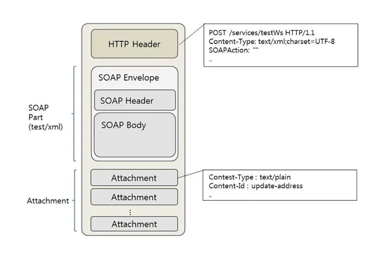

## 낙관적 동시성 제어 (Optimistic Concurrency Control)

#### 기본 정보

- 같은 로우를 동시에 수정하지 않을 것이라 가정
    - Read시에는 lock을 걸지 않는다
    - 수정시에는 검사가 필요한다

## 낙관적 동시성 제어에서 각 트랜잭션은 세 가지 단계로 실행 된다

- Read Phase -> Validation Phase -> Write Phase

### 읽기 단계 (Read Phase)

- 트랜잭션이 다른 사본을 만들어 관리
- 트랜잭션의 갱신(update)는 사본에 대해서 실행하고, 실제 DB에는 실행하지 않음

### 검증 단계

- 트랜잭션 실행 결과가 직렬 가능성 위반 check
- 위 이미지를 보면 다른 트랜잭션의 W(라이트)와 R(리드)가 겹치지지 않았는지 확인한다

### 쓰기 단계

- 검증 단계를 통과하면, 트랜잭션의 실행 결과를 데이터베이스에 반영

## 비관적 동시성 제어
- 비관적 동시성 제어는 동시성이 저하 되지만 데이터를 일일이 검사하지 않아도 된다
- 결국 락을 갈아서 내가 점유 하고 있는 동안에는 변경을 허용하지 않음으로서 정합성을 유지한다
  - 배타 락(exclusive lock)의 경우 에는 읽기, 쓰기 둘다 불가능하다
  - 공유 락(shared lock)의 경우 읽기는 가능하지만 쓰기는 불가능 하다 