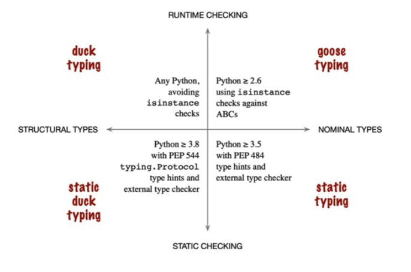

## [파이썬 타입 종류 요약](https://rumbarum.github.io/posts/python-interface/)


- 파이썬은 스크립트 언어라 실행 시점에 타입검사를 하기 때문에 사전 확인이 어려우며, 인터페이스를 완벽하게 강제하는 방법은 없다
- 따라서 아래 4가지 방법중 적절한 방법을 찾아서 적용해야 한다 

## Duck Typing

```python
class Duck:
    def shoute(self):
        print("kwak")


class Cat:
    def voice(self):
        print("moew")


def make_noise(x):
    x.voice()


cat = Cat()
make_noise(cat)

duck = Duck()
make_noise(duck)
```

- 위 코드는 덕 타이핑 예제 코드이다
- make_noise 함수에서 x는 vocie라는 함수를 가지고 있을 것이라는 인터페이스를 cat은 지켰지만 duck은 지키지 않았다
- 덕 타이핑은 실행하기 전까지는 인터페이스를 지키고 있는지 인지 하기 어렵기 때문에 변경에 매우 취약하다

```python
def make_noise(x):
    if isinstance(x, Cat):
        x.voice()
    else:
        print("x has no voice")
```

- 덕타이핑은 사전에 강제 할 수 없기 때문에 make_noise 인터페이스를 위지하기 위해서 위 코드처럼 인터페이스를 지키고 있는지 확인 하는 방법이 있다
- 하지만 cat, lion, tiger, gorilla 등 종류가 늘어 난다면 문제가 된다

```python
duck = Duck()
duck.voice = lambda: print("duck kwak")
make_noise(duck)
```

- 위코드 처럼 몽키 패칭으로 인터페이스를 지키게 만들 수 있다

## Goose Typing

```python
from abc import ABC, abstractmethod


# 추상클래스 임을 명시하는 ABC 상속
class Animal(ABC):
    # 추상메소드를 만들기 위한 데코레이터
    @abstractmethod
    def voice(self):
        raise NotImplementedError


# abc 없이 이렇게 Base Class를 선언하기도함
class Animal:
    def voice(self):
        raise NotImplementedError


class Goose(Animal):
    ...


def make_noise(x):
    x.voice()


goose = Goose()
make_noise(goose)
```

- 위 코드 처럼 추상클래스로 인터페이스를 구현하고 구상클래스들이 인터페이스를 따르도록 하는 것을 구스타이핑이라고 한다
- 하지만 파이썬에서는 make_noise의 안전성을 런타임에서만 검사할 수 있다
- 대규모 파이썬 프로젝트의 아주 깊숙한 곳에서 이런 런타임에러가 발생하면 복잡해진다

## Static Typing

```python
from abc import ABC, abstractmethod


class Animal(ABC):
    @abstractmethod
    def voice(self):
        raise NotImplementedError


class Goose(Animal):
    def voice(self):
        print("kwak")


def make_noise(x: Animal):
    if issubclass(x, Animal):
        x.voice()
    else:
        print("x is not subclass of Animal")


goose = Goose()
make_noise(goose)
```

- 파이썬 3.5부터 추가된 type hints를 활용한다
- 하지만 마찬가지로 x에 Animal구상 클래스만 들어오도록 강제하지는 못한다 issubclass를 통해서 구상 클래스 검증은 할 수 있다
    - IDE에서는 경고 발생, mypy에서는 에러 발생

## Static Duck typing

- Static typing까지 하면 런타입에서 확인 할 수 밖에 없는 스크립트 언어의 한계는 있지만 외형은 정적 언어와 동일하다. 그런데 왜 static duck typing이 나왔는가
    - PEP-484 에서 제안된 typing은 파이썬 일반 프로토콜인 len, iter 를 위한 추상 클래스(Iterable and Sized)들을 가지고 있습니다. 문제는 이 클래스를 상속하고 있음음
      명시적으로 적어 줘야 한다는 것입니다. 이는 파이써닉 하지 않고, 관용 동적 타이핑 파이썬 코드와도 다릅니다. 사용자 정의 추상 클래스도 마찬가지 입니다. 라이브러리 타입과 할경우 타입이 어디 있는지 찾기
      힘듭니다. 상속을 활용하기 위해서는 Base Class 되거나 가상클래스로 Base Class에 등록 되어야 합니다. 그리고 ABC 과도한 사용은 추가적인 자원을 소모 합니다.
      -즉, 엄격한 type checker에서 파생된 구조적 복잡성 문제를 해결하기 위해서 PEP-544가 제안 되었고 static duck typing이라고 부르기로 했다

- Protocol은 메소드, 어트리뷰트 검증을 한다
    - Concrete 도 name, value 멤버 변수가 있고 int를 반환하는 method함수가 있기 때문에 type check를 통과한다
    - 그렇지 않다면 type 에러가 발생한다

```python
class Template(Protocol):
    name: str  # This is a protocol member
    value: int = 0  # This one too (with default)

    def method(self) -> int:
        return 1


class Concrete:
    def __init__(self, name: str, value: int) -> None:
        self.name = name
        self.value = value

    def method(self) -> int:
        return 1


var: Template = Concrete('value', 42)  # OK
```

- ABC 처럼도 사용이 가능하다
    - ImplicitColor도 PColor가 가지고 있는 draw, complex_method가 있기 때문에 type check를 통과한다

```python
from abc import abstractmethod
from typing import Protocol


class PColor(Protocol):
    @abstractmethod
    def draw(self) -> str:
        return 'draw'

    def complex_method(self) -> str:
        return 'complex'


class NiceColor(PColor):

    def draw(self) -> str:
        return 'NiceColor draw'


class ImplicitColor:
    def draw(self) -> str:
        return 'ImplicitColor draw'

    def complex_method(self) -> str:
        return 'ImplicitColor complex_method'


def represent(c: PColor) -> None:
    c.draw()
    c.complex_method()


represent(NiceColor())
represent(ImplicitColor())  # 프로토콜 대신 ABC를 쓰면 여기에서 IDE가 에러를 보여준다 

```

- runtime_chekable 데코레이터를 사용하면 Protocol이 ininstance, insubclass를 지원한다
    - Protocol의 하위인지 검사가 아니라, method구현 여부를 검증하기에 런타임에서도 검사를 할 수 있다
    - @runtime_checkabl을 사용하지 않으면 아에 신텍스 에러가 발생한다
    - 단 method, attribute 소유 여부만 조사하고, 실제 구현 방식까지 검사하지는 못한다 -> static type checker로만 가능하다

```python
from typing import runtime_checkable, Union, Protocol


class NoiseMaker(Protocol):
    def moew(self, master: str) -> None:
        print(f"moew {master}")


class NoiseMaker2(Protocol):
    def moew2(self, master: str) -> None:
        print(f"moew {master}")


@runtime_checkable
class NoiseMakerProtocol(NoiseMaker, NoiseMaker2, Protocol):
    pass


class Cat:
    def moew(self, master: str):
        print("moew")

    def moew2(self, master1: str) -> None:
        print(f"moew {master1}")


def make_noise(x: NoiseMakerProtocol):
    if isinstance(x, NoiseMakerProtocol):
        x.moew('master')
    else:
        print("no")


cat = Cat()
make_noise(cat)
```

- 프로토콜은 합성도 가능하다
    - 주의할 점은 합성 프로토콜에소 Protocol이 들어 가야 한다
    - tiger는 AnimalProtocol인 Animal, Animal2의 함수 voice, shout두개다 있음으로 에러가 없지만, 고릴라는 아님으로 에러 발생

```python
from typing import Protocol


class Animal(Protocol):
    def voice(self):
        ...


class Animal2(Protocol):
    def shout(self):
        ...


# 주의: 합성 클래스에도 Protocol 이 들어가야함
class AnimalProtocol(Animal, Animal2, Protocol):
    ...


class Tiger:
    def voice(self):
        ...

    def shout(self):
        ...


class Gorilla:
    def voice(self):
        ...

    def motion(self):
        ...


def make_noise(x: AnimalProtocol):
    x.voice()
    x.shout()


tiger = Tiger()
make_noise(tiger)  # OK

gorilla = Gorilla()
make_noise(gorilla)  # ERROR

```