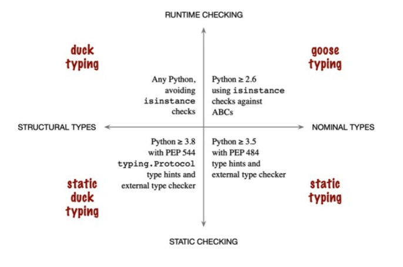
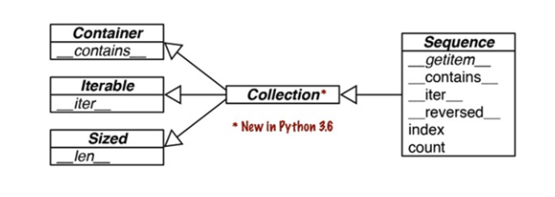
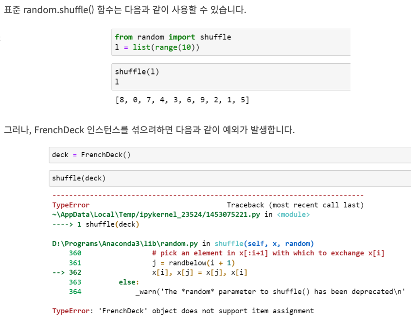
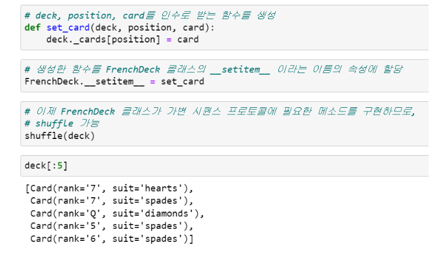

## 파이썬 타입



- 프로그래밍 언어에 따라서, 인터페이스를 정의하고 사용하는 방법은 여러가지가 있달
- 파이썬 3.8 부터는 위 이미지 처럼 4가지 방법이 있다
    - **duck typing** :  파이썬 초창기부터의 기본 파이팅 접근 방법
    - **goose typing** :  파이썬 2.6부터 추상 베이스 클래스(ABC)에 의해 지원되는 방법. 런타임에 ABC에대해 객체 검사에 의존
    - **static typing** : C와 자바와 같은 정적 타이핑 언어의 기본 접근 방법. 파이썬 3.5 부터 typing 모듈에 의해 지원되면 PEP 484와 외부 type check에 의해 강제됨
    - **static duck typing** : go 언어로 인해 대중화된 접근방식. 파이썬 3.8에 추가된 typing.Protocol의 서브클래스에 의해 지원됨

### 기존 파이썬에서 protocol의 의미

```python
import collections

Card = collections.namedtuple('Card', ['rank', 'suit'])


class FrenchDeck:
    ranks = [str(n) for n in range(2, 11)] + list('JQKA')
    suits = 'spades diamonds clubs hearts'.split()

    def __init__(self):
        self._cards = [Card(rank, suit) for suit in self.suits
                       for rank in self.ranks]

    def __len__(self):
        return len(self._cards)

    def __getitem__(self, position):
        return self._cards[position]
```

- 위 코드처럼 객체 프로토콜을 객체가 반드시 역학을 수행하기 위해 제공해야하는 메소드를 가리킨다
    - FrenchDuck의 경우에는 시퀀스 프로토콜을 따른다고 불 수 있이며, 정의된 메소드들을 파이썬 객체가 시퀀스처럼 행동할 수 잇도록 해준다

### PEP544에서의 프로토콜의 의미

- PEP544는 typing.Protocol의 서브클래스를 생성하여, 클래스가 반드시 구현(또는 상속)해야 하는 하나 이상의 메소드를 정의하도록 한다
- 프로토콜은 아래 두 프로토콜로 나눌 수 있다
    - dynamic protocol
        - 암묵적으로 컨벤션에 따라 정의된다. 파이썬의 가장 중요한 dynamic protocol은 인터프리터 그 자체에 의해 지원되며, 파이썬 레퍼런스 문서 Data Model챕터에 설명되어 있다
        - https://docs.python.org/3/reference/datamodel.html
    - static protocol
        - PEP544에 의해 정의된 프로토콜이며, 파이썬 3.8 부터 적용된다. typing.Protocol의 서브클래스로 명시적으로 정의된다
    - 차이점
        - dynamic은 일부분만 구현될 수 있으며, 그렇더라도 매우 유용하다. 하지만 static을 따른다면 객체를 비록 프로그램이 모든 메소드를 필요로 하지 않더라도, 프로토콜 클래스에 선언된 모든
          메소드를 제공해야 한다
        - sttic은 static type checker에 의해 검증되지만 dynamic은 그렇지 않다
        - `두 프로토콜은 클래스가 프로토콜을 지원하다고 프로토콜 이름을 상속과 같은 방식으로 선언할 필요가 없다는 본질적인 특징을 공유한다`
        - 추가로, static에서, 파이썬은 코드안에 명시적인 인터페이스를 정의하는 다른 방법(ABC)을 제공한다 (아래 설명)

### Duck Type-Dynamic Protocol (예제1)

- 파이썬 데이터 모델은 가능한 한 많이 핵심 dynamic 프로토콜과 협업하겠다는 철학을 가지고 있다



- 위 이미지는 ABC로 정의된 공식적인 Sequence인터페이스를 보여준다.

```python
class Vowels:
    def __getitem__(self, i):
        return 'AEIOU'[i]
```

- 시퀀스의 경우, 가장 단순한 구현만 가지고 있더라도 파이썬은 최선을 다한다
    - 이 클래스는 abc.Sequence를 상속받지 않으며 오직 __getitem__()만 구현하고 있다
    - __iter__()메소드는 구현되지 않았지만 반복이 가능하다. 파이썬 인터프리터가 0부터 시작하는 인덱스로 getitem을 호출을 시도하기 때문
    - __contains__()메소드가 구현되지 않았지만 마찬가지로 in 연산자도 동작한다
    - `따라서 반복(iterable)프로토콜은 덕 타이핑의 극단적인 예를 보여준다`

### Duck Type-Dynamic Protocol (예제2)



- 위에 나온 FrenchDeck 클래스는 카드를 섞을 수 없다는 단점이 있다
    - shuflle은 시퀀스 처럼 동작하기 때문에 동작 할거라고 기대하지만 작도앟지 않는다
    - 원인은 FenchDec객체가 할당을 지원하지 않기 때문이다. shuffle()함수는 컬렉션 안의 항목들을 교환시킴으로써 동작하는데, FrenchDeck 클래스는 불변 시퀀스 프로토콜만 구현하고, 가변
      시퀀인 __setitem__()은 구현하고 있지 않기 때문이다
    - 따라서 아래 이미지 처럼 __setitem__을 구현하면 shuffle이 가능해진다
        - 이렇게 따로 외부에서 만들어서 연결하는 방식을 monkey patching 이라고 한다
        - 몽키패치 : 소스 코드를 건드리지 않고 런타임에 클래스나 모듈을 변경하는 행위
- `결국 shuffle 함수는 자신이 받는 인수의 자료형에 대해서는 신경쓰지 않는다. 단지 받은 객체가 일부 가변 시퀀스 프로토콜을 구현하고 있으면 될 뿐이다`



## Goose Typing-Dynamic Protocols

- 파이썬에는 interface 키워드가 없으며, 추상 베이스 클래스 ABC(AbstractBase Class)를 사용해서 명시적인 인터페이스를 정의한다
- 구스 타이핑은 ABC를 사용하는 런타임 type checking approach 이다
- 간략하게 정리하면, 구스 타이핑은 ABC를 서브클래싱 하여 이전에 정의한 인터페이스를 구현하고 있음을 명시한다
- 구스 타이핑은 isinstance와 issubclass의 두번째 인수로 구체적인 클래스 대신 ABC를 사용하여 런타임 타입 검사를 수반한다

### Subclassing an ABC - Goose Typing

```python
import collections
from collections.abc import MutableSequence

Card = collections.namedtuple('Card', ['rank', 'suit'])


class FrenchDeck(MutableSequence):
    ranks = [str(n) for n in range(2, 11)] + list('JQKA')
    suits = 'spades diamonds clubs hearts'.split()

    def __init__(self):
        self._cards = [Card(rank, suit) for suit in self.suits
                       for rank in self.ranks]

    def __len__(self):
        return len(self._cards)

    def __getitem__(self, position):
        return self._cards[position]

    # 카드를 섞기 위해서는 __setitem__() 메소드만 있으면 가능
    def __setitem__(self, position, value):
        self._cards[position] = value

    # MutableSequence를 상속했으므로, 이 클래스의 추상 메소드인 __delitem__()도 구현해야함
    def __delitem__(self, position):
        del self._cards[position]

    # MutableSequence의 세 번째 추상 메소드인 insert()도 구현해야함
    def insert(self, position, value):
        self._cards.insert(position, value)
```

- 우선 직접 ABC를 만들기 전에 MutableSequene라는 ABC를 활용하는 코드이다
- 파이썬은 모듈을 로딩하거나 컴파일 할때가 아니라, 실행 도중 FrenchDeck 이라는 객체를 생성할때 추상 메소드의 구현 여부를 확인한다. 이떄 추상 메소드 중 하나라도 구현되어 있지 않으면 TypeError가
  발생한다
    - 따라서 FenchDeck도 __delitem__과 insert()를 구현해야 한다. MutableSequence의 요구사항이기 때문 
- 