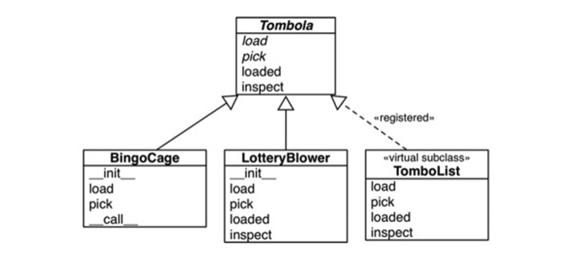

## [파이썬 타입](https://junstar92.tistory.com/356)


- 프로그래밍 언어에 따라서, 인터페이스를 정의하고 사용하는 방법은 여러가지가 있달
- 파이썬 3.8 부터는 위 이미지 처럼 4가지 방법이 있다
    - **duck typing** :  파이썬 초창기부터의 기본 파이팅 접근 방법
    - **goose typing** :  파이썬 2.6부터 추상 베이스 클래스(ABC)에 의해 지원되는 방법. 런타임에 ABC에대해 객체 검사에 의존
    - **static typing** : C와 자바와 같은 정적 타이핑 언어의 기본 접근 방법. 파이썬 3.5 부터 typing 모듈에 의해 지원되면 PEP 484와 외부 type check에 의해 강제됨
    - **static duck typing** : go 언어로 인해 대중화된 접근방식. 파이썬 3.8에 추가된 typing.Protocol의 서브클래스에 의해 지원됨

### 기존 파이썬에서 protocol의 의미

```python
import collections

Card = collections.namedtuple('Card', ['rank', 'suit'])


class FrenchDeck:
    ranks = [str(n) for n in range(2, 11)] + list('JQKA')
    suits = 'spades diamonds clubs hearts'.split()

    def __init__(self):
        self._cards = [Card(rank, suit) for suit in self.suits
                       for rank in self.ranks]

    def __len__(self):
        return len(self._cards)

    def __getitem__(self, position):
        return self._cards[position]
```

- 위 코드처럼 객체 프로토콜을 객체가 반드시 역학을 수행하기 위해 제공해야하는 메소드를 가리킨다
    - FrenchDuck의 경우에는 시퀀스 프로토콜을 따른다고 불 수 있이며, 정의된 메소드들을 파이썬 객체가 시퀀스처럼 행동할 수 잇도록 해준다

### PEP544에서의 프로토콜의 의미

- PEP544는 typing.Protocol의 서브클래스를 생성하여, 클래스가 반드시 구현(또는 상속)해야 하는 하나 이상의 메소드를 정의하도록 한다
- 프로토콜은 아래 두 프로토콜로 나눌 수 있다
    - dynamic protocol
        - 암묵적으로 컨벤션에 따라 정의된다. 파이썬의 가장 중요한 dynamic protocol은 인터프리터 그 자체에 의해 지원되며, 파이썬 레퍼런스 문서 Data Model챕터에 설명되어 있다
        - https://docs.python.org/3/reference/datamodel.html
    - static protocol
        - PEP544에 의해 정의된 프로토콜이며, 파이썬 3.8 부터 적용된다. typing.Protocol의 서브클래스로 명시적으로 정의된다
    - 차이점
        - dynamic은 일부분만 구현될 수 있으며, 그렇더라도 매우 유용하다. 하지만 static을 따른다면 객체를 비록 프로그램이 모든 메소드를 필요로 하지 않더라도, 프로토콜 클래스에 선언된 모든
          메소드를 제공해야 한다
        - sttic은 static type checker에 의해 검증되지만 dynamic은 그렇지 않다
        - `두 프로토콜은 클래스가 프로토콜을 지원하다고 프로토콜 이름을 상속과 같은 방식으로 선언할 필요가 없다는 본질적인 특징을 공유한다`
        - 추가로, static에서, 파이썬은 코드안에 명시적인 인터페이스를 정의하는 다른 방법(ABC)을 제공한다 (아래 설명)

## Duck-Typing

### Dynamic Protocol (예제1)

- 파이썬 데이터 모델은 가능한 한 많이 핵심 dynamic 프로토콜과 협업하겠다는 철학을 가지고 있다


- 위 이미지는 ABC로 정의된 공식적인 Sequence인터페이스를 보여준다.

```python
class Vowels:
    def __getitem__(self, i):
        return 'AEIOU'[i]
```

- 시퀀스의 경우, 가장 단순한 구현만 가지고 있더라도 파이썬은 최선을 다한다
    - 이 클래스는 abc.Sequence를 상속받지 않으며 오직 __getitem__()만 구현하고 있다
    - __iter__()메소드는 구현되지 않았지만 반복이 가능하다. 파이썬 인터프리터가 0부터 시작하는 인덱스로 getitem을 호출을 시도하기 때문
    - __contains__()메소드가 구현되지 않았지만 마찬가지로 in 연산자도 동작한다
    - `따라서 반복(iterable)프로토콜은 덕 타이핑의 극단적인 예를 보여준다`

### Dynamic Protocol (예제2)


- 위에 나온 FrenchDeck 클래스는 카드를 섞을 수 없다는 단점이 있다
    - shuflle은 시퀀스 처럼 동작하기 때문에 동작 할거라고 기대하지만 작도앟지 않는다
    - 원인은 FenchDec객체가 할당을 지원하지 않기 때문이다. shuffle()함수는 컬렉션 안의 항목들을 교환시킴으로써 동작하는데, FrenchDeck 클래스는 불변 시퀀스 프로토콜만 구현하고, 가변
      시퀀인 __setitem__()은 구현하고 있지 않기 때문이다
    - 따라서 아래 이미지 처럼 __setitem__을 구현하면 shuffle이 가능해진다
        - 이렇게 따로 외부에서 만들어서 연결하는 방식을 monkey patching 이라고 한다
        - 몽키패치 : 소스 코드를 건드리지 않고 런타임에 클래스나 모듈을 변경하는 행위
- `결국 shuffle 함수는 자신이 받는 인수의 자료형에 대해서는 신경쓰지 않는다. 단지 받은 객체가 일부 가변 시퀀스 프로토콜을 구현하고 있으면 될 뿐이다`


## Goose-Typing

#### ABC 코딩 규칙

- ABC클래스는 ABCMeta의 인스턴스이다
- @abstractmethod 이외에도 @abstractclassmethod, @abstractstaticmethod, @abstractproperty 데코레이터를 정의합니다. 그러나 이 3개의 데코레이터는 파이썬
  3.3 이후에는 사용 중단으로 안내되고 있다
    - 파이썬 3.3에서는 @abstractmehtod위에 데코레이터를 쌓아 올리수 있게 되어 3개의 메소드가 주복되기 때문이다 (아래 코드)
    ```python
    class MyABC(abc.ABC):
       @classmethod
       @abc.abstractmethod
       def an_abstract_classmethod(cls, ...):
           pass
    ```
    - 일반적으로 누적된 함수 데코레이터의 순서는 중요하다 @abstractmethod의 경우 문서에서 def바로 위에 작성해야 한다고 설명하고 있다

### Dynamic Protocols

- 파이썬에는 interface 키워드가 없으며, 추상 베이스 클래스 ABC(AbstractBase Class)를 사용해서 명시적인 인터페이스를 정의한다
- 구스 타이핑은 ABC를 사용하는 런타임 type checking approach 이다
- 간략하게 정리하면, 구스 타이핑은 ABC를 서브클래싱 하여 이전에 정의한 인터페이스를 구현하고 있음을 명시한다
- 구스 타이핑은 isinstance와 issubclass의 두번째 인수로 구체적인 클래스 대신 ABC를 사용하여 런타임 타입 검사를 수반한다

### ABC 서브 클래싱

```python
import collections
from collections.abc import MutableSequence

Card = collections.namedtuple('Card', ['rank', 'suit'])


class FrenchDeck(MutableSequence):
    ranks = [str(n) for n in range(2, 11)] + list('JQKA')
    suits = 'spades diamonds clubs hearts'.split()

    def __init__(self):
        self._cards = [Card(rank, suit) for suit in self.suits
                       for rank in self.ranks]

    def __len__(self):
        return len(self._cards)

    def __getitem__(self, position):
        return self._cards[position]

    # 카드를 섞기 위해서는 __setitem__() 메소드만 있으면 가능
    def __setitem__(self, position, value):
        self._cards[position] = value

    # MutableSequence를 상속했으므로, 이 클래스의 추상 메소드인 __delitem__()도 구현해야함
    def __delitem__(self, position):
        del self._cards[position]

    # MutableSequence의 세 번째 추상 메소드인 insert()도 구현해야함
    def insert(self, position, value):
        self._cards.insert(position, value)
```

- 우선 직접 ABC를 만들기 전에 MutableSequene라는 ABC를 활용하는 코드이다
- 파이썬은 모듈을 로딩하거나 컴파일 할때가 아니라, 실행 도중 FrenchDeck 이라는 객체를 생성할때 추상 메소드의 구현 여부를 확인한다. 이떄 추상 메소드 중 하나라도 구현되어 있지 않으면 TypeError가
  발생한다
    - 따라서 FenchDeck도 __delitem__과 insert()를 구현해야 한다. MutableSequence의 요구사항이기 때문

### ABC 선언

- 프레임워크를 확장해야 하는 상황이라고 간주하고, ABC를 생성해보자. 다음 상황을 가정한다
    - 웹사이트나 모바일 앱에서 광고를 무작위 순으로 보여줘야 하지만, 광고 목록에 들어 있는 광고를 모두 보여주기 전까지는 같은 광고를 반복하면 안된다
- Tombola ABC 클래스의 메소드
    - 추상메소드
        - load() : 항목을 컨테이너 안에 넣는다
        - pick() : 컨터이너 안에서 무작위로 항목 하나를 꺼내서 반환한다
    - 구상메소드
        - loaded() : 컨테이너 안에 항목이 하나 이상 들어 있으면 true를 반환
        - inpsect() : 내용을 변경하지 않고 현재 컨테이너 안에 들어 있는 항목으로부터 만든 정렬된 튜플을 반환



- Tombola ABC와 3개의 구상 구현은 위 이미지와 같다

### ABC 가상 서브 클래싱

- 구스 타이핑의 본질적인 기능을 어떤 클래스가 ABC를 상속하지 않더라도 그 클래스의 가상 서브클래스로 등록할 수 있다는 것이다. 이렇게 함으로써 이 클래스 ABC에 정의된 인터페이스를 충실히 구현한다고 약속하는
  것이다. 그리고 파이썬은 이를 검사하지 넘어간다. 구라치면 런타임 예외가 발생한다
- ABC의 register() 메소드를 호출하면 클래스가 등록된다
    - 등록된 클래스는 ABC의 가상 서브클래스가 되어 issubclass()와 isinstanc()함수에 의해 인식되지만, ABC에서 상속한 메소드나 속성은 전혀 없다
    - 일반적으로 register() 메소드는 평범한 함수처럼 호출되지만, 데코레이터로 사용할 수도 있다

```python
from random import randrange

from tombola import Tombola


# TomboList를 Tombola의 가상 서브클래스로 등록
@Tombola.register
class TomboList(list):  # TomboList는 list를 상속
    def pick(self):
        # TomboList는 list에서 __bool__을 상속. 리스트가 비어 있지 않으면 True 반환
        if self:
            position = randrange(len(self))
            # pick() 메소드는 무작위 인덱스를 전달해서 list에서 상속한 self.pop()을 호출
            return self.pop(position)
        else:
            raise LookupError('pop from empty TomboList')

    # list.extend() 메소드를 TomboList.load에 할당
    load = list.extend

    def loaded(self):
        # loaded() 메소드를 bool() 함수에 위임
        return bool(self)

    def inspect(self):
        return tuple(self)

# 파이썬 3.3 및 이전 버전에서는 register() 클래스 데코레이터로 사용할 수 없고,
# 아래와 같이 표준 호출 구문을 사용해야 한다
# Tombola.register(TomboList)
```

- TomboList를 Tomboa클래스의 가상 서브클래스로 등록했기 때문에 이제 issubclass()와 isinstance() 함수는 TomboList가 Tombola의 서브클래스인 것처럼 판단한다
    - 그러나 상속은 메소드 결정 순서(Method Resolution Order, MRO)를 담은 __mro__라는 특별 클래스 속서엥 의해 운영된다. 이 속성은 기본적으로 파이썬이 메소드를 검색할 순서대로
      자신과 자신의 슈퍼클래스들을 나열한다 TomboList의 __mro__를 조사해보면 이 클래싀 진짜 슈퍼클래스인 List와 object만 들어 있다
    - 즉, Tombola가 TomboList.__mro__에 들어 있지 않으므로 TomboList는 Tombola에서 아무런 메소드도 상속하지 않는다

### ABC 구조적 타입 (Structural typing with ABC)

```python
class Struggle:
    def __len(self):
        return 23


isinstance(Struggle(), abc.Sized)  # -> True
issubclass(Struggle, abc.Sized)  # -> True
```

- 위 코드 처럼 클래스를 등록하지 않고도 ABC의 가상 서브클래스로 인식시킬 수 있다
    - issubclass() 함수는 Struggle을 abc.Sized의 서브클래스라고 간주한다. isinstance()도 마찬가지다.
    - abc.Sized가 __subclasshook__()이라는 특별 클래스 메소드를 구현하기 때문이다

```python
class Sized(metaclass=ABCMeta):
    __slots__ = ()

    @abstractmethod
    def __len__(self):
        return 0

    @classmethod
    def __subclasshook__(cls, C):
        if cls is Sized:
            return _check_methods(C, "__len__")
        return NotImplemented
```

- _check_methods를 호출해서 __len__이라는 속성이 있는지 검사한다. 함수 내에서 C.__mro__에 나열된 클래스 중 __dict__속성에 __len__이 라는 속성이 있으면 True를 반환한다
    - 이것이 __subclasshook__이 ABC가 structural typing을 지원하도록 하는 방법이다
    - 즉, ABC를 이용해서 공식적으로 인터페이스를 정의할 수 있고, 어디에서든 isinstance() 검사를 할 수 있으며, 단지 어떤 메소드를 구현하기만 하면 전혀 상관 없는 클래스들이 함꼐 어울리도록 만들
      수 있다
- 표준이 아닌 자체 정의한 ABC에서 __subclasshook__을 구현하는 것은 좋지 않다. 파이썬에서도 이를 구현한 클래스는 모두 특별 메소드 하나만 선언한 Sized같은 ABC이며 그 클래스들은 그러한 특별
  메소드명만 검사할 뿐이다

## Static Protocols

### The typed double function

- 정적 타입 언어에 더 익숙한 프로그래머에게 파이썬을 소개할 때, 자주 사용되는 예제 중 하나는 바로 간단한 double 함수 이다

```python
class double(x):
    return x * 2


double(1.5)  # 3
double('A')  # AA
double([10, 20, 30])  # [10,20,30,10,20,30]
double(Fraction(2, 5))  # Fraction(4,5
```

- static protocoal이 도입되기 전에, 타입 힌트로 double을 추가하는 것은 실용적인 방법이 아니었다
- 파이썬에서 타이 힌트 초기 구현은 nominal(명사) type system이었다. 어노케이션에서 타입의 이름은 실제 인수의 타입과 매치되거나 수퍼 클래스 중 하나의 타입과 매치되어야 한다
    - 필요한 연산들을 지원하여 프로토콜을 구현하는 모든 타입의 이름을 지정할 수 없기 때문에 파이썬 3.8이전에는 덕 타이핑은 타입 힌트로 묘사될 수 없었다
    - 위 double을 어떻게 타입 힌트를 작성함?

```python
from typing import TypeVar, Protocol

# T를 __mul__의 signature로 사용
T = TypeVar('T')


class Repeatable(Protocol):
    # __mul__은 Repeatable 프로토콜의 본질.
    # self 파라미터는 보통 어노테이션되지 않으며, 보통 클래스 타입이라고 가정
    # 여기서 리턴 타입이 self와 같다라는 것을 보장하기 위해서 T를 사용하며,
    # 이 프로토콜에서 repeat_count는 int로 제한됨
    def __mul__(self: T, repaet_count: int) -> T:
        ...


# RT 타입 변수는 Repeatable 프로토콜에 바운딩됨
# 이 type checker는 실제 타입이 Repeatable을 구현해야 한다는 것을 요구함    
RT = TypeVar('RT', bound=Repeatable)


# 이제 type checker는 x 파라미터가 정수로 곱할 수 있는 객체라는 것을 검증하고
# x와 같은 타입의 값을 반환함
def double(x: RT) -> RT:
    return x * 2
```

- 하지만 위 코드처럼 이제 typing.Protocol을 통해 Mypy에게 dobule 함수가 x*2를 지원하는 인수 x를 받는다고 알려줄 수 있다
- 위 예제는 PEP544의 제목이 왜 "Protocols: Structural subtyping(stati duck typing)"으로 지어졌는지 보여준다 