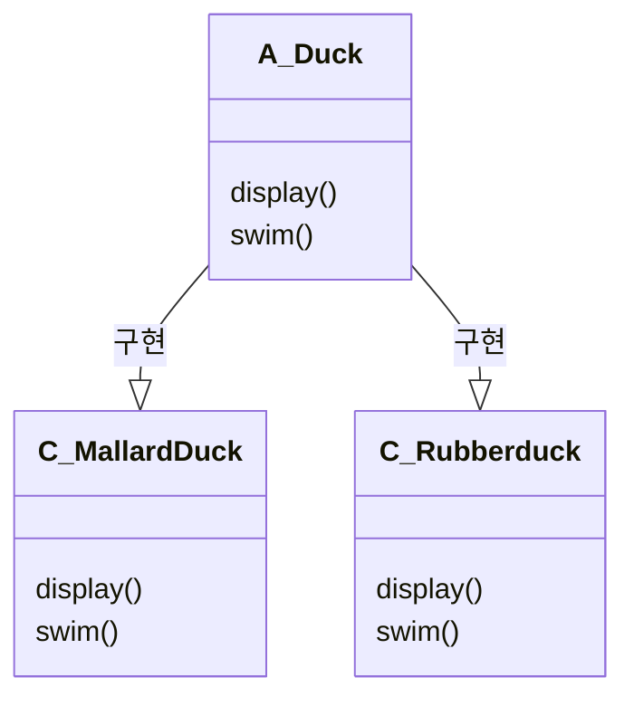
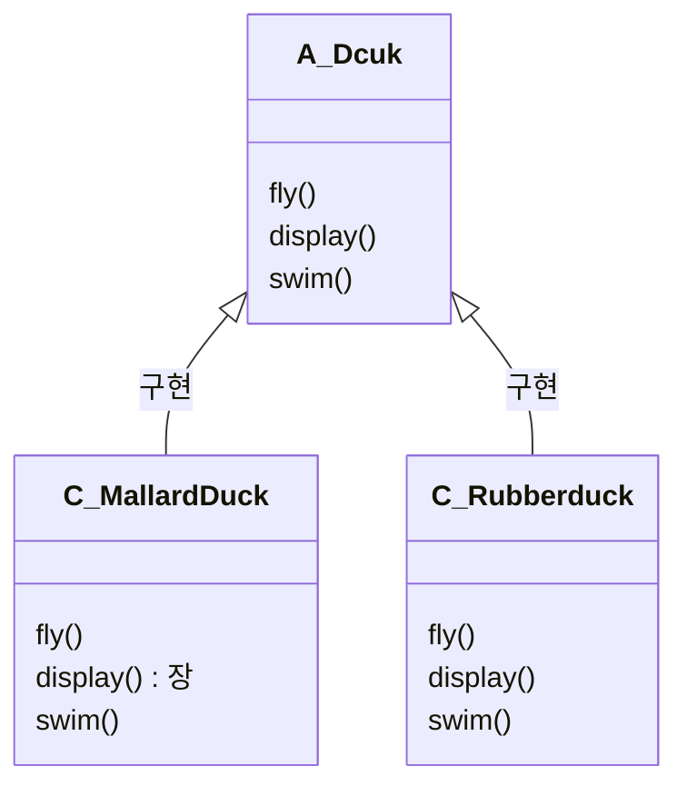
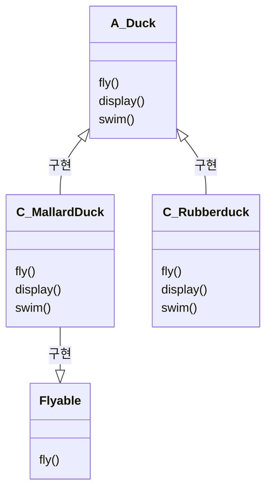
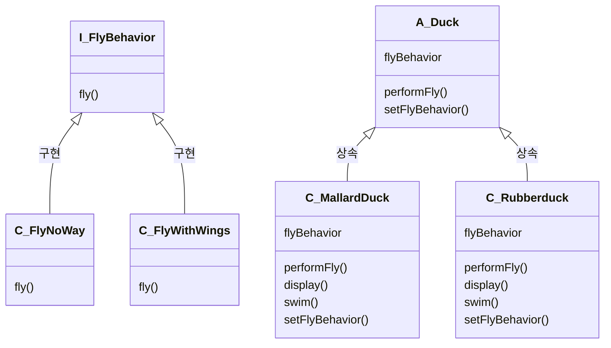

## 문제상황

<blockquote>

* Duck 클래스에 fly()기능을 추가 하려고 한다

</blockquote>

## 일반적인 해결책

<blockquote>

* Duck 클래스에 fly()를 추가한다
* 이 방법에 있는 문제점
  * 서브클래스에서 코드가 중복된다
    * 평범하게 하늘을 나는 오리들 전부다 똑같은 내용의 fly()함수가 있다 
  * 실행시 특징을 바꾸기 힘들다
    * 생성시점에 fly()의 행동을 정의되기 떄문에 동적으로 변경하는 것이 어렵다
  * 모든 오리의 행동을 알기 어렵다
    * 모든 오리클래스의 fly()함수를 확인해야면 그 오리의 행동을 알 수 있다
</blockquote>

<blockquote>

* 이 방법의 문제점은 새로운 날수 있는 Duck 하위 클래스가 생길때마다 Flyable 인터페이스를 매번 구현해야한다 (코드 중복)
* 자바 인터페이스에는 구현된 코드가 전혀 들어가지 않기 때문에 코드 재사용을 할수 없다는 문제점이 있다
* 즉 한 행동을 바꿀 때마다 그 행동이 정의되어 있는 서로 다른 서브클래스들을 전부 찾아서 코드를 일일이 고쳐야한다
    * fly() 내용이 바뀌면 Flyable 인터페이스를 구현 하는 모든 서브클래스를 찾아서 변경해야한다

</blockquote>

## 일반적인 해결책의 문제점

<blockquote>

* OCP 원칙을 지키고 있지 않다
    * 달라지는 부분을 찾아내고, 달라지지 않는 부분으로 부터 분리 시켜야하지만 공존하고 있다
    * 달라지는 부분 -> fly()
    * 달라지지 않는 부분 -> swim(), display()

</blockquote>

## 해결 방법

<blockquote>
Strategy Pattern을 도입한다  

정의 : 알고리즘군을 정의하고 각각을 캡슐화하여 바꿔 쓸 수 있게 만든다. 
</blockquote>

## 수호원칙

<blockquote>

* OCP
    * 캡슐화를 통해서 OCP원칙을 지킨다
    * FlyNoWay와 FlyWithWings로 나누어서 캡슐화과 되어 있기 때문에, FlyWithWings와 FlyNowings는 상호 독립적이다
* 구현이 아닌 인터페이스에 맞춰서 프로그래밍한다
    * Duck클래스가 flyBehavior를 멤버로 가지고 있다
* 상속보다는 구성을 활용한다

</blockquote>

## 얻을 수 있는 장점

<blockquote>

* 클라이언트와 독립적으로 알고리즘 변경(교환) 가능

</blockquote>

## 구현 방법

<blockquote>

* performFly()는 flyBehavior에게 행동을 위임한다
* setFlyBehavior()을 통해서 동적으로 할당이 가능하다
* A에게는 B가 있다 -> 오리에게는 FlyBehavior가 있다
    * 즉 구성을 활용하고 있다 (composition)

</blockquote>

