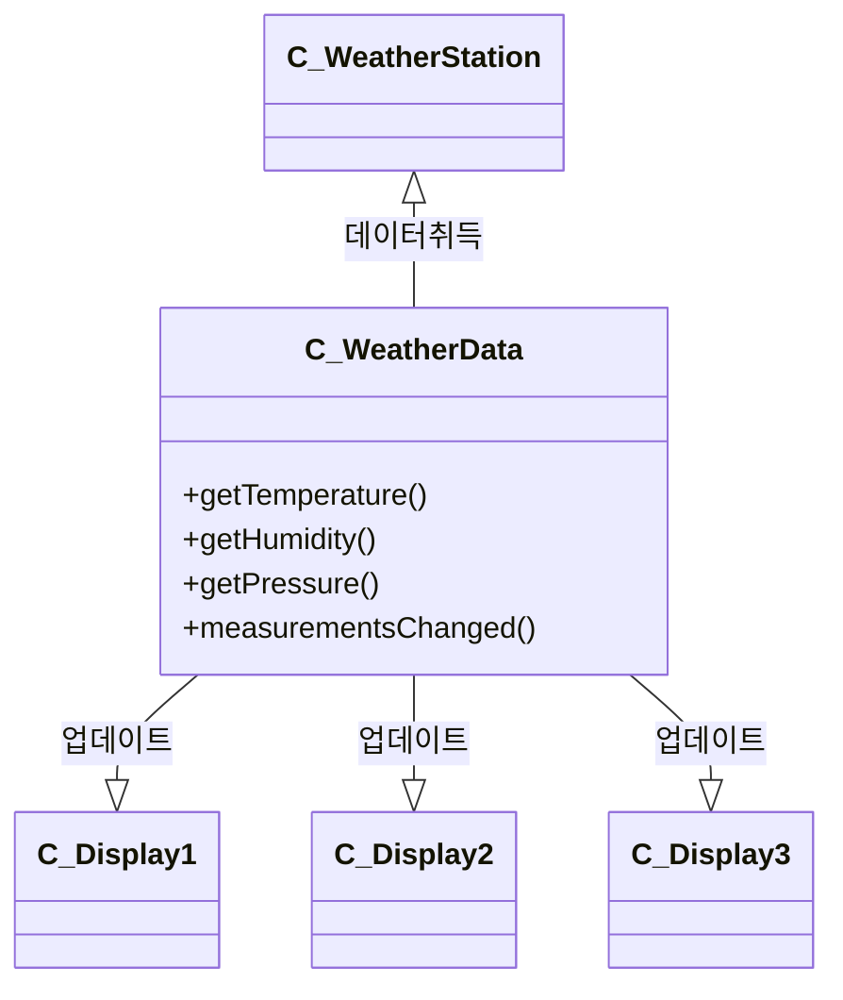
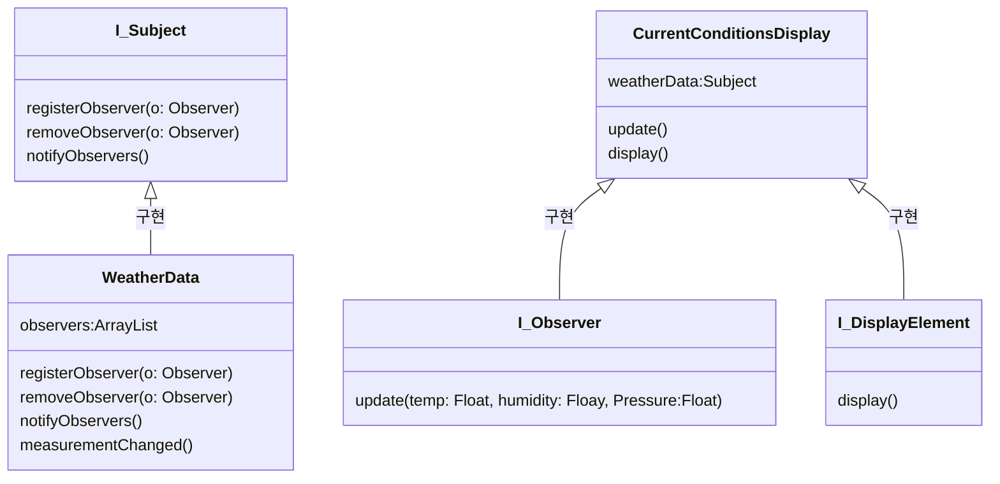

## 문제상황 (일반적인 해결책)

<blockquote>

* measurementsChanged를 통해서 Display를 갱신 해줘야한다
    * measurementsChanged 는 기상 관측값이 갱신될 때마다 호출이 자동으로 된다
    * 어떻게 언제 호출되는지는 우리가 알 필요가 없다

* WeatherData와 Display와의 강항 커플링
    * Display나 WeatheData의 한쪽 스펙이 바뀌면 다른쪽도 코드를 수정해야 한다

</blockquote>

## 해결 방법

<blockquote>
Oberver Pattern 도입

정의 : 한 객체의 상태가 바뀌면 그 객체에 의존하는 다른 객체들에게 연락이 가고 자동으로 내용이 갱신되는 방식으로 일대다 의존성을 정의한다

</blockquote>

## 수호원칙

<blockquote>
느스한 결합(Loose Coupling) : 두 객체가 상호작용을 하긴 하지만 서로에 대해 잘 모르는 것을 의미
</blockquote>

## 얻을 수 있는 장점

<blockquote>

* 객체 사이의 상호의존성을 최소화 할 수 있기 때문 에 느슨한 결합 디자인을 사용하면 변경 사항이 생겨도 무난히 처리할 수 있는 유연한 객체지향 시스템을 구축 할 수 있다
* 옵저버 패턴이 구체적으로 어떻게 느슨한 결합인가
  - 출판사가 구독자에 대해서 아는 것은 구독자가 특정 인터페이스를 구현한다는 것 뿐이다
  - 옵저버는 언제든지 새로 추가할 수 있다
  - 새로운 형식의 옵저버를 추가하려고 할 때도 출판사를 전형 변경할 필요가 없다
  - 출판사와 옵저버는 서로 독립적으로 재상용할 수 있다
  - 출판사나 옵저버가 바뀌더라도 서로한테 전형 영향을 주지 않는다 (느슨한 결합의 장점)

</blockquote>

## 구현 방법
<blockquote>

* 느슨한 결합
  * WeatherData와 CurrentConditionDisplay는 서로 알지 못한다
    * Subject(WeatherData)는 CurrentConditionDisplay가 Observer라는 특정 인터페이스를 구현한다는 것만 알고 있다
  * 출판사나 옵저버가 바뀌더라도 서로한테 전혀 영향을 주지 않는다 
* 유연성
  * 옵저버는 언제든지 새로 추가할 수 있다
  * 출판사와 옵저버는 서로 독립적으로 재사용할 수 있다
  * 새로운 형식의 옵저버를 추가하려고 할 때도 출판사를 전혀 변경할 필요가 없다
</blockquote>
