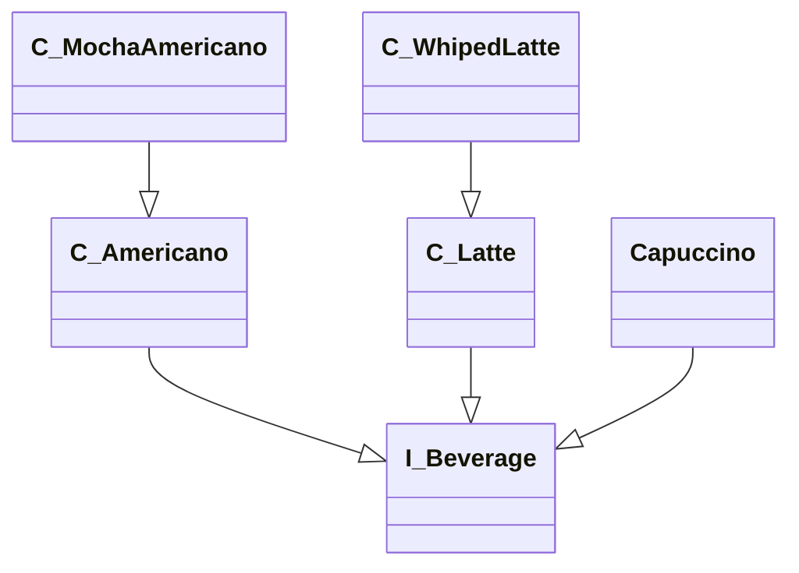
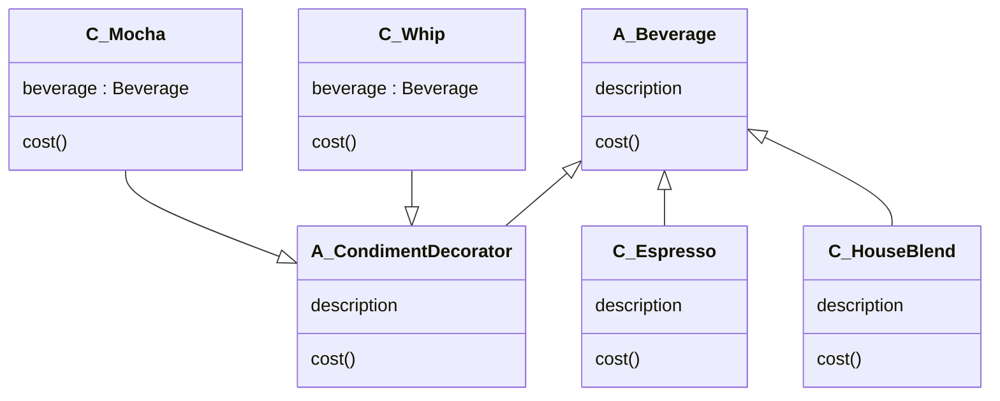

## 문제상황 (일반적인 해결책)

<blockquote>



### 문제점

* 너무 많은 서브클래스들이 생겨 계층이 복잡해진다 -> 확장성이 낮다
    * 스타벅스에서 커피를 구성할 때, Beverage 클래스를 최상위 클래스로 두고, 이를 상속 받는 클래스들이 존재 한다
      (에스프레소, 디카페인 커피, 모카 커피 등등)
* 객체에 추가적인 요건을 동적으로 첨가하는 것이 어렵다 -> 유연성이 낮다

</blockquote>

## 해결 방법

<blockquote>
Decorator Pattern을 도입한다

정의 : 객체에 추가적인 요건을 동적으로 첨가한다. 데코레이터는 서브클래스를 만드는 것을 통해서 기능을 유연하게 확장할 수 있는 방법을 제공한다
</blockquote>

## 수호원칙

<blockquote>
OCP

</blockquote>

## 얻을 수 있는 장점

<blockquote>

### 장점

* 기존 클래스를 건들지 않고 확장할 수 있다
* 객체에 추가적인 요건을 동적으로 첨가할 수 있다
* 서브클래스를 만드는 것을 통해서 기능을 유연하게 확장할 수 있는 방법을 제공한다
* 한 객체를 여러개의 데코레이터로 감쌀 수 있다
*

### 단점

* 자잘한 클래스들이 많이 만들어지는 경우가 많다
* 데코레이터를 빼먹는 실수를 할 수 있따 (휘핑을 빼먹는 다던지...)
* 데코레이터 패턴만 단독으로 사용하기 보다는 팩토리나 빌더 같은 다른 패턴과 함꼐 사용된다
* 감싸져 있는 객체에 특정 작업을 하는 것은 적합하지 않다
* 데코레이터는 그 데코레이터가 감싸고 있는 객체에 행동을 추가하기 위한 용도로 만들어 졌다, 여러 단계의 데코레이터를
  파고들어가서 어떤 작업을 해야 한다면, 원래 데코레이터 패턴이 만들어진 의도와 어긋난다

</blockquote>

## 구현 방법

<blockquote>



```kotlin
val beverage: Beverage = Espresso()
println(beverage.description)

var beverage2: Beverage = HouseBlend()
beverage2 = Mocha(beverage2)
beverage3 = Whip(beverage2)
println(beverage2.description)
println(beverage2.cost())
```

</blockquote>
