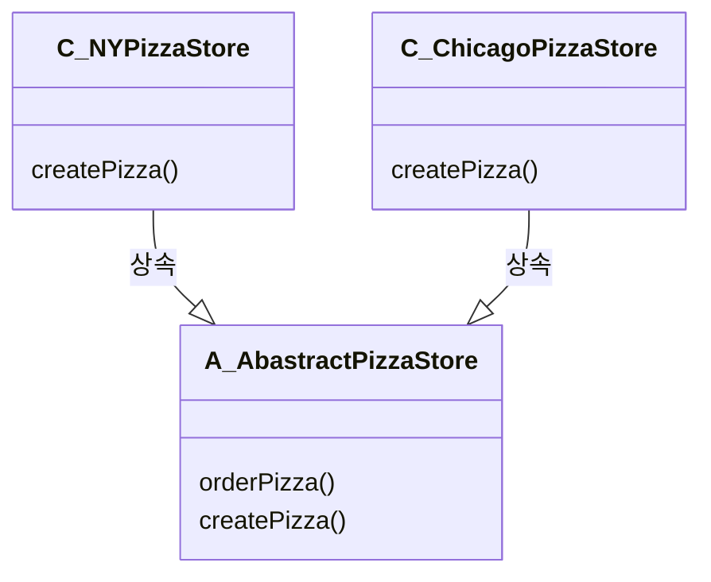

## 문제상황

<blockquote>

```kotlin
fun odrerPizza(type: String): Pizza {
    var pizza: Pizza? = null
    if (type.equals("cheese")) pizza = CheesePizza()
    else if (type.equals("greek")) pizza = GreekPizza()
    else if (type.equals("pepperoni")) pizza = PepperoniPizza()
    else if (type.equals("greek")) pizza = GreekPizza()

    pizza!!.prepare()
    pizza!!.bake()
    pizza!!.box()
    return pizza
}
```

피자가 추가될 때마다 if문이 추가된다
</blockquote>

## 해결 방법

<blockquote>
팩토리 메소드 패턴 도입  

정의

* 팩토리 메소드 패턴에서는 객체를 생성하기 위한 인터페이스를 정의하는데, 어떤 클래스의 인스턴스를 만들지는 서브클래스에서 결정하게 만든다
* 팩토리 메소드 패턴을 이용하면 인스턴스를 만드는 일을 서브클래스에게 맡기는 것이다

</blockquote>

## 수호원칙

<blockquote>
OCP  


목적: 모든 팩토리 패턴의 목적은 객체 생성의 캡슐화 -> OCP  
팩토리 메소드 패턴에서는 서브클래스에서 어떤 클래스를 만들지를 결정하게 함으로써 객체 생성을 캡슐화 한다
</blockquote>

## 얻을 수 있는 장점

<blockquote>

* 피자 객체를 생성을 AbstractPizzaStore에게 맡기고, 각 분점은 AbstractPizzaStore을 상속해서 구체피자를 만든다
* 구상 클래스의 인스턴스를 만드는 일을 한 객체에서 전부 처리하는 방식에서 일련의 서브클래스에서 처리하는 방식으로 변경
    * 구상 클래스의 인스턴스 : 피자, 한 객체 : Factory, 서브클래스 : NYPizzaStore
* 장점
    * 팩토리 메소드를 이용하면 객체를 생성하는 작업을 서브클래스에 캡슐화시킬 수 있다
    * 슈퍼 클래스에 있는 클라이언트 코드와 서브클래스에 있는 객체 생성코드를 분리시킬 수 있다
    * 슈퍼 클래스는 실제로 생성된 구상 객체가 무엇인지 알 수 없게 만든다

</blockquote>

## 구현 방법

### 첫번째 해결 방법

<blockquote>

* simple factory를 도입한다

```kotlin
class SimplePizzaFactory {
    fun createPizza(type: String): Pizza {
        var pizza: Pizza? = null
        if (type.equals("cheese")) pizza = CheesePizza()
        else if (type.equals("pepperoni")) pizza = PepperoniPizza()
        else if (type.equals("greek")) pizza = GreekPizza()
        else if (type.equals("clam")) pizza = ClamPizza() // 추가
        else if (type.equals("veggie")) pizza = VeggiePizza() // 추가

        return pizza!!
    }
}

class PizzaStore(val factory: SimplePizzaFactory) {
    fun orderPizza(type: String): Pizza {
        // New 연산자 대신에 팩토리 사용(구상 클래스의 인스턴스를 만들 필요가 없음)
        // PizzaStore 안에 createPizza와 같은 메소드로 캡슐화를 시키지 않는 이유
        // - 이렇게 하며되면 어잿든 PizzaStore클래스는 Pizza클래스라는 구상 클래스를 직접 만들게 됨
        val pizza: Pizza = factory.createPizza(type)
        pizza.prepare()
        pizza.bake()
        pizza.box()
        return pizza
    }
}
```

### 문제점

* 피자집에 분점이 생기기 시작하면서 분점마다 고유의 피자 스타일이 생겼다
    * 문제상황(1) 해결책을 적용하면 NYPizzaFactory, ChicagoPizzaFactory ...등등을 계속 만들어야 한다
    * 즉 어떤 피자를 만들지 정하는(if문)곳이 변하는 부분이어서 capsulation을 시켰는데(simple factory) 이번에는 simple factory가 종류별로 필요해져서 변하는 부분이 되었음

### 새로운 문제의 해결책 -> Factory Method Pattern 구현



* 분점마다 자기 스타일의 피잘르 만들 수 있게 되었다

</blockquote>
