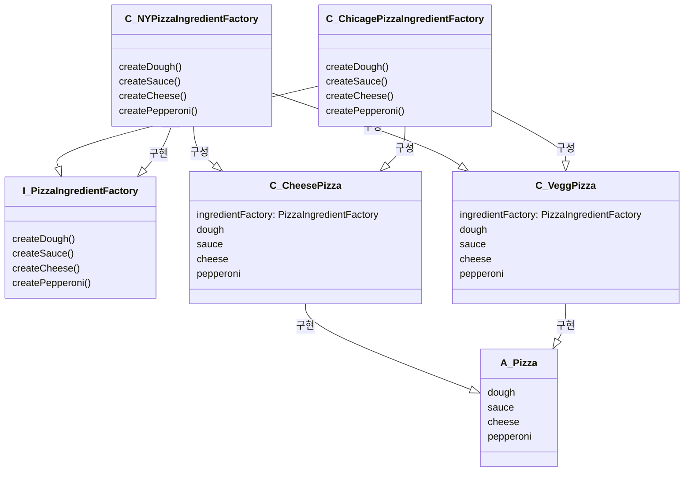

## 문제상황

<blockquote>

* 피자 원재료를 관리할 필요성이 생겼다
* 시카고, 뉴욕, 켈리포니아 마다 원재료군이 다르다

</blockquote>

## 해결 방법

<blockquote>
추상 팩토리 패턴 (Abstract Factory Pattern)   

정의 : 추상 팩토리 패턴에서는 인터페이스를 이용하여 서로 연관된, 또는 의존하는 객체를 구상 클래스를 지정하지 않고도 생성할 수 있다
</blockquote>

## 수호원칙

<blockquote>
의존관계 역전 원칙 (Dependency inversion principle)   

* 구상 클래스에 직접 의존하지 않고도 서로 관련된 객체들로 이루어진 제품군을 만들기 위한 용도로 쓰인다
* 의존성 뒤집기 원칙을 따르면 구상 형식에 대한 의존을 피하고 추상화를 지향할 수 있다

</blockquote>

## 얻을 수 있는 장점

<blockquote>

* 구성(compistion)을 사용해서 어떤 클래스의 인스턴스를 만들지 결정한다

</blockquote>

## 구현 방법

<blockquote>



```kotlin
val ingredientFactory: PizzaIngredientFactory = ChicagePizzaIngredientFactory()
pizza = CheesePizza2(ingredientFactory)
pizza = VeggiePizza2(ingredientFactory)
```

</blockquote>
