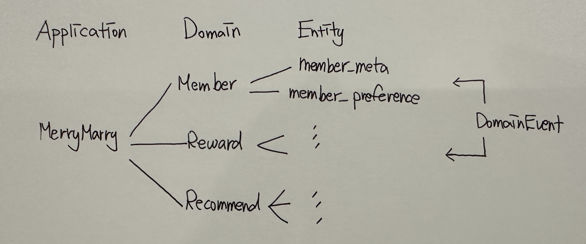
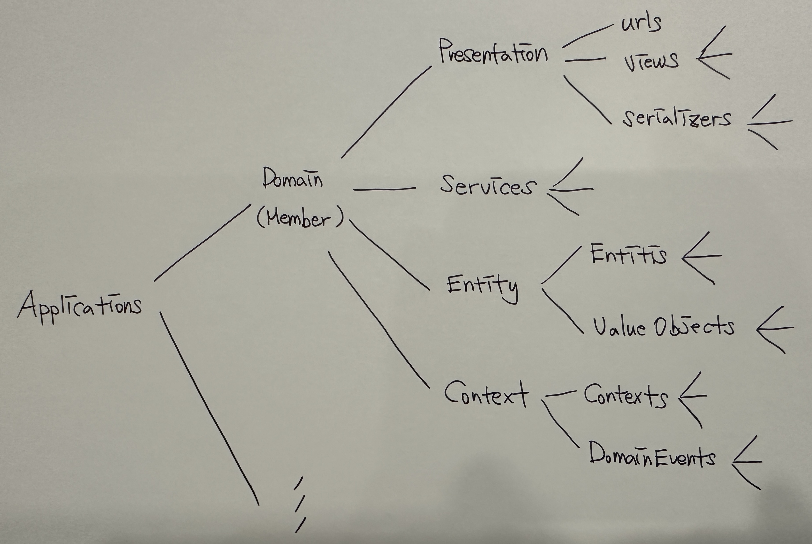

## Architecture 구조

### 마이크로 서비스 기반 vs 서비스 기반

- Domain을 독립적인 서버로 옮겨 가면 서비스 기반 아키텍쳐가 된다
- Entitiy를 독립적인 서버로 옮겨 가면 마이크로 서비스 기반 아키텍처가 된다

### 서버간 통신

- 마이크로이던 서비스 기반 이던 서버간 통신은 DominEvent를 통해야 해야한
- 도메인 이벤트의 내용물은 id들이 되어야 한다 -> 도메인 이벤트로 객체를 실어 나르면 안된다
    - 도메인이 다르다는것/독립적인 서버라는 것은 서로 몰라도 자기일을 하는데 아무지장이 없는 독립적인 환경을 가져야 하기 떄문

## Django 적용

### Repository

- Repository는 사용하지 않지만 DB관련 작업을 할 때 objects를 최대한 사용하지 않는 쪽으로 OOP스러운 쪽으로 개발한다
    - repository가 없어도 db관련 작업은 entity안에만 존재 하기 때문
    - 현실적으로 데이터베이스를 교체하는 일은 없기 떄문에 repository 계층의 실효성이 적음

### Context

- 도메인간 통신을 담당하는 레이어

### Entitiy

- value objects는 기능을 갖지 않는다

### Service

- Entity를 이용하여 비즈니스 로직을 구현하는 레이어 
