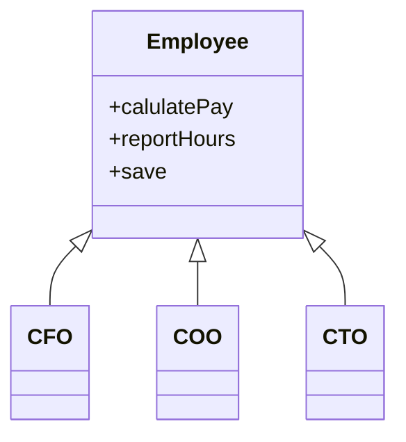

## 단일 책임 원칙 (SRP, Single Responsibility Principle)

```
땡땡이 변하는 목적는 하나여야만 한다 (개인적으로 이유보다 목적이 이라고 해석하는게 더 좋아 보임)
떙떙 : 함수, 모듈, 아키텍쳐
```

### 함수 수준

- `함수가 변하는 이유는 하나여야만 한다`
- 함수가 변하는 이유가 여러가지라는 것은 함수가 하는 일이 여러가지라는 것과 같은 말이다 (아래 코드 참조)

```
def order(product, discount_policy, user, card){
  if(prodcut.count > 10) return
  if not (card.check_validate) return
  total_price = discount_policy(product)
  card.pay(total_price, user)
}
```

- 위 함수는 여러 가지 이유로 수정 될 수 있다
- 위 코드는 아래 코드처럼 함수가 하나만 책임지도록, 즉 변하는 이유가 하나만 되도록 리펙토링 할 수 있다

```
def check_max_product_count(product){
  if(product.count >10) return
}
def validdate_card(card){
  return card.check_validate
}
def calculate_total_price(dicount_price, product){
  return discount_policy(product
}
def pay_with_card(card, price, user){
  card.pay(price,user)
}
```

- `그렇다면 모든 메소드를 아주 잘게잘게 쪼개는 것이 좋을까?? -> 이건 나중에...`

### 모듈 수준

- 일반적으로 SRP는 이 수준에 해당하는 내용을 의미합니다
- 책에 나온 정의
    - 단일 모듈의 변경의 이유가 하나, 오직 하나 뿐이어야 한다.
    - 다른 말로 하면 하나의 모듈은 하나의, 오직 하나의 사용자 또는 이해관계자에 대해서만 책임 져야 한다
- 풀이
    - 클래스가 변하는 목적은 오직 하나 뿐이어야 한다
        - 이유라고 해석 하면 꼭 클래스를 사용하는 곳이 반드시 하나이어야 할것 같지만 이건 미친 소리다. 이럴 거면 클래스를 만들 이유가 없으니깐
        - 즉, 클래스가 여러 목적으로 사용이 되면 안된다는 뜻이다



- 위 다이어 그램만 봤을 때 SRP를 위반 한다고 볼 수 있을까?
    - 알 수 없다.
    - 예를 들어
        - CFO는 save만, COO는 calulatePay만, CTO는 reportHours만 사용하는 경우, 세 클래스가 Employee클래스를 서로 다른 목으로 사용한다고 볼 수 있고 이런 경우
          SRP를 위반한다고 볼 수 있다
        - 이때, CFO, COO, CTO를 액터(actor)라고 한다

- 그런데 이게 왜 나쁠까?
    - ISP 원칙 위반
    - 수정이 필요할 때, 내가 수정해야 할 부분보다 훨씬더 넓은 범위의 코드를 봐야 하는 문제가 있다 &rarr; 사이드 이펙트의 무서움

## 해결책

- 데이터와 메서드를 분리하는 방법이 있다
    - 즉 아무런 메서드가 없는 간단한 데이터 구조인 EmployeeData 클래스를 만들어, 세 개의 클래스가 공유하도록 한다
    - 각 클래스는 자신의 메서드에 반드시 필요한 소스 코드만을 포함한다. 세클래스는 서로 존재를 몰라야한다 &rarr; '우연한 중복'을 피할 수 있다
  ```mermaid
      classDiagram
      EmployeeData <|-- PayCalculator
      EmployeeData <|-- HourReporter
      EmployeeData <|-- EmployeeSaver
      class PayCalculator {
          +calculatePay
      }
      class HourReporter {
          +reportHours()
      }
      class EmployeeSaver {
          +saveEmployee
      } 
  ```

## 결론

- What에 관한, 이렇게 되어야 한다
- `단일 책임 원칙이라는 것은 '응집성'에 관한 것이다`
    - 응집이라는 것은 쓸데 없는걸 그냥 다 모아 놓은게 아니라, 위에서 본것처럼 분명한 이유로 인해서 같이 `모여` 있는 걸 말한다
    - 응집은 또한 `물리적`, 논리적 모든걸 포함하는 말이다
    - 결국, 단일 책임 원칙이라는 것은 단일책임(이해관계, 엑턴...)을 정의하고 그것을 기준으로 어떻게 모을 것인가에 대한 고민이다.

### 아키텍처 수준

## 공통 폐쇄 원칙 (CCP, Common Closure Principle)

- `동일한 이유로 동일한 시점에 변경되는 클래스를 같은 컴포넌트로 묶어라. 서로 다른 시점에서 다른 이유로 변경되는 클래스는 다른 컴포넌트로 분리하라`
    - 이 원칙은 '단일 책임 원칙'을 컴포넌트 관점에서 다시 쓴 것이다
    - SRP 에서 단일 클래스는 변경이 이유가 여러 개 있어서는 안된다고 말하듯이, 공통 폐쇄 원칙에서도 만찬가지로 단일 컴포넌트는 변경의 이유가 여러 개 있어서는 안된다
- 대다수의 애플리케이션에서 유지보수성(maintainability)은 재사용성보다 훨씬 중요하다
    - 애플리케이션에서 코드가 반드시 변경되어야 한다면, 이러한 변경이 여러 컴포넌트 도처에 분산되어 발생하기보다는, 차라리 변경 모두가 단일 컴포넌트에서 발생하는 편이 낫다
- `물리적 또는 개념적으로 강하게 결합되어 항상 함께 변경되는 클래스들은 하나의 컴포넌트에 속해야 한다`
- OCP원칙 과도 밀접하게 관련되어 있다 같은 폐쇄(Closure)뜻이다
- SRP와의 유사성
    - CCP는 컴포넌트 수준의 SRP이다
    - SRP에서는 서로 다른 이유로 변경되는 메서드를 서로 다른 클래스로 분리하라고 말한다
    - CCP에서는 서로 다른 이유로 변경되는 클래스를 서로 다른 컴포넌트로 분리하라고 말한다
    - 즉, `동일한 시점에 동일한 이유로 변경되는 것들을 한데 묶어라. 서로 다른 시점에 다른 이유로 변경되는 것들은 서로 분리하라`
